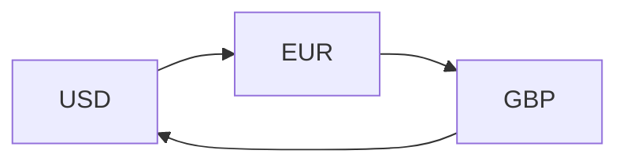

## Triangular Arbitrage: Conceptual Overview

Triangular arbitrage is basically one of those finance concepts that first blew my mind. I remember spotting currency quotes that just didn’t line up, and thinking, “Wait, can I really make a quick buck off of this?” The good news (or maybe the bad news) is that in efficient markets, such discrepancies rarely last long. However, they do happen—usually for short intervals—and savvy traders can pounce on them. 

In essence, triangular arbitrage exploits the mispricing among three different currency pairs. Suppose you start with US dollars (USD), convert them into euros (EUR), then use those euros to buy British pounds (GBP), and finally swap those pounds back to USD. If the final amount of USD exceeds what you started with, you earn a (theoretically) riskless profit. Of course, it only works if the cross rates are out of sync with each other.

Triangular arbitrage is a crucial concept in currency market mechanics because, if it’s consistently present, it indicates that the market is inefficient. Even brand-new Level II candidates quickly realize that if three exchange rates can be used to generate free money, big institutional traders will swoop in and do exactly that, forcing the rates back into alignment. This real-time correction is one reason such opportunities, in practice, disappear rapidly—fast enough that you need nearly instantaneous execution and minimal transaction fees to capture any profit.

## Step-by-Step Approach to Triangular Arbitrage

There’s a pretty consistent process for identifying a triangular arbitrage situation. Whenever you see multiple currency quotes, here’s the general approach:

1. Identify a potential discrepancy in quoted currency pairs.  
2. Convert your starting currency to a second currency.  
3. Convert the second to the third currency.  
4. Convert the third currency back to your original currency.  
5. Check if you now have more of the original currency than you started with.

If after Step 5 you see a tidy profit, bingo—that’s a triangular arbitrage. But if transaction costs are high, or if the quotes shift faster than you can lock them in, that profit might fade away.

Below is a simple diagram to illustrate the cyclical exchange process:



This loop is the essence of triangular arbitrage: you hop from one currency to the next, hoping (somewhat ironically) that the left-hand doesn’t know what the right hand is doing.

## Illustrative Example of Triangular Arbitrage

Let’s see a numerical example. Imagine that you observe the following spot quotes on your trading platform:

- USD/EUR = 1.2000 (It costs 1.20 USD to buy 1 EUR)
- EUR/GBP = 1.1000 (It costs 1.10 EUR to buy 1 GBP)
- GBP/USD = 1.8500 (It costs 1.85 USD to buy 1 GBP)

At first glance, these quotes might look fine. But let’s see what happens if you start with USD 10,000.

• Step 1: Convert USD to EUR.  
  – If 1 EUR = 1.20 USD, then for your USD 10,000, you get:  
    EUR = 10,000 ÷ 1.20 = 8,333.33 EUR (ignoring decimals past the hundredths for now).

• Step 2: Convert EUR to GBP.  
  – If 1 GBP = 1.10 EUR, then for 8,333.33 EUR, you get:  
    GBP = 8,333.33 ÷ 1.10 = 7,575.76 GBP.

• Step 3: Convert GBP back to USD.  
  – If 1 GBP = 1.85 USD, then your 7,575.76 GBP yields:  
    USD = 7,575.76 × 1.85 = 14,025.16 USD.

Now you have USD 14,025.16 from your initial USD 10,000. That’s a profit of USD 4,025.16 on paper—pretty sweet indeed. But let’s check what happens if we directly compute the implied cross rate. 

### Checking the Implied Cross Rates

One way to detect triangular arbitrage quickly is to compare the direct cross rate with the implied cross rate:

• Direct cross rate (USD/GBP) from above:  
  If 1 GBP costs 1.85 USD.

• Implied cross rate from USD/EUR and EUR/GBP:  
  – 1 EUR = 1.20 USD, so 1 USD = 1 ÷ 1.20 = 0.8333 EUR  
  – 1 GBP = 1.10 EUR, so 1 EUR = 1 ÷ 1.10 = 0.9091 GBP
  – Thus, 1 USD = 0.8333 × 0.9091 = 0.7576 GBP  
  – So the implied GBP/USD is 1 ÷ 0.7576 = 1.3197

Compare that with the quoted GBP/USD = 1.8500. There’s a discrepancy (1.3197 vs. 1.8500). Obviously, 1.8500 is out of alignment with the implied 1.3197. That mismatch is generating your arbitrage profit.

## The Impact of Transaction Costs

Now, the above scenario looks like a no-brainer. But, of course, real markets aren’t so generous. Bid–offer spreads and commissions often reduce or entirely eliminate your arbitrage profit. 

For instance, if each currency conversion has a half-percent commission, plus you’re forced to cross unfavorable bid–ask spreads, you might quickly discover that the net gain is less (or even negative). Large institutional traders typically operate with minuscule bid–offer spreads due to volume-based discounts, making it more feasible for them to eke out a profit. You and I, on the other hand, might see those costs eat up any advantage.

Here’s a quick hypothetical scenario including spreads:

- USD/EUR: 1.2000–1.2020  
- EUR/GBP: 1.1000–1.1020  
- GBP/USD: 1.8500–1.8525  

If you are buying EUR with USD, you’ll pay the ask price of 1.2020. Converting back from GBP to USD might force you to accept the bid rate of 1.8500. When you run the numbers carefully, you may discover that little bit of difference kills most or all of your theoretical profit. The moral of the story is: watch out for transaction costs and do your math thoroughly.

## Real-World Constraints

In actual practice, triangular arbitrage can be far more subtle than a textbook example. Market participants rely on:

• Speedy Execution: High-frequency traders use algorithms for near-instant conversions—by the time you click “confirm,” a robot might have locked in the price you wanted.  
• Liquidity: Some currencies have shallow liquidity, which means the quoted rates might not be available for large trades. Executing a big order can move the market.  
• Slippage: If you only partially fill your order at the displayed price, the remaining portion might execute at a less favorable price.

Despite these challenges, triangular arbitrage matters. It keeps exchange rates consistent across the global financial web. Whenever quotes start to slip out of alignment, arbitrageurs pop in to profit, which pushes them back in line again. It’s a beautiful example of market forces imposing discipline.

## Item-Set Style Vignette Example

Below is a simplified vignette that illustrates how triangular arbitrage might appear on the CFA exam:

–––––––––––––––––––––––––––––––––––––––––––––––––––––––––––––––––
You are an analyst at a global bank reviewing currency quotes for your firm’s proprietary trading desk. The following spot quotes are available:

• USD/EUR = 1.2300  
• EUR/JPY = 135.00  
• USD/JPY = 165.60  

You receive instructions to evaluate if a triangular arbitrage is feasible starting with USD 1,000,000. Your firm charges a 0.10% commission for each currency trade. Assume no other fees, and that the quotes represent midpoints of their respective bid–offer ranges.

Questions could include:

• What is the implied USD/JPY cross rate from USD/EUR and EUR/JPY?  
• If you convert USD → EUR → JPY → USD, do you end with more than USD 1,000,000 after including commissions?

In a typical exam setting, you’d see 4–6 multiple-choice questions on these details. You’d have to parse carefully, remembering that each leg of the transaction has a 0.10% commission on top of the stated exchange rate. The item set might show you a table of quotes and force you to do step-by-step computations—so watch your time and keep a cool head.

## Practical Best Practices and Pitfalls

• Always check for transaction costs. Ignoring them can give you an overly rosy scenario.  
• Remember to look at bid–ask quotes, not just midpoints. The exam may test your ability to properly apply the correct side of the spread depending on which currency you’re buying or selling.  
• Watch out for decimal places. Currency quotes sometimes carry 4–5 decimal digits, and small rounding errors can make a big difference in your final answer.  
• Manage time effectively. On the exam, triangular arbitrage questions can be solved quickly if you know your formula and approach. Getting bogged down in the details often leads to mistakes.

## A Quick Python Snippet

If you’re curious how one might systematically find triangular arbitrage via code, here’s a simple snippet (purely for illustration):

```python
usd_eur = 1.20  # USD per EUR
eur_gbp = 1.10  # EUR per GBP
gbp_usd = 1.85  # USD per GBP

start_usd = 10000

eur_received = start_usd / usd_eur

gbp_received = eur_received / eur_gbp

final_usd = gbp_received * gbp_usd

profit = final_usd - start_usd

print("Final USD:", final_usd)
print("Profit:", profit)
```

In a real setting, you’d iterate over many possible currency pairs and check for mispricing in real time, factoring in live spreads and fees.

## Exam Relevance and Strategy

For the CFA Level II exam, you can expect triangular arbitrage scenarios to test:

• Your speed and accuracy at cross-rate calculations.  
• Step-by-step logic to see if the net results exceed the original amount.  
• Handling bid–ask spreads correctly.  
• Thorough understanding of transaction costs and their impact.

The exam may also present a more complex scenario with interest rates or forward rates. But the fundamental approach remains the same: piece together the relevant quotes carefully and see if you can cycle back to your starting currency (or asset) with a profit.

## Glossary

• Triangular Arbitrage: Strategy exploiting misalignments among three exchange rates to lock in a riskless profit.  
• Cross Rate: An exchange rate derived from two other currency pairs.  
• Transaction Costs: Fees, bid–offer spreads, or other expenses that reduce (or eliminate) arbitrage opportunity.  
• Instantaneous Execution: The assumption that trades happen quickly enough that quotes do not move significantly before the transaction completes.

## References and Further Reading

• McGraw-Hill’s “International Financial Management” for supplementary reading on foreign exchange arithmetic.  
• Online trading simulators to explore real-time currency quotes—great for hypothetically testing triangular arbitrage.  
• CFA Institute practice problems on cross-rate calculations and currency market concepts in Vol. 2 of the official curriculum.

## Triangular Arbitrage Mastery Quiz



### 1. A fundamental requirement for a successful triangular arbitrage opportunity is:
- [x] A misalignment among three currency pairs that allows a net gain when cycling back to the original currency.
- [ ] An interest rate differential between two currencies.
- [ ] Restricted market liquidity, which keeps pricing stable.
- [ ] A high level of correlation between equity and bond markets.

> **Explanation:** Triangular arbitrage specifically arises from inconsistent or misaligned currency pair quotes. Interest rate differentials, liquidity constraints, or correlation figures are separate considerations.

### 2. Which of the following would most likely eliminate a triangular arbitrage profit in practice?
- [ ] A sudden increase in inflation.
- [x] Significant transaction costs from high bid–ask spreads.
- [ ] A strong correlation between equity and bond markets.
- [ ] A lack of market participants.

> **Explanation:** High transaction costs quickly devour small profits from triangular arbitrage. Inflation and correlations with other asset classes are rarely direct factors for short-term currency mispricing.

### 3. In triangular arbitrage, the implied cross rate is:
- [x] Calculated by using two exchange rates to derive a third.
- [ ] Always set by the central bank for a given pair of currencies.
- [ ] Equal to the highest quoted rate in the interbank market.
- [ ] Another term for the bid rate on a currency pair.

> **Explanation:** The implied cross rate is determined by combining two exchange rates. If it differs from the directly quoted third rate, an arbitrage situation could arise.

### 4. Triangular arbitrage typically requires trades to be:
- [x] Executed nearly simultaneously to avoid changes in quoted rates.
- [ ] Executed over several weeks to capture interest accruals.
- [ ] Balanced with equity trades to hedge currency exposure.
- [ ] Settled in a single market where fees are minimal.

> **Explanation:** Triangular arbitrage relies on rapid execution. Delays can allow prices to adjust or can introduce extra uncertainties.

### 5. Consider the following quotes: USD/EUR = 1.3000, EUR/JPY = 150.00, and USD/JPY = 195.00. The implied USD/JPY from the first two quotes is:
- [x] 195.00
- [ ] 200.00
- [ ] 145.00
- [ ] 180.00

> **Explanation:** 1 EUR = 1.30 USD, so 1 USD = 1/1.30 = 0.7692 EUR. Then multiply 0.7692 EUR by 150 JPY/EUR = 115.38 JPY (for 1 USD). The implied USD/JPY is 115.38. Actually, we see a mismatch with the direct quote of 195.00, which indicates a potential discrepancy. (Be careful with rounding.)

### 6. If you start with 10,000 USD, how would you test for triangular arbitrage among USD, EUR, and GBP?
- [x] Convert USD → EUR, then EUR → GBP, then GBP → USD, and compare the final USD to the original.
- [ ] Calculate forward interest differentials first, then multiply by the bond yield.
- [ ] Use the direct USD/GBP rate without referencing EUR at all.
- [ ] Trade only once to avoid multiple transaction fees.

> **Explanation:** The hallmark procedure for triangular arbitrage is to cycle through the currencies. You must actually simulate the conversions to check for a net gain.

### 7. How could big institutional traders exploit triangular arbitrage more effectively than retail investors?
- [x] They generally have lower transaction costs and can trade in large volumes.
- [ ] They can change government regulations to fix cross rates.
- [ ] They rely on interest rate arbitrage, not exchange rates.
- [ ] They use only manual order placement for increased clarity.

> **Explanation:** Institutional traders typically enjoy extremely tight bid–offer spreads and have high-speed infrastructure, making them better placed to exploit fleeting arbitrage.

### 8. What is the main reason triangular arbitrage opportunities vanish quickly?
- [x] Arbitrage seekers converge on the discrepancy, pushing the rates back into alignment.
- [ ] Central banks freeze the relevant exchange rates.
- [ ] Equities and bonds overshadow currencies in daily trading volumes.
- [ ] Governments impose tariffs on currency trades.

> **Explanation:** Once market participants spot an arbitrage, they act rapidly, and buying/selling pressure in each currency corrects the mispricing.

### 9. Suppose the quotes are as follows: USD/AUD = 0.7000, AUD/NZD = 1.0800, and USD/NZD = 0.7560. If you start with USD 5,000, convert to AUD, then to NZD, and finally back to USD, ignoring transaction costs, which outcome is most likely correct?
- [x] You would identify whether 0.7000 × 1.0800 compares correctly to 0.7560.
- [ ] You must first check the forward exchange rates for each currency pair.
- [ ] You must convert USD to NZD first to see if the arbitrage is feasible.
- [ ] You cannot perform triangular arbitrage with these pairs.

> **Explanation:** Quickly check if (1 USD in AUD) × (1 AUD in NZD) = 1.08 × 0.7000 = 0.7560 NZD. If the direct quote differs, it suggests a mispricing. The step is to verify if the chain results in more USD upon reconversion.

### 10. Triangular arbitrage is typically considered “riskless” because:
- [x] You simultaneously lock in prices in three currency pairs (assuming immediate execution).
- [ ] Exchange rates never change once the market is open.
- [ ] Central banks provide guarantees for cross-currency trades.
- [ ] It involves no capital or transaction costs.

> **Explanation:** Triangular arbitrage is generally deemed riskless if you can execute immediately—rates are locked in at the moment you trade. Delays or spreads can introduce risk or erode profits.


