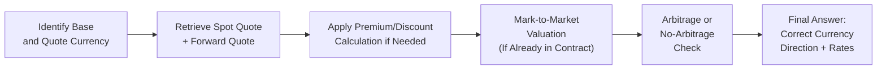

## Overview

Let’s face it: sometimes currency market questions feel like a puzzle with too many pieces. You might be juggling forward points, annualized interest rates, mark-to-market values, and maybe even an unexpected central bank announcement. The good news is that these “puzzles” become much more approachable once you see how each piece fits together. In this section, we’ll explore practical vignettes that tie together all those building blocks—from spot quotes to forward premiums/discounts—so that you’ll walk into the exam or into a real-world client meeting feeling prepared and confident.

Why focus on vignettes? Because in the CFA Level II exam, almost all questions on currency mechanics appear in item set format. You’ll get a short scenario (sometimes more than one page if it’s especially detailed), along with an array of data: spot rates, forward rates for various expiry dates, yields, and perhaps commentary on economic releases. This can be overwhelming at first glance, so let’s discuss how to identify the key data more efficiently, how to avoid the most common mistakes, and how to turn your knowledge of currency markets into correct answers, quickly and consistently.

## Common Pitfalls in the Vignette Format

Before we jump into hands-on scenarios, let’s highlight some recurring challenges you’ll want to watch out for:

• Misreading the Quote Convention: Spot and forward quotes might appear as direct quotes (e.g., USD/EUR) or indirect (EUR/USD). Check carefully whether the currency is in the numerator or denominator.

• Mixing Up the Transaction Direction on Bid–Offer Spreads: If you’re buying the base currency, you typically pay the offer; if you’re selling the base, you receive the bid. In an exam question, you could easily pick the wrong side if you’re not absolutely sure which currency you’re transacting.

• Ignoring Annual vs. Contract-Specific Time Horizons: Forward premiums or discounts need to be adjusted for the exact contract duration. For instance, if you see a 3-month forward premium, you might have to annualize it to compare different possibilities.

• Confusing Mark-to-Market Value: When you have to value an existing forward contract prior to maturity, confirm how many days have passed and how many remain, and re-check the relevant interest rates and forward quotes. 

• Overcomplicating Triangular Arbitrage: Triangular arbitrage is conceptually straightforward but can trip you up if you lose track of which currency you start with.

## Scenario 1: Forward Contracts and Interest Rate Changes

Imagine you’re an investment manager at a global fixed-income fund. You hold a forward contract to sell EUR and buy USD in three months, locking in a known exchange rate that was quoted a few weeks ago. Suddenly, one of the major eurozone countries announces an unexpected interest rate hike, and you need to figure out the potential impact on your forward position’s value.

### Background Data for the Vignette

• Current Spot Rate (EUR/USD): 1.1200  
• 3-Month Forward Points Quoted in Pips: +50 (meaning the forward rate is 1.1200 + 0.0050 = 1.1250 if we treat each pip as 0.0001)  
• Original Forward Rate on Your Contract: 1.1300 (you locked this in earlier)  
• Eurozone Interest Rate (Annualized): 2.00%  
• US Interest Rate (Annualized): 1.50%  

Over the past few days, the market has begun pricing in an unexpected possibility of a large rate hike in the eurozone. Let’s see how we might interpret the forward movement and mark-to-market implications.

### Interpreting Forward Rate Adjustments

When markets expect higher eurozone rates relative to US rates, the forward EUR/USD currency pair might rise if the euro is expected to strengthen (or the market might move in the other direction if the rate hike is seen as detrimental to the broader economy—but we’ll assume a straightforward scenario for illustration). Let’s say the new quoted forward points widen to +80. That means the forward price for EUR/USD in three months rises to 1.1200 + 0.0080 = 1.1280.

Now, you locked in 1.1300, which implies you have the right to sell EUR and receive more USD than the current forward market is offering (1.1300 > 1.1280). Hence, your forward contract is in-the-money, or “out of the money” for the other side. The mark-to-market value (to you) can be estimated using the difference:

1.1300 (your contract) – 1.1280 (current forward) = 0.0020 USD per EUR

Next, you would typically discount that difference to present value using the appropriate interest rate for the relevant time period. For a 3-month horizon, discounting might look something like:

M  
= (Spot * (Contract Rate – New Forward Rate)) × Notional × Discount Factor

But it’s crucial to be consistent with the currency. Since you’re receiving more USD for each EUR, the contract might be valued in USD, then possibly converted back to EUR. This is one place where many test-takers (or real-life practitioners) slip up: not carefully picking the right discount rate or forgetting the notional currency.

## Scenario 2: Triangular Arbitrage in Action

Let’s do a quick trip down memory lane to a triangular arbitrage example. Suppose the vignette lays out these spot quotes:

• USD/EUR = 1.2000 (1 EUR buys 1.20 USD)  
• GBP/USD = 1.3200 (1 GBP buys 1.32 USD)  
• GBP/EUR = 1.0800 (1 EUR buys 0.9259 GBP, but we can also invert it carefully if needed)

Picture yourself wanting to spot an arbitrage opportunity. The item set might say something like: “You start with USD 1,000,000. Show whether you can generate a riskless profit via euro and sterling conversions.” The solution typically follows these steps:

1. Convert USD to EUR: USD 1,000,000 / 1.20 = EUR 833,333.33  
2. Convert EUR to GBP: EUR 833,333.33 × 1.0800 GBP/EUR = GBP 900,000 (for example)  
3. Convert GBP back to USD: GBP 900,000 × 1.3200 USD/GBP = USD 1,188,000  

If you end up with a new total of USD 1,188,000, you have a riskless gain of USD 188,000 (minus any transaction costs). That’s triangular arbitrage in action. A well-constructed exam vignette might ask you step by step whether an arbitrage exists, or how small an initial mispricing can be before transaction costs wipe it out.

## Macro News Impact: GDP and Inflation Announcements

Another typical vignette scenario: A country announces stronger-than-expected GDP growth, which might prompt markets to anticipate an interest rate hike, thus influencing both the spot and forward rates. You might see:

• Spot Rate: 1.5000 CAD/USD (your base currency is CAD)  
• Forward Rate for 6 Months: 1.5100  
• Canada’s Expected Rate Hike: 25 bps  
• US Expected Rate: Unchanged  

The exam question might ask you to recalculate or reinterpret the forward premium/discount. Or it could ask how the new information might change the forward quote. In this hypothetical, if the Bank of Canada moves sooner, the CAD might strengthen, and the forward CAD/USD rate could fall (i.e., fewer CAD per USD). 

Remember, exam vignettes love to give you a swirl of data: a central bank statement, big changes in the yield curve, or a snippet of inflation data. It tests your ability to filter out what’s noise vs. what’s relevant for the currency pair in question. In practice, be sure you track interest rate differentials and the updated forward points. 

## Building a Step-by-Step Solution Framework

When you face a currency vignette, it helps to have a structured approach that you do almost by muscle memory:

1. Identify the Base Currency and the Quote Currency.  
2. Pinpoint All Relevant Quotes: Spot, forward, or maybe cross rates if you’re suspecting triangulation.  
3. Make Sure You Understand the Time Frame: Is it a 30-day forward, a 90-day forward, or a 1-year forward?  
4. Check for Premium or Discount Calculation:  
   - Forward Premium (in quote terms) ≈ [(Forward – Spot) / Spot] × (360 / days) (or 365 if the question specifically indicates that).  
5. If Mark-to-Market is Needed, Confirm These:  
   - Notional principal.  
   - Execution date vs. current date.  
   - Rate used for discounting.  
6. Monitor for Bid–Offer Spread Implications: Are you buying or selling base currency? That will almost always determine which side of the quote you have to use.  
7. Look for Macro Catalysts: Rate announcements, inflation news, political statements—like revised US GDP or a surprise central bank move.  
8. Double-Check Final Answer Units: Are you inadvertently quoting the rate in the wrong “direction” or mixing up how you interpret the final currency amount?  

This structure is your broad-based template. For the CFA exam, you’ll want to quickly adapt it to whatever data is provided. That means reading the entire vignette first, underlining the data, and only then performing the calculations. 

## Time Management Techniques for Currency Vignettes

• Skim First, Then Solve: You don’t want to jump into step-by-step calculations only to find near the end that you used the wrong currency direction. Read carefully once.  
• Underline Key Figures: If you see interest rates for multiple countries, highlight them. Same goes for forward quotes or pip differences versus the spot.  
• Identify Simple vs. Complex Sub-Questions: Some item set questions only need a quick forward premium formula. Others require multiple steps (like checking if an arbitrage profit exists and then converting it). Start with the simpler points if possible, or if they logically flow to the more complex.  
• Allow Time to Double-Check: Because currency transactions are easy to get backwards, set aside a moment to confirm your final direction.  

## A Visual Guide to Data Flows in a Currency Transaction

To help you picture the multi-step nature of currency problems, here’s a simple flowchart illustrating a typical approach—like analyzing a spot or forward transaction and how you might value it:

This diagram basically represents how you’d think through a straightforward currency question.

## Bringing It All Together: A Sample Multi-Step Vignette

Let’s combine these concepts in a short item set example. (This is not an exhaustive example but gives a sense of presentation.)

### Vignette Excerpt

Case Facts:  
• A regionally focused hedge fund is holding an existing forward contract to buy EUR 5,000,000 with USD in 3 months. The original forward rate locked in was 1.1050 USD/EUR.  
• Current Spot: 1.1000 USD/EUR  
• 3-Month Forward Rate (Quoted): 1.1020 USD/EUR  
• US 3-Month Interest Rate: 2.00% annualized  
• Eurozone 3-Month Interest Rate: 1.00% annualized  
• Management expects that the US Federal Reserve will implement a surprise rate cut next week, which the manager believes will weaken the USD.  

Potential Questions:  
1. Determine whether the fund’s existing forward contract is in a gain or loss position now, before the potential US rate cut.  
2. Estimate the magnitude of the mark-to-market value, given the difference between the original forward rate of 1.1050 and the current forward market rate of 1.1020.  
3. Discuss how the surprise Fed rate cut might affect the forward rate for EUR/USD in the near term, assuming it leads to a lower interest rate differential in favor of the EUR.

### Short Analysis

• Forward Value: The current 3-month forward is 1.1020, so locking in 1.1050 to buy euros with USD is less favorable than the current forward. That likely puts the contract at a negative value to the fund. The difference is 1.1050 – 1.1020 = 0.0030 USD/EUR, times the notional EUR 5,000,000.  

• Mark to Market: 
  Mark-to-Market Value = (F₀ – F₁) × Notional × discount factor  
  Where  
  F₀ = Original forward rate (1.1050)  
  F₁ = Current forward rate (1.1020)  

  This difference is 0.0030 USD/EUR. Multiply that by EUR 5,000,000 = USD 15,000. You then discount that for 3 months using the appropriate USD interest rate.  

• Rate Cut Implication: If the Fed cuts rates, you might see the USD weaken further, causing the forward rate to move higher (EUR/USD potentially above 1.1020). That could actually reduce the fund’s loss or move the forward contract closer to a gain, depending on how large the rate cut is and how the market reacts.

That’s the gist of how a typical exam question might be structured. You’d then see multiple follow-up questions about each piece of data. 

## Personal Reflections

I remember my early days analyzing forward contracts—I’d get so excited at the possibility of arbitrage that I forgot that a forward discount might be priced in for a reason. Honestly, the best defense is always clarity about which currency is base vs. quote, and whether we’re applying the correct interest rate for discounting. It’s amazing how often these details can cause last-minute panic if you skip one step. So, be thorough, but not slow—practice enough that these steps become second nature.

## Glossary (Key Terms)

• Item Set: A short scenario followed by multiple-choice questions.  
• Real-World Data: Live or near-live quotes from actual currency markets.  
• Spot Rate: The current price to exchange one currency for another.  
• Forward Rate: The agreed-upon exchange rate for settlement at a future date.  
• Premium/Discount: A forward currency trades above/below the spot.  
• Mark-to-Market Value: The “fair value” of your open forward contract if you were to close it out.  
• Arbitrage: Exploiting price discrepancies for riskless profit.  
• Macro News Impact: How economic releases (e.g., GDP, interest rate decisions) shift exchange rates.  
• Solution Framework: A systematic method to break down and solve item-set questions.

## References and Further Reading

• CFA Institute: Official Level II Curriculum—Currency Exchange Rates & Global Investment.  
• CFA Mock Exams for Level II: Look for item sets focusing on forward contracts, arbitrage, and interest rate parity.  
• “Practical Guide to Vignette-Style Question Strategies”: Check reputable test-prep providers for tips on reading and processing item sets quickly.  
• Websites like Investing.com, Yahoo Finance: Good for referencing real currency quotes and forward market data.  

## Test Your Knowledge: Currency Vignette Mastery Quiz



### Which of the following is the most common pitfall when analyzing currency vignettes?

- [ ] Using annualized forward premiums.
- [x] Mixing up the base and quote currencies.
- [ ] Applying interest rates of the incorrect tenor.
- [ ] Using forward rates for fair value.

> **Explanation:** Many candidates overlook whether a currency quote is expressed as USD/EUR vs. EUR/USD, leading to confusion in applying the right side of the bid–offer spread.

### In a triangular arbitrage scenario starting with USD, which step occurs first?

- [x] Converting USD into a second currency (say EUR or GBP).
- [ ] Checking whether forward points are in premium or discount.
- [ ] Annualizing interest differentials.
- [ ] Using the forward rate for valuation.

> **Explanation:** Triangular arbitrage typically begins with converting the original currency to an intermediate currency, then into a third currency, and back again to see if an arbitrage gain emerges.

### A forward contract to buy GBP at 1.3000 when the current 3-month forward is at 1.2950 likely:

- [x] Has a negative value to the buyer.
- [ ] Has a zero value to the buyer.
- [ ] Has a positive value to the buyer.
- [ ] Is irrelevant to the buyer.

> **Explanation:** Since the market forward rate is lower (1.2950) than the contract rate (1.3000), the buyer is locked into paying more USD per GBP, making the contract less favorable.

### When annualizing a 90-day forward premium for EUR/USD, the multiplier is:

- [ ] 4 (because 90 days × 4 = 360).
- [x] (360 ÷ 90).
- [ ] (365 ÷ 90).
- [ ] (12 ÷ 90).

> **Explanation:** The typical convention is to multiply by (360/90) = 4. Some questions specify 365, but unless stated, 360 is standard in many currency conventions.

### If the Fed unexpectedly increases interest rates, and market participants expect further hikes:

- [x] The USD tends to strengthen, assuming all else is constant.
- [ ] The USD typically depreciates due to higher US inflation.
- [x] The forward USD rate could shift upward relative to a foreign currency.
- [ ] The effect is usually negligible on the forward market.

> **Explanation:** A higher US interest rate generally boosts demand for USD-denominated assets, leading to a stronger USD. The forward rate tends to reflect this by moving in line with interest rate parity.

### In mark-to-market valuation of a forward contract, the discount rate is typically:

- [x] The interest rate of the currency in which you’re calculating the present value.
- [ ] Always the lower of two countries' interest rates.
- [ ] The average of domestic and foreign interest rates.
- [ ] Determined by the central bank’s discount window rate.

> **Explanation:** You discount in the currency of the contract’s payoff. For example, if you’ll receive USD, you use the USD risk-free (or relevant) discount rate.

### To verify a triangular arbitrage opportunity, you must:

- [x] Multiply each exchange step to see if the final amount exceeds the initial amount.
- [ ] Cross-check whether interest rates match the forward premium.
- [x] Confirm net profit after transaction costs.
- [ ] Annualize the differential between quotes.

> **Explanation:** Triangular arbitrage is confirmed when, after going through the cycle of conversions, the final currency amount is strictly more than the initial even after subtracting any transaction costs.

### During your analysis, you notice a mismatch: the forward points provided don’t align with the interest rate differential. This scenario suggests:

- [x] Potential arbitrage or a missing piece of data.
- [ ] A natural condition in efficient markets.
- [ ] That the spot rate is irrelevant.
- [ ] That interest rate parity never holds.

> **Explanation:** If the forward quote and interest rate differential differ, it hints at an arbitrage, incomplete data, or a misread of quotes, because in theory, covered interest parity should hold in efficient markets.

### In an item set question with multiple currency quotes and partial forward data scattered around the vignette, the recommended approach is:

- [x] Collect all currency quotes and interest rates in one place, then analyze systematically.
- [ ] Solve each question as you read through the vignette, scanning for relevant data later.
- [ ] Focus primarily on spot rates and ignore forward rates unless explicitly asked.
- [ ] Avoid using any text from the vignette other than the direct quotes.

> **Explanation:** Currency questions require you to gather all relevant data—spot, forward points, interest rates—before any calculations. A methodical approach reduces errors.

### Forward points are primarily a function of:

- [x] Interest rate differentials between two currencies.
- [ ] The volatility of the spot market alone.
- [ ] The notional amount of the contract.
- [ ] The trade balance between the two countries.

> **Explanation:** In covered interest rate parity, forward premiums or discounts mainly arise from differences in interest rates between the two currencies.


