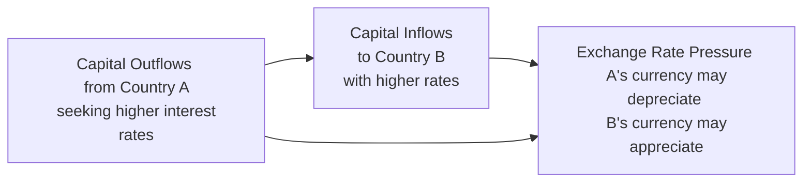

## Introduction and Purpose

You know, sometimes when we talk about currency markets and interest rate parity, it can sound pretty abstract—like it’s all theory and not much real-life application. But in these large-scale, integrated exam item sets, we’re often forced to juggle real-world complexities: maybe we see a central bank raising rates to tame inflation while the government announces big spending plans that might worsen the deficit. It’s a lot, right? But that’s exactly the point: to test your ability to connect dots in a fluid environment. If you’ve ever read, say, a central bank press release the same day your country’s finance minister hinted at raising taxes, you’ve felt that swirl of contradictory signals. Our goal here is to help you practice how to interpret and handle them on exam day.

In this section, we’re going to explore large-scale vignettes—those multi-page or multi-exhibit item sets that combine interest rate parity, policy announcements, forward/spot quotes, and underlying macroeconomic data. We’ll discuss best practices for scanning these scenarios efficiently, focusing on the relevant bits, and integrating multiple theories—covered/uncovered interest rate parity, purchasing power parity, and more. 

Expect worked examples that merge forward rate calculations, interest differentials, and possible arbitrage conditions, all layered with conflicting economic data. The aim is to push you beyond just plugging in formulas. You’ll see how to weigh policy statements from central banks, interpret market sentiment around interest rates and inflation, and figure out the direction of capital flows. We’ll also talk about potential pitfalls—like over-relying on a single parity concept when the data suggests a different direction. Let’s dive right in.

## Blending Parity Theories with Policy Dynamics

When we analyze currency markets under exam conditions, we often rely on international parity relationships to guide us. Yet the real world is full of nuances—monetary tightening can strengthen a currency if inflation expectations stay consistent, but if rising rates strangle growth, that same currency might become overvalued and end up reversing in the long run. 

Here are some of the core theories we typically bring to bear:

- **Covered Interest Rate Parity (CIRP):** States that the forward premium or discount on a currency should offset interest rate differentials, eliminating arbitrage opportunities. If you see an item set with clear interest rate data for two countries and forward quotes, you can test for covered parity by checking if:
  
  
  \text{Forward}_{a/b} = \text{Spot}_{a/b} \times \frac{(1 + i_a)^t}{(1 + i_b)^t}
  
  
  This condition helps you see if there’s any “free lunch” from borrowing in one currency and investing in another with a forward hedge.

- **Uncovered Interest Rate Parity (UIRP):** Asserts that the expected change in spot exchange rates should reflect the interest rate differential between two countries, but without a forward contract in place. If country A’s interest rate is higher than country B’s, we might expect currency A to depreciate in the future, making the expected returns equal after accounting for exchange rate changes.

- **Purchasing Power Parity (PPP):** Proposes that exchange rates in the long run gravitate toward levels that equalize the price of a basket of goods across countries. In an exam vignette, you might see data on inflation rates or broad price level changes. PPP is most useful when analyzing the long-term direction of exchange rates.

- **Central Bank Policy & Government Actions:** Policy rates, open market operations, quantitative easing (QE), changes to reserve requirements—these can all shift interest rates and inflation expectations. Meanwhile, government spending or taxation can alter growth forecasts and influence capital flows.

In an integrated item set, you’ll often find references to at least two of these frameworks, possibly hinting at forward mispricing or the potential for short-term arbitrage.

## Key Data Points to Look For in Vignettes

Large-scale item sets often throw a lot of numbers at you: spot exchange rates, forward quotes, multiple interest rates, inflation data, trade figures, and the occasional snippet from a central bank press release. When I was first practicing these item sets, I’d get a bit overwhelmed. My best strategy was to highlight or jot down the essential details for each currency:

• **Spot Rate & Forward Rate**  
• **Interest Rates** (risk-free or deposit rates, typically annualized)  
• **Time to Maturity** (for forward contracts)  
• **Inflation Or Growth Indicators** (CPI trend, GDP forecasts)  
• **Policy Statements** (rate hikes, expansions, or contractions of monetary policy)  
• **Trade and Capital Flow Data** (balance of payments, trade deficits, capital inflows/outflows)

It might sound obvious, but you don’t need to memorize every single number. Usually, each question points to specific pieces of data. Focus on what’s relevant for forward discount/premium calculations, PPP comparisons, or capital flow direction. 

## Diagram: The Flow of Capital in a Two-Country Model

Below is a simple diagram illustrating how capital might flow when interest rate differentials plus policy changes alter exchange rates. In many item sets, you’re expected to figure out which direction the money flows and how that flow affects forward exchange rates.



In a typical uncovered interest rate parity condition, higher interest rates in Country B attract capital, appreciating Country B’s currency, even though, theoretically, that same currency is expected to depreciate in the future if it’s priced under UIRP equilibrium. On the exam, you must interpret whether short-term capital flows or long-run expectations dominate the storyline in a given vignette.

## Contradictory Signals in Macroeconomic Data

You’ll often see vignettes featuring scenarios like:  
• A central bank raises policy rates to fight inflation.  
• The economy simultaneously shows signs of slowing growth.  
• Export data might slip while the trade balance improves due to weaker domestic demand.  

At first glance, these signals can conflict—for instance, a rate hike usually boosts the currency, but if growth tanks, foreign investors might panic and pull out. In some item sets, your job is to figure out the net effect. Are real interest rates still attractive enough to offset recession fears? Are forward quotes showing a discount that suggests the market is pricing in a future depreciation due to negative growth projections?

## Step-by-Step Example: Forward Rate Calculation Amid Policy Shifts

Let’s walk through a scenario that merges interest rate parity calculations with policy changes:

1. **Spot Exchange Rate (USD/EUR):** 1.10  
2. **6-Month Forward Rate Quoted:** 1.105 USD/EUR  
3. **Annualized US Interest Rate:** 3%  
4. **Annualized Euro Area Interest Rate:** 1%  
5. **Central Bank Announcement in the US:** A 25bps rate hike is expected in three months to counter mild inflation.  
6. **European Central Bank Outlook:** No immediate change due to moderate inflation and stable growth.  

We want to see if the existing forward rate (1.105) is aligned with covered interest rate parity. Using the covered interest parity formula for a 6-month horizon (t = 0.5):


F_{USD/EUR} = S_{USD/EUR} \times \frac{(1 + i_{US} \cdot t)}{(1 + i_{EU} \cdot t)} 


Substituting:


F_{USD/EUR} = 1.10 \times \frac{(1 + 0.03 \times 0.5)}{(1 + 0.01 \times 0.5)}
= 1.10 \times \frac{(1 + 0.015)}{(1 + 0.005)}
= 1.10 \times \frac{1.015}{1.005}
\approx 1.10 \times 1.00995
\approx 1.111


So the theoretical forward rate under covered interest parity is about 1.111 USD/EUR. The market quote is 1.105. That’s slightly lower, suggesting the EUR forward is trading at a small discount relative to the CIP-implied rate. 

If you see an item set question about whether an arbitrage opportunity exists, you’d zero in on this discrepancy. In a vacuum, you might say the market expects a rate hike’s effect on the U.S. dollar to be somewhat stronger than the standard model implies, or perhaps there are near-term risk factors for the Euro. The exam might ask how a treasury manager could exploit this.  

Anyway, the key is: Don’t just memorize formulas—explain what the mismatch means in the context of policy changes and capital flows.

## Quick Python Example for Forward Rate Checks

Below is a simple Python snippet to calculate the forward rate. You might not write code in the actual exam, but seeing a quick script can make your calculations more tangible. Practice on your own with different interest rates and times to see how forward prices shift.

```python
import math

S0 = 1.10    # Spot rate USD/EUR
i_US = 0.03  # Annualized US interest rate
i_EU = 0.01  # Annualized Euro interest rate
t = 0.5      # Time in years (6 months)

F = S0 * (1 + i_US * t) / (1 + i_EU * t)
print("Forward Rate (USD/EUR) in 6 months = ", round(F, 4))
```

## Practical Tips for Exam success

• **Skim, then Deep-Dive:** When you get your vignette, skim the text for major data points—spot, forward, interest rates, policy stance—before reading every detail. This helps anchor your brain to the key numbers.  
• **Underline Inconsistencies:** If the vignette says inflation is moderate but wage growth is surging, make a note. Contradictions can hint that the currency might be over- or under-valued.  
• **Remember Real vs. Nominal Rates:** A policy might raise nominal interest rates, but if inflation jumps even more, real yields could be falling. That mismatch may determine if capital flows truly move.  
• **Watch for Time Horizons:** Covered interest rate parity is typically short term, while PPP is often long term. The item set might try to trick you into applying the wrong framework.  
• **Policy Release Nuances:** A central bank may mention “data dependence” or “cautious approach.” That suggests possible future moves. Don’t assume the path is certain unless the text explicitly says so.

## Common Pitfalls

• **Overlooking Hidden Costs:** In real markets, transaction costs or capital controls can complicate parity conditions. An item set might mention subtle “fees” or “tax withholdings.”  
• **Ignoring Risk Premiums:** Investors might demand extra compensation for political or default risk, so simple interest differentials might not tell the whole story.  
• **Mixing Up Sign Conventions:** If you see an indirect quote (e.g., EUR/USD instead of USD/EUR) or some annualized vs. monthly rates error, you can easily misapply formulas. Double-check whether you’re dealing with direct or indirect quotes and the correct timeframe.

## Example of an Integrated Vignette Outline

Imagine an item set with the following structure:

1. **Exhibit 1:** Spot rate and forward quotes for three currency pairs, plus short-labeled data about each country’s interest rates, inflation, and capital flow trends.  
2. **Exhibit 2:** A press release from Country A’s central bank announcing a 50bps rate cut.  
3. **Exhibit 3:** Government budget changes in Country B, aiming to reduce deficits by cutting spending.  
4. **Exhibit 4:** Commentary from an international financial institution about global economic slowdown and expectations for deflationary pressure.  

The questions might then ask:  
• How does the new rate cut in Country A alter the forward rate in a CIP-based scenario?  
• Are the observed forward discount or premium on A’s currency consistent with UIRP given the inflation outlook?  
• Given the government’s new austerity measures in Country B, what does the trade surplus data tell us about the direction of currency B?  
• Is there an arbitrage opportunity somewhere across the three currency pairs, perhaps using a triangular arbitrage approach?  

This type of multi-exhibit format forces you to combine data from different angles and adopt the correct parity or model.

## References and Further Reading

- CFA Institute Level II Curriculum, Economics topic readings on International Parity Conditions and Exchange Rate Determination.  
- Mishkin, Frederic. “The Economics of Money, Banking, and Financial Markets.”  
- IMF Data & Publications: https://www.imf.org/en/Data  

## Test Your Mastery: Parity and Policy in Integrated Item Sets



### A policymaker in Country X just announced a rate hike of 25bps while inflation remains at 4%. The economy is showing signs of cooling. Which effect would typically dominate under uncovered interest rate parity in the short run?

- [ ] Currency of Country X should depreciate immediately.
- [ ] Currency of Country X remains unaffected by changes in the domestic rate.
- [x] Currency of Country X might appreciate initially due to a higher rate.
- [ ] Demand for exports of Country X soars immediately due to cheaper currency.

> **Explanation:** Higher rates often trigger short-run appreciation as capital inflows increase. In uncovered parity, investors initially chase higher yields even if they ultimately expect future exchange rate adjustments.

### Suppose the spot rate is 1.50 USD/GBP, and the six-month forward rate is 1.52 USD/GBP. The annualized interest rate in the US is 4%, while it’s 2% in the UK. Over a six-month period, which forward rate is implied by covered interest rate parity?

- [x] 1.515 USD/GBP  
- [ ] 1.528 USD/GBP  
- [ ] 1.500 USD/GBP  
- [ ] 1.480 USD/GBP

> **Explanation:** Using the CIP formula F = S × [(1 + i_US × 0.5)/(1 + i_UK × 0.5)] = 1.50 × [(1 + 0.04×0.5)/(1 + 0.02×0.5)] = 1.50 × [1.02/1.01] ≈ 1.515.

### You read an item set describing monetary tightening in Canada while the Canadian dollar trades at a forward discount against the U.S. dollar. Real growth in Canada is slowing, but inflation remains above target. Which statement best explains the forward discount?

- [ ] Markets expect the CAD to appreciate due to higher interest rates.  
- [ ] Slowing growth typically doesn’t affect the exchange rate.  
- [x] Despite higher rates, markets anticipate CAD depreciation due to weak growth or risk concerns.  
- [ ] A forward discount indicates CIP is violated beyond repair.

> **Explanation:** Forward discounts can persist if market participants expect the higher interest rate environment to be unsustainable, or if risk premiums and growth concerns overshadow the rate advantage.

### A central bank statement reads, “We remain vigilant against inflation and will adjust the policy rate to maintain price stability.” The economy’s inflation is trending downward faster than expected. How might forward-looking traders interpret this stance?

- [ ] They ignore it because inflation is already declining.
- [x] They expect potential rate cuts if inflation continues dropping, which might weaken the currency. 
- [ ] They assume immediate rate hikes, strengthening the currency indefinitely.
- [ ] They see this as a direct risk of an interest rate parity breakdown.

> **Explanation:** If inflation is trending down quickly, the central bank may see room to cut in the future. Traders often price in potential rate cuts, which can weaken the currency in forward markets.

### In a scenario where forward EUR/USD is trading at a significant premium compared to its CIP-implied level, which outcome might you expect if no market frictions exist?

- [ x ] Arbitrageurs will earn riskless profit until the forward rate realigns with CIP.
- [ ] The premium widens indefinitely as more traders chase it.
- [ ] No profit opportunities exist without central bank intervention.
- [ ] CIP must have been permanently discredited by the market.

> **Explanation:** Significant deviations from covered interest rate parity typically invite arbitrage, which tends to realign forward rates with theoretical levels unless there are frictions or capital controls.

### A press release from the finance ministry of Country Z highlights a widening trade deficit. The central bank is simultaneously considering raising its policy rate to combat local inflation. How might this mixed data affect the currency?

- [ ] The currency must strengthen because of the rate hike.
- [x] The currency could move in either direction; the rate hike might attract inflows while the widened deficit suggests potential depreciation.
- [ ] The currency will remain pegged at the current rate, unaffected by trade deficits.
- [ ] There is no probable impact on the currency from these announcements.

> **Explanation:** A rate hike can boost currency demand, but a ballooning trade deficit can weigh on the currency. Net effect depends on which factor markets deem more dominant.

### Under uncovered interest rate parity, if Country A’s annual nominal interest rate is 5% and Country B’s is 1%, which near-term outcome is commonly expected?

- [ ] Country A’s currency must depreciate immediately by 4%.
- [ ] Country B’s currency is worthless in forward markets.
- [ ] Country A’s inflation rate must be negative to compensate.
- [x] Country A’s currency may be expected to depreciate over time by about 4%, reflecting the interest differential.

> **Explanation:** Uncovered parity suggests the currency of the high-interest-rate country is expected to depreciate by roughly the differential in interest rates over the same period, though not necessarily immediately.

### A newly released GDP growth forecast for an emerging market is significantly higher than anticipated, while its interest rates remain steady. How might capital flows react?

- [x] Foreign capital may flow in, expecting strong corporate earnings and potential currency appreciation.
- [ ] Investors will only shift out of the currency due to lack of rate hikes.
- [ ] Capital flows are not influenced by GDP growth forecasts.
- [ ] Only interest rate differentials matter for cross-border investment decisions.

> **Explanation:** Even with no change in interest rates, improved growth prospects can attract foreign investments, which could appreciate the currency if other conditions remain stable.

### A forward contract exhibits a smaller discount than implied by CIP for a particular currency. What might be the simplest explanation?

- [x] Market participants expect that future developments will be more favorable to the currency than implied by basic CIP.
- [ ] A forward discount smaller than CIP always signals interest rates are misreported publicly.
- [ ] Central banks are colluding to manipulate the currency.
- [ ] There is no logical reason for forward discounts to deviate from CIP.

> **Explanation:** Forward rates can deviate from the strict CIP formula if traders anticipate different future risk premiums or policy changes than the raw differential suggests.

### True or False: In large-scale vignette scenarios, contradictory macro signals (like slowing growth alongside rising policy rates) always lead to a clear, unambiguous currency valuation outcome.

- [x] True
- [ ] False

> **Explanation:** Trick question: it’s actually false. Contradictory signals rarely yield an obvious outcome. You often have to carefully weigh which factors dominate. In reality, a single data set might push the currency one way in the short term, while another factor leads to the opposite move in the longer term.


