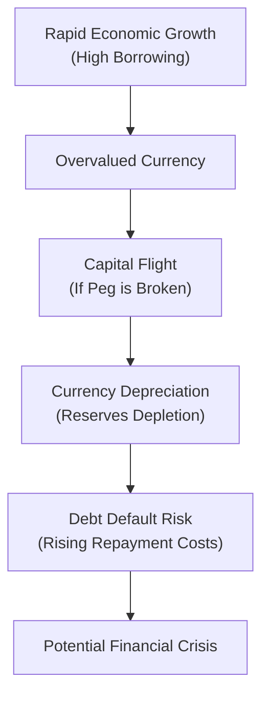

## Introduction

Hey there, welcome to this deep dive into the wild ride that is “Growth and Currency Crisis Simulations.” If you’ve been following along from earlier chapters of CFA® 2025 Level II, Volume 2: Economics, you already know how currency markets can be impacted by various macroeconomic shifts—things like interest rates, balance of payments conditions, and inflation differentials. Now we turn our attention to something that’s a bit more adrenaline-inducing: full-blown currency crises and the sometimes unpredictable growth patterns that pave the way to them.

It might sound fancy, but in simpler terms, a currency crisis is basically a situation where the value of a country’s currency (often under a fixed or pegged regime) drops like a rock or comes under intense pressure—sometimes overnight. If you’ve ever heard stories of people queuing at banks, frantic about the value of their savings, that’s usually tied to these sorts of large-scale economic disruptions.

In this section, we’ll integrate the ideas of macroeconomic indicators, exchange rate regimes, and policy actions. We’ll look at how short-term, super-charged growth can become a major risk factor—particularly when that growth is financed by foreign currency borrowings (ouch), or when it leads to mounting imbalances in the current account. We’ll also practice diagnosing a potential currency crisis scenario using hypothetical data, then explore how central banks and governments might respond (for better or worse). So, let’s get going.

## Setting the Stage: Key Warning Signs

One way to recognize that something fishy might be brewing in the currency markets is to keep an eye on a set of macroeconomic indicators that historically have signaled impending crises. Let’s break down some red flags you might see in your material or in real countries:

• High Inflation: When a country experiences persistently high inflation, its currency tends to lose purchasing power relative to currencies with lower inflation. In a fixed or pegged regime—where the central bank tries to keep its currency at a certain level against, say, the US dollar—this mismatch can become unsustainable.

• Overvalued Exchange Rate: You might recall from Chapter 4 (Balance of Payments and Currency Valuation) that a currency considered overvalued is one whose external value doesn’t match economic fundamentals. Usually, there’s a shortage of foreign exchange if the central bank tries to maintain a value that’s too high, which drains FX reserves.

• Excessive Foreign-Denominated Debt: Borrowing in a foreign currency can be cheap—until you have to repay that debt in, say, US dollars. If your domestic currency depreciates, the cost of servicing that debt (in domestic currency terms) skyrockets. This can be the spark that turns an uncomfortable financial situation into a raging fire.

• Dwindling Foreign Reserves: If the country’s central bank attempts to defend its currency (often pegged) by using reserves to buy up its own currency, the reserves can evaporate quickly if the market perceives fundamental misalignments. No more reserves = no more lines of defense.

• Widening Current Account Deficit: For many nations, a massive current account deficit usually needs financing from abroad. If global sentiment ices over—investors get skittish, or credit dries up—this external funding can vanish, intensifying the pressure on the exchange rate.

• Growth Booms with Structural Imbalances: High growth is wonderful—until it’s not. If growth is fueled by cheap external credit and speculation, it might lead to bubbles or artificially propped-up industries. That “boom” can quickly transform into a “bust” that crushes the currency.

Just imagine: you’re analyzing a country that’s posting 8% real GDP growth year after year, financed mainly by foreign currency loans. It looks great on the surface—shiny new infrastructure projects, real estate mania, and massive consumer spending. But if that foreign credit pipeline dries up or interest rates rise abroad, the party might be over.

## Growth Models and Overheating Economies

We’ve touched on growth theories in Chapters 6 and 7 (like neoclassical and endogenous growth models). So, let’s quickly recall how these can interact with currency crises:

• Neoclassical Growth Model: It suggests that economies converge to a long-run sustainable growth path, determined by capital accumulation, labor, and technological progress. If an economy pushes itself way above this long-run trend (e.g., through aggressive fiscal stimuli or foreign borrowing), it may face inflation or currency misalignment.

• Endogenous Growth Model: This model emphasizes factors like innovation, knowledge spillovers, and human capital as internal drivers of growth. While it’s more optimistic about sustained higher growth, it still warns that external financing is not an unlimited resource. If those flows stop, even an innovation-driven economy can suffer capital flight.

Short-term bursts of growth certainly feel good, but they can mask vulnerabilities. For instance, a country adopting expansionary monetary policy (chasing growth) might see interest rates remain artificially low. In a floating exchange rate regime, the currency could depreciate gradually, but if the regime is partially fixed or heavily managed, the mismatch can lead to big trouble—especially if foreign-denominated debt is building.

## Diagnosing a Currency Crisis: Hypothetical Data

Let’s try a small hypothetical scenario—something you might see in a Level II item set:

• Country X’s GDP Growth: 7–8% per year for the last five years.  
• Inflation: 12% (while key trading partners have 2–3%).  
• Exchange Rate Regime: Fixed to the US dollar at a ratio of 1:1.  
• FX Reserves: Have fallen from USD 60 billion to USD 30 billion over two quarters.  
• External Debt: 80% of GDP, largely denominated in US dollars.  
• Current Account: Running a deficit of 10% of GDP.  

We’re looking at a country that’s been running hot. Inflation is up, real exchange rate is probably overvalued (since inflation is exceeding that of its trade partners), and the central bank is burning reserves to maintain the fixed rate. Meanwhile, the country’s carrying a hefty chunk of external debt.

So if you were reading this in an exam vignette, you might suspect a currency crisis is near. The central bank might have to devalue (i.e., abandon the peg) or drastically increase interest rates to encourage capital inflows. But that interest rate spike can result in domestic recession, and if the peg is broken anyway, foreign debt repayment becomes more expensive. It’s a lose-lose scenario when the fundamentals aren’t addressed early.

## The Role of Exchange Rate Regimes

The kind of exchange rate regime in play can magnify or mitigate a crisis. So, let’s talk about fixed vs. floating:

• Fixed (Pegged) System: The government tries to maintain a certain exchange rate, typically pegged to a major currency. Though it can reduce exchange rate volatility in stable times, it also means the country’s monetary policy is somewhat tied to that of the anchor currency. If local inflation is raging, the mismatch grows. Defending a peg consumes foreign reserves—sort of like a set of armor that cracks under repeated blows if fundamentals are flawed.

• Floating System: In a truly floating system, market forces determine the exchange rate. Overvaluation typically self-corrects via depreciation (the currency weakens on its own). While you avoid an abrupt break of a peg, it can still get messy if sentiment shifts quickly. You might end up with a rapid depreciation leading to imported inflation. But, at least theoretically, the effect is more gradual than a “peg break” that can cause overnight chaos.

In practice, many countries operate in a “managed float,” meaning the central bank occasionally intervenes but tries not to commit to a hard peg. The advantage is flexibility; the disadvantage is unpredictability for investors and businesses.

## Policy Tools and Ramifications

Imagine you’re on the policy-making side, facing the risk of a currency meltdown—what can you do? Let’s keep it informal:

• Interest Rate Hikes: “Crank ‘em up!” is often the first tool out of the box to defend a currency. Higher interest rates attract foreign capital (in theory) and support the currency. But back home, higher rates can kill domestic borrowing, hamper growth, and spark stagflation if inflation remains sticky.

• Direct FX Intervention: The central bank can sell foreign reserves to buy the domestic currency. This props up the currency’s value—until reserves run out.

• Capital Controls: In some extreme scenarios, governments limit how much money can flow out of the country (capital flight). But this isn’t popular with foreign investors, who see it as a sign of desperation.

• Fiscal Austerity: Cutting government spending or raising taxes can reduce inflationary pressures if the economy is overheating. But it can also be socially and politically unpopular, triggering protests or slower growth in the near term.

• Floating (Abandoning the Peg): Accept a sharp depreciation, let the currency find its equilibrium. It may cause a spike in inflation (especially in an import-heavy economy) and magnify the foreign-debt burden. However, if that currency was truly overvalued, this might be the only genuine path to correction.

A straightforward example: A central bank that is determined to keep its currency peg might issue domestic bonds at higher and higher yields to entice foreign capital. But the market’s confidence erodes fast if they suspect that needs are unsustainable. As soon as large holders of debt lose faith, the capital flight can snowball—faster than you can say “speculative attack.”

## Scenario Building: Defend or Let Go?

One of the trickiest calls for policymakers is: do we defend the currency with every resource at our disposal, or do we let the currency depreciate?

• Defending the Currency: Typically means aggressive rate hikes and using precious foreign reserves. The upside: if you succeed, you maintain a stable exchange rate and perhaps keep inflation somewhat in check. The downside: if your fundamentals aren’t aligned, the market may eventually overwhelm your defenses, leaving you with minimal reserves, high interest rates, and cratered growth.

• Letting the Currency Float: The short-term shock can be severe—capital flight, inflation on imports, and possibly banking stress if banks hold large FX liabilities. But if markets believe the currency is now more correctly valued, confidence can stabilize in the medium term.

I remember a friend telling me about visiting a country right before a major devaluation. The official exchange rate might have been 1 local currency to 1 US dollar, but on the street, you’d get double the local currency for 1 dollar (a huge black-market premium!). Within days, the government gave up defending the peg, and the official rate soared to match the black-market rate. People scrambled to convert their savings into dollars. Not a fun time.

## Time-Series Forecasting Approaches

Although your CFA® exam might not demand you code an Autoregressive (AR) model from scratch, understanding how analysts forecast growth and inflation can help highlight potential currency pressure points. A typical approach:

• Multiple Regression: Suppose you want to forecast next quarter’s growth. You might regress GDP growth on interest rates, inflation expectations, external debt levels, commodity prices, and so on. Surging inflation or ballooning foreign debt might foretell problems for the currency.

• AR(1) or ARMA Models: For inflation or exchange rate forecasting, you could do a simple AR(1):  
  X(t) = α + ρX(t−1) + ε(t)  
  If ρ is close to 1 for inflation, you might be in a scenario where shocks persist—and that’s never good for currency stability.

Here’s a quick snippet (just for fun) of how you might do a simple AR(1) in Python for inflation data:

```python
import statsmodels.api as sm
import pandas as pd

df['inflation_lag'] = df['inflation'].shift(1)
df.dropna(inplace=True)

X = sm.add_constant(df['inflation_lag'])
y = df['inflation']

model = sm.OLS(y, X)
results = model.fit()
print(results.summary())
```

Analysts will look at the autoregressive coefficient, check the residuals, and see if inflation is likely to remain stubbornly high, risking a crisis if the currency remains pegged.

## Putting It All Together in a Mermaid Diagram

Below is a simple flowchart showing how unsustainable growth can escalate into a currency crisis:



## Best Practices and Common Pitfalls

• **Best Practices**:  
  - Monitor foreign reserve levels, not just in absolute terms but relative to short-term external debt.  
  - Conduct sensitivity analyses: “What if interest rates rise abroad by 2%? Does that kill our country’s ability to roll over short-term debt?”  
  - Keep track of the credit rating environment and market sentiment. If rating agencies hint at a downgrade, capital flight can intensify quickly.  

• **Common Pitfalls**:  
  - Overlooking currency mismatch: When corporations or governments borrow in foreign currencies without hedging.  
  - Believing “this time is different”: Overconfidence in indefinite growth booms, ignoring historical crisis patterns.  
  - Overusing interventions: Repeatedly defending a currency peg can ironically accelerate the crisis if capital markets suspect you’ll lose.  

## Glossary Quick Reference

• **Currency Crisis**: A scenario where a currency’s fixed or managed value collapses under market pressure or is forced to devalue.  
• **Foreign-Denominated Debt**: Loans/bonds in a currency different from the issuer’s home currency, exposing them to exchange rate risk.  
• **Balance of Payments**: A record of all economic transactions between residents of a country and the rest of the world, including trade, investment, and transfers.  
• **Capital Flight**: Rapid movement of assets out of a country due to political or economic instability, often worsening currency pressures.  
• **Overvaluation/Undervaluation**: Relative to its fundamental equilibrium, a currency might trade at an unsustainably high (overvalued) or low (undervalued) rate.  
• **FX Reserves**: Foreign assets held by a central bank for managing the currency’s value.  
• **Growth Shock**: Large and unexpected change in GDP growth, which can spark volatility in currency markets.  
• **Expansionary Monetary Policy**: Lowering interest rates or increasing money supply to stimulate the economy, often weakening the currency in the process.

## Final Tips for the Exam

• **Look for Contradictory Indicators**: If inflation is skyrocketing while the central bank insists on a peg, consider the risk of devaluation.  
• **Detect the Narrative**: Vignette item sets often tell a story—maybe the country’s been posting stellar growth numbers, but keep an eye on foreign debt levels or reversing capital flows.  
• **Weigh Policy Tools**: Understand the consequences of raising rates vs. letting the currency float. The exam might ask you to pick the “best” policy response given a country’s constraints.  
• **Time Management**: Watch for data tables with reserves, current account deficits, inflation trends, and interest rates. Summarize the big picture quickly so you can answer the item set questions confidently.  

Remember that real-life crises are messy, and in the exam, you’ll often see simplified data. The key is to identify the dominoes that are likely to fall when the fundamentals don’t line up.

## References and Further Exploration

• Krugman, P. “Crisis Models in International Economics” – a classic theoretical overview of speculative attacks.  
• CFA Institute Level II Curriculum – Economics readings on currency crises, exchange rate systems, and growth models.  
• Reinhart, C., & Rogoff, K. “This Time Is Different: Eight Centuries of Financial Folly” – an illuminating read on how crises echo through history.  

---------------------------------------------

## Growth & Currency Crisis Simulation Quiz



### A country with a fixed exchange rate sees its foreign reserves plummet from $100B to $20B within a few months due to defending its peg. Which warning sign does this trend primarily highlight?

- [ ] High inflation
- [ ] Strong GDP growth
- [ ] Weak consumption spending
- [x] Dwindling FX reserves

> **Explanation:** Rapid depletion of foreign reserves signals that the central bank is heavily intervening to support the currency's peg, a classic precursor to a potential currency crisis if fundamentals are misaligned.

### Suppose you observe a country running a 12% inflation rate while its anchor currency partner runs 2%. The central bank keeps the nominal exchange rate at par. Which of the following is the biggest immediate risk?

- [ ] Capital inflows due to high domestic interest rates
- [x] Overvaluation of the real exchange rate
- [ ] A drop in the current account surplus
- [ ] Surge in domestic credit ratings

> **Explanation:** If the domestic inflation rate significantly exceeds that of the anchor currency’s economy but the exchange rate remains fixed, the real exchange rate becomes overvalued, exposing the country to crisis risk.

### A government can attempt to defend a fixed rate by:

- [x] Selling foreign reserves to buy its own currency
- [ ] Reducing interest rates to increase domestic demand
- [ ] Buying its own currency with newly printed money
- [ ] Forbidding domestic banks to lend to corporations

> **Explanation:** Defending a peg typically involves using foreign currency reserves to buy the domestic currency. Reducing interest rates would actually weaken the currency further.

### Which scenario best describes a “capital flight” episode?

- [ ] Local currency rapidly appreciates against the US dollar
- [x] Investors withdraw large amounts of funds, converting them to foreign currency
- [ ] The government invests heavily in infrastructure projects
- [ ] The central bank hoards additional foreign reserves

> **Explanation:** Capital flight is the mass exodus of funds from one country to safer or more stable assets abroad, often converting to foreign currencies on the way out.

### If policymakers choose high interest rates to defend a peg, which secondary effect is most probable?

- [x] Slowing economic growth due to higher borrowing costs
- [x] Reduced investor interest in domestic currency
- [ ] Constant inflation
- [ ] Unchanged foreign reserve levels

> **Explanation:** Higher rates typically cool domestic demand and can slow growth. They may sustain the currency temporarily, but they don't guarantee stable inflation unless accompanied by broader structural measures.

### A “growth shock” occurs when:

- [x] GDP deviates significantly from its long-term trend
- [ ] Unemployment rises by 1% or more per quarter
- [ ] The current account flips from deficit to surplus
- [ ] Inflation simply remains unchanged

> **Explanation:** A growth shock happens when there’s a notable and unexpected jump or drop in GDP growth compared to historical or expected levels. This can ripple through currency markets.

### Which of the following is a hallmark of the neoclassical growth perspective?

- [x] Economies converge to a steady-state growth rate
- [ ] Growth is solely driven by continuous external borrowing
- [x] Persistent inflation is the primary growth driver
- [ ] High levels of net exports guarantee indefinite expansion

> **Explanation:** The neoclassical model posits that economies tend toward a steady state determined by capital, labor, and technology, not indefinite borrowing or inflationary tactics.

### When analyzing foreign-denominated debt in crisis scenarios, a key risk is:

- [x] Cost of debt servicing surges if the domestic currency depreciates
- [ ] Excess domestic savings
- [ ] Elimination of structural unemployment
- [ ] Significant improvement in trade balance

> **Explanation:** Foreign debt obligations become more expensive in domestic currency if there is a depreciation. This can rapidly worsen fiscal or corporate balance sheets.

### Which of the following is most likely to happen if a central bank “abandons the peg”?

- [x] The currency depreciates to a market-determined level
- [ ] The currency appreciates dramatically
- [ ] Inflation falls immediately
- [ ] The current account deficit is guaranteed to widen

> **Explanation:** Abandoning a peg generally allows the currency to float. If the peg was overvalued, the currency often depreciates to a new equilibrium level.

### True or False: A currency crisis can only occur in pegged exchange rate systems.

- [x] True
- [ ] False

> **Explanation:** While severe crises are more commonly associated with fixed or pegged regimes, a “crisis” can still happen in managed or even floating regimes under extreme conditions. However, classic currency crises typically refer to the collapse of a peg under speculation and reserve losses.


