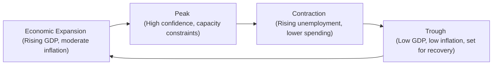

## Introduction

Ever watch a surfer waiting for the right wave? They bob up and down, scanning the horizon for a swell that lines up with the perfect conditions. I used to think, “Ah, that’s exactly the same as navigating sectors in an investment portfolio!” Maybe I was just hungry for a beach vacation, but seriously—like surfing, sector rotation is all about spotting that next big macro wave and positioning yourself to ride it. 

In the context of macroeconomic analysis, we’re basically trying to figure out which sectors are poised to outperform or underperform based on various indicators. Everything from rising GDP, surging inflation, or unexpected interest rate cuts can shift the market’s preference from technology to energy, or from consumer discretionary to consumer staples. As a CFA® Level II candidate, you’ve probably got a decent handle on how macro indicators move markets, but layering that knowledge onto sectors can feel a little tricky at first.

That’s what this section is all about: bridging the gap between your understanding of economic fundamentals and applying it to real-world sector positioning. We’ll dig into cyclical vs. defensive industries, business cycle phases, commodity price effects, cross-market linkages, and scenario analyses. There’s a lot to share, so let’s dive in.

## Why Sector Rotation Matters

Sector rotation is the strategy of shifting investment allocations among different economic sectors to capitalize on expected changes in market conditions. For instance, in an expansionary environment, cyclical sectors like consumer discretionary and financials often see robust performance, while during a downturn, defensive sectors such as utilities and consumer staples may hold up better. If you time it well—and also weigh the various macro indicators—sector rotation helps optimize returns and manage downside risk.

Most importantly, for the CFA® Level II exam, you’re not just memorizing which sector does well during expansion. You’ll need to analyze the given macro data (like interest rates, employment, or consumer confidence) and tie it logically to a probable sector performance outcome. In that sense, sector rotation is a forward-looking approach. It relies on anticipating changes—some subtle, some glaring—that could be gleaned from numerous economic signals.

## Macroeconomic Indicators and Sector Dynamics

Several macro indicators can affect sector performance. Let’s walk through some of the biggest ones you’ll see:

### GDP Growth

GDP growth is the broad measure of economic expansion or contraction. When GDP accelerates, consumer spending tends to rise, corporate earnings improve, and cyclical sectors such as consumer discretionary, industrials, and materials often thrive. On the flip side, a decline or slowdown in GDP typically favors defensive sectors—those that rely less on discretionary consumer spending.

• Fast-growing GDP → job creation, higher revenues in cyclical sectors (e.g., hotels, airlines, auto manufacturers).  
• Slowing GDP or recession → stable demand for consumer staples, utilities, healthcare.

### Inflation

Inflation is like that hidden tax that can chip away at both consumer purchasing power and certain sectors’ profitability. Rising inflation has historically boosted sectors tied to real assets or commodities (like energy or materials) because the underlying commodity prices often move in tandem with inflation. Financial institutions may benefit if higher inflation accompanies rising interest rates, but they could also suffer if inflation sets off concerns about credit quality or dampens loan demand.

Conversely, high inflation can be rough on consumer discretionary if consumers tighten their belts. Also, if cost pressures become unmanageable for certain manufacturers, profit margins might shrink in sectors that can’t immediately pass price increases on to customers.

• Rising inflation → potential outperformance in materials, energy, and possibly financials (due to rising interest rates and bank margins).  
• Stable or low inflation → secular growth stocks and discretionary items may perform better.

### Consumer Spending Patterns

Consumer spending is the lifeblood of many economies. When people have more disposable income and confidence in the future, they’re more likely to splurge on discretionary items (vacations, electronics), fueling growth in consumer discretionary sectors. Meanwhile, if unemployment rises or consumer confidence falters, defensive corners of the market—like consumer staples (food, beverages, household products)—tend to be viewed as “safe havens.”

### Interest Rates and Yield Curves

The yield curve, which shows the relationship between bond yields and maturities, is a powerful indicator of economic expectations. A normal, upward-sloping yield curve often implies healthy growth, allowing financial institutions to borrow short-term at lower rates and lend long-term at higher rates, thereby expanding their interest margins.

In contrast, an inverted yield curve (when short-term yields exceed long-term yields) can signal an impending economic slowdown. Banks may face a profitability squeeze, while certain defensive sectors (utilities, real estate investment trusts) attract folks seeking consistent cash flows.

• Rising rates → may favor financials in the early stages if net margins improve, but can become a drag on capital-intensive sectors (like real estate or utilities) as financing becomes more expensive.  
• Flattening or inverted yield curve → heightened recession worries, so cyclical sectors might underperform; defensive sectors could see increased demand.

### Commodity Prices

Commodity price movements reflect global supply-demand dynamics, and they can quickly change which sectors look attractive. For example, rising oil prices (like we might see if there are big disruptions in the Middle East or a major pipeline closure) can boost energy stocks but weigh on consumer discretionary (if higher gas prices reduce consumer budgets). Similarly, if copper or iron ore rally, materials or mining stocks might see a lift. 

Like it or not, commodity markets can be influenced by everything from geopolitical tensions to new technology adoption—think electric vehicles driving up demand for lithium.

## Cyclical vs. Defensive Sectors

“Cyclical” sectors are those that align closely with the business cycle. Their revenues and profits typically see big swings when economic conditions change. Examples include:

• Consumer Discretionary (e.g., automotive, retail, leisure)  
• Financials (banks, insurance, asset managers)  
• Industrials (capital goods, construction, industrial conglomerates)  
• Materials (mining, chemicals, construction materials)  
• Real Estate (can also be interest-rate sensitive)

“Defensive” sectors are generally insulated from broad economic shifts because demand remains consistent. Even during downturns, consumers need certain basic goods and services. Typical examples:

• Consumer Staples (food, beverages, household products)  
• Utilities (electricity, water, gas distribution)  
• Healthcare (pharmaceuticals, hospitals)

Some folks also categorize Technology and Telecom as somewhat cyclical depending on the segment (e.g., enterprise software might be stable, while semiconductors could see big booms and busts).

### Visualizing the Business Cycle

Below is a simple flowchart of a standard business cycle with expansions and contractions.

During a robust expansion and approaching the peak, cyclical sectors typically do quite well. As the cycle rolls over and enters contraction, defensive or interest-sensitive sectors may appear more attractive. After enough contraction, we eventually hit the trough and the early rebound typically sets the stage for cyclical re-entry.

## Scenario Analysis and Vignette Examples

Let’s consider some scenarios you might encounter in a CFA® Level II item set. The key is to parse the data on GDP, inflation, interest rates, consumer sentiment, and so on, then form a coherent argument about which sector might take off—or which might lag.

1) High Growth + Rising Inflation  
   - Suppose the economy is expanding at a robust GDP growth rate of 4%. Consumer spending is looking strong, but inflation has also crept up to 3.5%. Central banks hint at raising rates to cool the economy.  
   - Likely Winners: Materials and energy might benefit from rising commodity prices. Financials (especially banks) can do well if rate hikes support net interest margins—though watch out if rate hikes happen too aggressively.  
   - Likely Losers: Consumer discretionary might suffer if borrowing costs go up and inflation dampens disposable income. Real estate may feel a pinch as mortgage rates rise.

2) Global Slowdown + Loose Monetary Policy  
   - Now imagine unemployment is rising, and a major trading partner is dipping into recession. The central bank cuts interest rates to stimulate activity.  
   - Likely Winners: Defensive sectors (utilities, consumer staples) because consumer demand for these goods is less sensitive to cyclical downturns. Real estate investment trusts might get a small boost from lower interest rates.  
   - Likely Losers: Export-oriented cyclical sectors, especially industrials that depend on robust global demand.

3) Technology Disruption + Supply Chain Shifts  
   - Another scenario: A major wave of technology disrupts old business models—like e-commerce threatening traditional retail, or advanced robotics trimming labor demand. Meanwhile, supply chain constraints in semiconductors hamper car production.  
   - Likely Winners: Innovative tech firms, certain utilities that adopt cost-saving technology, or energy providers if global supply chain disruptions drive up rotation toward domestic production.  
   - Likely Losers: Industries that fail to adapt (brick-and-mortar could be hammered if it ignores e-commerce trends).

In your exam vignettes, you may see a mix of these data points. Practice reading quickly yet carefully: highlight key stats, watch for repeated references to rising or falling prices, and piece together how the macro environment is shifting. Then connect the dots to the sector calls.

## Pitfalls and Best Practices

• Over-Reliance on a Single Indicator: Don’t fixate on just inflation or just the yield curve. Real-world economic conditions are dynamic.  
• Timing: Even if you’re correct about the macro trend, markets might have priced in that expectation. In other words, sector rotation can be about *anticipation* more than reaction.  
• Policy Surprises: Central bank actions (like unexpected rate cuts) or government interventions (stimulus spending, trade barriers) can flip your sector bets on their heads.  
• Global Interdependence: In our interconnected world, a slowdown in one major region (say, the Eurozone) can have ripple effects everywhere. Export-oriented sectors are especially vulnerable.  
• Portfolio Diversification: Don’t over-concentrate. Even the “perfect” sector bet might underperform if unexpected events occur.

A best practice is to set up a matrix of macro conditions—like high/low growth, rising/falling inflation, expansions/contractions—and outline which sectors you find favorable in each. While you won’t always guess right 100%, having a structured roadmap makes your sector rotation decisions more systematic and reduces knee-jerk reactions to news headlines.

## Conclusion

Sector rotation under multiple macroeconomic indicators is all about interpreting signals from GDP growth, inflation, consumer spending, interest rates, and more. If this sounds like a lot of moving parts, well, it is. But with systematic analysis and scenario-based thinking, you can cut through the noise.

For the CFA® Level II exam, you’ll likely see item sets that present a hodgepodge of data. Remain calm, parse them carefully, outline the macro environment, and justify which sectors are best positioned. Remember, cyclical sectors thrive when the economy expands and consumer confidence is high, while defensive sectors tend to shine in tough times. Pay attention to yield curves for clues on interest rates. Watch inflation for signals that might move commodity-linked sectors. And stay aware of cross-market linkages if global conditions are shifting.

Ultimately, your mastery of sector rotation will help you stand out in real investment analysis and in those exam vignettes that test your ability to piece everything together. So practice scenario analysis, keep an eye on each indicator, and you’ll be well-prepared to catch that next macro wave.

## Sector Rotation Under Multiple Macroeconomic Indicators: Practice Questions



### Which sector is most likely to benefit directly when the yield curve steepens with short-term rates remaining very low?

- [ ] Consumer Staples
- [ ] Utilities
- [x] Financials
- [ ] Healthcare

> **Explanation:** A steepening yield curve typically benefits banks and other financial institutions, as they can borrow cheaply at short-term rates and lend at higher long-term rates, increasing net interest margins.

### An economy shows strong GDP growth of 5%, but inflation also rises from 2% to 4%. The central bank indicates a series of rate hikes. Which sectors might outperform in this scenario?

- [ ] Real Estate and Utilities
- [x] Materials and Energy
- [x] Financials
- [ ] Consumer Discretionary

> **Explanation:** Rising inflation often boosts commodity prices, favoring materials and energy. Financials may benefit from higher rates so long as economic growth remains robust. Conversely, real estate and utilities are disadvantaged by higher borrowing costs, and consumer discretionary can suffer as inflation erodes disposable income.

### Under a scenario of major consumer confidence declines and contracting GDP, which sector would typically be considered defensive?

- [ ] Consumer Discretionary
- [x] Consumer Staples
- [ ] Industrials
- [ ] Information Technology

> **Explanation:** During economic contractions, defensive sectors like consumer staples see stable demand since households continue purchasing essential goods (food, beverages, household items) irrespective of economic conditions.

### If global commodity prices surge due to a disruption in supply chains, which sector is likely to experience underperformance if consumer budgets are squeezed?

- [ ] Energy
- [x] Consumer Discretionary
- [ ] Materials
- [ ] Healthcare

> **Explanation:** A sudden jump in commodity prices, such as oil or metals, can increase costs for goods and services. Consumer budgets may be squeezed by higher fuel and product prices, often reducing discretionary spending on non-essential items.

### The yield curve inverts (short-term rates exceed long-term rates). Which of the following sectors is most likely to face higher risk of underperformance?

- [ ] Consumer Staples
- [ ] Utilities
- [x] Financials
- [ ] Healthcare

> **Explanation:** An inverted yield curve often signals an economic downturn. Banks and other financial institutions see lower net interest margins if they pay more for short-term deposits than they earn from longer-term loans.

### If technology innovation makes energy production more efficient and drives down input costs for heavy industries, which sector might see a profit margin boost?

- [x] Industrials
- [ ] Consumer Discretionary
- [ ] Consumer Staples
- [ ] Healthcare

> **Explanation:** When technology lowers energy costs, sectors heavily reliant on energy (e.g., industrials, manufacturing, transportation) may see improved profit margins due to plummeting input costs.

### Central banks in major economies simultaneously lower interest rates to combat a global slowdown. Which pair of sectors is more likely to benefit?

- [x] Utilities and Real Estate
- [ ] Consumer Staples and Materials
- [x] Real Estate and Consumer Staples
- [ ] Healthcare and Energy

> **Explanation:** Lower interest rates tend to benefit capital-intensive or yield-based sectors like real estate and utilities, since they rely on cheaper financing and can become attractive for yield-seeking investors. Consumer staples may also gain as defensive stocks with stable dividends. However, the single best pairing is often Real Estate and Utilities.

### Rising inflation and lower GDP growth appear simultaneously (stagflation). Which sector might prove relatively resilient?

- [x] Consumer Staples
- [ ] Industrials
- [ ] Consumer Discretionary
- [ ] Real Estate

> **Explanation:** During stagflation, both growth potential and consumer sentiment deteriorate, but prices continue climbing. Consumer staples demand is fairly inelastic, making it a safer haven in these conditions.

### Global interest rates spike, and capital flows shift toward economies with higher yield. Which sector in those high-yield economies might see an immediate positive impact?

- [x] Financials
- [ ] Healthcare
- [ ] Consumer Discretionary
- [ ] Energy

> **Explanation:** Higher rates often bolster the profitability of banks and other financial institutions in the short term, as they can lend at higher rates. International capital flows seeking higher yield can also boost local financial services, fueling expansion in that sector.

### True or False: When analyzing sector rotation, relying on a single economic indicator like inflation to guide investment decisions is typically sufficient.

- [ ] False
- [x] True

> **Explanation:** This is a trick question. It is actually false that relying on a single indicator is sufficient. Multiple indicators should be considered (GDP growth, consumer confidence, interest rates, etc.). So the correct stance is that the statement is false. (Note: If you checked “True,” be aware that was the trap—no single indicator alone is enough for sector rotation decisions!)



## References and Further Reading

• Fabozzi, Frank. “Fixed Income Analysis.” New York: Wiley.  
• CFA Institute Level II Curriculum, Equity and Economics topics on sector rotation and business cycles.  
• Bogle, John C. “Common Sense on Mutual Funds.” Wiley.  

These resources provide deeper insights into interest rate dynamics, the intricacies of economic cycles, and the practical considerations of sector-based investing strategies. They should help reinforce your understanding of macro indicators and how to rotate among sectors for maximum effect. Good luck with your studies—and remember, always keep an eye on multiple data points before deciding which wave to catch!
