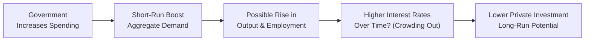

## Introduction and Context

Sometimes, we come across those big economic vignettes—you know, the ones that make you stare at the page, mutter “Oh boy,” and wonder where to begin. They throw in changes to tariff rates, a government announcing new spending projects, and a central bank tinkering with interest rates, all in one go. For the CFA Level II exam, learning how to handle these bundled policy scenarios can help you ace the item set format. 

In this section, we’ll walk through how trade policies, fiscal positions, and monetary decisions come together to influence the economy—both in the short run and the long run. The trick is to carefully orchestrate different frameworks: aggregate demand and supply, balance of payments, currency flows, and, of course, the good old crowding out effect. We’ll also throw in a few personal stories here and there, plus a little “um, let me think” moment, so stick with me. 

## Integrating Macroeconomic Tools

### Identifying Multiple Policy Moves in a Vignette
In a typical bundled item set, you might see a press release stating that the government has decided to raise spending on infrastructure (fiscal expansion) while simultaneously imposing tariffs on certain imports. Then a chart might show the monetary policy stance of the central bank—say, they cut interest rates to boost domestic investment. 

These policy shifts can create a flurry of effects:
• Fiscal expansion can stimulate consumption through the spending multiplier.  
• Tariffs may import inflationary pressure and provoke retaliatory measures.  
• A looser monetary policy often weakens the currency, all else equal, encouraging exports—until (or unless) foreign investors buy domestic bonds and offset some of that depreciation.  

Candidates need to piece together how these changes interact rather than treat them as isolated events. The exam loves to see you walk a fine line: connect the short-run jump in aggregate demand to the potential long-run crowding out, then layer on the exchange rate effect from new trade barriers or shifting capital flows.

### Short-Run vs. Long-Run Dynamics
A classic pitfall is forgetting that economic models can produce quite different results depending on your time horizon. In the short run, expansionary fiscal policy is likely to increase aggregate demand (AD), fueling growth and potentially boosting employment. However, over the long run, persistent government deficits might raise real interest rates—if the central bank does not fully accommodate the deficits—and crowd out private investment.

To visualize, we can use a basic mermaid diagram showing the flow of short-run vs. long-run effects:

In the short run (A → B → C), everything seems rosy as output climbs. But in the long run (C → D → E), rising government borrowing can raise the cost of capital and reduce private sector investment. On the exam, watch for clue words in the vignette that hint at time frames—“over the next quarter” vs. “looking five years ahead.”

## Trade Barriers, Exchange Rates, and Competitiveness

When you add trade policy changes like tariffs or quotas to the mix, the plot thickens. Let’s say the government places a tariff on steel imports:

• Domestic steel producers might enjoy a short-term competitive advantage.  
• Domestic consumers or downstream manufacturers could face higher input costs.  
• Retaliation (if foreign trade partners respond with tariffs of their own) could reduce exports.  

Moreover, as a result of import restrictions, the immediate effect might be to reduce the demand for foreign currency (fewer imports purchased), which can strengthen the domestic currency in the near term. But if inflation begins to climb due to rising import prices, the currency could weaken over time—and it’s also possible that domestic producers become less efficient without foreign competition. 

In a Level II item set, you might be asked to examine an exhibit showing:
• Tariff rates across industries.  
• Shifts in import value over two quarters.  
• Price trends for domestic goods.  
• Exchange rates over the same timeframe.  

You’re expected to piece together the net effect on output, inflation, and the currency. Honestly, it can be a bit of a puzzle, but the best approach is to keep your frameworks organized: short-run vs. long-run, and domestic vs. external sector.

## Fiscal Policy and the Current Account

### Government Borrowing and Crowding Out
Any large fiscal expansion (infrastructure spending, tax cuts, etc.) ties directly into the current account if it goes hand in hand with heavier government borrowing. Sometimes, the crowding out effect is partially mitigated by foreign capital inflows attracted to higher domestic interest rates. The open economy angle is crucial: an economy with free movement of capital doesn’t automatically see interest rates skyrocket if global investors step in to buy government debt.

But if foreign capital inflows are significant, that can push the currency upward (because foreign investors need to convert their currency into the domestic currency to buy bonds). A stronger currency could then lead to a deterioration of the trade balance—exports become more expensive for foreigners, and imports become cheaper domestically. 

### Spending Multipliers in Open Economies
We often talk about the spending multiplier in a closed economy: a government outlay of 100 million might lead to a final boost in GDP greater than 100 million if marginal propensities to consume are significant. But, in an open economy, some fraction of that spending leaks out to imports, meaning the overall multiplier is typically smaller than in a closed economy. 

Be mindful of exam items that show different “Marginal Propensity to Import” (MPI) or “Marginal Propensity to Consume” (MPC) values across time or region. The item set might announce, “Country A’s citizens have a high preference for foreign goods,” implying a large import leakage. This lowers the overall multiplier for domestic output.

## Demographic and Structural Offsets

Sometimes, a vignette describes a big shift in policy—like a new national healthcare spending plan—yet also mentions an aging population. If the workforce is shrinking, that can limit capacity for economic expansion. An older population might reduce labor force participation rates, meaning the growth potential is smaller than in a younger, more rapidly expanding economy.

At the same time, structural changes (like advanced technology or supply chain integration between countries) can modify how quickly an economy responds to policy. You might see:
• Enhanced automation that quickly adapts to new demand.  
• A global supply chain that reduces the inflationary impact of domestic capacity constraints.  

This is precisely the kind of data that might appear in a complex item set: a little table showing the ratio of retirees to workers, or a chart of new technology adoption rates. You want to integrate these details to refine your final analysis of inflation, growth potential, or exchange rate movements.

## Cross-Country Policy Comparisons

A popular exam device is to give side-by-side vignettes about two countries, each pursuing different policies:
• Country X announces an expansionary fiscal policy but no major monetary accommodation.  
• Country Y enacts a looser monetary policy while holding the line on fiscal deficits.  

The question might revolve around comparing their exchange rate trajectories or interest rate differentials. Suppose Country X’s fiscal expansion pushes up domestic interest rates, attracting foreign capital, causing appreciation of Currency X, potentially hurting exports. Meanwhile, Country Y’s lower interest rates might cause Currency Y to depreciate, spurring exports. 

In the real world, these dynamics often shift quickly if central banks or market sentiment changes. In an exam vignette, your job is to freeze the scenario and apply the appropriate models consistently, even if real-world outcomes can deviate.

## Practical Tips for Bundled Vignette Mastery

### Organize the Data and Timelines
When you see item sets that throw macro data, policy announcements, and demographic indicators at you all at once, first take a deep breath. Then systematically label everything. I like to pencil-note: “short-run changes,” “long-run changes,” “domestic effect,” “external effect,” or “structural factor.” Once you group the info, you’ll see the relationships more clearly.

### Beware Conflicting Impacts
Any single policy can have multiple, sometimes conflicting impacts. For instance, a tariff might help domestic producers in the short run but raise input costs for downstream industries. In the open economy context, partial insights might be contradictory until you structure the big picture carefully.

### Use Equations and Formulas as Needed
While the exam emphasizes conceptual understanding, you may still lean on some key relationships. For instance, keep in mind (very simply):

(1) (Spending Multiplier in an Open Economy)  
(2) The link between real exchange rate changes and net exports  
(3) The baseline identity: (National Saving – Investment) = Current Account  

Don’t go overboard with formulas, but do keep the basics on mental standby.

### Time Constraints and Logical Flow
Probably the hardest part is the clock. Level II item sets can eat up your limited minutes if you’re not systematic. One approach is:
1. Read the entire vignette quickly to spot the main policy changes (fiscal, monetary, trade).  
2. Highlight data supporting short-run vs. long-run analysis.  
3. Identify linkages to the current account, currency, or inflation.  
4. Tackle the questions in an order that lets you build from easier to more complex.  

## Worked Mini-Example

Picture a scenario: Country Alpha’s government announces a major spending program for renewable energy. At the same time, it imposes a tariff on imported solar panels from Country Beta. Meanwhile, Alpha’s central bank recently lowered interest rates. 

• Fiscal expansion: More aggregate demand, more growth pressure (short run bullish).  
• Tariff: The cost of producing solar power in Alpha might ironically go up if domestic producers can’t meet demand alone. Could raise inflation.  
• Lower interest rates: The currency of Alpha may weaken relative to Beta, spurring exports but also magnifying the cost of imports (like those panels).  

In an item set, you might see contradictory or overshadowing effects. Maybe the currency effect is dwarfed by huge inflows of foreign capital seeking to invest in alpha’s new renewable energy sector. So, the currency actually appreciates. The exam question might ask: “Which of the following most likely occurs to Alpha’s trade balance next year?” That’s where you test if you integrated all these complexities.

## Conclusion and References

Complex scenario analysis for trade, fiscal, and monetary policies is more about weaving together multiple aspects and seeing the big picture than memorizing a single formula. And yes, it can feel like herding a bunch of cats. But with practice, you’ll get a feel for the synergy (or conflict) among policies, and that’s what helps differentiate top performers in the exam. 

If you’re keen to dig deeper, definitely consult:
- World Trade Organization, “World Trade Report,” at https://www.wto.org for global trade policy developments.  
- CFA Institute Level II Curriculum sections on Fiscal Policy and International Trade.  
- Mankiw, Gregory. “Principles of Economics,” for a refresher on open-economy aggregate demand and supply.  

Happy studying—and remember, keep calm and systematically parse that avalanche of data!

## Test Your Knowledge: Bundled Policy, Trade, and Fiscal Shifts



### Which outcome is a potential long-run effect of expansionary fiscal policy in an open economy?

- [ ] A guaranteed rise in private investment
- [x] Crowding out of private investment due to higher interest rates
- [ ] Immediate currency devaluation leading to improved net exports
- [ ] A permanent decrease in the marginal propensity to import

> **Explanation:** Over time, increased government borrowing can push up real interest rates and reduce private investment, known as crowding out. While currency depreciation is sometimes possible in the short run, it is not guaranteed in the long run.

### A country imposes tariffs on key imported inputs while simultaneously launching a large infrastructure program. In the near term, this might:

- [x] Increase inflationary pressures and temporarily stimulate domestic output
- [ ] Immediately reduce aggregate demand
- [ ] Eradicate any inflationary pressure
- [ ] Ensure an immediate and permanent appreciation of the domestic currency

> **Explanation:** Tariffs on imports can push up costs for domestic businesses and lead to inflationary pressures. An infrastructure program can stimulate aggregate demand in the near term, but myriad currency and trade responses may follow later.

### If a central bank cuts interest rates while fiscal policy remains contractionary, one probable outcome is:

- [x] A weaker domestic currency, other factors equal, and some boost to exports
- [ ] Guaranteed crowding out of private capital
- [ ] A stronger domestic currency from increased capital inflows
- [ ] A reduction in the current account deficit due to rising interest rates

> **Explanation:** Lowering interest rates typically reduces the appeal of domestic bonds, leading to weaker currency pressure and potentially boosting exports. However, fiscal contraction offsets some demand increases, so the net effect requires careful analysis.

### Country Alpha expands government spending drastically, but foreign investors flock to buy its bonds. Which outcome is most likely?

- [x] The domestic currency appreciates, weakening exports but financing the deficit
- [ ] The domestic currency depreciates, weakening domestic interest rates permanently
- [ ] The trade balance immediately improves as the domestic currency weakens
- [ ] Crowding out is guaranteed to be zero

> **Explanation:** Large foreign capital inflows can strengthen a currency by creating demand. This may weaken net exports. Crowding out might be partially mitigated if sufficient foreign capital keeps domestic interest rates stable, but it’s not necessarily zero.

### A country decides to impose quotas on vital industrial imports. This is most likely to:

- [x] Support domestic producers in the short run but risk higher domestic production costs and retaliation
- [ ] Permanently lower inflation
- [x] Stimulate indefinite economic expansion
- [ ] Immediately reduce domestic wages

> **Explanation:** Quotas protect domestic producers in the short run but can drive up costs for users of these imported inputs. Retaliation by trade partners is also a risk.

### Under an open economy with significant import leakage, the fiscal spending multiplier is likely to be:

- [x] Smaller than in a closed economy
- [ ] Larger than in a closed economy
- [ ] Completely irrelevant
- [ ] Equal to 1

> **Explanation:** High import leakage means a portion of increased spending goes into imports, reducing the multiplier compared to a closed economy scenario.

### What typically happens when a government continues to run large deficits and finances them through foreign capital inflows?

- [x] The domestic currency may appreciate, impeding exports
- [ ] Domestic companies are forced to privatize
- [x] Full employment is guaranteed
- [ ] The current account deficit vanishes

> **Explanation:** Significant foreign capital inflows can push up demand for the domestic currency, leading to an appreciation that could undermine export competitiveness. Large deficits do not guarantee full employment or the disappearance of the current account deficit.

### A repeated theme in tariff policy is:

- [x] Short-run gains for protected industries but long-run inefficiencies and possible retaliation
- [ ] Guaranteed elimination of trade deficits
- [ ] No effect on inflation
- [ ] A stable real exchange rate in perpetuity

> **Explanation:** Tariffs typically benefit domestic producers in the short run but can induce retaliation from trading partners, reduce efficiency, and spur inflationary pressures.

### If Country Z has a significant aging population and simultaneously enacts major expansions in government spending, it’s likely that:

- [x] Growth potential is constrained, even if aggregate demand rises
- [ ] Inflation remains negative forever
- [ ] The currency immediately collapses with no exception
- [ ] The trade deficit automatically shrinks

> **Explanation:** An aging population can constrain labor force growth, limiting the capacity for sustained economic expansion. Spiraling inflation, currency collapse, or trade adjustments are not automatic consequences.

### The overall effect of simultaneous fiscal expansion and monetary easing on a country’s current account balance is:

- [x] Highly dependent on the relative magnitudes of rising income leading to imports vs. exchange rate effects on exports
- [ ] Guaranteed to fix a current account deficit
- [ ] Certain to destroy private sector investment
- [ ] Always beneficial for domestic inflation control

> **Explanation:** When both fiscal and monetary policies are expansionary, the interplay of interest rates, demand for imports, and currency movements determines whether the current account improves or worsens. There is no single guaranteed outcome.


