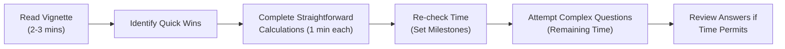

When you’re approaching the exam hall for your Level II Economics session, it’s natural to feel a tinge of anxiety. Um, I still remember how my heart would race a bit when the proctor said, “You may begin.” Anyway, the goal for this section is to turn that anxiety into a structured plan. We’re taking everything you’ve encountered so far—currency market mechanics, international parity conditions, economic growth models, business cycle insights, trade and policy shifts, you name it—and funneling it into timed exam simulations. This approach helps you become a lean, mean, item-set-completing machine.

Below, we’ll walk through suggestions for constructing and completing comprehensive mock item sets under timed conditions. We’ll discuss time management, quick-win identification, how to NOT get stuck in “analysis paralysis,” and how to comb through your solutions with a fine-toothed comb to refine your exam strategy. Then we’ll provide a set of checklists, a glossary, references, and a quiz to bring it all home.

The Big Picture: Timed Exam Simulations  
Exam day is about triage. You only have so many minutes—18 minutes per typical 6-question vignette is a rough benchmark. If you haven’t tested your stamina or sharpened your time management skills beforehand, you’ll struggle to integrate all these complex economic ideas, especially under pressure.

• Mock item sets must be realistic. That means adopting the layered complexity you’ll see in actual vignettes: combining currency forwards from Chapter 2 with subscripts from Chapter 3 on interest parity, or throwing in a dash of capital flow analysis from Chapter 4.  
• Focus on real-time problem-solving. The ability to pivot from a straightforward purchasing power parity (PPP) calculation to a nuanced reading of a central bank intervention scenario is precisely what exam day demands.

Time Management Best Practices  
One of the biggest challenges in a timed setting is balancing reading and solving. You know the feeling: you start reading a vignette about exchange rate pass-through (from Chapter 11), but you get lost in a sea of numbers. Then you realize you’ve spent five minutes going nowhere. I think we’ve all been there, right?

Here’s a recommended flow to keep you on track:

1) Read Vignette (2–3 minutes): Skim the entire item set to grasp the broad scenario. Double-check any tables or data exhibits.  
2) Identify Quick Wins: Some parts of the question will just be “formula in, number out.” For instance, maybe you see a forward discount calculation that’s purely mechanical (from Chapter 2.2).  
3) Complete Straightforward Calculations: Lock in those easy points. If you have a question about uncovered interest rate parity, and they give you the domestic and foreign rates, that’s a direct formula.  
4) Re-check Time: After each question, take a mental note of the clock. If you’re going too slow, it may be time to speed up, or skip a question that looks extremely complicated (such as a multi-step forecasting scenario referencing both PPP and the international Fisher effect from Chapter 3).  
5) Attempt Complex Questions: Now that you’ve bagged some points, shift your attention to the more in-depth inquiries or case-based analyses.  
6) Review Answers: If you happen to have leftover time at the end, do a quick pass to confirm you didn’t misread any key exhibit data. This final 60-second review can be your saving grace.

Approach to Multi-Topic Vignettes  
Let’s imagine you’re reading an item set that seamlessly combines:  
• A central bank interest rate change to address inflation concerns (Chapter 5)  
• Triangular arbitrage in the spot currency market (Chapter 2.4)  
• Hints about the cyclical positioning in the domestic economy (Chapter 8)  

It’s easy to get overwhelmed. The trick is to break down each piece:

• First, isolate the relevant data for the currency piece. Possibly, you see quotes for three currency pairs and you suspect an arbitrage. Crunch that quickly if you suspect an easy point.  
• Next, the policy dimension. Is the question about how the central bank’s move might lead to capital inflows or outflows? Weave in your knowledge from the balance of payments (Chapter 4) and monetary policy’s effect on exchange rates (Chapter 5.1).  
• Then, the cyclical aspect. If the economy is entering a recessionary phase, how does that interplay with currency strength or interest rates? Possibly, you recall business cycle phases from Chapter 8 or how growth forecasts from Chapter 6 might shift investment flows.  

These vignettes demand an integrated approach. Remember: not every piece of data will be relevant. Don’t let yourself get bogged down in extraneous details that the examiners planted.

Scoring Rubrics and Detailed Rationales  
Your mock item sets should offer thorough answer keys with step-by-step logic:

• Formulaic Breakdowns: If you’re computing forward premiums/discounts, the rationale must show how you annualize interest rates, subtract or add, and then convert to a percentage.  
• Risk and Policy Insights: If a question concerns a potential currency crisis, highlight the lead indicators (reserve depletion, severe current account deficit, high foreign debt) from prior chapters.  
• Cross-Referencing Wrong Answers: This is huge. Don’t just say “B is incorrect.” Show candidates precisely which assumption or data usage was misguided. For instance, maybe answer B used the forward points in the wrong direction or multiplied rather than divided.  

When you go through rationales, you gain a deeper sense of how exam graders might parse partial credit on broader constructed responses. For item sets (multiple-choice format), use rationales to see exactly how each distractor is intended to lead you astray.

Avoiding “Analysis Paralysis”  
Yes, it’s a real phenomenon. Maybe the vignette includes three tables, each referencing exchange rates from a different date, a chart of nominal interest rates for five countries, plus a footnote about hedging. The best approach:

• Identify the data relevant to each question. Just because a footnote provides a trade elasticity figure doesn’t mean you need it for every question.  
• Resist the urge to read every footnote three times. You can easily lose precious minutes double- and triple-checking. Instead, note down the data as soon as you see it might be relevant to a question.  
• Make an educated guess if you’re stuck. Then move on. Remember: you can’t allow yourself to get trapped for five minutes unraveling a single point that yields diminishing returns.

Practical Example: A Multi-Chapter Scenario  
To illustrate, let’s craft a hypothetical 6-question item set with an 18-minute recommended timeframe. The vignette might read:

• Country A’s interest rate is 3.5%, while Country B’s is 2.0%.  
• Spot exchange rate: 1.200 USD/EUR.  
• 6-month forward rate: 1.215 USD/EUR.  
• Inflation forecast for the next year in Country A is 2%, while Country B’s is 1.2%.  
• “Economic data suggests a fiscal expansion is planned in Country A to lower unemployment. Analysts expect net exports to decline if the currency appreciates too much.”  
• “In the medium term, a trade agreement with B has lowered tariffs, generating new capital inflows.”  

From that single text, you might get six questions:

1. Calculate the implied forward premium or discount for the currency pair.  
2. Assess whether covered interest rate parity or uncovered interest rate parity is validated by the data.  
3. Estimate the relative inflation rates’ effect on PPP-based predictions.  
4. Evaluate how the potential fiscal expansion could alter capital flows and the balance of payments.  
5. Link this scenario to the business cycle position and possible bond/credit spread outcomes.  
6. Decide if the trade agreement and capital inflows create an environment conducive to a carry trade.  

This is how the exam merges a bit of everything. Train yourself to go line-by-line through the provided data, parse out the relevant figures, do the calculations, and interpret results in the context of the theoretical frameworks from earlier chapters.

Checklists for Efficient Review  
Right after your timed practice, use a checklist approach to see if you covered the main bases.

Key Formulas and Concepts  
• Interest Rate Parity (Covered and Uncovered) and Forward Rate Calculation  
• PPP-based exchange rate forecasts (both absolute and relative)  
• Growth rate expansions (Classical vs. Endogenous model frameworks)  
• Monetary Policy impetus (Chapter 5) and how it affects capital flows  
• Business Cycle phases and sector rotation strategies (Chapter 8)  
• Tools like the Marshall-Lerner condition, J-curve effect on trade balance (Chapter 4.6)  

Core Interpretative Frameworks  
• Reading in-depth policy announcements or BOP data to detect potential global imbalances (Chapter 4)  
• Identifying the phases of the business cycle quickly (Chapter 8.1)  
• Determining if inflationary vs. recessionary pressures matter for your currency calls  
• Growth or convergence theories to predict the sustainability of emerging market expansions (Chapter 7)  

Pitfalls to Watch For  
• Misreading forward quotes (bid-offer spreads or annualizing incorrectly)  
• Over/underestimating interest rates in parity formulas if the question gives you a monthly or quarterly figure  
• Confusing nominal vs. real growth rates in an item set discussing productivity shocks (Chapter 15)  
• Overlooking contradictory signals, such as a policy statement that might offset an otherwise straightforward IRP conclusion  

Glossary  
• Item Set: A vignette with multiple questions tied to a common scenario.  
• Time Management: Prioritizing tasks to fit them within a limited exam window.  
• Mock Exam: A practice test replicating the real exam’s format, length, and difficulty.  
• Answer Key (Rationale): A detailed explanation clarifying each question’s correct choice and logical derivation.  
• Checklist Approach: An organized list ensuring you don’t miss critical steps (like verifying interest rate annualization).  
• Straightforward vs. Complex Calculations: Identifying which formulas are “plug and chug” vs. those needing deeper thresholds of analysis.  
• Exam Strategy: The holistic method of reading, solving, shaving off wasted time, and verifying work.  
• Adaptive Review: Focusing extra attention on tricky questions or repeated mistakes in your practice sessions.

References & Further Reading  
• CFA Institute’s Official Practice Exams: The gold standard for realism.  
• “Practicing for the Exam” Tools in the CFA Learning Ecosystem: Interactive resources that help you track your progress.  
• McMillan, Lawrence. “Options as a Strategic Investment.” Although it focuses on derivatives, it includes scenario-based questions that hone timed analysis.

Test Your Knowledge: Timed Exam Simulations and Review



### A mock exam's 6-question item set generally demands about 18 minutes to complete. Which time allocation strategy is most effective?

- [ ] Spend the first 8 minutes reading the vignette thoroughly, then guess if you run out of time.
- [ ] Break down all footnotes in detail before scanning the questions.
- [ ] Allocate roughly 2–3 minutes to read the vignette, then proceed to identify “quick wins.”
- [ ] Skip reading the vignette entirely and focus on the answer choices first.

> **Explanation:** Giving yourself about 2–3 minutes to read the vignette and plan is the recommended method. This ensures you understand which details are relevant before diving into the questions.

### Which of the following typically qualifies as a “quick win” in a currency-related item set?

- [ ] Inferring central bank policy details from historical inflation data.
- [x] Computing a forward premium/discount from clearly provided spot and forward rates.
- [ ] Evaluating the net exports effect under the Marshall-Lerner condition.
- [ ] Assessing full business cycle risks for carry trades.

> **Explanation:** Forward premium/discount calculations are often straightforward because they only require the spot rate, forward rate, and the time to maturity. Items like business cycle analysis or trade conditions typically demand more nuanced reflections.

### When facing a complex multi-topic item set involving interest rate parity, PPP, and growth forecasts, which approach is most advisable?

- [ ] Immediately do all PPP-related calculations, ignoring references to interest rates.
- [ ] Do not attempt calculations; rely solely on conceptual learning.
- [x] Identify each subtopic’s relevant data and solve step by step.
- [ ] Spend the majority of your time analyzing growth forecasts; currency calculations can wait.

> **Explanation:** You must parse the given data for each subtopic, then address them systematically. Jumping blindly into one piece while ignoring the rest often leads to missing vital steps or relevant data.

### What does “analysis paralysis” commonly lead to in the context of timed exams?

- [ ] Increased speed and efficiency.
- [ ] Enhanced accuracy in all calculations.
- [ ] Realization that the question was simpler than it seemed.
- [x] Excessive time spent on a single question, harming overall performance.

> **Explanation:** Analysis paralysis occurs when you become so focused on details that you lose sight of the clock. In a timed exam, spending too long on one question can sacrifice easier points elsewhere.

### How should you handle contradictory signals within a vignette that discusses both high interest rates and dovish central bank policies?

- [ ] Assume the vignette is incorrect and pick answers at random.
- [ ] Ignore any mention of central bank policies.
- [ ] Solve only the interest rate–related problems.
- [x] Weigh both factors carefully; the exam is testing your ability to integrate conflicting data.

> **Explanation:** Contradictory signals often reflect real-world complexities. The exam wants you to combine pieces of evidence thoughtfully and select the best answer based on integrated analysis.

### Which statement best describes a good approach to checking answers if you have extra time at the end of a vignette?

- [x] Quickly review calculations for arithmetic errors and confirm you used the right data inputs.
- [ ] Reread the entire vignette from scratch.
- [ ] Change answers if you have a vague hunch they might be wrong.
- [ ] Guess on all unanswered questions only if you are absolutely sure they are correct.

> **Explanation:** A quick review for arithmetic or reading errors is prudent. Rereading the entire vignette may be too time-consuming. Avoid random changes unless you spot a specific error.

### An item set presents a forward rate and local interest rates for both currencies. You need to test if covered interest rate parity (CIP) holds. Which is the correct first step?

- [x] Compute the theoretical forward rate using the interest differential.
- [ ] Examine inflation data for both countries.
- [x] Compare the computed forward rate with the actual forward rate.
- [ ] Immediately conclude CIP does not hold if the country’s inflation is high.

> **Explanation:** CIP is tested by comparing the forward rate derived from interest rate differentials to the actual forward rate. Inflation data may be relevant to uncovered interest rate parity or PPP, but CIP is specifically interest-rate-based.

### You’re given a vignette about a fictitious emerging market. The central bank is intervening to keep its currency undervalued. Which relevant concept from previous chapters helps analyze potential trade competitiveness?

- [ ] The J-curve effect is irrelevant here.
- [x] Marshall-Lerner condition, which examines the impact of exchange rate movements on trade balances.
- [ ] Purchasing power parity, which only focuses on domestic inflation.
- [ ] Convergence hypothesis, which deals with long-term growth differences.

> **Explanation:** The Marshall-Lerner condition states that depreciation (or artificially undervalued exchange rates) can improve a country’s trade balance if the sum of import and export elasticities is greater than one.

### A candidate spends too much time on one tricky question in a 6-question vignette and has only 2 minutes left for the remaining five. What is likely the biggest risk?

- [x] Missing out on easier points from the unanswered questions.
- [ ] Having a more thorough rationale for that tricky question.
- [ ] Gaining partial credit on the question they spent time on.
- [ ] Improving future performance due to the extended calculation practice.

> **Explanation:** While investing time in complex questions can be beneficial, you risk missing simpler items and thus forgo easy points. Balanced time allocation is essential.

### During final review, you stumble on a question you answered incorrectly earlier. You realize the correct approach is uncovered interest rate parity, not covered. Is it advisable to change your answer if you are certain?

- [x] True
- [ ] False

> **Explanation:** If you identify a clear, justifiable mistake in your original reasoning, changing the answer can be beneficial. Studies show that changed answers—when done for a concrete reason—often go from incorrect to correct.


