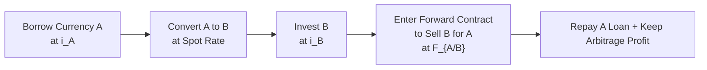

## Introduction

Let’s take a relaxed moment—maybe sip a cup of coffee—and chat about two really important concepts in currency markets: Covered Interest Rate Parity (CIP) and Uncovered Interest Rate Parity (UIP). In the hustle of actual trading floors, CIP tends to hold up pretty well because of arbitrage-based adjustments. UIP, on the other hand, can be a tad tricky, since it involves what the market “expects” the future exchange rate to be—and expectations, as we all know, can go astray.  

If you’ve already tackled foreign exchange topics in Level I, you might recall how the forward exchange rate should reflect the interest rate differentials between two currencies, at least in theory. Now, for Level II, we step further into the labyrinth of parity conditions. We’ll examine CIP first, see how it emerges from a no-arbitrage argument, then flip over to UIP to navigate those times when the market is simply letting future exchange rates float on uncertain seas.  

In practice, CIP and UIP both matter for analysts, traders, and corporate treasurers managing currency exposures. Let’s see how they apply, the math behind them (don’t worry, we’ll go step by step), and the pitfalls of using them blindly.  

## Covered Interest Rate Parity

### Core Idea of CIP
Covered Interest Rate Parity (CIP) is one of those fundamental building blocks in international finance. It basically says: if you try to earn riskless profits by investing in a foreign currency at a certain interest rate and then covering your currency exposure in the forward market—so that your exchange rate risk is hedged—the return you earn should be the same as investing in your domestic currency. Otherwise, there would be a free lunch, and we can’t have that in an efficient, well-functioning market.

CIP is labeled “covered” because you use forward contracts or another derivative to “cover” (hedge) the exchange rate risk. If CIP fails in a liquid market, big institutions will pounce on the arbitrage, quickly restoring CIP.

### CIP Formula

Here’s the standard CIP formula in KaTeX:


F_{A/B} = S_{A/B} \times \frac{1 + i_A}{1 + i_B}


Where:  
• \\( F_{A/B} \\) is the forward exchange rate (quote of currency A per unit of currency B)  
• \\( S_{A/B} \\) is the current spot exchange rate (A per B)  
• \\( i_A \\) is the annualized risk-free interest rate for currency A  
• \\( i_B \\) is the annualized risk-free interest rate for currency B  

In other words, the forward rate must reflect the interest rate differential. If interest rates in Country A are higher than in Country B, the forward rate for A/B will generally show a forward discount for A (relative to B) or, equivalently, a forward premium for B.

### How CIP Eliminates Arbitrage

Here’s a quick story (personal anecdote) from the days when I first realized how powerful CIP was: I had a professor who jokingly said, “If CIP didn’t hold, you could borrow your lunch money in one currency, convert it, invest risk-free in another, and repay the first loan with no net cost—and maybe buy a sports car with the proceeds.” That scenario (the sports car part) rarely materializes in real life, precisely because CIP keeps the system balanced.  

When CIP holds, the spots, forwards, and interest rates adjust so there’s no free lunch. As soon as a slight discrepancy arises, high-frequency traders’ algorithms or big banks’ currency desks jump in to exploit any profit, and that basically closes the gap.

## Diagram of Covered Interest Arbitrage

Below is a simple Mermaid diagram depicting the basic steps of covered interest arbitrage if CIP were violated. Every arrow points to the next step in the strategy. Notice how the ultimate payoff would exceed cost only if CIP doesn’t hold—something that rarely lasts long in the real market.

In an efficient market, the profit you see at the end (from node E) is pretty much zero when you account for transaction costs. That zero-profit condition is CIP.

## Uncovered Interest Rate Parity

### Conceptual Difference: Expectation vs. Forward Hedge

Uncovered Interest Rate Parity (UIP) is a bit different. You aren’t “covering” your position with a forward contract. Instead, you’re betting on the future spot exchange rate. The theory says that the expected change in the spot rate should offset the interest rate differentials:


\frac{E[S_{A/B}(t+1)]}{S_{A/B}(t)} - 1 = i_A - i_B 


where \\( E[S_{A/B}(t+1)] \\) is the expected future spot rate for time \\( t+1 \\).  

Unlike CIP, UIP isn’t enforced by arbitrage—because you’re not locking in a forward rate. You’re just hoping that if currency A’s interest rate is 2% higher than currency B’s, then currency A will depreciate by roughly that same 2% over the period. If it doesn’t, well, you might earn more (or less) than you bargained for. There’s greater uncertainty and, typically, a risk premium that real-world investors demand.

### Market Efficiency and UIP

Empirical research on UIP is mixed. Sometimes, for major currency pairs in stable contexts, UIP doesn’t look so bad. Other times, especially during crises or when capital flows drastically shift, the expected exchange rate movement fails to match interest differentials.  

In advanced markets with large institutional players and sophisticated risk models, you might see partial adherence to UIP, but it’s definitely not as ironclad as CIP. Behavioral finance folks point to factors like investor risk aversion, momentum trading, and fuzzy expectations that can distort the neat formula.  

## Relationship to Market Efficiency

The difference in how CIP and UIP hold in practice stems from the fact that CIP is a direct, mechanical no-arbitrage condition. Traders can set up riskless positions to exploit any CIP violations, forcing them to vanish quickly. With UIP, you can’t form a riskless trade. Your success depends on guessing tomorrow’s exchange rate. And you know how tricky guesswork can be!  

When market participants are rational and risk-neutral, UIP might hold “on average” over long horizons. But we often see short-term deviations thanks to risk premiums, capital controls, or big policy surprises (think central bank announcements).

## Practical Applications

### Hedging and Arbitrage

If you’re hedging currency exposure for a portfolio, CIP is your guiding star. You can use forwards or currency swaps to eliminate FX risk, and any attempt to deviate from CIP-based pricing is arbitraged away.  

For instance, if you manage a global bond portfolio and you want to hedge your yen exposure to dollars, you’d look at the forward market quotes. If the implied forward rate doesn’t match interest rate differentials between the U.S. and Japan, there’s an arbitrage opportunity. In a real marketplace, the quotes typically fall right in line with CIP—except for small differences due to bid–ask spreads, credit risk, liquidity, and so forth.

### Forecasting and Risk Management

As for UIP, while it can serve as a kind of base-case forecast—“the currency with the higher interest rate is expected to depreciate”—there’s no guarantee. Risk premiums, geopolitical events, and the nature of monetary policy all factor heavily into actual outcomes.  

One well-known technique is to modify the straightforward UIP approach by adding a “risk premium” term. Traders might say:  


\frac{E[S_{A/B}(t+1)]}{S_{A/B}(t)} - 1 = (i_A - i_B) + \text{RP}


where RP stands for the risk premium demanded by investors. That premium might be negative or positive, reflecting how safe or risky the currency is perceived to be.

## Common Pitfalls

• Believing CIP will always hold perfectly: Small transaction costs, liquidity constraints, or credit/counterparty risk can create minor deviations from CIP, especially in times of financial stress.  
• Using UIP to forecast short-term exchange rates without adjusting for risk and behavioral factors: Empirical data is full of examples where high-interest-rate currencies don’t depreciate as theory predicts (sometimes they even appreciate!).  
• Ignoring the role of capital controls and institutional barriers: CIP might fail in markets with heavy regulations, limited currency convertibility, or big capital flow restrictions.  

## Illustrative Example

Imagine you’re evaluating a cross-currency investment between Country A and Country B.  

• Country A has an annual interest rate (\\( i_A \\)) of 3%.  
• Country B has an annual interest rate (\\( i_B \\)) of 1%.  
• The spot exchange rate is \\( S_{A/B} = 1.5000 \\) (that is, 1.5 units of currency A per unit of currency B).

### CIP Perspective

Using CIP, the theoretically correct forward rate (\\( F_{A/B} \\)) for one year would be:


F_{A/B} = 1.5000 \times \frac{1 + 0.03}{1 + 0.01} 
= 1.5000 \times \frac{1.03}{1.01} 
\approx 1.5282


So, the forward rate is 1.5282 (A per B). If the actual market forward rate is, say, 1.5350, you might see an arbitrage opportunity—unless there are transaction costs big enough to eat up your theoretical gain.

### UIP Perspective

Now, for UIP, you might say, “If currency A’s interest rate is 2% higher, we expect currency A to depreciate by about 2% in the next year.” So your baseline guess for the expected future spot might be:


E[S_{A/B}(t+1)] = 1.5000 \times (1 + 0.02) = 1.5300


But is that what actually happens? Maybe currency A doesn’t depreciate at all because a new trade deal or surging demand for A-based assets keeps it strong. Or maybe it overshoots and hits 1.5700. These deviations from the UIP “prediction” are common.  

## Best Practices and Strategies to Overcome Challenges

• Use CIP for practical hedging: For your firm’s currency exposure, always compare forward quotes to theoretical CIP-based numbers. If you see a big gap, investigate promptly (do we have a market anomaly or an error?).  
• Don’t rely on UIP alone to forecast exchange rates: Complement it with fundamental analysis, risk-premium estimates, and qualitative insight (e.g., central bank signals, political risk, changing global demands).  
• Incorporate transaction costs: Real-world interest rate quotations differ for borrowers and lenders, and forward markets have bid–offer spreads. Make sure to factor this in.  
• Watch for structural or one-off events: Whether it’s a surprise referendum or a sudden change in monetary policy, these can blow normal parity relationships out of the water.

## Conclusion and Final Exam Tips

CIP and UIP can feel like two sides of the same coin: CIP is pinned down by arbitrage and hedging, while UIP floats on market sentiment and expectations. For exam success—and for real-world application—remember the key difference:

• CIP → A practical, near-ironclad no-arbitrage condition involving forward contracts.  
• UIP → A theoretical expectation-based condition riddled with risk premiums and uncertainties.  

A common exam pitfall is to mix them up or assume one works like the other. Make sure you can articulate how each formula works, how to interpret it, and how to spot anomalies. When you face a currency item set, watch for subtle hints: if a question references a forward contract to hedge the underlying transaction risk, CIP is your go-to. If instead it’s about predicted spot rates or theoretical returns, UIP is usually in play.  

Manage your time wisely in the exam by practicing quick calculations for CIP’s forward pricing mechanics and double-checking whether they align with interest rate differentials. For UIP, frame your answers around the condition that the expected spot movement offsets the interest rate differential, then be ready to mention risk premiums or real-world reasons for deviation.

---

## References

- Bodie, Z., Kane, A., & Marcus, A. (2018). Investments. McGraw-Hill Education.  
- Madura, J. (2021). International Financial Management. Cengage Learning.  
- CFA Institute (2023). Level II CFA® Program Curriculum, Economics. Available at: [https://www.cfainstitute.org/](https://www.cfainstitute.org/)

---

## CIP and UIP Mastery Quiz



### When Covered Interest Rate Parity (CIP) holds in a liquid market:
- [ ] The spot rate must always equal the forward rate.
- [ ] The currency with the higher interest rate always appreciates.
- [x] Any forward discount or premium exactly offsets the interest rate differential.
- [ ] The no-arbitrage opportunities exist due to transaction fees.

> **Explanation:** CIP states that the forward premium or discount matches the interest rate differential, leaving no room for covered arbitrage profits.

### Which statement best describes Uncovered Interest Rate Parity (UIP)?
- [ ] It is directly enforced by arbitrage in forward markets.
- [x] It relies on expected future spot rates to offset interest rate differentials.
- [ ] It never holds in practice.
- [ ] It is equivalent to purchasing power parity.

> **Explanation:** UIP posits that the expected change in the spot exchange rate compensates for interest rate differentials, and is not enforced by a forward hedge.

### A minor deviation from CIP in a major currency pair typically implies:
- [ ] The currency pair will remain mispriced for an extended period.
- [ ] Central banks will intervene to restore CIP.
- [x] Short-term arbitrage opportunities will be exploited quickly.
- [ ] The currency with the lower interest rate has become overvalued.

> **Explanation:** In highly liquid markets, deviations from CIP are quickly arbitraged away by market participants.

### If interest rates in Country A exceed those in Country B by 3%:
- [x] The forward price of A in terms of B will typically be at a discount.
- [ ] The forward price of A in terms of B will typically be at a premium.
- [ ] CIP must fail.
- [ ] Country A automatically has a stronger currency in the spot market.

> **Explanation:** The higher-interest-rate currency usually trades at a forward discount to eliminate arbitrage opportunities under CIP.

### In an environment where risk premiums exist, the UIP equation often:
- [x] Includes an additional term to reflect the required excess return.
- [ ] Eliminates all variations in future spot rates.
- [ ] Always holds perfectly in the short run.
- [ ] Excludes the role of expectations.

> **Explanation:** The uncovered parity relationship often needs a risk premium term: (iA - iB) + RP.

### One common pitfall when applying UIP is:
- [ ] Overestimating transaction costs in forward markets.
- [x] Ignoring the impact of risk aversion and possible risk premiums.
- [ ] Failing to calculate coupon payments accurately on foreign bonds.
- [ ] Overlooking the effect of time value of money.

> **Explanation:** Deviations from UIP commonly arise because markets demand additional compensation for exposure to exchange rate risk.

### Which factor is most likely to cause larger, more persistent deviations from CIP?
- [x] Severe capital controls or heavy market frictions.
- [ ] Higher frequency of open-market operations by the central bank.
- [ ] Lower interest rates imposed by the local central bank.
- [ ] A free-floating currency regime.

> **Explanation:** Even though CIP holds often, extreme conditions like capital controls or major liquidity issues can cause sustained deviations.

### When forecasting exchange rates using UIP, an analyst should:
- [ ] Ignore any mention of risk premiums or transaction costs.  
- [ ] Always assume CIP holds as well.  
- [ ] Assume the forward rate will equal the expected future spot rate.  
- [x] Consider adding risk adjustments or other macro factors that could shift expectations.  

> **Explanation:** Relying on UIP alone is risky; analysts frequently layer on a risk premium and look at fundamentals.

### A practical application of CIP is:
- [ ] Predicting currency crises purely from open interest rates.  
- [ ] Generating long-term currency forecasts with risk premiums.  
- [x] Hedging currency exposure with forwards or swaps at no-arbitrage rates.  
- [ ] Explaining why currencies of developing nations always converge quickly.

> **Explanation:** CIP underpins the pricing of forward contracts used for currency hedging, ensuring no free-lunch arbitrage in covered positions.

### True or False: When CIP fails to hold, it guarantees that UIP also fails.  
- [ ] True  
- [x] False  

> **Explanation:** CIP and UIP aren’t the same. CIP is enforced by covered arbitrage, whereas UIP depends on expected future spot rates. One can deviate independently of the other.


