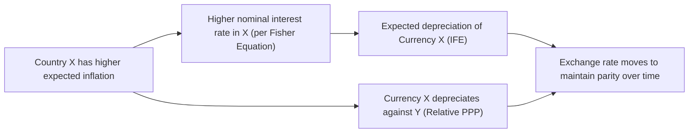
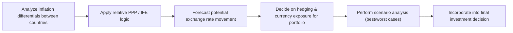

## Overview and Motivation

If you’ve ever wondered how inflation and interest rates actually shape the long-term path of exchange rates, well, you’re definitely not alone. Many of us have caught ourselves saying things like, “But wait—shouldn’t higher prices at home push my currency lower abroad?” or “If interest rates in one country are higher, doesn’t that make its currency stronger?” The short answer is that it depends a lot on underlying assumptions about inflation. Two major theoretical pillars in this area are Purchasing Power Parity (PPP) and the International Fisher Effect (IFE). While they’re studied separately, they’re tied together by the grand theme of how inflation expectations work their way into exchange rate forecasts.

In this section, we’ll explore both PPP and the IFE in detail, consider their limitations, and see how they can be applied in practical investment contexts. We’ll highlight some potential pitfalls, show you some diagrams, and share personal reflections on where real life might deviate from neat theory. And we’ll spice things up with examples that you might see on the CFA Level II exam—or in your own day-to-day economic research!

## Revisiting the Basics of PPP

Purchasing Power Parity is often described as the idea that a basket of goods should cost the same everywhere—at least in theory, if we ignore things like transportation costs, tariffs, and brand loyalty. Let’s unravel that step by step.

### Absolute Purchasing Power Parity

Absolute PPP suggests that, in a perfect world, you could buy the same bundle of goods anywhere on earth once you’ve converted currencies at the market exchange rate. So if a basket (say, a standard set of groceries) costs $100 in the US, and the same basket is advertised for €90 in Europe, theoretically, the euro–dollar exchange rate should be 1.11 USD/EUR (i.e., $100 ÷ €90).

Of course, real life isn’t usually this clean. We have shipping fees, taxes, local brand dynamics, or plain old habit. Maybe consumers are so used to a certain domestic brand that the global chain can charge a higher premium. Nonetheless, absolute PPP is an important reference point. Think of it as a mental anchor, letting us spot if a currency is blatantly over- or undervalued relative to the cost of identical goods.

### Relative Purchasing Power Parity

Relative PPP is a bit more realistic and is probably the version you’ll see more often in exam questions and real-world research. Instead of claiming that prices must equalize on day one, relative PPP says that the rates of change in price levels (i.e., inflation rates) will be mirrored by the rates of depreciation or appreciation of currencies over time.

Mathematically, if Country X has an inflation rate of πₓ and Country Y has an inflation rate of πᵧ, then the expected percentage change in Country X’s currency relative to Country Y’s currency is approximately (πₓ − πᵧ). In simpler terms:

(ΔE_XY / E_XY) ≈ πₓ − πᵧ,

where E_XY is the exchange rate (price of X’s currency in terms of Y’s currency). If Country X has higher inflation, expect X’s currency to depreciate in proportion to the inflation differential. This provides at least a first approximation for how exchange rates might evolve.

## The International Fisher Effect

Once you understand PPP, the International Fisher Effect (IFE) is a fairly natural extension. It’s built on the Fisher equation, which itself states:

(1 + i) = (1 + r)(1 + πᵉ),

where i is the nominal interest rate, r is the real interest rate, and πᵉ is the expected inflation rate. Rearrange or approximate for small values, and you can see that i ≈ r + πᵉ.

### Core Idea of the IFE

The IFE then argues: if nominal interest rates are higher in one country than another, that higher rate should reflect higher expected inflation. Because higher inflation eventually depreciates the currency, the country that has the higher nominal rate will tend to see its currency weaken over time—just enough to offset any gains from the higher nominal rate in a straightforward currency investment. Another way to say it is:

Expected depreciation (of currency X) = iₓ − iᵧ,

where iₓ and iᵧ are nominal interest rates in countries X and Y, respectively. In theory, an investor who invests in a higher-yielding currency wouldn’t necessarily gain, because that currency is expected to lose value over the holding period. If that sounds suspiciously similar to uncovered interest rate parity (UIP), you’re exactly right—the IFE is basically UIP but highlights the role of inflation in shaping nominal interest rates.

### A Quick Story

I once had a friend who insisted on consistently buying bonds denominated in a high-yield emerging market currency. He bragged about the double-digit coupon payments he earned each year—until that currency proceeded to tumble by an alarming amount. Ultimately, the currency depreciation overshadowed his coupon income, leaving him with a net loss in US dollar terms. As an illustration, that’s basically the IFE in motion: the expected currency depreciation associated with higher nominal yields ended up negating the short-term interest bonanza.

## Linking PPP and IFE

At first glance, PPP (especially relative PPP) and the IFE might look like two separate approaches. But there’s a common nucleus: inflation. PPP says inflation influences changes in exchange rates. IFE says inflation expectations show up in nominal interest rates, which in turn help predict exchange rate movements. Here’s a small diagram you can keep in mind:

In short, the two theories operate from slightly different angles, but they converge on the idea that inflation differentials—whether expressed directly or indirectly via nominal interest rates—play a pivotal role in exchange rate determination.

## Empirical Evidence and Limitations

### Observed Trends

• In the long run, many studies (Krugman & Obstfeld, 2017; Sarno & Taylor, 2003, among others) show that PPP tends to exert a gravitational pull on exchange rates. Over years or even decades, currencies do seem to align with the broad inflation differentials across countries.  
• The IFE also has support over extended horizons, but short-term movements can be quite noisy. Capital flows, speculation, and short-term interest rate chasing can create deviations from IFE predictions for months or even years.

### Factors Behind Deviations

We should be realistic: these are models, not ironclad laws. Common reasons for deviations:

1. **Tariffs and Shipping Costs**: The cost of transporting goods or facing import duties undermines the premise that identical goods should cost the same globally.  
2. **Trade Barriers**: Restrictive quotas or outright bans limit the free flow of goods that PPP assumes.  
3. **Market Segmentation**: Local tastes, brand loyalty, or marketing can inflate or depress certain product prices.  
4. **Speculation**: Currency traders may chase short-term yields or capital appreciation, throwing a wrench into the ephemeral daily exchange rates.  
5. **Differing Productivity Trends**: If a country experiences a sudden burst of productivity, it can sustain lower inflation or appreciate without necessarily violating PPP in the short run.

Think of PPP or the IFE as a lighthouse. They offer guidance for where exchange rates might gravitate in the long haul, but the waters near the shore can be turbulent.

## Practical Implications for Analysts

From a CFA Level II perspective, these theories show up in multiple contexts:

• **Misvaluation Detection**: Comparing current exchange rates to PPP-based equilibrium values might help identify long-run overvaluation or undervaluation.  
• **Long-Horizon Investment Strategies**: Global bond portfolio managers often look at interest differentials and inflation outlooks to manage currency exposures.  
• **Corporate Valuation**: When projecting foreign cash flows, analysts will sometimes incorporate PPP or IFE assumptions to forecast exchange rates, especially if looking beyond a few months.  
• **Risk Management**: If your expectation is that a particular currency is set to depreciate because of higher domestic inflation, you might hedge or rethink your unhedged positions.

Here’s a second visual that might help you see how these pieces can come together in a practical workflow:

## Common Pitfalls

While the theories themselves aren’t too complicated, things can get tricky:

• **Overlooking Non-Tradables**: PPP focuses on tradable goods, but plenty of domestic services (like haircuts or real estate) play into overall inflation indices.  
• **Ignoring Structural Changes**: Over the years, countries change. A surge in technology, for instance, might keep inflation surprisingly low in one country while boosting productivity—and raising real wages—even if PPP or the IFE initially suggested depreciation.  
• **Short-Horizon Misapplication**: If you’re analyzing a six-month currency swap, relying on PPP or IFE might give you shaky ground. Speculative flows in short timeframes can overshadow fundamentals.  
• **Focusing on Spot Rates Only**: For exam items, watch out for the forward-spot interplay. Sometimes a question might slip in forward rates and interest rate data. If you treat those relationships incorrectly, you might get the wrong conclusion about future spot movements.

## Illustrative Example

Suppose you’re analyzing two countries: Country X and Country Y.

• Country X’s inflation rate: 5%  
• Country Y’s inflation rate: 2%  

Relative PPP implies that over time, the currency of X should fall relative to Y by about 3% to maintain the same purchasing power (5% − 2%). If you start with a spot rate of 1.00 X per Y, the new rate might become 1.03 X per Y, meaning you now need 1.03 units of X to get 1 unit of Y.

Now assume you also observe that nominal interest rates in X exceed those in Y by, say, 3%. The IFE suggests that the currency of X will likely depreciate by about 3%, consistent with the difference in nominal interest rates—basically echoing the PPP forecast. That’s the synergy we talked about.

In practice, you track these differences over time. Maybe next year, inflation in Country X is unexpectedly low because of a policy shift, or speculation has driven the currency up. You then see short-term deviations. But if the policies revert or the fundamentals reassert themselves, the exchange rate may drift back down.

## Conclusion

Purchasing Power Parity and the International Fisher Effect remain central tools for thinking about long-run exchange rates. They won’t always save you from short-term turbulence—markets can be, well, chaotic. But if you’re trying to figure out whether a currency is fundamentally over- or undervalued, or if you’re just aiming to craft a multi-year strategic view, these parity conditions are often the place to start.

I personally like to think of PPP as the dog walker and the dog. The dog walker’s path is the “fair value” of the currency given inflation differences, and the dog itself is the actual daily exchange rate—often wandering and zigzagging around but generally tethered by that invisible leash of PPP. The IFE merely steps in to explain how interest rates, driven by inflation expectations, feed into that movement as well.

## Glossary

- **Absolute PPP**: Theory that states identical goods should cost the same worldwide, measured in a common currency.  
- **Relative PPP**: A focus on the difference in inflation rates to explain exchange rate changes over time.  
- **Fisher Equation**: Relates nominal interest rate (i), real interest rate (r), and expected inflation (πᵉ).  
- **International Fisher Effect (IFE)**: Asserts that the currency of the country with the higher nominal interest rate will depreciate by the difference in nominal rates.  
- **Inflation Differential**: The difference in inflation rates between two countries.  
- **Real Interest Rate**: The nominal rate minus inflation.  
- **Long-Horizon Strategy**: Investment approach focusing on multi-year trends in currency and valuation.

## References

- Krugman, P., & Obstfeld, M. (2017). International Economics: Theory and Policy. Pearson Education.  
- Sarno, L., & Taylor, M. (2003). The Economics of Exchange Rates. Cambridge University Press.  
- CFA Institute. (2025). CFA Program Curriculum. CFA Institute Publications.

## Test Your Knowledge: Purchasing Power Parity and International Fisher Effect Quiz



### Which statement best describes Absolute Purchasing Power Parity (PPP)?

- [ ] It states that interest rate differentials entirely explain currency depreciation.  
- [x] It posits that identical goods should cost the same in different countries when measured in a common currency, assuming no trade barriers.  
- [ ] It suggests that currency forward rates are strictly determined by risk premiums.  
- [ ] It assumes short-term capital flows dominate exchange rates.  

> **Explanation:** Absolute PPP holds that in the absence of trade frictions, a basket of goods should cost the same worldwide once currency conversions are taken into account.

### Relative PPP focuses on which key economic variable when assessing exchange rate changes?

- [ ] Gross Domestic Product (GDP) growth differentials.  
- [ ] Fiscal deficit levels.  
- [x] Differences in inflation rates between countries.  
- [ ] Tax policy divergences.  

> **Explanation:** Relative PPP states that the exchange rate adjustment between two currencies over time reflects the inflation rate differentials between those two countries.

### According to the IFE, a currency with a higher nominal interest rate is expected to:

- [x] Depreciate relative to currencies with lower nominal interest rates.  
- [ ] Appreciate relative to currencies with lower nominal interest rates.  
- [ ] Stay completely stable due to interest rate arbitrage.  
- [ ] Fluctuate solely based on the forward premium.  

> **Explanation:** The International Fisher Effect suggests a direct relationship between higher nominal interest rates and expected depreciation, as higher rates typically reflect higher inflation expectations.

### What is a common short-term reason for deviations from PPP?

- [ ] Harmonized tax policies across countries.  
- [ ] Rational expectations adjusting all goods and services instantly.  
- [x] Speculative capital flows and trading activities.  
- [ ] Perfect integration of global markets.  

> **Explanation:** In the short run, currency speculation by investors, combined with “hot money” flows, often creates deviations from PPP.

### In Relative PPP, if Country A has a 6% inflation rate and Country B has a 2% inflation rate, the expected depreciation of A’s currency relative to B’s is:

- [ ] 2%.  
- [x] 4%.  
- [ ] 6%.  
- [ ] 8%.  

> **Explanation:** Relative PPP suggests that the currency of the country with higher inflation (Country A) will depreciate by about the inflation differential: 6% – 2% = 4%.

### Which of the following would most likely cause a persistent deviation from the International Fisher Effect?

- [x] Government intervention and capital controls in the foreign exchange market.  
- [ ] Identical inflation rates in both countries.  
- [ ] Global convergence in productivity growth.  
- [ ] Harmonized interest rate policies across all nations.  

> **Explanation:** Capital controls and heavy intervention can distort normal relationships between interest rates and exchange rates, preventing the IFE from holding.

### True or False: The IFE is essentially another form of Covered Interest Rate Parity (CIP).

- [ ] True  
- [x] False  

> **Explanation:** The IFE more closely aligns with Uncovered Interest Rate Parity (UIP), not covered parity. CIP involves forward contracts or hedging, whereas IFE speaks to expected depreciation in an unhedged context.

### If a global investor bases currency valuations solely on short-term nominal interest rates, ignoring inflation, which parity condition are they incorrectly applying?

- [ ] Relative PPP.  
- [x] International Fisher Effect.  
- [ ] Covered Interest Rate Parity.  
- [ ] Speculative Equilibrium Mechanism.  

> **Explanation:** The investor is not accurately applying the IFE, which demands that higher nominal rates reflect higher expected inflation, implying subsequent currency depreciation.

### Which factor is most critical in reconciling the predictions of PPP and the IFE?

- [x] Inflation expectations.  
- [ ] Immediate capital flows.  
- [ ] Government debt levels.  
- [ ] Commodity price indexes.  

> **Explanation:** Both PPP and IFE hinge on inflation dynamics. PPP directly involves inflation-driven price levels, while the IFE incorporates inflation expectations into nominal interest rates.

### True or False: In practice, both Relative PPP and the IFE tend to be more accurate over longer time horizons rather than short ones.

- [x] True  
- [ ] False  

> **Explanation:** Empirical evidence generally supports that PPP and the IFE predict exchange rate trends more effectively over years or decades, while short-term market volatility can cause frequent deviations.


