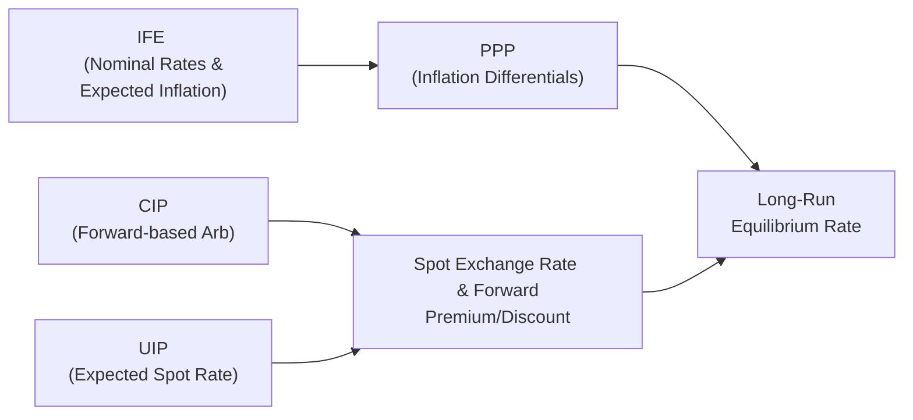

## Overview

So, maybe you’ve wondered how all these parity conditions—Covered Interest Rate Parity (CIP), Uncovered Interest Rate Parity (UIP), Purchasing Power Parity (PPP), and the International Fisher Effect (IFE)—fit together in the real world. You know, as a Level II candidate, you’ve probably memorized the formulas, stared at currency quotes, and read about forward premiums. But how do these theories interrelate? And why do some hold more tightly (like CIP) while others tend to drift (like PPP in the short term)?

Let’s walk through the conceptual linkages, practical divergences, and exam-related strategies. I’ll even mix in a tiny personal anecdote from my early days as a currency analyst—when I once confused CIP with UIP and ended up explaining the (wrong) forward pricing to my boss. (Ouch. Let’s not do that again.)

## Conceptual Interlinkages

### Covered Interest Rate Parity (CIP)
CIP states that any difference in interest rates between two countries is exactly offset by the forward currency discount or premium. Formally:


(1 + i_d) = \frac{F_{d/f}}{S_{d/f}} \times (1 + i_f)


• i_d = Domestic interest rate  
• i_f = Foreign interest rate  
• S_{d/f} = Current spot exchange rate (domestic per foreign)  
• F_{d/f} = Forward exchange rate (domestic per foreign)

Because this condition involves a forward contract—where you fully hedge against exchange rate risk—arbitrage opportunities can be quickly exploited if it ever breaks. In practice, CIP tends to hold fairly reliably except during market stress or when borrowing constraints, transaction costs, or capital flow restrictions come into play.

### Uncovered Interest Rate Parity (UIP)
UIP shares a similar structure with CIP, but it replaces the forward rate with the expected future spot rate:


\mathbb{E}[S_{d/f}(t+1)] = S_{d/f}(t) \left( \frac{1 + i_d}{1 + i_f} \right)


No forward contract is used here; instead, investors assume they’ll earn higher interest in the currency with the higher rate, but they also face the risk that the currency might depreciate by exactly the difference in rates. Because we’re dealing with expectations and risk preferences, UIP is often violated in the short run. But hey, it’s still a core theoretical model for the direction of currency movements if only markets were always risk-neutral.

### Purchasing Power Parity (PPP)
Some say PPP is the big-picture anchor in currency economics. At its simplest, PPP suggests that exchange rates adjust over time to reflect inflation differentials between two nations. The “absolute” form states:


S_{d/f} = \frac{P_d}{P_f}


where P_d and P_f are domestic and foreign price levels, respectively. But in practice, we often use the “relative” form:


\frac{S_{d/f}(t+1)}{S_{d/f}(t)} \approx \frac{1 + \pi_d}{1 + \pi_f}


• π_d = Domestic inflation  
• π_f = Foreign inflation  

When domestic inflation is higher, the currency should depreciate to preserve purchasing power parity. Trouble is, in the short and medium term, speculation, capital flows, and trade barriers can cause persistent deviations. PPP is still super relevant in the long run—and for multinational corporations setting long-horizon forecasts—since price level convergence tends to assert itself eventually.

### International Fisher Effect (IFE)
The International Fisher Effect says nominal interest rates reflect real rates plus expected inflation. Over time, the currency of the country with the higher nominal interest rate is expected to depreciate. As a formula:


i_d - i_f = \mathbb{E}[\pi_d - \pi_f]


where i_d - i_f is the difference in nominal rates, and \\(\pi_d - \pi_f\\) is the difference in expected inflation. In other words, if you have higher nominal interest rates domestically, it’s because your inflation is expected to be higher, which implies your currency might lose value. This concept dovetails with PPP, because PPP states that the exchange rate should adjust for inflation differences, and IFE contends that nominal rates embody those same inflation differences.

## Graphical Representation

To visualize how these parities converge (or diverge), consider the following simplified diagram. Each node represents a different parity condition, and we see the overlaps where expectations, inflation, and forward rates come into play.

In this schematic:

• CIP ties interest rate differentials to the forward market.  
• UIP uses expected spot rates to align interest rate differentials (no hedging).  
• PPP handles inflation differentials, gradually anchoring the exchange rate.  
• IFE shows that nominal rates essentially reflect real rates + expected inflation, thus reinforcing PPP over longer horizons.

Notice how CIP mainly interacts with the forward rate while UIP, PPP, and IFE revolve around expectations (whether about future spot rates, inflation, or real interest rates).

## Why These Parities Often Diverge in Practice

### Arbitrage and Transaction Costs
CIP is enforced by arbitrage—if it’s violated, traders can execute a “covered interest arbitrage” by borrowing in the lower-rate currency, exchanging at the spot rate, investing in the higher-rate currency, and locking in a forward contract to convert the proceeds back. Hence, CIP holds up fairly well in normal conditions. But add in transaction costs, regulatory constraints, or limited access to capital markets, and CIP can break down—especially in times of market stress (think 2008 or early 2020).

### Risk and Expectations
UIP, on the other hand, can have frequent short-term deviations because it depends on expectations of future spot rates. Here, risk aversion (or risk-seeking behavior), leverage constraints, and market sentiment matter a lot. If investors believe a currency is more likely to strengthen due to, say, strong domestic economic data, they might pour in capital for reasons that deviate from UIP’s neat formula. Behavioral biases can drive currencies away from fair value for extended periods.

### Inflation Pass-Through
PPP also relies on an assumption that inflation differences will be reflected in exchange rates. But ephemeral shocks in demand, government interventions (like pegged exchage rates or “dirty floats”), and speculative flows can disrupt that adjustment. Or, if a country imposes price controls or subsidies, the measured inflation might not map cleanly to internal price levels. So PPP might fail in the short run, even though evidence suggests it holds better over long horizons—especially 3–5 years out, or even longer.

### Overlapping Theories
IFE essentially merges interest rate differentials and PPP, stating that higher nominal interest rates in one country reflect higher inflation expectations, which leads to depreciation of that currency. But again, if the market’s inflation expectations differ from actual inflation or from the official consensus, the short-term predicted movements may differ from the IFE model.

## Analytical Synthesis in Currency Valuation

When you’re building a currency valuation framework, it can be tempting to fixate on just PPP (because, hey, it’s been around forever and is conceptually simple), or rely purely on CIP (because it seems so mechanical). In practice, you’d examine:

• Is CIP providing a consistent forward-based measure? If CIP is off, is it a sign of capital constraints or unusual credit spreads?  
• Is UIP giving signals about the perceived risk environment or expected monetary policy changes?  
• Are inflation differentials pointing toward a long-term drift in one currency’s value relative to another?  
• Does the difference in nominal rates reflect different inflation expectations or real rates?

A well-rounded approach might incorporate all of these. For instance, you could use PPP for a longer-run anchor, CIP for near-term arbitrage boundaries on forward prices, and factor in a risk premium for uncertain macro conditions, effectively adjusting what UIP “says” about expected future spot rates. If you find that the actual forward rate lies far from your CIP-based fair value, you might explore if credit risk or liquidity constraints are to blame.

## Practical Implications for Analysts

For a day-to-day currency strategist or a multinational treasurer, these parity conditions serve as reference points:

1. **Hedging Strategies**  
   • CIP helps set forward prices for hedging. If your forward quotes deviate from CIP, you might investigate an arbitrage or look for an alternative hedging provider.  
   • If you suspect future currency movements beyond the forward rate, you might use options strategies instead.

2. **Forecasting and Budgeting**  
   • PPP is often used for budgeting exchange rates a few years out, especially for capital expenditure planning.  
   • In global equities or fixed-income strategies, differential inflation forecasts (related to PPP and IFE) can inform currency overlays.

3. **Identifying Overshoot/Undershoot**  
   • If the spot rate is far from PPP, you might suspect that either the currency is undervalued or overvalued. However, watch real interest rates, risk sentiment, or shocking policy changes to avoid being too mechanical about it.

4. **Risk Management**  
   • Large deviations from UIP can hint that the market expects a policy change or risk event. Similarly, CIP breakdown may indicate credit turmoil or liquidity risk.  
   • Cross-checking CIP, UIP, and PPP can help you interpret how much of the currency’s movement is purely cyclical vs. structural.

## A Quick Anecdote

Let me share a short story: early in my career, I was asked to do a quick CIP “sanity check” for a major corporate client hedging their Euro exposure. I accidentally used an expected future spot rate rather than the forward rate in my equation. Turns out I had basically conflated CIP with UIP. Our model was off by several percentage points, raising eyebrows until someone pointed out the mismatch. We eventually corrected it by segregating the forward quote method (for CIP) from the forecast approach (for UIP). Lesson learned: always keep these frameworks distinct in your mind, because forward rates are actual tradable prices, while expected spot rates are just predictions.

## Conclusion and Best Practices for the Exam

• **Distinguish Each Parity Condition Clearly**: CIP is about arbitrage with forward contracts. UIP is about unhedged exposure and future expectations. PPP is about inflation differentials. IFE ties nominal rates to expected inflation.

• **Recognize Which Parities Tend to Deviate**: CIP typically holds in liquid markets. UIP and PPP can diverge for a while, so watch macro fundamentals and risk sentiment. IFE might be overshadowed by cyclical factors or short-term speculation.

• **Approach Vignette Questions Methodically**: If you see a question about forward arbitrage, it’s almost certainly CIP. If they mention “expected spot rate” or “risk-neutral investors,” it’s likely UIP. If you see references to inflation data and cost adjustments, that’s PPP territory. And if you see talk about nominal rates and expected inflation, consider the IFE.

• **Use All in Synthesis**: In practice, currency forecasting or valuation typically borrows from each parity condition to form a more robust framework.

Now, let’s wrap up with a few references and some practice questions to test your knowledge. 

## References

Officer, L. H. (1978). “The Purchasing-Power-Parity Theory of Exchange Rates: A Review Article.” IMF Staff Papers.  
CFA Institute Research Foundation (Various). Articles on currency valuation and parity conditions.  

## Practice Questions: Currency Parity Conditions and Applications



### Which concept is most closely associated with a no-arbitrage condition in the presence of a forward market?
- [ ] Uncovered Interest Rate Parity (UIP)
- [ ] Purchasing Power Parity (PPP)
- [ ] International Fisher Effect (IFE)
- [x] Covered Interest Rate Parity (CIP)

> **Explanation:** CIP is the parity condition that ensures no arbitrage exists once forward contracts are taken into account. It states that interest rate differentials exactly offset any forward discount or premium.

### According to Uncovered Interest Rate Parity (UIP), what adjusts to offset interest rate differentials?
- [ ] The current spot rate, guaranteed by arbitrage
- [ ] The forward premium or discount
- [x] The expected future spot rate
- [ ] The inflation differential

> **Explanation:** In UIP, investors do not hedge with forwards. The expected future spot rate is assumed to adjust to offset the interest rate differential.

### When inflation in Country A is consistently higher than in Country B, which long-term parity suggests that Country A’s currency should depreciate?
- [ ] Covered Interest Rate Parity (CIP)
- [x] Purchasing Power Parity (PPP)
- [ ] Uncovered Interest Rate Parity (UIP)
- [ ] The Marshall-Lerner Condition

> **Explanation:** PPP states that currencies adjust over time by the inflation rate differential. Higher inflation in Country A implies its currency is expected to depreciate in the long run.

### If a currency’s spot rate diverges significantly from the PPP-implied rate, which factor is least likely to explain this discrepancy in the short term?
- [ ] Speculative capital flows
- [ ] Government intervention
- [ ] Risk appetite shifts
- [x] Persistent arbitrage in the forward market

> **Explanation:** While CIP-related arbitrage might exist for forward rates, it does not directly force the spot rate to align with PPP. Instead, speculation, government policies, and risk sentiment typically drive near-term spot deviations from PPP.

### The International Fisher Effect (IFE) links:
- [x] Nominal interest rates to expected inflation
- [ ] Forward exchange rates to expected spot rates
- [x] Changes in currency value to nominal interest rates
- [ ] Central bank interventions to equilibrium exchange rates

> **Explanation:** IFE states that the difference in nominal interest rates between two countries should reflect the expected difference in inflation, implying the currency of a higher nominal interest rate country depreciates correspondingly.

### Which of the following best describes a reason CIP might fail to hold?
- [x] Capital controls or severe market illiquidity
- [ ] Overestimation of the inflation rate
- [ ] Overly optimistic exchange rate forecasts
- [ ] Reversal of trade balance flows

> **Explanation:** CIP is enforced by opportunities for covered arbitrage. If a market is illiquid or restricted by capital controls, covered arbitrage cannot be executed effectively, and CIP can break down.

### An analyst finds that the current forward rate is not matching the rate implied by CIP. Which of the following is the most likely immediate action for an active trading desk?
- [ ] Adjust inflation forecasts for PPP calibration
- [ ] Conduct unhedged foreign currency investments
- [x] Execute a covered interest arbitrage trade
- [ ] Modify domestic monetary policy assumptions

> **Explanation:** A discrepancy between the forward rate and CIP creates a direct opportunity for covered interest arbitrage, so a trading desk would act to lock in risk-free profit.

### Under UIP, if the domestic interest rate is higher than the foreign interest rate and the exchange rate remains unchanged, which logical outcome might occur according to the theory?
- [ ] The forward rate must be lower than the spot rate
- [ ] The inflation rate in the foreign country will spike
- [x] Domestic currency is expected to depreciate
- [ ] Foreign demand for domestic goods must rise

> **Explanation:** UIP suggests that a higher domestic interest rate means investors expect the domestic currency to depreciate by roughly the interest rate differential.

### Which of the following best summarizes how a long-term fundamental analyst might use PPP?
- [x] As a baseline to gauge currency misvaluation over a horizon of several years
- [ ] To identify immediate, no-risk profit trades
- [ ] To hedge short-term currency exposures
- [ ] To calculate the risk premium

> **Explanation:** PPP is primarily used for a longer-term anchor or baseline to see if a currency is significantly over- or undervalued in real terms.

### True or False: The International Fisher Effect directly uses forward exchange rates to predict future currency movements.
- [x] True
- [ ] False

> **Explanation:** The IFE concept, in many applied contexts, indirectly references how forward rates imply interest rate and inflation differentials. Though the pure theoretical statement focuses on nominal rate and inflation, forward rates and IFE are intertwined in practical currency analysis.


