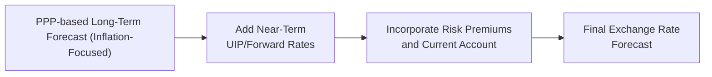

## Introduction
Sometimes I hear folks grumble, “Why can’t the exchange rate just follow a neat theory?” and I can’t help but chuckle. The real world can be, well, complicated. This section aims to show you how, despite the messy realities of global markets, fundamental parity theories provide a solid starting framework for trying to figure out where exchange rates might be headed. 

You’ll see how Purchasing Power Parity (PPP) and Uncovered Interest Rate Parity (UIP) can work together in both the short and long run. We’ll also chat about the adjustments needed for those pesky real-world annoyances: risk premiums, changing terms of trade, or random policy shifts. By the end, you’ll have a robust toolkit—plus a few cautionary tales—on forecasting currencies in a way that stands up to critical analysis (and hopefully, the CFA Level II exam item sets).

## Baseline Forecasting Approaches

### PPP-Based Forecasts
Purchasing Power Parity (PPP) is often considered the long-run “anchor” for currency values. If you ever find yourself thinking, “Hey, that currency seems cheap (or expensive) given local prices,” you’re already using a rudimentary version of PPP logic. 

In a more formal sense, PPP posits that identical baskets of goods in different countries should ideally cost the same when measured in a common currency. Big differences in prices—whether due to inflation or cost-of-living changes—drive adjustments in exchange rates until price levels come back into alignment.

• Absolute PPP states that the exchange rate should adjust so that the same basket of goods costs the same across countries.  
• Relative PPP refines this idea by suggesting that the percentage change in the exchange rate over time equals the inflation rate differential between two economies.

From a forecasting perspective, the simplest relative PPP approach says:


\hat{S}_{(t + k)} = S_{t} \times \frac{(1 + \pi_\text{dom})^k}{(1 + \pi_\text{for})^k},


where  
– \\(\hat{S}_{(t + k)}\\) is the forecasted spot rate k periods from now,  
– \\(S_{t}\\) is the current spot rate,  
– \\(\pi_\text{dom}\\) is the domestic inflation rate,  
– \\(\pi_\text{for}\\) is the foreign inflation rate.

Let’s say you’re eyeing a 2-year horizon and expecting annual inflation of 5% at home versus 2% abroad. If today’s spot rate is 1.2000 domestic currency units per foreign currency, a quick PPP-based forecast suggests:


\hat{S}_{(t + 2)} = 1.2000 \times \frac{(1.05)^2}{(1.02)^2}
\approx 1.2000 \times \frac{1.1025}{1.0404} \approx 1.27.


So, the domestic currency is expected to weaken from 1.2000 to 1.2700 per unit of foreign currency over those two years, in line with higher expected inflation.

### UIP-Derived Forecasts
Uncovered Interest Rate Parity (UIP) tells us that currencies with higher interest rates should depreciate to offset any potential arbitrage gains. The logic can be expressed simply: if you can earn a higher interest rate in Country A than in Country B, the currency of Country A is expected to fall so that on a currency-adjusted basis, you’re no better off than if you had just invested in Country B in the first place.

Mathematically, UIP says that the expected change in the spot exchange rate equals the interest rate differential:


\frac{\hat{S}_{(t + 1)} - S_t}{S_t} \approx i_\text{dom} - i_\text{for},


which can be rearranged to:


\hat{S}_{(t + 1)} \approx S_t \times \left(1 + (i_\text{dom} - i_\text{for})\right).


An example: Say domestic one-year interest rates are 4% and foreign one-year interest rates are 1%. If the current spot rate is 1.2000, UIP implies:


\hat{S}_{(t + 1)} \approx 1.2000 \times (1 + 0.04 - 0.01) = 1.2000 \times 1.03 = 1.2360.


In words, you might forecast that the domestic currency will fall from 1.2000 to 1.2360 per unit of foreign currency after one year, offsetting the fact that you earned a higher interest rate in the domestic market.

Now, one big caveat with UIP is that empirical studies often find currencies can remain out of line with this principle for long stretches. Sentiment, risk aversion, and good old speculation can keep the results from matching up. That said, UIP remains a powerful theoretical reference point and can provide a baseline forecast that you may choose to fine-tune.

## Adjustments for Market Realities
The truth is, we’re almost never dealing with an ideal, frictionless market. Risk premiums, capital controls, or major policy announcements can all introduce short-term (or longer) departures from PPP or UIP.

• Risk Premiums: If foreign investors demand extra returns to hold a currency they see as higher risk (perhaps due to political uncertainty or fear of default), that risk premium can overshadow parity-based forecasts.  
• Terms-of-Trade Changes: Big shifts in export vs. import prices can alter trade flows, pushing the exchange rate away from purely inflation- or interest-based projections. If your country’s key export commodity price plunges, watch out—you might see the currency come under pressure faster than the theoretical PPP or UIP path would suggest.  
• Structural Changes: Productivity gains, supply-chain realignments, or demographic shifts can yield sustained deviations. A once-lower-cost export hub might lose that status, or new technology might strengthen a country’s productivity in unexpected ways.

Well, what does that all mean for you as a forecaster? You can’t just rely on the neat equations, for sure. Instead, you can do scenario analysis or overlay fundamental data onto your parity-based forecast. “If the government imposes capital controls, then my UIP-based forecast might overshoot.” Or “If commodity prices surge temporarily, my PPP-based forecast for next year could be incomplete.”

## Combining Multiple Parities
In practice, many analysts blend PPP and UIP insights to create a more balanced forecast. PPP provides the long-term gravity center: eventually, inflation differences show up in exchange rates. But in the near term—particularly for horizons under, say, one or two years—interest-rate expectations (UIP) can dominate.

You can also throw in Covered Interest Rate Parity (CIP) if forward markets for the currency are liquid. CIP ensures no riskless arbitrage in covered positions (those hedged with forward contracts). While CIP itself doesn’t “forecast” the future spot rate, it can highlight market expectations embedded in forward rates, which often reflect interest rate and risk considerations.

One approach is this:  
1. Start with a PPP-based forecast for the long term (e.g., 3–5 years).  
2. Adjust shorter-term projections by applying UIP or forward quotes to reflect near-term economic or monetary policy conditions.  
3. Overlay your macro signals: if you expect a big shift in trade balances or a surprise from the central bank, incorporate that in your final number.  
4. Evaluate risk premiums. For instance, if a country’s debt rating is eroding, you might build in an additional currency depreciation beyond the standard interest differential.

Below is a simple visualization showing how analysts might combine frameworks:

In practice, it’s common to maintain multiple forecast scenarios rather than relying on a single “point” estimate.

## Vignette Example
Let’s imagine you’re sitting for the CFA exam, and you see a vignette that outlines:

• Projected inflation rates in Country A (5%) vs. Country B (3%).  
• Expected short-term interest rates in Country A at 6% vs. Country B at 2%.  
• Information about rising political uncertainty in Country A, along with a minor risk premium.  
• Current spot rate for A/B is 2.0000.  

You might first do a PPP-based forecast for the next year:


\hat{S}_{(t + 1)}^\text{PPP} \approx 2.0000 \times \frac{1 + 0.05}{1 + 0.03} \approx 2.0000 \times 1.0194 \approx 2.0388.


Next, a UIP-based approach might call for:


\hat{S}_{(t + 1)}^\text{UIP} \approx 2.0000 \times (1 + (0.06 - 0.02)) = 2.0000 \times 1.04 = 2.08.


You might then factor in a modest risk premium that further weakens Country A’s currency—say an extra 1% depreciation—and arrive at 2.10 as your final forecast. The exam question might ask you to justify each step and highlight how the risk premium changed your baseline estimate. Notice how these short-answer or multiple-choice queries often test knowledge of the underlying parity theories as well as the ability to layer in real-world complexities.

## Scenario Planning
Given the uncertainty in global finance, many analysts prefer scenario planning over a single “best guess.” You might run a baseline scenario (your central assumption of inflation and interest differentials), plus a best-case scenario (perhaps lower inflation at home or better political stability) and a worst-case scenario (maybe the central bank must hike rates aggressively, or a ratings downgrade leads to higher risk premiums).

Scenario analysis can look like this:

• Best case: Lower domestic inflation than expected + stable foreign inflation → smaller depreciation.  
• Base case: “As forecast” inflation and interest assumptions → moderate depreciation.  
• Worst case: Surprising economic data or political turmoil → sharper depreciation.

With scenario analysis, you assign probabilities to each scenario and calculate a weighted average exchange rate. This helps you plan for all sorts of outcomes (and hopefully helps avoid heartbreak if you pinned everything on a single forecast).

## Best Practices and Common Pitfalls
There’s no substitute for a thorough understanding of economic fundamentals and the current environment. A few typical mistakes to watch out for:

• Over-Reliance on a Single Parity: “Hey, my PPP formula told me 1.25!” Unless every assumption is guaranteed, you might be missing the near-term capital flow story or risk divergence.  
• Ignoring “Gap” Periods: Sometimes, exchange rates can remain out of equilibrium for years due to capital market frictions or pegged exchange rate regimes. Don’t assume PPP or UIP should hold instantaneously.  
• Failing to Monitor Central Bank Intervention: If authorities routinely intervene in the currency market, your fundamental forecast might overshoot or undershoot dramatically.

## Exam Tips for CFA Level II
• Know Your Formulas: They might test your ability to rearrange PPP or UIP equations quickly.  
• Identify the “Why”: Vignette questions often ask why the actual outcome deviates from parity (e.g., risk premiums, capital controls, central bank interventions).  
• Manage the Time: On exam day, you don’t want to spend ages overthinking. Lay out your steps, do the math carefully, and interpret results succinctly.  
• Combine Theories: They love questions where you start with PPP, then adjust for UIP, then incorporate a policy twist. Show them you can connect the dots.

## References
• Pilbeam, K. (2013). International Finance. Palgrave Macmillan.  
• IMF (International Monetary Fund). (Various Reports). Currency Forecasting Methodologies. [https://www.imf.org/en/Publications](https://www.imf.org/en/Publications)  

## 10 Sample Questions on Forecasting Exchange Rates



### 1. 
An analyst is forecasting the domestic currency (DC)–foreign currency (FC) exchange rate. Domestic inflation is 4%, foreign inflation is 2%, and the current spot rate is DC1.5000 per FC. Using a pure relative PPP forecast for one year, which of the following is closest to the indicated exchange rate?

- [ ] DC1.5000
- [ ] DC1.5300
- [x] DC1.5360
- [ ] DC1.5700

> **Explanation:** Relative PPP implies the forecasted spot rate = 1.5000 × (1.04 / 1.02) ≈ 1.5360.

### 2.
You observe that the domestic 1-year interest rate is 5%, while the foreign 1-year interest rate is 2%. According to UIP, if the spot rate is DC3.0000 per FC, what would be the forecasted spot rate in one year?

- [x] DC3.0900
- [ ] DC2.9415
- [ ] DC2.9100
- [ ] DC3.1500

> **Explanation:** Using UIP, S(t+1) ≈ 3.0000 × (1 + (0.05 - 0.02)) = 3.0000 × 1.03 = 3.0900.

### 3.
Which best describes the general long-term relationship between exchange rates and inflation under PPP?

- [ ] Exchange rates do not respond to inflation differentials.
- [x] Currencies with higher inflation typically depreciate.
- [ ] Currencies with higher inflation typically appreciate.
- [ ] Inflation differentials are irrelevant to exchange rate movements.

> **Explanation:** Under PPP, higher inflation in a country leads to depreciation of its currency over the long term.

### 4.
An analyst calculates a one-year PPP-based forecast of DC2.050 per FC but decides to adjust it upward by 1.5% due to a perceived risk premium. Which final forecast would result?

- [ ] DC2.025 per FC
- [ ] DC2.050 per FC
- [ ] DC2.070 per FC
- [x] DC2.081 per FC

> **Explanation:** Adjusting upward by 1.5% from 2.050 gives 2.050 × 1.015 = ~2.081.

### 5.
When constructing forecasts under UIP, a major assumption is that:

- [x] Investors make no systematic excess return from shifting between currencies unhedged.
- [ ] Real interest rates in all countries are identical.
- [ ] Central banks never intervene in currency markets.
- [ ] Historical inflation rates equal forward inflation rates.

> **Explanation:** A key UIP assumption is that expected currency depreciation offsets interest rate differentials, leaving no arbitrage opportunity.

### 6.
A country’s terms of trade suddenly deteriorate due to a collapse in its primary export commodity. Which effect is most likely to occur if one initially used a simple PPP-based forecast?

- [ ] The currency would strengthen more than PPP suggests.
- [ ] The currency would not change because PPP is unconditional.
- [x] The currency is likely to depreciate more quickly than PPP alone predicts.
- [ ] Forecasts remain unchanged if the interest rate is stable.

> **Explanation:** A fall in a country’s terms of trade often reduces demand for its currency, leading to a faster or deeper depreciation beyond basic PPP.

### 7.
Covered interest rate parity (CIP) differs from UIP in that CIP:

- [ ] Considers inflation expectations only.
- [ ] Is used for long-run currency forecasting only.
- [x] Requires a forward hedge, eliminating currency risk.
- [ ] Predicts no relationship between forward and spot rates.

> **Explanation:** CIP states the forward exchange rate should eliminate arbitrage in covered positions, where investors hedge currency risk via forward contracts.

### 8.
An analyst forecasts the next year’s exchange rate using both PPP and UIP. She obtains values of DC1.300 and DC1.250, respectively, for DC per FC. She judges a risk premium for the domestic currency at roughly 1%. If she combines these forecasts by taking an average and then adjusts for risk, which of the following is closest to her final figure?

- [ ] DC1.300
- [x] DC1.276
- [ ] DC1.310
- [ ] DC1.215

> **Explanation:** Average of 1.300 and 1.250 is 1.275. Adjusting upward by 1% yields 1.275 × 1.01 = 1.2878 (~1.28). Minor rounding differences can occur, but 1.276 is the closest choice provided.

### 9.
Which factor can lead to prolonged departures from PPP-based exchange rate forecasts?

- [ ] Absence of interest rate differentials.
- [ ] Perfectly flexible exchange rates with no capital controls.
- [x] Market interventions or persistent risk sentiment changes.
- [ ] Zero inflation in both countries.

> **Explanation:** Market interventions and shifts in risk sentiment (or structural imbalances in capital markets) can keep exchange rates away from PPP for extended periods.

### 10.
Scenario analysis for exchange rate forecasting typically involves:

- [x] Considering best-case, base-case, and worst-case projections.
- [ ] Calculating a single forecast based solely on the current spot rate.
- [ ] Applying only PPP without adjusting for policy changes.
- [ ] Ignoring possible risk premiums to avoid overcomplicating the forecast.

> **Explanation:** Scenario analysis accounts for multiple potential paths of inflation, interest rates, and risk factors, creating several plausible exchange rate forecasts.


