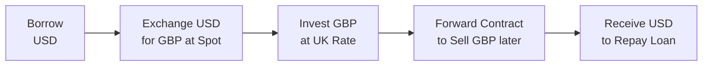

Introduction to Vignette-Style Problems  
Sometimes you read a short case about a country’s rising interest rates, a rumored intervention by the central bank, or a sudden shift in inflation—and then you have to figure out what it all means for spot and forward exchange rates, or for prospective arbitrage trades. That’s the essence of a Level II vignette question. And you know what? They can be super enjoyable once you get used to them—but a bit tricky at first glance. In this section, we’ll walk through how these item sets are structured, explore a step-by-step approach to solving them, talk about pitfalls, then wrap up with some worked examples and a quick reference glossary.

Structure of Item Set Questions  
Vignette-style questions in Level II revolve around short scenarios describing real or hypothetical economic conditions. You might see:

• Several paragraphs of macroeconomic data for two or more countries (e.g., inflation rates, interest rates, forward quotations).  
• A mention of capital flows, a rumor about central bank policy shifts, or a snippet from an analyst’s report.  
• Tables showing the spot exchange rate, forward quotes, or historical trend data in inflation and interest rates.  

Following that, you’ll encounter inquiries such as:  
• “Based on uncovered interest rate parity, what is the expected future spot rate?”  
• “If covered interest parity holds, what’s the one-year forward EUR/USD?”  
• “Is there an arbitrage opportunity given these rates?”  

Don’t be rattled by the formidable details. The key is to identify which parity concepts and formulas apply. If these item sets mention forward quotes, CIP (Covered Interest Rate Parity) might be tested. If it’s all about expected future spot rates, you might be dealing with UIP (Uncovered Interest Rate Parity). If inflation data is there, you might suspect PPP (Purchasing Power Parity) or the International Fisher Effect (IFE).

Approach to Solving Vignette Questions  
It’s easy to get lost in the details—trust me, I’ve seen folks overcomplicate things by mixing up nominal vs. real interest rates. So let’s keep this systematic:

Step 1: Identify Relevant Data Points  
Look for the spot rate, forward quote, interest rates (domestic vs. foreign), or inflation differentials. Also note if the question specifically references transaction costs or partial equilibrium limitations.

Step 2: Determine the Parity Concept(s)  
• CIP: Relationship between spot rates, forward rates, and interest rates—no risk of arbitrage if forward premiums/discounts exactly offset interest rate differentials.  
• UIP: The idea that expected future spot rates reflect interest rate differentials (not guaranteed by forward contracts).  
• PPP: Currencies adjust so that the same basket of goods costs the same in different countries, often used for long-run estimates.  
• IFE: A variant of Fisher equations that ties expected changes in exchange rates to nominal interest differentials (driven by expected inflation).  

Step 3: Apply the Relevant Formula  
An example for CIP (covered interest parity) is:  
F = S₀ × (1 + i_domestic) / (1 + i_foreign)  
where F is the forward exchange rate (domestic currency per unit of foreign currency), S₀ is the current spot rate, i_domestic is the domestic interest rate, and i_foreign is the foreign interest rate.

For PPP (absolute version), you might see:  
S_expected = S₀ × (1 + π_domestic) / (1 + π_foreign)  
where π_domestic and π_foreign are inflation rates.

Step 4: Adjust for Nuances  
If transaction costs or capital controls are mentioned, consider how they might reduce or eliminate arbitrage. If only partial coverage is possible (maybe only half the position can be hedged), factor that into your interest cost or forward coverage.

Step 5: Interpret the Result  
Does your calculation show an implied forward rate that differs from the market quote? That might signal an arbitrage for a diligent investor. Does your PPP-based forecast differ from the current spot rate? Then the currency might be overvalued or undervalued relative to PPP.

Common Mistakes in Exam Context  
• Misreading base vs. terms currency. If you see GBP/USD at 1.25, that means 1 GBP = 1.25 USD (GBP is the base). This can be more confusing than folks realize—so double-check the question’s convention.  
• Mixing nominal vs. real interest rates. If final rates incorporate expected inflation but the question specifically says “real interest rate,” be careful applying or adjusting the parity formula.  
• Skipping the details. Sometimes item sets sneak in lines about transaction costs or partial hedges. That can drastically change your arbitrage conclusion.  

Sample Worked Example  
Let’s see how it all comes together in a small sample:

• Spot GBP/USD = 1.2500  
• 1-year interest rate (US) = 2%  
• 1-year interest rate (UK) = 1%  
• CIP is assumed to hold (i.e., no transaction costs or capital controls)

Question: “Under CIP, what is the 1-year forward GBP/USD?”  

Solution:  
Let’s define:  
S₀ = 1.2500  
i_domestic = 0.02 (for USD if we treat USD as the domestic currency)  
i_foreign = 0.01 (for GBP, which is foreign in this setup)  

Using:  
F = S₀ × (1 + i_domestic) / (1 + i_foreign)  

So:  
F = 1.2500 × (1.02) / (1.01)  
F ≈ 1.2624  

Interpretation:  
If the actual forward quote in the market is 1.2700, you’d see that 1.2700 is higher than the CIP-implied 1.2624. That difference might allow for covered interest arbitrage. The next question might ask you to demonstrate how you would borrow in one currency, convert at the spot, invest, and then lock in a forward contract to see if you earn a riskless profit. If you find a difference that leads to a guaranteed positive gain, that’s an arbitrage.

Anyway, once you see how the formula works in a calm environment, you can adopt the same approach in exam scenarios that might have slightly more complex data (maybe multiple currencies or complicated time frames).

Integrating Real-World News  
Sometimes item sets reference a huge shift in inflation or interest rates that distorts short-run parity conditions. For instance, if the Bank of England makes a surprise rate cut, CIP might still hold in theory, but actual forward rates might swing widely in a short timeframe. Over the long run, markets often revert back to the fundamental relationship implied by parity—yet the exam might test whether you recognize that short-term volatility or capital controls can break these relationships temporarily.

Here’s a little personal anecdote: I once tried to forecast a currency pair using PPP for a small project, but the currency was influenced by capital controls that prevented free cross-border flows. The short-term exchange rate didn’t budge according to the PPP formula. Over the long run, though—like two or three years later—the exchange rate eventually corrected, roughly consistent with inflation differentials. So in a question, watch for cues that the parity might not hold in the short term. That’s often a clue the test-makers want you to acknowledge partial equilibrium or capital controls.

Best Practices for Vignette Questions  
• Underline or highlight any direct statements about interest rates, inflation rates, or forward quotes. That’s your “formula fuel.”  
• Keep track of which currency is the base vs. the terms currency. It’s amazingly easy to slip.  
• Double-check if the question wants a “domestic” perspective or “foreign” perspective. Yes, it’s crucial.  
• If you’re expected to produce a forward quote, show the formula carefully. The exam loves punishing sloppy formula usage.  
• Don’t forget to see if they mention real or nominal interest rates. For instance, the International Fisher Effect uses nominal rates, but if the vignette only supplies real rates plus inflation, you might have to combine them first.  

Visualizing Currency Parities (Mermaid Diagram)  
Sometimes a quick diagram helps you keep track of money flows (especially if you suspect a covered interest arbitrage). Here’s a small flow using a mermaid diagram, where we borrow in one currency, exchange, invest in another, and then use a forward contract to convert back:

Ask yourself: do I end up with more USD than I started with after repaying the loan, or is it break-even? If it’s a surplus—arbitrage is possible.

Glossary  
Base Currency  
• The first currency in the quote. For GBP/USD = 1.2500, GBP is the base.

Terms Currency (Quote Currency)  
• The second currency in the quote. For GBP/USD, USD is the terms or quote currency.

Partial Equilibrium  
• An approach that focuses on one market or segment without adjusting all other markets simultaneously.

Forward Quote  
• The currency exchange rate for future delivery, typically expressed in “points” or “pips” added/subtracted from the spot.

References  
• CFA Institute (2023). CFA Program Curriculum, Volume 2: Economics. https://www.cfainstitute.org/  
• James, J., Marsh, I., & Sarno, L. (2012). Handbook of Exchange Rates. Wiley.  

Test Your Knowledge of International Parity Conditions



### Suppose the spot AUD/USD is 0.7000, and annual interest rates are 3% in Australia and 1% in the U.S. With zero transaction costs, which forward AUD/USD would covered interest parity imply for a one-year contract?

- [ ] 0.7140
- [x] 0.7139
- [ ] 0.6881
- [ ] 0.7272

> **Explanation:** Using CIP: F = 0.7000 × (1 + 0.03) / (1 + 0.01) ≈ 0.7139.

### A scenario states: “Spot EUR/USD is 1.1000; inflation in the Eurozone is 2%, while inflation in the U.S. is 4%. If purchasing power parity holds over the next year, what is the expected EUR/USD in one year?”

- [ ] 1.0784
- [ ] 1.1450
- [x] 1.0788
- [ ] 1.0673

> **Explanation:** Applying PPP: Expected EUR/USD = 1.1000 × (1 + 0.02) / (1 + 0.04) ≈ 1.0788.

### If a vignette states that forward quotes in USD/CHF deviate significantly from the CIP-implied values, what is the most likely reason?

- [ ] CIP is definitively void and can never hold.
- [x] There may be capital controls or significant transaction costs.
- [ ] The CIP formula is misunderstood and not used for actual markets.
- [ ] The USD and CHF interest rates are the same.

> **Explanation:** Large deviations often arise from transaction costs, liquidity constraints, or capital controls, which block the straightforward arbitrage mechanism.

### Suppose you read in a vignette that “Spot CAD/JPY is 90.00, but PPP-based models suggest it should be 88.00 based on inflation differentials.” If there are no partial equilibrium or short-term frictions, how might we interpret this?

- [x] CAD might be overvalued relative to JPY in PPP terms.
- [ ] JPY might be overvalued relative to CAD in PPP terms.
- [ ] Interest rate parity is definitely violated.
- [ ] CIP implies no forward premium.

> **Explanation:** A higher spot than PPP fair value suggests the base currency (CAD) may be overvalued if all else is equal.

### The expected inflation differential between Brazil and the U.S. is 6% in favor of Brazil. If the current spot is BRL/USD = 5.00, the PPP-implied one-year spot would be:

- [ ] 5.11
- [x] 5.30
- [ ] 4.72
- [ ] 6.20

> **Explanation:** The expected BRL/USD is 5.00 × (1 + 0.06) = 5.30, assuming the U.S. inflation is near 0% or negligible in this scenario.

### Under uncovered interest rate parity, if the risk premium is zero and the domestic interest rate is higher than the foreign interest rate, the domestic currency is expected to:

- [ ] Appreciate.
- [x] Depreciate.
- [ ] Stay constant.
- [ ] Create a guaranteed arbitrage.

> **Explanation:** UIP states that a higher domestic interest rate is offset by an expected depreciation of the domestic currency.

### A vignette says: “Spot USD/NOK is 9.00. The 1-year forward is quoted at 9.10. The Norwegian rate is 2%, U.S. rate is 3%. Is there a covered interest arbitrage?”

- [x] Yes, we should check the CIP equation to confirm the magnitude.
- [ ] No, because CIP is always correct.
- [ ] No, because the forward quote is above the spot rate.
- [ ] Can’t be determined without inflation data.

> **Explanation:** We compare the forward quote implied by CIP (F = 9.00 × (1+0.03)/(1+0.02) = 9.0882) to the actual forward of 9.10. The small difference suggests a possible arbitrage if transactions costs are low.

### If the real interest rate in Country A is 2% and expected inflation is 3%, while the real interest rate in Country B is 1% with expected inflation at 1%, what is the approximate nominal rate in Country A?

- [x] 5%
- [ ] 3%
- [ ] 2%
- [ ] 4%

> **Explanation:** Nominal ≈ real + inflation (Fisher equation, ignoring compounding): 2% + 3% = 5%.

### According to the International Fisher Effect, if Country X has a 5% nominal rate and Country Y has a 2% nominal rate, how should currency X behave over the long run?

- [x] Currency X is expected to depreciate relative to Y by about 3%.
- [ ] Currency X is expected to appreciate relative to Y by about 3%.
- [ ] The exchange rate should remain the same due to market equilibrium.
- [ ] No conclusion can be drawn from nominal rates.

> **Explanation:** IFE suggests that a higher nominal rate reflects higher expected inflation, leading to expected depreciation for currency X.

### If the forward rate equals the expected future spot rate, this situation is most closely aligned with:

- [x] Uncovered interest rate parity holding without a risk premium.
- [ ] Covered interest rate parity with transaction costs.
- [ ] Purchasing power parity in the short run.
- [ ] The break-even inflation concept.

> **Explanation:** When the forward rate equals the expected future spot rate, we often associate that with UIP, although in practice risk premiums may cause deviations.


