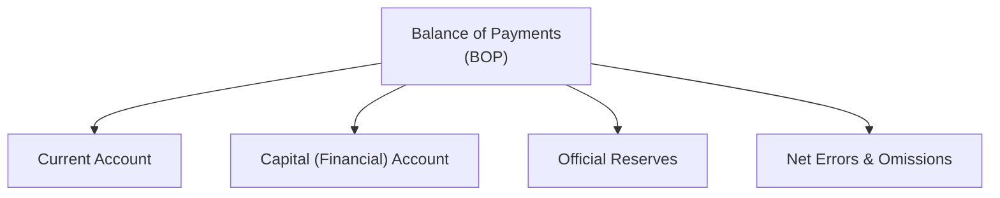

## Understanding the Balance of Payments

I remember the first time I encountered the term "Balance of Payments" (BOP). Someone casually told me, "Eh, it always balances," and I thought: Wait, what does that even mean? How does it balance, and why should I care? The BOP might look like a dry set of accounts, but it’s actually a vital barometer of a country’s economic health and international financial standing. In the Level II CFA curriculum, it’s also a critical concept for analyzing exchange rates, international trade flows, investment behavior, and central bank policies.

In short, BOP is an accounting framework tracking all transactions between residents of one country and the rest of the world over a specific period. If you’re reading about a “current account deficit” or “capital inflow,” you’re brushing up against facets of the BOP. The neat thing is that once you grasp how money flows across borders for trade, investment, or official reserve changes, you can spot early signals of currency strength (or potential crises).

## Key Components of the Balance of Payments

Traditionally, the BOP is divided into a few main components: the Current Account, the Capital (or Financial) Account, Official Reserves, and Net Errors & Omissions. Let’s break them down in plain English, then we’ll dig deeper into how each component functions.

### Current Account

The Current Account records a country’s net trade in goods and services, plus income flows (think dividends, interest, wages) and net current transfers (like official aid, workers’ remittances, or personal gifts). Some folks call it the “trade balance” portion because goods and services transactions dominate the conversation. But it also includes:

• Goods exports and imports.  
• Services exports and imports (e.g., tourism, consulting, financial services).  
• Net primary income (income from foreign investments, wages paid to foreign labor, etc.).  
• Secondary income (transfers such as remittances or foreign aid).

Whenever you read about a “deficit” or “surplus” in the current account, you can basically think of it as the nation’s net exporter or net importer status. If you run a current account deficit, you generally import more (outflow of domestic currency) than you export. That can be financed by inflows in other accounts, or else you’re depleting foreign reserves or taking on net foreign liabilities.

### Capital (Financial) Account

This part of the BOP tracks cross-border investments. It’s often referred to as the Capital and Financial Account, but for simplicity people might just call it the Financial Account. Expect to see:

• Portfolio investment (buying foreign stocks, bonds, or other securities).  
• Foreign Direct Investment (FDI)—for example, if a multinational builds a factory abroad.  
• Other official and private capital flows (like bank deposits and loans that cross borders).

If a country is super attractive for investment—maybe because it’s got high growth potential or stable political conditions—you’ll see big positive inflows in the Financial Account. On the flip side, if local investors see opportunities abroad or lose faith in the domestic economy, you might see outflows, which can impact the currency.

### Official Reserves

Official Reserves represent changes in a country’s holdings of foreign exchange, gold, Special Drawing Rights (SDRs), and similar assets held by the central bank. Central banks use these reserves to stabilize or influence exchange rates. For example, if a central bank wants to prop up its currency, it might sell foreign currency (an outflow of its official reserves) and buy its own currency in the marketplace, hence supporting its value.

### Net Errors and Omissions

I like to think of Net Errors and Omissions as the “Oops!” line item on the BOP statement. Because we’re dealing with huge volumes of cross-border data from different sources, there are inevitably unrecorded or misrecorded transactions—especially in large economies with complex flows. The Net Errors and Omissions entry serves to reconcile the accounts so that the overall BOP statement balances out.

Below is a quick overview in a visual diagram. You can see how these four main areas interact:

Each arrow simply shows that these components feed into the final “balance” of the overall statement.

## Why the BOP Must Balance

So, why is it called the Balance of Payments? The fundamental rule is:

(Current Account) + (Capital Account) + (Official Reserves) + (Net Errors & Omissions) = 0

You might see slightly different naming conventions or groupings, but the bottom line is that any shortfall or surplus in one component tends to be offset by adjustments in the others (including official reserves).

• If a country imports more than it exports (negative current account), it typically covers that difference via foreign capital inflows or by running down official reserves.  
• If a country has a large current account surplus, that extra inflow must go somewhere—often into purchasing foreign assets (recorded in the Capital Account) or building up foreign reserves.

Anyway, this balancing act can produce interesting consequences for currency markets. For instance, a persistent deficit may weaken the currency if it’s not countered by sufficient capital inflows or intervention from the central bank. That leads us to the next question: how do these economic flows shape currency valuation?

## Economic Flows and Currency Valuation

Think of each BOP transaction as a simultaneous exchange of currencies—like when you buy French cheese, you pay in euros (maybe indirectly through a bank or some slightly more complicated method, but you get the idea). This transaction counts as an outflow of USD from the U.S. perspective and an inflow of euros to the U.S. importer, with the ultimate counterpart being a French exporter receiving euros. Over the long run, these flows—exports, imports, capital movements, and central bank actions—collectively shape supply and demand for currencies.

• Trade Flows: If a country is consistently importing more than it exports, there’s a net demand for foreign currency. Such a dynamic can pressure the home currency to depreciate unless balanced by offsetting inflows in the Financial Account or interventions by the central bank.  
• Capital Flows: Global investors might chase higher returns by pouring money into a country’s equity and bond markets, appreciating that currency. Conversely, capital flight is an outflow that weakens the currency.  
• Official Intervention: Central banks can change their reserves (selling or buying foreign currency) to manage exchange rate volatility.

When analyzing BOP data for currency valuation, pay special attention to persistent imbalances. A huge, sustained current account deficit, for example, can be a sign that the currency will eventually face downward pressure unless offset by robust foreign investment or other measures.

## Real-World Discrepancies, Net Errors, and Omissions

We talk about the BOP matching up perfectly, but in practice, measurement errors and timing differences can throw a wrench in the data. This is where Net Errors and Omissions (NEO) swoops in to reconcile the final equation. You might see big, puzzling swings in NEO for certain emerging market data. That can happen if:

• There’s underreporting of trade because some small business owners aren’t filing appropriate forms.  
• Illegal capital flight or “informal” transactions don’t show up in official numbers.  
• Timing issues exist between shipments recorded as exports and the actual receipt of payment.

Excessive NEO entries sometimes raise eyebrows about data credibility. For exam purposes—and for real-world investing—you might keep an eye on this line item to see if there’s something fishy going on. A high NEO figure can indicate data-collection challenges or hidden flows that might eventually affect macroeconomic conditions.

## Practical Examples and Vignette Approaches

Let’s imagine a hypothetical economy called Polhiria. It’s a resource-rich country with decent manufacturing, and the latest partial BOP data is shown below. You have to figure out what’s happening with Polhiria’s currency stance—maybe even guess if it’s undervalued or overvalued.

• The Current Account shows a large deficit from heavy machinery imports.  
• The Capital Account shows strong inflows from foreign investors who are bullish on Polhiria’s commodities.  
• Official Reserves remain steady.  
• Net Errors and Omissions is a small positive figure.

What does that tell you? Polhiria’s heavy imports might ordinarily weaken its currency, but consistent foreign investment is offsetting that deficit. That can keep Polhiria’s currency stable or even push it to appreciate slightly if the financial inflows exceed the deficit. An exam item set might ask you to do some short calculations:

1) Identify the main driver in the Current Account deficit (e.g., trade deficit in goods).  
2) Evaluate how FDI or portfolio inflows affect the Capital Account.  
3) Check how stable or large the Official Reserve ratio is.  
4) Judge short-term currency pressures.

In practice, the exam might give you partial data points, some anecdotal info about Polhiria’s future growth prospects, and changes in interest rates. Your job is to piece these elements together in a cohesive analysis. That’s basically what real analysts do when deciding whether a currency is likely to hold value or if there’s a risk of currency meltdown based on a precarious BOP situation.

## Persistent Deficits and Surpluses

Ever wonder why the U.S. can run persistent current account deficits for years without immediate meltdown? Well, it’s often explained by strong capital inflows. Foreign investors still see the U.S. as a relatively safe place to park money—so the deficits get financed. On the other hand, some emerging markets aren’t so lucky. If they run persistent deficits and can’t attract enough capital, they might deplete reserves or face rapid depreciation.

Surpluses come with their own set of challenges. Countries like China, known for export-driven surpluses, end up accumulating large foreign reserves. We see them investing heavily abroad or buying foreign assets. That can spur political debates over trade imbalances, currency manipulation allegations, or unsustainable reliance on exports for growth.

## Best Practices and Common Pitfalls

• Overlooking the Capital Account’s role: Watch out—sometimes people focus too heavily on the Current Account. Capital flows can make or break an economy in the short run.  
• Misinterpreting Net Errors and Omissions: A big NEO might signal hidden flows or data inaccuracies that can distort your view completely.  
• Missing reserve movements: Changes in a country’s foreign reserves can mask underlying pressures in the exchange rate. Don’t assume the currency is stable just because the spot rate is stable. Maybe the central bank is burning reserves to keep it that way.  
• Not adjusting for seasonal factors: Some countries have strong seasonality in exports (e.g., agricultural goods), so monthly or quarterly data might bounce around.  

If your exam item set lumps multiple pieces of data, highlight or jot down key figures so you don’t lose track of them in the narrative. Time management can be tricky if you start drowning in text rather than zeroing in on relevant numbers.

## References and Further Reading

• International Monetary Fund (IMF), “Balance of Payments and International Investment Position Manual (BPM6)”:  
  https://www.imf.org/external/pubs/ft/bop/2007/pdf/bpm6.pdf

• Krugman, Paul R., and Maurice Obstfeld (most recent edition). “International Economics: Theory and Policy.” A strong academic foundation for understanding global trade and finance.

• IMF Data and World Bank Open Data provide extensive BOP statistics across countries.

• For an intuitive guide, consider checking out news articles or official central bank reports on a given country’s BOP release—they often provide commentary on the reasons behind deficits or surpluses.

## BOP Accounts and Economic Flows Practice Quiz



### A country's Balance of Payments includes which of the following major components?
- [x] Current Account, Capital (Financial) Account, Official Reserves, Net Errors and Omissions
- [ ] Current Account, Capital (Financial) Account, Federal Budget Deficit
- [ ] Current Account, Merchandise Trade, Currency Hedging Activity
- [ ] Capital (Financial) Account, Government Debt Financing, Unemployment Rate

> **Explanation:** The BOP is typically broken down into the Current Account, the Capital (or Financial) Account, Official Reserves, and Net Errors & Omissions, consistent with international accounting standards.

### Persistent current account deficits are most likely financed by:
- [ ] A trade surplus in the same period
- [x] Capital inflows through the Capital (Financial) Account
- [ ] A reduction in the money supply
- [ ] Increases in unemployment

> **Explanation:** Persistent current account deficits must be offset by net inflows in the Capital (Financial) Account or a drawdown in Official Reserves. Trade surpluses cannot coexist simultaneously in the same sense with a current account deficit.

### In a hypothetical country with a large current account surplus and no significant net capital inflows or outflows, the BOP must balance primarily through changes in:
- [x] Official Reserves
- [ ] Domestic interest rates
- [ ] Government spending
- [ ] Tax policies

> **Explanation:** The surplus of foreign currency from exports will often be reflected in an increase in Official Reserves if there is no balancing capital movement.

### A high Net Errors and Omissions line in the BOP often indicates:
- [ ] Precise coverage of all transactions
- [ ] Surplus in the Current Account
- [x] Measurement inconsistencies or unrecorded flows
- [ ] That the Capital Account must be zero

> **Explanation:** A large Net Errors and Omissions figure usually arises from issues such as data reporting errors or unaccounted/unofficial transactions.

### Which type of flow is least likely to be recorded under the Capital (Financial) Account?
- [ ] Foreign Direct Investment
- [ ] Portfolio Investment
- [ ] Cross-border bank loans
- [x] Net trade in goods and services

> **Explanation:** The Capital (Financial) Account tracks cross-border investments, loans, and financial transactions. Trade in goods and services is captured under the Current Account.

### Official Reserves include:
- [ ] Equities, real estate, and intangible assets
- [x] Foreign currencies, gold, and Special Drawing Rights (SDRs)
- [ ] Corporate bonds and term deposits
- [ ] Domestic government debt

> **Explanation:** Official Reserves commonly include liquid foreign currencies, gold holdings, and SDRs, typically managed by the nation’s central bank.

### If an economy experiences a significant increase in foreign direct investment (FDI), this transaction will primarily appear in:
- [ ] The Net Errors and Omissions entry
- [ ] The Current Account
- [x] The Capital (Financial) Account
- [ ] The Official Reserve Account

> **Explanation:** FDI represents direct capital investment from abroad and is therefore recorded in the Capital (Financial) Account.

### An item set reveals that Country X has a current account deficit of $50 billion, capital inflows of $30 billion, and no changes in official reserves. Which of the following is most likely true?
- [ ] Net Errors & Omissions must be -$80 billion
- [ ] Net Errors & Omissions must be +$50 billion
- [ ] Net Errors & Omissions must be +$30 billion
- [x] Net Errors & Omissions must be +$20 billion

> **Explanation:** BOP must balance. A $50 billion current account deficit partially filled by $30 billion in capital inflows leaves a $20 billion gap, which is likely recorded in Net Errors & Omissions as +$20 billion (or an equivalent drawdown in official reserves if such an entry actually occurred).

### Which scenario is most likely to pressure the domestic currency to depreciate?
- [ ] A balanced current account but large capital inflows
- [x] A sustained current account deficit unaccompanied by capital inflows
- [ ] Rising foreign exchange reserves and a current account surplus
- [ ] A large net errors & omissions figure indicating some measurement gap

> **Explanation:** A sustained current account deficit that isn’t financed by foreign capital typically creates excess demand for foreign currency, pushing the domestic currency to depreciate.

### True or False: The Balance of Payments always sums to zero because each deficit or surplus in one account is offset by other accounts (including net errors and omissions).
- [x] True
- [ ] False

> **Explanation:** By definition, the BOP must “balance” as long as all transactions, including net errors and omissions, are properly recorded and accounted for.


