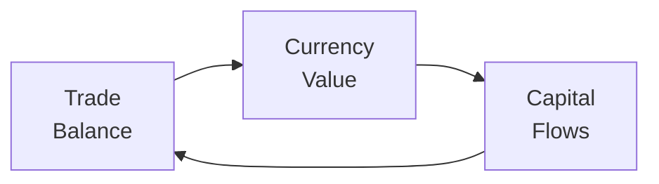

Understanding how trade balance and capital flows affect exchange rates can be super eye-opening—especially if you remember those days when you saw a headline about a country’s big current account deficit and thought, “So, does that mean the currency is doomed?” Funny enough, there isn’t always a straightforward answer. Let's explore how trade surpluses and deficits intertwine with capital flows to move currencies up or down. We’ll touch on short-term vs. longer-term causes, interest rate differentials, and more. So, if you’re curious about how money zooms around the globe and moves exchange rates, let’s dive in.

Understanding the Trade Balance  
A country’s trade balance is basically the difference between export revenues and import expenditures on goods and services. If exports exceed imports, there is a trade surplus. Conversely, if imports are higher than exports, there’s a trade deficit. This notion might sound simple on paper, but it’s super important because, in many economic models, a higher export figure can mean more demand for a nation’s currency—think about foreigners having to buy that currency to purchase local goods.

Currency Movements from Trade Surpluses and Deficits  
When a country runs a persistent trade surplus, foreign buyers need its currency to buy the country’s goods. In a freely floating system, that extra demand for the currency can lead to currency appreciation. On the flipside, a country with a massive trade deficit shifts demand the other way—its economy is spending more on imports (i.e., demanding foreign currency), and that can contribute to depreciation pressures over time. But, as we’ll see, the story doesn’t end with just net exports.

Capital Flows and Their Impact  
Capital flows might offset—or even dominate—trade balance effects. If a country that runs a trade deficit also happens to be an attractive investment destination, foreign investors may pour money into its financial markets (like bonds or equities). This can generate serious offsetting demand for the local currency. And guess what? That can hold up the currency’s value even if the country’s trade balance is negative.

Here’s the big picture with the balance of payments identity:

$$
\text{Current Account (CA)} + \text{Capital Account (KA)} + \Delta \text{Reserves} = 0.
$$

In a simplified, free-floating system (ignoring official reserve interventions for the moment), if the CA is negative (i.e., you're importing more than exporting), the KA (capital account) must be positive (i.e., you’re receiving net capital inflows). Exchange rates ultimately help keep this equation in balance.

Sustaining Large Current Account Deficits Through Capital Inflows  
You might wonder: how do countries manage big current account deficits year after year and not watch their currency tank? The key is that often there are equally large capital inflows. This pattern can hold as long as foreign investors feel good about the country’s prospects, maybe because interest rates are attractive, or the equity markets look promising. But if investor sentiment shifts—say global economic conditions change or political risk spikes—capital can pull out quickly. This can produce abrupt exchange rate movements.

Interest Rate Differentials and Speculative Flows  
Interest rates are a huge driver behind short-term capital movements. Think of “hot money flows” seeking better yields. If domestic interest rates exceed foreign rates, investors might rush in to capitalize on higher bond or money-market returns. This fresh wave of capital flow can support the currency. But if interest rates suddenly look more appealing elsewhere, the flows can reverse fast. And that’s where you see big, unexpected exchange rate swings.

By the way, it’s not uncommon for analysts to track interest rate differentials across countries to infer the direction of currency moves. If a central bank indicates it may hike rates, folks might buy that country’s currency, anticipating higher yields. The relationship doesn’t always hold neatly, but it’s still a powerful factor.

Exchange Rate Adjustments to Changes in Trade Balance  
Another angle: if a currency depreciates, the price of imports goes up in local currency terms, making imported goods more expensive, while local exports become cheaper for overseas buyers. In theory, that can improve the trade balance over time by reducing imports and boosting exports. However, there can be lags—sometimes that immediate effect on the trade balance might not appear right away. You might hear about the “J-Curve”—the idea that a depreciation worsens a trade balance briefly before improving it later, once volumes adjust.

Short-Term vs. Long-Term Flows  
It’s also helpful to differentiate between short-term capital flows (like hot money or highly speculative inflows to exploit interest rate differentials) and long-term flows (like foreign direct investment or real estate purchases). Short-term flows can be volatile and can cause quick exchange rate moves. Longer-term flows tend to be more stable, but they still affect supply and demand for currency. Many countries actively encourage the stable, long-term flows because they’re considered healthier for sustainable economic growth and exchange rate stability.

Below is a brief flow diagram illustrating the interplay of trade balance, currency value, and capital flows:

Note: In reality, the causation can run in multiple directions at once since these factors are interlinked. But this simplified loop reminds us that trade balances, exchange rates, and capital flows constantly influence each other.

Common Pitfalls and Best Practices  
• Ignoring Capital Flows: It’s tempting to assume that a big trade deficit automatically means a currency must fall. That might be too simplistic because capital inflows can offset the deficit.  
• Overlooking Time Lags: Trade adjustment doesn’t happen overnight. A currency depreciation might not boost exports as fast as textbooks imply.  
• Focusing on Short-Term Rate Differentials Only: Sure, high rates might attract inflows now, but sentiment can change fast if, say, inflation risk or political instability creeps in.  
• Confusing Different Types of Capital Flows: FDI is generally more stable than speculative portfolio flows. If a country depends on “hot money,” it’s more vulnerable to sudden reversals.  
• Mixed Policy Signals: Suppose a country’s running a large trade imbalance while also raising interest rates to control inflation. That can introduce conflicting signals, so you have to analyze carefully.  

Real-World Example (Item-Set Styled)  
Let’s consider Redwoodia, a country with the following data:

• Trade Balance: –\$10 billion (deficit)  
• Portfolio Inflows: +\$3 billion  
• Foreign Direct Investment: +\$7.5 billion  
• Domestic Interest Rate: 5%  
• Foreign Interest Rate (major trading partners): 3%  

From the trade balance alone, Redwoodia runs a \$10 billion deficit, suggesting downward pressure on its currency. However, the net capital inflow is \$10.5 billion (3 + 7.5), exceeding the trade deficit. This could result in net upward pressure on the currency. After all, investors need Redwoodia’s currency to buy those local assets (equities, bonds, real estate, or direct business ventures). The interest rate differential (5% vs. 3%) also encourages foreign funds to flow into Redwoodia’s bond market for higher yields.

Let’s add a twist: what if Redwoodia’s political conditions suddenly sour, prompting investors to dump Redwoodian assets? If those \$3 billion in portfolio inflows quickly exit, Redwoodia’s currency might depreciate sharply if there are no other offsetting flows. The underlying question in an item set might be: “Given the data and sudden change in investor sentiment, predict Redwoodia’s currency movement,” or “How might Redwoodia’s central bank respond if rapid outflows pressure the currency?” These are classic exam-style analyses that test your understanding of trade balance vs. capital flows.

Conclusion  
The interaction between trade balances, capital flows, and currencies is a beautiful and, at times, chaotic web. A large current account deficit doesn’t always spell trouble if there are corresponding capital inflows—but watch out for shifting investor sentiment. Understanding the interplay of interest rate differentials, the nature of capital (short-term vs. long-term), and how exchange rates adjust over time will help you evaluate real-world scenarios more effectively. It’s seldom a one-sided story. Keep an eye on all moving parts, and you’ll be better equipped when you see a real or exam-based scenario about big deficits or surpluses and the likely effects on currencies.

References and Further Reading  
• Bank for International Settlements (BIS) – Studies on capital flows and their impact on exchange rates. [https://www.bis.org/](https://www.bis.org/)  
• Federal Reserve Board – Research papers on exchange rate determination. [https://www.federalreserve.gov/](https://www.federalreserve.gov/)  
• Relevant CFA Institute assigned curriculum readings on trade and currency impacts.  
• Chapter 4.6 of this volume for extended tools (Marshall-Lerner Condition, J-Curve, etc.).

## Test Your Knowledge: Trade Balance, Capital Flows, and Exchange Rates



### Which factor typically exerts downward pressure on a currency in a freely floating regime?

- [ ] A persistent current account surplus
- [x] A persistent current account deficit
- [ ] Increasing foreign direct investments
- [ ] Lower foreign interest rates relative to domestic

> **Explanation:** In isolation, a persistent current account deficit means a country is importing more than it exports, putting downward pressure on its currency. However, we must note that capital inflows can offset this pressure.

### How might rising domestic interest rates affect short-term capital flows?

- [ ] They reduce the likelihood of currency appreciation
- [x] They attract “hot money” inflows seeking higher returns
- [ ] They have no impact on capital flows
- [ ] They always neutralize any existing current account deficit

> **Explanation:** Higher interest rates often attract short-term speculative inflows looking for better yields, which can support the currency. It does not guarantee that a country’s current account deficit will be eliminated.

### True or False: Foreign direct investment (FDI) flows are always more volatile than speculative portfolio flows.

- [ ] True
- [x] False

> **Explanation:** FDI flows are generally considered longer-term investments and thus more stable. Speculative (portfolio) flows can be far more volatile.

### What is one reason a trade deficit might not lead to immediate currency depreciation?

- [x] Large offsetting capital inflows
- [ ] Reduced reliance on foreign goods
- [ ] Declining domestic consumer demand
- [ ] Increased export tariffs

> **Explanation:** If foreign investors are attracted by markets or interest rates in the country, their purchases of domestic assets create demand for the currency, offsetting trade deficit pressures.

### A currency depreciation typically leads to:

- [ ] Immediate improvement of the trade balance
- [x] More expensive imports for the home country
- [x] Cheaper exports for foreign buyers
- [ ] Zero impact on domestic inflation

> **Explanation:** Depreciation makes imports costlier and exports cheaper. This can help improve the trade balance over time, but not always instantly, due to volume and price adjustments.

### When foreign investors suddenly lose confidence in a country’s assets:

- [x] The currency may depreciate rapidly
- [ ] The currency always appreciates immediately
- [ ] Trade balances shrink immediately
- [ ] Monetary policy becomes unnecessary

> **Explanation:** A quick sell-off of local assets can lead to a sharp depreciation because supply of the local currency rises as investors convert back to their home currencies.

### Which of the following movements is most closely linked to short-term “hot money” flows?

- [x] Changes in relative interest rates
- [ ] Changes in a country’s population growth
- [x] Changes in short-term investor risk appetite
- [ ] Changes in long-term technology investments

> **Explanation:** Hot money flows chase yield and are sensitive to interest rate changes and shifting investor sentiment.

### When a country’s capital flows offset its trade surplus:

- [x] The exchange rate can remain relatively stable
- [ ] The trade surplus immediately disappears
- [ ] The exchange rate must collapse
- [ ] Inflation automatically rises

> **Explanation:** If outflows match or exceed the surplus, the net effect on the currency can be smaller, stabilizing it.

### An interest rate differential in favor of the home country often results in:

- [x] More demand for the home currency
- [ ] Less demand for the home currency
- [ ] An inverted yield curve
- [ ] No influence on speculative inflows

> **Explanation:** Higher home interest rates relative to the rest of the world can attract foreign funds into the bond or money markets, increasing demand for the currency.

### A sudden reversal of capital inflows is an example of:

- [x] Exposure to hot money flows
- [ ] Persistent net exporting
- [ ] Guaranteed currency appreciation
- [ ] A controlled depreciation

> **Explanation:** Rapid outflows after a period of inflow highlight the volatility of hot money flows, which can lead to sharp currency depreciation.


