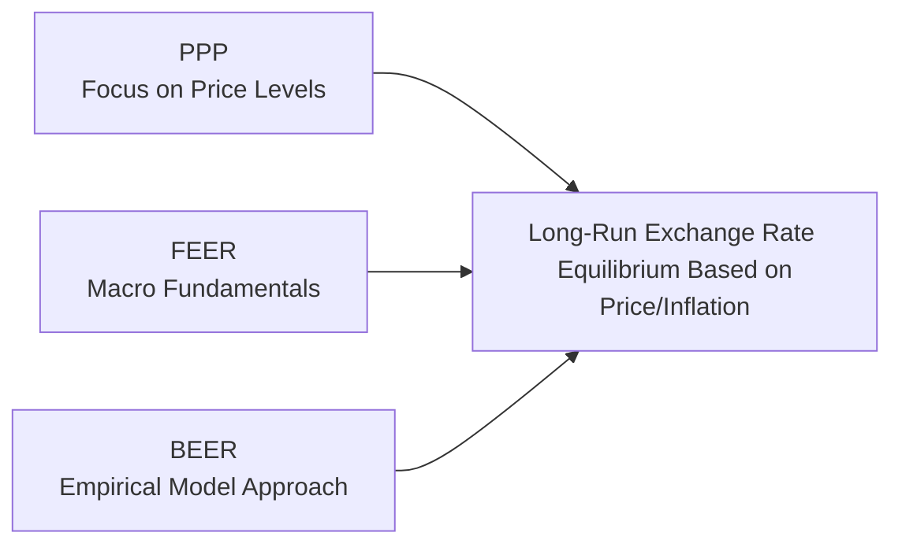

## Introduction
Standing in a friend’s bustling coffee shop in Barcelona—or was it Milan?—I remember thinking, “Wait, why is espresso cheaper here than back home?” That casual thought opened my eyes to why we often talk about how currency values influence the cost of goods across countries. Economists have built frameworks to figure out what exchange rate would make prices “just right,” and that’s exactly what we explore here. We’ll dig into three classic methods for gauging a currency’s long-run “fair value”: Purchasing Power Parity (PPP), the Fundamental Equilibrium Exchange Rate (FEER), and the Behavioral Equilibrium Exchange Rate (BEER). While their names might sound fancy, they’re all attempts to answer a common question: “Does this currency look overvalued, undervalued, or about right?”

In practice, exchange rates can be all over the place in the short run—people speculate, governments intervene, markets panic, you name it. But over the longer haul, these three frameworks help folks like us see through the noise.

## Purchasing Power Parity (PPP)
Purchasing Power Parity is probably the best-known concept for thinking about long-run fair value. At its core, it states that in an ideal world without transaction costs or trade barriers, the same basket of goods should cost the same across different countries once we adjust for the exchange rate. If you’ve come across The Economist’s “Big Mac Index,” you already get the gist.

### Absolute vs. Relative PPP
• Absolute PPP says that if a pair of shoes costs US$100 at home, then—after accounting for the exchange rate—the same pair should cost $100 in another country’s currency. Honestly, this is a bit simplistic because shipping costs, tariffs, and local margins (plus a sprinkling of intangible cultural factors) can skew prices.

• Relative PPP is more about rates of change: The expected change in an exchange rate over time is roughly equal to the difference in inflation rates between two countries. Formally:
  
  (Percentage change in Spot FX) ≈ (Domestic inflation) − (Foreign inflation)

So, if the domestic inflation rate is 5% and the foreign inflation rate is 2%, we’d expect the domestic currency to depreciate by about 3% over the long run to keep prices in line. You won’t see a perfect match each year, but over a multi-year horizon, relative PPP does a decent job of explaining average exchange rate movements.

### Why PPP Deviates in Reality
• Non-Tradeables: Services (like haircuts or medical care) are not easily tradable across borders.  
• Trade Barriers: Tariffs, quotas, or outright bans add friction.  
• Consumer Preferences: Even seemingly identical items (like coffee) can be priced differently due to intangible brand effects, local wages, and taxes.  
• Differences in Product Quality: The “same” product might differ in quality across countries (think local customizations or packaging nuances).

Despite these quirks, PPP offers a straightforward, intuitive lens: if inflation gets out of control in one country, that currency is likely to weaken in the long run.

## Fundamental Equilibrium Exchange Rate (FEER)
If you’re more of a macro buff, FEER might be your cup of tea. Whereas PPP primarily examines goods prices, FEER focuses on macroeconomic fundamentals. It tries to identify the exchange rate that ensures “internal and external balance” over the medium term.

### Under the Hood of FEER
• Internal Balance: The economy operates at full employment with stable inflation.  
• External Balance: The current account position is sustainable; in other words, you’re not running massive external deficits or surpluses that call for abrupt adjustments.

FEER basically says, “At what exchange rate would the economy neither boom nor bust, and where the country’s net savings and investment flows are in harmony?”

To find this so-called fundamental rate, analysts look at a variety of structural variables:  
• Productivity growth trends.  
• Desired national saving vs. investment.  
• Global capital flows and trading partner fundamentals.

FEER is often used in policy discussions: central banks or governments might say, “We think the FEER is around 1.10 for our currency pair,” implying that a current market rate of 1.30 is out of whack with underlying fundamentals.

### Strengths and Limitations of FEER
• Strength: More robust than PPP alone. FEER accounts for capital flows, productivity, and macro balancing.  
• Limitation: Complex to estimate. The “correct” measure of internal and external balance can be subjective.  
• Real-World Deviation: Even if the model suggests a fair value, markets can push way off target—for years.

## Behavioral Equilibrium Exchange Rate (BEER)
Behavioral Equilibrium Exchange Rate (BEER) is like a cousin to FEER but calls on big empirical models. Instead of just talking about an ideal macro balance, it hunts for real-world relationships:

• Terms of Trade: Commodity exporters, are you listening? If your export prices go up, your currency might appreciate.  
• Real Interest Rate Differentials: Higher real (inflation-adjusted) interest rates can attract capital inflows, boosting the currency.  
• Productivity Indicators: Countries with faster productivity growth can see stronger currencies.  
• Other Variables: Sometimes it’s net foreign assets, sometimes it’s a measure of risk appetite or dummy variables for crises—basically, whatever the researcher thinks might affect currency values.

### Steps in a Typical BEER Analysis
1. Collect relevant macro data (interest rate differentials, commodity price indices, etc.).  
2. Regress the real exchange rate on selected variables.  
3. Determine which relationships are statistically significant.  
4. Estimate an “equilibrium” path for the currency based on those macro fundamentals.

BEER is widely used by investment banks and economists who want a more flexible approach than a purely theoretical one. You do have to watch out for data-mining: if you throw in enough variables, something is bound to “stick,” but it might not be reliable over time.

## Comparing PPP, FEER, and BEER

| Model         | Key Variables                          | Time Horizon            | Strengths                                                                 | Limitations                                                    |
|---------------|----------------------------------------|-------------------------|---------------------------------------------------------------------------|----------------------------------------------------------------|
| PPP           | Price levels / inflation differentials | Typically long-term     | Intuitive, easy to grasp, widely used, highlights inflation effects       | Ignores capital flows, trade barriers, and structural changes  |
| FEER          | Macro fundamentals (savings/investment, productivity) | Medium to long-term | Integrates internal & external balance, robust framework for policy-making | More complex, subjectivity in measuring "equilibrium"           |
| BEER          | Empirical macro variables (ToT, real interest rates) | Short to medium-term  | Flexible, data-driven, captures real-world complexities                   | Potential data-mining, model depends heavily on chosen variables |

### Diagram of Conceptual Flow

In the diagram, each of PPP, FEER, and BEER eventually points to an assessment of the currency’s long-run equilibrium. They simply get there via different roads, using different sets of assumptions and data.

## Why Currencies Deviate from Equilibrium
Over lunch with a fellow analyst, you might joke that currencies have a mind of their own in the short run. Indeed, all three frameworks are about the “long run,” but in reality:

• Speculative Flows: Large capital movements can drive big swings that ignore fundamentals.  
• Government Intervention: Pegging, managed floats, capital controls—all can keep currencies off “fair” levels for extended periods.  
• Cyclical or Sentiment Factors: Risk-on or risk-off moods can overshadow fundamental valuations for a while.

## Practical Item-Set Style Example
Imagine you’re handed a short vignette in the exam:

“Country A has seen inflation accelerate to 8% while Country B’s inflation is stable at 2%. Over the same period, Country A’s central bank kept nominal policy interest rates unchanged, leaving real rates substantially lower than in Country B. Meanwhile, Country A’s terms of trade deteriorated because it exports mainly oil, whose world price has slumped. However, Country A also has had robust productivity growth due to structural reforms. Current market exchange rate: 1.60 (A’s currency per B’s currency). A PPP-based assessment suggests the rate should be 1.75. A BEER model that includes real interest rate differentials, productivity, and terms of trade suggests a fair value of 1.65, whereas a local think tank’s FEER-based estimate comes out at 1.55.”

You might see questions like:

• Based on relative PPP, is A’s currency overvalued or undervalued at 1.60?  
• Does the BEER model’s slightly higher rate reflect the negative terms of trade or the productivity gains, or both?  
• Why might the FEER-based estimate differ even more?  
• Which intangible factors (government capital controls, market sentiment) could explain why the actual rate is still at 1.60?

This kind of set-up forces you to interpret multiple angles: PPP focusing on price-level changes, FEER focusing on internal/external balance, and BEER capturing a blend of macro variables. Each method might yield a different perspective, and your job is to piece together a coherent conclusion.

## Best Practices and Common Pitfalls
• Best Practice #1: Cross-Check. If PPP says one thing, but your BEER analysis is far off, you might want to re-check data or think about capital flows or structural changes.  
• Best Practice #2: Understand Time Horizons. PPP is fairly long-run. If you’re trying to forecast next quarter’s move, a short-run measure like a near-term BEER or a micro flow-based model might help more.  
• Common Pitfall: Over-Reliance on a Single Model. Markets are dynamic. Relying on just PPP or just FEER might give you tunnel vision.  
• Pitfall #2: Ignoring Behavioral Factors. Sometimes “herding” or “momentum trading” can push a currency far from any fundamental value. Keep that in mind.

## Conclusion
Judging a currency’s long-run fair value is part art, part science—like trying to find the “true” cost of a cappuccino between countries when wages, tastes, and taxes all differ. PPP gives you a neat “goods-based” anchor, FEER offers a thoughtful macro framework, and BEER leverages empirical data. In practice, these models each have their champion scenarios. You’ll often see them used together, especially in equity research, macroeconomic policy discussions, and big investment decisions. 

For exam success, be sure you understand the differences among these three approaches, how to interpret their numbers, and reasons why real-world exchange rates often depart from “fair.” The item-set questions will likely test your ability to evaluate and compare these methods in a scenario-based context—and to remain calm when the figures don’t line up perfectly.

Remember: if the exam leads you to a currency misalignment, always ask yourself, “What’s driving this divergence from the model?” Then weigh the effect of short-term vs. long-term forces. And maybe think of that coffee moment in Barcelona (or was it Milan?)—sometimes it’s all about perspective.

## References and Further Reading
• IMF Working Papers on “Exchange Rate Assessments: FEER, BEER, and PPP”  
• “Purchasing Power Parity and Real Exchange Rates” in the Journal of International Economics  
• Practitioner guides on applying BEER models for currency forecasting  
• CFA Institute Level II Curriculum (2025) – Economics Sections on Parity Conditions and Exchange Rate Determination  

## Test Your Knowledge: Long-Run Fair Value of Currencies



### 1. Which statement best describes an advantage of using relative PPP for assessing long-run exchange rates?

- [ ] It exactly predicts short-term exchange rate fluctuations.  
- [ ] It includes capital flow adjustments and productivity changes.  
- [x] It uses inflation differentials to explain persistent exchange rate movements.  
- [ ] It is not influenced by trade barriers or taxes.  

> **Explanation:** Relative PPP focuses on how inflation differentials drive exchange rate changes over the long run. It does not incorporate capital flows or subtle structural factors.

### 2. An analyst observes that a country’s currency is trading weaker than what PPP suggests. Which of the following is least likely a valid reason for this deviation?

- [x] There are no differences in product quality across borders.  
- [ ] The country enforces capital controls discouraging currency inflows.  
- [ ] Speculative flows might be driving the currency below its “fundamental” value.  
- [ ] The country's terms of trade have deteriorated significantly.  

> **Explanation:** Variation in product quality, capital controls, speculation, or adverse terms-of-trade shifts all can cause the currency to deviate from PPP. If there are “no differences in product quality,” that does not by itself explain a deviation.

### 3. FEER differs from PPP mainly because FEER emphasizes:

- [x] The role of saving and investment balances in determining a sustainable exchange rate.  
- [ ] Purely relative inflation rates between two trading partners.  
- [ ] Fluctuations in price indices for standardized goods.  
- [ ] Short-term speculator positions in foreign exchange markets.  

> **Explanation:** FEER focuses on macro fundamentals—like national savings, investment, internal/external balance—rather than just price levels or short-term speculative flows.

### 4. A BEER model would typically use which of the following as an explanatory variable?

- [ ] Total government expenditures with no reference to trade data.  
- [x] Real interest rate differentials between the domestic country and foreign counterparts.  
- [ ] The absolute price of a single, standardized good.  
- [ ] Tariff rates for each importing country.  

> **Explanation:** BEER often includes real interest rate differentials, terms of trade, productivity changes, etc., in a regression-based approach.

### 5. Which of the following best characterizes the main limitation of FEER?

- [ ] It fails to account for macro variables.  
- [x] Determining the precise measure of internal and external balance can be subjective.  
- [ ] It is very easy to estimate and widely used for intra-day trading.  
- [ ] It only focuses on a narrow set of price indices.  

> **Explanation:** FEER is a sophisticated model requiring judgments about “internal balance” (employment, inflation) and “external balance” (current account equilibrium). This involves inevitable subjectivity.

### 6. Suppose an analyst’s BEER model shows that Country A’s currency is undervalued relative to its long-run equilibrium even though recent inflation is higher in Country A than abroad. What factor might explain this result under BEER?

- [x] Significant productivity gains overshadowing the inflation effect.  
- [ ] Fluctuations in the Big Mac Index.  
- [ ] An unusually large expansion in government purchases.  
- [ ] The model omitted interest rate differentials entirely.  

> **Explanation:** BEER might capture productivity gains that strengthen the currency, offsetting any negative effect of higher inflation.

### 7. If a currency is persistently overvalued according to PPP and FEER, which of the following is most likely?

- [ ] The currency's inflation rate has been consistently higher than the foreign inflation rate.  
- [x] Potential central bank interference or a structural constraint keeps the currency from depreciating.  
- [ ] The Big Mac Index indicates fairly priced burgers across countries.  
- [ ] The currency is strictly determined by real interest rate differentials.  

> **Explanation:** Persistent overvaluation might result from policy intervention, pegged rates, or capital controls preventing normal adjustment.

### 8. When analyzing exchange rates over a very short-term horizon (e.g., one month), which approach is least likely to provide accurate forecasts?

- [x] PPP-based evaluation.  
- [ ] Flow-based market positioning analysis.  
- [ ] Observing interest rate arbitrage opportunities.  
- [ ] Technical chart patterns.  

> **Explanation:** PPP is generally a long-term concept and not reliable for short-term forecasting where flows and market sentiment can dominate.

### 9. In an exam item-set, Country X has a high trade surplus, stable inflation, and moderate real interest rates. A FEER analysis suggests the currency is still undervalued despite the surplus. Which factor most likely explains this?

- [x] Domestic consumption is far below potential, implying internal imbalance.  
- [ ] The high surplus alone dictates an overvalued currency.  
- [ ] The Big Mac price is the same as in other countries.  
- [ ] Low real interest rates always indicate an overvalued currency.  

> **Explanation:** Even with a trade surplus, a country could be under-consuming, meaning it lacks internal balance (e.g., underemployment). FEER tries to align both external and internal balance.

### 10. True or False: BEER models use only inflation differentials to forecast exchange rate movement.

- [x] True  
- [ ] False  

> **Explanation:** This is actually a trick question; the statement is false. BEER models incorporate multiple macro variables beyond inflation (e.g., real interest rates, terms of trade, productivity). So the correct answer is False.  


