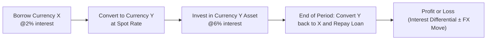

## Understanding the Concept of Carry Trades

I remember the first time a friend casually mentioned the phrase “carry trade.” I thought, “Hmm, is this about carrying something across borders?” It turned out to be a popular currency strategy that, on paper, seemed like a no-brainer: borrow money in a currency that has a low interest rate (let’s call this Currency X), convert it into a currency offering a higher interest rate (Currency Y), invest in that higher-yielding currency, and keep the difference. It sounded so straightforward that I was sure there had to be a catch. Spoiler alert: The catch is that exchange rates don’t always behave. But let’s start with the basics.

### Why Investors Love the Idea of a Carry Trade
• It seems like “free profit” if the lower-yield currency remains stable or depreciates only mildly against the higher-yield currency.  
• It exploits temporary (or sometimes more persistent) deviations in foreign exchange markets, wherein uncovered interest rate parity (UIP) may not hold over short or medium horizons.  
• In periods of low market volatility—often called a “risk-on” environment—carry trades can generate a steady stream of returns.

Of course, there’s always risk lurking. Any major swing in exchange rates can instantly flip your “nice interest differential” on its head. Let’s dig into how it all comes together.

## Rationale Behind Carry Trades

A carry trade basically hinges on the interest rate differential between two currencies. Suppose Currency A has an annual interest rate of 2% while Currency B has an annual interest rate of 6%. The straightforward approach is:

• Borrow Currency A at 2%.  
• Convert it into Currency B at the current spot rate.  
• Invest the proceeds in an instrument denominated in Currency B that yields 6%.  
• After some time—say one year—reconvert your money back to Currency A, repay the 2% interest loan, and pocket the difference (which should be about 4% in an ideal scenario).  

Well, that’s the dream scenario. The real world can get complicated if, for example, Currency B depreciates sharply against Currency A, making your re-conversion back to Currency A far more expensive and even possibly eradicating the interest differential gain. 

## Practical Mechanics and Profit Calculation

Let’s walk through a generic formula. For simplicity, we’ll consider an unhedged trade (no forward contract is used to lock in an exchange rate). Your approximate return (R) from the carry trade over one period might be expressed as:


R \approx (i_{\text{B}} - i_{\text{A}}) - \Delta s 


Where:  
• \\(i_{\text{B}}\\) is the interest rate on the currency you invest in.  
• \\(i_{\text{A}}\\) is the interest rate on the currency you borrow.  
• \\(\Delta s\\) is the percentage change (or appreciation) of the currency you must repay relative to the currency in which you invested.  

In plain words:  
• You earn \\(i_{\text{B}}\\).  
• You owe \\(i_{\text{A}}\\).  
• You might lose (or gain) from exchange rate shifts \\(\Delta s\\).  

A more precise approach might incorporate compounding and transaction costs, but the principle is the same. Some investors attempt to reduce \\(\Delta s\\) risk by using forward contracts—meaning they lock in a forward rate to convert back. If you do that, the difference in forward rates typically tries to reflect the interest rate differential (as per covered interest rate parity). That said, any expected “outperformance” is more about short-term market mispricings or assumptions about future spot rates.

## A Visual Overview

Below is a simple Mermaid diagram showing how money flows in a standard (unhedged) carry trade:

## Risks and Pitfalls

If there’s one thing that can unravel your trade in a heartbeat, it’s the exchange rate. You know, a small fluctuation can do more than eat away your profit—it can cause outright losses. For instance, if you borrow U.S. dollars at 2% to invest in some other currency that yields 6%, you might plan to earn ~4%. But if that other currency depreciates heavily against the U.S. dollar, your final conversion back to USD might cost more, effectively trashing your 4% gain (sometimes turning it into a painful loss).

### Sources of Risk
• Exchange Rate Volatility: The biggest one. During “risk-off” episodes (like a financial crisis), investors often flock back to “safe haven” currencies, making high-yield currencies plummet.  
• Shifting Interest Rates: Central bank surprises can quickly alter the interest rate differential.  
• Liquidity Risk: If positions are large, unwinding them in a stressed market can further impact exchange rates.  
• Transaction Costs: Bid–ask spreads and other fees can whittle away profits more than you’d think.

## Dew Tour with Uncovered Interest Rate Parity

Uncovered Interest Rate Parity (UIP) is the academic foundation that says: “If a country’s interest rate is higher, then on average, that currency should depreciate by roughly the difference in interest rates.” Mathematically:


\frac{E[S_{t+1}]}{S_t} \approx 1 + (i_{\text{B}} - i_{\text{A}})


Where \\(S_t\\) is the current spot exchange rate (say, domestic currency per unit of foreign currency), and \\(E[S_{t+1}]\\) is the expected future spot rate. According to UIP, no free lunch is supposed to exist: any yield advantage should be offset by a drop in the value of the higher-interest currency. Of course, real markets often defy this fully in the short run, which is where carry traders step in. The disparity between theory and reality can be profitable, but it’s not guaranteed or risk-free.

## Example Item-Set Scenario: Two Currencies, Two Interest Rates

Let’s illustrate a simplified example, reminiscent of exam-style vignettes. 

### Vignette Data
• Currency A (low-yield): Annual interest rate = 2%. Spot exchange rate: 1.500 A/USD.  
• Currency B (high-yield): Annual interest rate = 6%. Spot exchange rate: 0.750 B/USD.  
• Time horizon: 1 year.  
• You have 1 million units of Currency A.  

Let’s keep the example direct: You consider borrowing 1 million of Currency A at 2% interest. Then you convert your borrowed amount into Currency B at the cross rate. Wait, we might need a cross rate, right? Actually, if 1.500 A = 1 USD, and 0.750 B = 1 USD, we can figure out the cross rate between A and B:


\text{A per B} = \frac{\text{A per USD}}{\text{B per USD}} = \frac{1.500}{0.750} = 2.000


So 1 unit of Currency B = 2 units of Currency A. 

Having borrowed 1 million A, you can obtain \\(\frac{1,000,000}{2} = 500,000\\) units of B. Then you invest 500,000 B at 6% for one year. 

#### 1. Calculate the interest earned in B
Interest in B = \\(500,000 \times 0.06 = 30,000 \, \text{B}\\).  
So at the end of the year, you will have \\(530,000 \, \text{B}\\).

#### 2. Repay the loan
You need to repay 1 million A plus interest at 2%. That’s \\(1,000,000 \times (1 + 0.02) = 1,020,000 \text{ A}\\).  

Now the question is: what’s the exchange rate between B and A at the end of the year? That’s the big unknown. We can consider a few scenarios.

### Scenario A: No Change in the Spot
If the cross rate remains at 2.000 (one B = 2.000 A), your 530,000 B converts back to \\(530,000 \times 2.000 = 1,060,000 \text{ A}\\).  

Net profit in A = 1,060,000 A – 1,020,000 A = 40,000 A.  
On your borrowed principal of 1 million A, that’s a 4% gain.  

### Scenario B: Adverse Movement
Let’s say B depreciates by 5% relative to A, so the new cross rate is 1.900 A per B. Now your 530,000 B is worth \\(530,000 \times 1.900 = 1,007,000 \text{ A}\\). Repayment is still 1,020,000 A, so your net result is –13,000 A (a 1.3% loss).  

This is precisely the risk carry traders face: that the interest differential can be wiped out by exchange rate shifts.

## Adding Forward Rates to the Mix

If you wanted to hedge your foreign exchange exposure, you might lock in a forward rate at the inception of the trade. Then the difference between the forward rate and the spot rate should, theoretically, approximate the interest rate differential. In that scenario, your potential gain from the interest differential typically gets offset by the forward discount or premium, making “risk-free profit” vanish—this is basically covered interest rate parity in action. 

Hence, the unhedged version (try at your own risk) is where the real speculation lies—that the currency with the higher yield won’t depreciate by too much.

## Real-World Relevance: The Yen Carry Trade

A classic real-world example is the “yen carry trade.” The Bank of Japan has historically kept interest rates very low, leading global investors to borrow yen at paltry rates and invest in higher-yielding currencies (e.g., Australian dollar). For a stretch, it worked phenomenally well because the yen didn’t appreciate significantly, and the Aussie dollar soared (sometimes because of commodity booms). But, in risk-off moments, or whenever the yen rallied, the losses on these trades piled up—investors scrambled to unwind, leading to more yen buying, ironically pushing the yen even higher. This cyclical nature is why global risk appetite can strongly influence carry trade performance.

## Glossary

Carry Trade:  
A strategy in currency markets where an investor borrows funds in a currency with a low interest rate and invests in a currency offering a higher rate. The investor aims to pocket the difference in interest rates (while hoping unfavorable exchange rate moves don’t wipe out the gain).

Uncovered Interest Rate Parity (UIP):  
An economic theory suggesting that a currency with a higher interest rate should depreciate over time by roughly the interest rate differential, so there’s no free lunch from simply switching into higher-yield currencies.

Interest Rate Differential:  
The gap in interest rates between two currencies. This difference, at least initially, is the main driver of potential profit in a carry trade.

Forward Exchange Rate:  
A rate agreed upon today for an exchange that will occur at a future date. Forward rates usually embed expected interest rate differentials, thus removing or largely reducing the interest-based arbitrage possibilities if you fully hedge.

## Key Takeaways and Best Practices

• Yes, carry trades can provide nice returns, but they are far from no-risk. Sudden exchange rate swings are the main threat.  
• Pay attention to global risk sentiment, central bank policies, and market volatility, as they can quickly impact your trade.  
• Short-term optimized strategies might ignore the possibility that UIP eventually asserts itself. Over the long run, currencies often adjust to interest rate gaps.  
• Consider using partial hedges or dynamic hedges if you want to manage your foreign exchange risk; remember, the minute you fully hedge, you’re probably just capturing a near-zero or minimal net return.  
• Always factor in transaction costs, bid–ask spreads, and the not-so-obvious fees that can slowly diminish your margins.

## References and Further Reading

• CFA Institute Level II curriculum sections covering currency carry trades and interest rate parity.  
• “The Yen Carry Trade and Recent Market Turmoil,” Bank of Japan.  
• BIS (Bank for International Settlements) reports on global carry trade flows and associated risk exposures.

## Test Your Knowledge: Carry Trade Strategies and Profit Calculations



### In a typical (unhedged) carry trade, how does the investor profit?

- [x] By borrowing a low-interest currency and investing in a higher-interest currency, hoping the exchange rate remains favorable.
- [ ] By precisely matching the forward rate with the spot rate.
- [ ] By relying on currency appreciation in the low-yield currency.
- [ ] By arbitraging fixed-income instruments with zero exchange rate risk.

> **Explanation:** In a standard unhedged carry trade, you borrow in a low-rate currency and invest in a high-rate currency. The main ambition is to pocket the rate differential, provided exchange rates don’t move against you.

### Which factor most commonly undermines the success of a carry trade?

- [x] Adverse exchange rate movements.
- [ ] A negative correlation between GDP growth and inflation.
- [ ] Fractional reserve banking requirements.
- [ ] Rising commodity prices.

> **Explanation:** Although several factors can influence a carry trade, large exchange rate shifts (especially abrupt appreciation of the currency you owe) can quickly erode all the potential gains from interest differentials.

### When forward markets are in line with covered interest rate parity, what effect does that typically have on potential carry trade profits if fully hedged?

- [x] The profits tend to vanish because the forward premium or discount offsets the interest rate advantage.
- [ ] Profits increase because a fully hedged trade eliminates volatility risk.
- [ ] Profits decrease only if interest rate differentials diverge.
- [ ] Profits are unaffected; the hedge has no bearing on the currency's exchange rate.

> **Explanation:** Under covered interest rate parity, the forward currency price should factor in the interest rate differential. That effectively removes the “free lunch” potential from a carry trade if it is fully hedged.

### Which of the following best describes Uncovered Interest Rate Parity (UIP)?

- [x] An expectation that the currency with the higher interest rate will depreciate to offset its yield advantage.
- [ ] A requirement that forward contracts always match spot rates.
- [ ] A theory that currency values never adjust to interest rate differentials over time.
- [ ] A principle dictating that all central banks harmonize their rates.

> **Explanation:** UIP states that any currency offering a higher interest rate is expected to weaken in line with the differential, nullifying arbitrage in the long run.

### Suppose Currency A yields 2% and Currency B yields 6%. If you execute a one-year carry trade by borrowing in A and investing in B, which of the following is most likely to protect you from an adverse currency movement?

- [x] Entering into a forward contract that locks in the exchange rate.
- [ ] Continuing to roll over your positions daily without limit.
- [x] Utilizing options or structured products to hedge tail risk.
- [ ] Relying on central bank announcements.

> **Explanation:** A forward contract (or certain option structures) can lock in or hedge your currency exposure, preventing unexpected exchange rate moves from wiping out your interest advantage.

### What is a realistic reason that a carry trade could fail even if the currency with the higher rate stays strong for most of the year?

- [x] A sudden “risk-off” event causing investors to exit the higher-yield currency en masse, sending its value plummeting at year-end.
- [ ] A persistent tax advantage in the low-interest currency region.
- [ ] A stable yield curve environment where short-term rates remain unchanged.
- [ ] Negative correlation between inflation and unemployment.

> **Explanation:** Sudden shifts in market sentiment (e.g., “risk-off” environment) can force large numbers of traders to close their positions in the high-yield currency, drastically altering its value.

### Assume you borrow 5 million units of Currency C at 3% and convert immediately into Currency D at a spot rate of 0.500 C/D. You invest in D at 7%. At the end of one year, you have 5.35 million D, but the new exchange rate is 0.550 C/D. How do you interpret your result when converted back to Currency C?

- [x] Calculate the final C value of your D holdings and then subtract what you owe in C, including interest at 3%.
- [ ] Only look at the difference in interest rates (4%) because the exchange rate is irrelevant.
- [ ] Add your final D holdings to your original C principal for total profit.
- [ ] Rely on covered interest rate parity to see that your profit is zero.

> **Explanation:** Whenever you’re evaluating an unhedged carry trade, you must convert your final foreign-currency holdings back to your borrowed currency and repay principal plus interest in that currency.

### How does high global risk appetite generally affect carry trades?

- [x] It encourages carry trades because investors become more comfortable speculating with currency differentials.
- [ ] It forces central banks to tighten monetary policy in all regions.
- [ ] It typically pushes interest rates in high-yield currencies to converge with low-yield currencies.
- [ ] It eliminates the possibility of currency depreciation.

> **Explanation:** When investors feel confident (“risk-on”), they often seek higher-yielding assets and currencies, fueling carry trade activity. This can continue until a risk-off shock reverses sentiment.

### Which best exemplifies a break-even point in a carry trade?

- [x] The exact exchange rate move that nullifies the advantage from the interest rate differential, leaving zero net profit.
- [ ] The maximum yield difference feasible between two currencies.
- [ ] The interest-free discount rate set by central banks.
- [ ] The moment you lock in your forward contract at inception.

> **Explanation:** The break-even exchange rate move is precisely the depreciation (or appreciation) threshold at which the benefit from the interest rate gap is fully offset, resulting in no net gain.

### True or False: If carry traders expect that the currency with the higher rate will appreciate slightly over their holding period, they are effectively predicting a deviation from Uncovered Interest Rate Parity in the short run.

- [x] True
- [ ] False

> **Explanation:** UIP would imply that the higher-yielding currency should depreciate, but if traders expect it to stay stable or even appreciate, they’re assuming market reality will deviate from UIP over that term.


