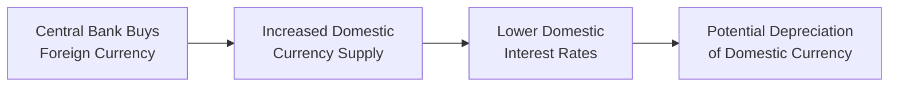

## Introduction
Central bank moves can feel elusive—one day it’s a straightforward rate announcement, and the next day you’re grappling with unexpected interventions that throw foreign exchange pairs into a frenzy. Throughout this discussion, we’ll explore the motivations behind central bank activities, examine how they impact exchange rates, and peek at real-world examples that shaped markets in dramatic ways. We’ll connect it all back to prior sections on balance of payments (BOP) accounts and currency valuation, showing why policy decisions are far more than simple announcements. After all, if you’ve ever watched your screen light up with a wild EUR/CHF or USD/JPY move, you know these interventions demand close attention.

## Why Central Banks Intervene
Central banks intervene in currency markets to achieve policy objectives—some obvious, others more subtle. For instance, you might recall from earlier sections on the balance of payments that trade imbalances, capital flows, and a nation’s economic health all tie into exchange rates. Central banks often step in to:

• Stabilize exchange rate volatility and protect export competitiveness.  
• Maintain or defend a fixed/pegged exchange rate regime against market pressures.  
• Validate monetary policy targets (e.g., interest rate corridors, inflation goals).  
• Build or deplete foreign exchange reserves to ensure a cushion of global liquidity.  

Interventions can be direct (e.g., outright buying or selling of the domestic currency) or indirect (e.g., adjusting interest rates, implementing capital controls, or launching large-scale asset purchase programs). Let’s walk through how these types of interventions typically unfold.

## Types of Interventions: Sterilized vs. Unsterilized
Two terms you’ll see repeatedly in both exam contexts and economics textbooks are “sterilized” and “unsterilized” interventions. The difference lies in whether the central bank neutralizes the impact of its forex operations on the domestic money supply.

• Sterilized Intervention: The central bank buys or sells foreign currency (thereby affecting the exchange rate) but then offsets any resulting change in the monetary base through open market operations. For example, if the Bank of Magoza sells domestic currency for U.S. dollars, it might later sell bonds (an open market operation) to remove the extra domestic currency from circulation. This move helps maintain the originally desired level of money supply and interest rates.  

• Unsterilized Intervention: The central bank lets its forex operations affect the domestic money supply. Buying foreign currency and pumping the local currency into the market expands monetary base, often lowering domestic interest rates, increasing inflation pressures (over time), and putting potential downward pressure on the exchange rate as markets perceive easier monetary conditions.

The debate about which approach is more effective can be fierce. Many argue that unsterilized interventions pack a bigger punch because they modify broader monetary conditions. Others suggest sterilized interventions can still have a signaling effect, shaping expectations even without a big liquidity change.

## Policy Rates, Quantitative Easing, and Currency Impact
Central banks sometimes don’t intervene directly in foreign exchange markets, yet their monetary policies have a profound influence on currency values. When policy rates shift—like a surprise rate hike or cut—capital flows rapidly adjust. Higher rates tend to attract foreign capital, leading to an appreciating currency, all else equal. Conversely, QE (Quantitative Easing) can flood the domestic economy with liquidity, reduce interest rates, and often lead to currency depreciation.

The magnitude of these changes hinges on market expectations. If everyone expects a certain rate hike, a central bank delivering exactly that surprise-free decision may generate little price action. Then you have more dramatic scenarios—like massive QE expansions or negative interest rate territory—that can spark large exchange rate realignments. This interplay of expectations, forward guidance, and actual policy moves is central to how the foreign exchange market interprets central bank signals.

Below is a simplified diagram showing how a central bank’s currency purchase can affect domestic liquidity and exchange rates (in an unsterilized scenario):

Here, you can see how an unsterilized operation affects the money supply (and in turn, interest rates and currency valuation). A sterilized intervention would introduce an offsetting bond sale (or other operation) to keep the money supply stable.

## Breaking the Peg: Key Examples and Lessons
Some of the most dramatic stories come when central banks try to maintain, adjust, or abandon fixed exchange rate regimes. In prior book sections, we discussed how balance of payments data can show when a currency is out of sync with economic fundamentals. If a pegged rate is too strong, foreign exchange reserves can deplete quickly (as the central bank buys domestic currency to defend the peg). When that defense is no longer sustainable, the central bank may capitulate, causing a large and sudden devaluation. Let’s look at notable examples:

• Swiss National Bank (SNB) Removing the EUR/CHF Floor (2015):  
  The SNB stunned the market by abandoning its longstanding 1.20 floor against the euro. This “floor” effectively pegged the Swiss franc at or above 1.20 CHF per EUR, intended to protect Swiss exporters from an overly strong franc. But persistent euro weakness and global risk aversion forced the SNB to buy euros in massive quantities, ballooning its balance sheet. The abrupt removal of the floor led to an instantaneous CHF spike. This example taught us that pegged or floored rates can be vulnerable to sharp corrections if the underlying fundamentals and capital flows apply relentless pressure.

• Bank of Japan (BoJ) Interventions Against Excessive Yen Strength:  
  Japan’s export-heavy economy relies on a competitive exchange rate, so the BoJ occasionally intervenes to weaken the yen if it appreciates too quickly. Sometimes these interventions are overt (the BoJ publicly announces rapid USD/JPY purchases), sometimes they’re more covert (stealth interventions to avoid immediate political or market backlash). Either way, the market learns to spot large, abrupt bursts in the USD/JPY exchange rate on heavy volumes. The effectiveness depends on broader macro conditions—like global risk sentiment—so repeated interventions can be modestly successful for short-term currency alignment but rarely shift the long-term trend.

• Emerging-Market Central Banks During Crises:  
  In emerging-market countries, defending a currency peg or a specific exchange rate corridor can be especially tricky if foreign reserves are limited. For instance, central banks in places like Argentina or Turkey have, at times, burned through foreign currency reserves trying to prop up their domestic currencies. When reserves run low, or capital flight accelerates, the pegged currency often faces a forced devaluation—or the central bank might impose capital controls to stem the outflow. These episodes highlight how quickly investor confidence can collapse if the peg is viewed as untenable.

## Verbal vs. Direct Intervention
Not all interventions come with the central bank physically buying or selling currency. “Verbal intervention” means officials attempt to influence the market through policy statements, press releases, or carefully worded hints. It might sound intangible, but in a market dominated by expectations, a central banker’s statements can move exchange rates in ways that can rival direct intervention.

For example, governments or central banks might publicly declare, “We find recent currency movements disorderly and will not tolerate excessive volatility.” That can signal imminent direct intervention. In some cases, the mere threat stabilizes a currency if traders believe the central bank has both the intention and the resources to act. But if traders suspect the central bank is bluffing or powerless, the currency may push even harder in the “forbidden” direction.

## Market Reaction and Why It Varies
Market participants are not robots—they weigh the credibility of the central bank, the depth of foreign reserves, the direction of monetary policy, and global risk sentiment. Here are a few factors influencing how the market responds:

• Credibility: If a central bank consistently delivers on its verbal and direct intervention threats, markets may be more inclined to align with the central bank’s stated target or range.  
• Global Risk Sentiment: In times of panic, even robust interventions can struggle to halt a major flight to safety if investors are determined to exit riskier currencies.  
• Policy Alignment: If intervention runs contrary to domestic monetary policy trends, the market might see it as unsustainable (e.g., trying to push the currency stronger while also cutting interest rates).  
• Reserves Adequacy: This is especially relevant for emerging markets. An intervention can fail if the market believes foreign reserves will eventually run out.

## Practical Vignette Applications
On the CFA exam, you may encounter item-set vignettes describing a fictional central bank announcing a policy change—perhaps a policy rate tweak or an impending QE program—alongside data on foreign exchange reserves, inflation, trade balances, or capital flows. You’d need to integrate these details to predict the currency’s likely reaction and consider whether the intervention is sterilized or not. For example:

• A central bank with high inflation but limited reserves might raise interest rates to defend the currency, yet the market might question whether reserves are sufficient to maintain that policy if capital outflows are large.  
• A central bank might announce a new QE program, sending bond yields lower, driving out capital inflows, and potentially weakening the currency.  
• Alternatively, a stealth intervention can show up in a data snippet indicating a large drop in official foreign reserves, prompting you to infer that the central bank was selling foreign currency to prop up the local currency.

Always look for logic and consistency. If a central bank claims to be defending a peg but official data reveals massive declines in reserves plus ballooning inflation, you may sense the peg is unsustainable.

## Common Pitfalls and Challenges
• Oversimplifying: Many candidates assume a direct relationship between “central bank buys domestic currency → currency stronger.” Remember to check if it’s sterilized or not. Also, watch those expectations.  
• Ignoring Credibility: A powerless or less-credible central bank threatens intervention but doesn’t garner market respect—particularly in times of crisis.  
• Confusing Policy Rate Goals with Actual Outcomes: Sometimes a rate hike meant to strengthen a currency might ironically weaken it if the hike signals desperation or if the economy is too fragile.  
• Underestimating Volatility: Breaking a peg or announcing an unexpected policy shift can lead to price gaps, not just smooth transitions.

## Putting It All Together for the Exam
Central bank actions can appear in any number of item-set scenarios, blending in concepts from interest rate parity, purchasing power parity, or the balance of payments (as discussed earlier in this volume). You’ll want to practice reading multi-paragraph vignettes, underlining data about reserves, inflation, policy rates, and macro conditions. Then think through how the action (or threat of action) ties to currency demand or supply.

Remember, the exam loves to test your ability to interpret all these puzzle pieces in a time-pressured environment. Keep your notes on sterilized vs. unsterilized interventions handy, track whether the central bank is defending a peg, and watch how capital flows might respond. 

## References and Further Reading
• Bank of England, “Central Bank Intervention and Exchange Rate Policy.”  
• BIS Papers: Collections of case studies on central bank interventions worldwide.  
• IMF Working Papers on the effectiveness of sterilized currency interventions.  

Below, we’ll provide some practice questions. They’re not exhaustive (there’s so much more that could be tested!), but they’re designed to capture a range of angles the exam might cover.

## Practice Questions: Central Bank Actions and Exchange Rates



### A Central Bank’s Surprise Policy Announcement

A central bank unexpectedly lowers its policy rate while holding a substantial amount of foreign currency reserves. The official statement indicates the central bank intends to keep the domestic currency from weakening too much by intervening directly if necessary. Based on the information:

- [ ] The currency should appreciate because the central bank can reduce money supply at will.
- [ ] The currency should remain unchanged as policy rates do not matter when FX reserves are large.
- [x] The currency may still weaken due to the rate cut, but large reserves could moderate the depreciation.
- [ ] The currency is guaranteed to strengthen because the central bank has pledged intervention.

> **Explanation:** A policy rate cut typically lowers the attractiveness of holding the domestic currency. Even with substantial foreign reserves, the bank’s intervention may slow but not fully prevent depreciation if market forces are strong.

### Sterilized vs. Unsterilized Action

Which best describes a sterilized FX intervention by a central bank?

- [ ] The central bank changes policy rates to offset inflationary pressures from intervention.  
- [x] The central bank conducts open market operations to offset any effect on domestic money supply.  
- [ ] The central bank imposes capital controls to regulate forex transactions.  
- [ ] The central bank directly sells foreign currency without any secondary market transactions.

> **Explanation:** Sterilized interventions involve offsetting the money supply impact (e.g., via open market bond operations). Policy rates may change indirectly, but the hallmark is neutralizing the liquidity effect.

### Swiss National Bank Example

In 2015, the Swiss National Bank (SNB) removed the EUR/CHF floor. Which of the following outcomes was most immediate?

- [x] The Swiss franc appreciated sharply as traders unwound positions betting against the franc.  
- [ ] The Swiss franc depreciated sharply due to reduced intervention by the SNB.  
- [ ] The euro appreciated sharply due to increased trade flows from Switzerland.  
- [ ] The euro depreciated slowly due to sterilized interventions by the SNB.

> **Explanation:** Removing the floor caused the CHF to surge instantly, as the SNB no longer defended the 1.20 level against the euro. 

### Verbal vs. Direct Intervention

A central bank governor states in a press conference that the domestic currency is “overvalued” and that they are willing to take “all necessary actions.” However, no official currency trades or open market operations follow. This scenario most closely illustrates:

- [x] Verbal intervention with a potential signaling effect.  
- [ ] Direct intervention, as the bank is actively buying foreign currency.  
- [ ] Sterilized intervention, as it neutralizes broader monetary conditions.  
- [ ] Unsterilized intervention due to the explicit threat.

> **Explanation:** The bank used words rather than direct market operations, hoping to shape market sentiment and expectations without immediate action.

### Emerging-Market Defense of a Peg

An emerging-market central bank tries to maintain a peg to the dollar. Reserves are declining as it sells dollars to buy its domestic currency. Which of the following best describes the risk?

- [ ] The peg will hold indefinitely due to strong local exports.  
- [ ] The currency will appreciate because the central bank has unlimited resources.  
- [x] The peg may break if reserves deplete and capital outflows persist.  
- [ ] The central bank can raise interest rates without affecting growth.

> **Explanation:** Low reserves make defending a peg difficult, and continued outflows can force the central bank to abandon the peg if it can no longer supply enough foreign currency.

### Impact of Quantitative Easing on Currency

A central bank announces a new QE program to purchase long-term government bonds. Which outcome is most likely?

- [ ] Domestic interest rates rise substantially, attracting foreign capital.  
- [x] The currency depreciates because of increased liquidity and lower yields.  
- [ ] The currency appreciates because the money supply shrinks.  
- [ ] The currency remains unchanged as bond purchases do not affect exchange rates.

> **Explanation:** Expanding the money supply and lowering rates generally weakens a currency relative to others with higher yields.

### Sterilization Tactics

When a central bank buys foreign currency to weaken the domestic currency but simultaneously sells government bonds to neutralize the effect on the money supply, this is an example of:

- [x] Sterilized intervention.  
- [ ] Unsterilized intervention.  
- [ ] Fiscal policy.  
- [ ] Covert intervention.

> **Explanation:** Sterilized intervention counteracts the liquidity impact so that monetary conditions remain largely unchanged, yet the currency may still be influenced via signaling or portfolio effects.

### Credibility and Intervention Outcomes

A central bank announces that it will “do whatever it takes” to prevent further currency depreciation but holds minimal forex reserves. Markets doubt the bank’s ability to follow through. Which outcome is most likely?

- [ ] Instant and permanent appreciation of the currency.  
- [ ] Gradual strengthening once the direct intervention begins.  
- [x] Continued depreciation as traders question the central bank’s capacity to intervene.  
- [ ] Balanced stability due to the strong verbal commitment.

> **Explanation:** Without substantial reserves or credibility, a verbal commitment may fail to sway the market if participants expect the bank to run out of resources quickly.

### Rate Hikes and Perceived Desperation

A small country’s central bank raises interest rates sharply to defend its currency during a crisis, but inflation is already high and capital outflows persist. Which scenario might unfold?

- [ ] The currency automatically stabilizes because higher rates attract new capital.  
- [ ] The currency appreciates indefinitely due to strong real returns.  
- [x] The currency may weaken if the market interprets the hike as desperation, and outflows continue.  
- [ ] The peg is protected by default since interest rates support the currency.

> **Explanation:** A desperate rate hike, especially in an environment of high inflation and fear, may fail to attract enough foreign capital. Investors may see this signal as panic rather than confidence.

### True/False on Covert Interventions

Covert or “stealth” interventions can occur without immediate official announcements, relying on sudden and unexplained trading volume to influence exchange rates.

- [x] True  
- [ ] False  

> **Explanation:** Covert interventions happen when a central bank quietly buys or sells its currency, often through third parties, to avoid drawing attention. 



---

Exam Tip: In item-set problems, keep an eye on the details—whether the central bank is committed to a peg, the adequacy of reserves, sterilization tactics, and any conflict between monetary policy direction and intervention. Evaluate short-term vs. long-term feasibility of interventions and be mindful of how credible those interventions might appear under intense market scrutiny. Understanding these nuances helps you parse complex vignettes and select the best answer under exam pressure.
