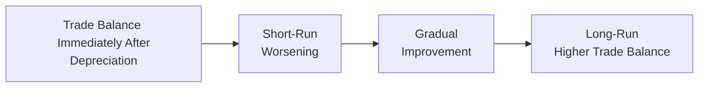

## Introduction
It’s easy to get so wrapped up in daily currency swings that we forget the underlying economic forces driving them over the long term. I remember once poring over a developing country’s trade data, hoping to figure out whether a sudden devaluation would really help its massive current account deficit. That’s exactly where the Marshall-Lerner condition, the J-Curve effect, and the twin deficits hypothesis come in handy. These tools explain why a currency depreciation might not deliver the immediate trade improvements we’d guess, and how government deficits could actually worsen external imbalances.

This section takes a deep dive into these three concepts, each offering a unique vantage point on global trade and fiscal dynamics. In previous sections (particularly in 4.2 Trade Balance, Capital Flows, and Exchange Rate Impacts), we talked about the broad interplay between exchange rates and trade. Now, let’s explore how specific conditions, time lags, and government borrowing can shape currency movements and trade balances.

## The Marshall-Lerner Condition
The Marshall-Lerner condition states that a currency depreciation will improve a country’s trade balance if (and only if) the absolute sum of the price elasticities of the country’s exports and imports exceeds 1. Put another way, if people significantly reduce their imports and simultaneously buy a lot more of the country’s exports when the currency weakens, then net exports will improve.

You might be wondering: why does elasticity matter so much? Well, if consumers at home and abroad hardly respond to price changes, a depreciation may just make imports more expensive without boosting export volumes enough to offset higher import costs. 

### Key Insight
If we let:
• ε_x be the price elasticity of demand for exports (i.e., how sensitive foreign buyers are to a change in the price of these exports),  
• ε_m be the price elasticity of demand for imports (i.e., how sensitive domestic consumers are to a change in the price of imports),  

then the Marshall-Lerner condition proposes:

| ε_x | + | ε_m | > 1

in order for a depreciation to lead to a net improvement in the trade balance. This condition typically applies in the medium to long run, because it can take a while for importers and exporters to find alternative suppliers or markets.

### A Quick Example
Imagine a country, call it Exportia, with these elasticity estimates:  
• ε_x = –0.6 for exports (the minus sign indicates that demand for exports increases when prices go down),  
• ε_m = –0.7 for imports.

Sum of absolute elasticities = 0.6 + 0.7 = 1.3, which is greater than 1. 
So, according to the Marshall-Lerner condition, Exportia’s currency depreciation should eventually lead to an improved trade balance—at least in theory.

But watch out: major short-term constraints (like supply chain rigidities, contractual obligations, or even consumer/investor biases) can mean that the improvement only appears several months (or even years) down the line. That’s where the J-Curve enters the story.

## The J-Curve Effect
Even if the Marshall-Lerner condition states that your country should benefit from a depreciation, the trade balance might initially worsen after the currency weakens. This dynamic is captured by the J-Curve effect. In the immediate term, contracts are usually locked in, and both domestic and foreign buyers continue purchasing at older (possibly higher) prices or with minimal quantity changes. So the country’s import bill might go up right away, while export volumes haven’t yet increased to offset it.

### How the “J” Takes Shape
1. Initial Worsening Phase:  
   Right after depreciation, your imported inputs are suddenly more expensive. Meanwhile, export orders may not ramp up fast enough to offset the cost. The trade balance dips even though you’d expect it to rise.  
2. Gradual Adjustment:  
   Over time, foreign buyers see cheaper prices for your country’s exports and ramp up purchases. Domestic consumers look for cheaper local substitutes, reducing their reliance on expensive imports.  
3. Long-Run Improvement:  
   Finally, the trade balance begins to climb, forming the upward stroke of the letter “J.”

Below is a conceptual mermaid diagram that visualizes the J-Curve timeline:

In the short run, import quantities may not decline enough, but as time goes on and new contracts reflect cheaper exports, trade volumes can improve. That’s the shape we call the J-Curve.

## Twin Deficits Hypothesis
Now, let’s look at something that sometimes feels like a scary bedtime story for currency markets: the twin deficits hypothesis. It proposes that a government budget deficit (i.e., a fiscal deficit) can lead to a current account deficit. The argument is that when a government runs a big fiscal deficit, it borrows more, pulling in capital flows that tend to appreciate the currency. A stronger currency, in turn, suppresses exports and encourages imports, fueling a current account deficit.

### Real-World Nuances
• Not a Universal Rule: Some economies run fiscal deficits without developing large current account deficits. A range of factors, including domestic savings rates, global investor sentiment, and central bank actions, come into play.  
• Timing: The effect of a fiscal deficit might be felt most strongly when foreign investors brace themselves for big government bond issuances or changes in interest rate policy.  
• Other Channels: Government deficits may be financed domestically, reducing the need for foreign capital and thus altering the currency implications.

In any case, the twin deficits hypothesis is a powerful lens through which to interpret the interplay between public finances and external balances. In Chapter 14 (Sovereign Debt and Fiscal Dynamics), we look more closely at sovereign credit ratings and default risk, which can also shape or disrupt the twin deficits pattern.

## Integrating the Three Tools
The Marshall-Lerner condition, the J-Curve effect, and the twin deficits hypothesis each shed light on different aspects of currency movements and trade balances:

• Marshall-Lerner Condition: Focuses on long-run price elasticity.  
• J-Curve Effect: Explains short-run trade balance dynamics.  
• Twin Deficits Hypothesis: Connects government borrowing to exchange rate and current account outcomes.

Together, they remind us that every currency event—like a surprise depreciation—has distinct phases and wide-reaching ramifications.

## Numerical Illustration: Vignette-Style Example
Imagine a fictional country, Riverland, that has just announced a 15% devaluation of its currency to boost export competitiveness and reduce a persistent current account deficit. You’re analyzing the situation from an investment standpoint:

1. Riverland’s exports have a price elasticity of 0.8 (|ε_x| = 0.8), and its imports have an elasticity of 0.6 (|ε_m| = 0.6).  
2. The government’s new budget shows a deficit of 6% of GDP, up from 3% last year.

### Immediate Observations
• The sum of export and import elasticities is 1.4, which is > 1. The Marshall-Lerner condition suggests that, over time, Riverland’s trade balance should improve.  
• However, in the next few months, the trade deficit could actually expand due to immediate higher import costs and slow export-contract adjustments (the hallmark of the J-Curve).  
• Meanwhile, Riverland’s larger government deficit might create fresh demand for its bonds, strengthening its currency from capital inflows—potentially offsetting part of that initial trade balance benefit. If foreign capital is truly abundant, the currency may not remain depreciated for long.

This mini-scenario encapsulates how these three concepts work in unison. In an exam setting, you may face item-set questions testing your understanding of each factor’s timing, magnitude, and net effect.

## Common Pitfalls and Best Practices
• Neglecting Time Lags: Even if the conditions for a trade balance improvement exist, ignoring the time it takes for contracts and consumption patterns to adjust can lead to incorrect conclusions.  
• Confusing Elasticities: Students often forget to take absolute values or misinterpret negative signs. Keep track of the sign conventions carefully.  
• Oversimplifying Twin Deficits: It’s tempting to assume a one-to-one link between budget and current account deficits, but factors like global capital markets, private investment rates, or monetary policy can foil that linkage.  
• Focusing Only on Price Effects: Remember that quality, taste, product differentiation, and availability also affect export/import volumes, complicating pure elasticity-based forecasts.

## Conclusion
Trading relationships are multifaceted. The Marshall-Lerner condition tells us whether a currency depreciation eventually helps the trade balance, while the J-Curve warns us about the short-run dip. And the twin deficits hypothesis pushes us to consider how government borrowing might realign exchange rates and current account balances in tricky ways.

Staying alert to these concepts—and calmly applying them—can make all the difference, especially under exam pressure. In practice, central banks, multinational corporations, and hedge funds all watch these dynamics, informing decisions about hedging strategies, investment flows, and currency exposure. 

## Glossary
• Marshall-Lerner Condition: The condition stating that a currency depreciation improves a country’s trade balance if the sum of the absolute price elasticities of exports and imports exceeds one.  
• J-Curve: The pattern where a country’s trade balance dips in the short run following a currency depreciation before eventually improving.  
• Twin Deficits Hypothesis: Proposes that a persistent government budget deficit can combine with a current account deficit, as fiscal shortfalls potentially lead to capital inflows and a strengthening currency that undermines export competitiveness.  
• Elasticity of Demand: Measures how much consumer demand changes in response to a change in price (or exchange rate), commonly considered in absolute value for trade models.

## References and Further Reading
• Krugman, Paul, and Obstfeld, Maurice. International Economics: Theory and Policy.  
• Journal of Policy Modeling. Various empirical research articles on the twin deficits phenomenon.  
• OECD Economic Outlook. Contains contemporary and historical data illustrating trade balance adjustments and the interplay with government budget deficits.

--------------------------------------------------------------------------------

## Test Your Mastery of Marshall-Lerner, J-Curve, and Twin Deficits



### A country’s sum of the absolute price elasticities for exports and imports is 0.8. According to the Marshall-Lerner condition, what is the likely effect of a currency depreciation on the country’s trade balance?

- [ ] The trade balance will definitely improve over time.  
- [x] The trade balance is likely to worsen, since the sum is below 1.  
- [ ] The trade balance will improve only in the short run.  
- [ ] The trade balance remains unchanged by the currency move.  

> **Explanation:** Because the sum of the absolute elasticities is below 1, the depreciation will probably not improve the country’s trade balance in the long run.

### Which of the following best explains the J-Curve effect?

- [ ] A country’s trade balance immediately improves after depreciation due to higher export volumes.  
- [x] A country’s trade balance initially worsens before improving as export and import volumes adjust over time.  
- [ ] A country’s trade balance remains unaffected because of negligible price elasticity.  
- [ ] A country’s trade balance only improves if the government runs a budget surplus.  

> **Explanation:** The J-Curve describes how the trade balance initially deteriorates following a currency depreciation due to short-term contracts and inertia, then eventually recovers and improves.

### If a government expands its budget deficit significantly, resulting in higher interest rates that attract foreign capital, which outcome is most likely under the twin deficits hypothesis?

- [ ] The currency weakens, increasing exports.  
- [ ] The current account surplus expands, offsetting the budget deficit.  
- [x] The currency appreciates, potentially causing a current account deficit.  
- [ ] The Marshall-Lerner condition ceases to apply.  

> **Explanation:** Higher interest rates and robust foreign capital inflows typically appreciate the currency, which makes exports more expensive abroad and can lead to a current account deficit, consistent with the twin deficits hypothesis.

### In the context of the Marshall-Lerner condition, which of the following is TRUE?

- [ ] The price elasticity of exports can safely be ignored in long-run analysis.  
- [x] The improvement in trade balance due to depreciation hinges on sufficient responsiveness of both import and export demand.  
- [ ] Short-run supply constraints are irrelevant when evaluating currency moves.  
- [ ] If the trade balance worsens, it violates the Marshall-Lerner condition.  

> **Explanation:** The condition highlights that both export and import demand must be sufficiently elastic in the aggregate (sum > 1) for a depreciation to improve the trade balance.

### Which statement best captures the main reason behind an initial worsening of a country’s current account following a sharp currency depreciation?

- [ ] Immediate reduction in domestic consumption of imported goods.  
- [ ] Rapid expansion of export volumes.  
- [ ] Sudden price elasticity changes in the short run.  
- [x] Contractual obligations and price stickiness delay volume adjustments.  

> **Explanation:** Existing purchase contracts and habit persistence mean import volumes often do not decline right away, contributing to a short-run decline in the current account.

### A country with a large budget deficit is experiencing stable demand for its exports. According to the twin deficits hypothesis, which factor could most directly lead to a worsening of its current account?

- [x] Foreign capital inflows appreciating the currency.  
- [ ] Rising inflation that lowers real interest rates.  
- [ ] A strict adherence to fixed exchange rates.  
- [ ] Zero import elasticity of demand.  

> **Explanation:** The basic channel of the twin deficits hypothesis is that large budget deficits invite foreign capital inflows, which often strengthen the currency and can push the current account toward deficit.

### Assuming a currency depreciation takes hold, but data show import volumes are unchanged while export volumes grow slowly. Which effect might best explain this pattern?

- [x] The short-run phase of the J-Curve.  
- [ ] The Marshall-Lerner condition is fully satisfied.  
- [ ] The twin deficits phenomenon.  
- [ ] Central bank contractionary policy.  

> **Explanation:** This is typical of the J-Curve’s initial phase: import quantities remain the same or do not adjust quickly, while export growth is gradual.

### If a country’s trade deficit continues to worsen even after a currency depreciation, which of the following reasons might be the MOST plausible?

- [ ] Low import elasticity but high export elasticity.  
- [ ] Overestimation of twin deficits.  
- [ ] Extremely high interest rates that depressed the currency.  
- [x] The sum of export and import elasticities is less than 1.  

> **Explanation:** When the sum of export and import elasticities is below 1, depreciation fails to produce the desired improvement in trade balance in the longer term.

### Which best captures the relationship between long-run and short-run trade balance analysis under currency depreciation?

- [ ] The short run always mirrors long-run outcomes.  
- [ ] Long-run effects are purely determined by government budget deficits.  
- [x] The J-Curve explains the short-run deteriorations that may eventually revert to long-run improvements if Marshall-Lerner holds.  
- [ ] Twin deficits have no place in analyzing changes to the trade balance.  

> **Explanation:** The short run is governed by the J-Curve explanation, while the longer run typically aligns with the broader elasticity framework in the Marshall-Lerner condition—provided the sum of elasticities is sufficient.

### If a government budget deficit increases interest rates and the capital account surplus grows, the currency is likely to:

- [x] Appreciate, hurting exports.  
- [ ] Depreciate, improving current account.  
- [ ] Depreciate, hurting current account.  
- [ ] Remain fixed by central bank mandate.  

> **Explanation:** Higher interest rates and rising capital account inflows generally strengthen the currency, making exports more expensive to foreigners and potentially worsening the current account.


