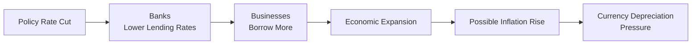

## Overview

Monetary policy influences the economy by shaping interest rates, liquidity conditions, and overall financial market sentiment. Changes in monetary policy can send traders and investors on a roller coaster ride as they try to figure out if a currency will end up stronger or weaker. At the CFA Level II level, we need to dig deeper into how monetary policy actions—such as adjusting policy rates and employing strategies like quantitative easing (QE)—impact currency valuations. 

We’ll walk through some core mechanisms, highlight real-life examples, and show how concepts like interest rate parity tie it all together. And, you know, I still remember being shocked when I first saw how quickly exchange rates could gyrate right after a surprise central bank announcement. It was eye-opening to realize these moves can come from just a few words in a policy statement.

## Interest Rate Transmission Mechanism

Central banks typically set a key policy rate, like the federal funds rate in the United States or the refinancing rate in the Eurozone. These rates serve as anchors for short-term interest rates in money markets, influencing borrowing costs for banks. Those costs, in turn, trickle through to individuals and companies.

When interest rates change, local bonds become more or less attractive to foreign investors. If a central bank raises rates significantly, overseas investors might rush in to buy domestic fixed-income securities—especially if they see an interest rate differential that beats what they can get at home. That inflow of capital can lead to currency appreciation. On the flip side, if rates go down, you might see capital flight, weakening the currency.

Here is a simple diagram illustrating one version of this transmission mechanism:

Note: This diagram is just one path; it’s not the only possible outcome. In reality, higher growth could also attract investments that lead to currency appreciation. But you get the idea—monetary policy can shape currency values through multiple channels, from capital flows to inflation expectations.

### Linking to Covered and Uncovered Interest Parity

Back in Chapter 3, we tackled covered and uncovered interest rate parity. Changes in policy rates effectively change the domestic interest rate (idomestic) and thus alter the forward exchange rate or shape expectations of future spot rates. In uncovered interest parity, for example, if the domestic rate goes up, market participants might expect the domestic currency to appreciate (or depreciate less quickly) to maintain parity over time. 

Mathematically, recall the covered interest rate parity condition:


F_{\text{domestic/foreign}} = S_{\text{domestic/foreign}} \times \frac{1 + i_{\text{domestic}}}{1 + i_{\text{foreign}}}.


Where:  
• F is the forward exchange rate (domestic/foreign).  
• S is the spot exchange rate.  
• idomestic and iforeign are the respective interest rates in each currency’s home market.

Changes in idomestic from monetary policy cause F to adjust accordingly if markets are efficient and arbitrage is possible.

## QE and Currency Movements

Quantitative easing (QE) is an “unconventional” policy tool, usually deployed when short-term rates are already near zero (or negative!), and further cuts might not be feasible. Central banks—like the Federal Reserve, the European Central Bank (ECB), or the Bank of Japan—purchase longer-term securities (government bonds or even corporate bonds) to inject liquidity into the financial system.

### QE and Depreciation?

Plenty of analysts argue that QE weakens a currency. This reasoning goes: by expanding the money supply and suppressing yields, QE reduces the relative attractiveness of domestic assets. Investors who chase higher yields abroad might move their money overseas, exerting downward pressure on the exchange rate.

### QE and Appreciation?

On the other hand, QE could be a signal that policymakers are determined to revive economic growth. If the bond-buying program effectively lifts confidence, spurs corporate profits, and speeds economic recovery, foreign investors might say, “Hey, that economy is back on track!” Then capital flows in, ironically pushing up the currency.

Reality often sits somewhere in between. Timing is crucial—markets can react unpredictably if QE is rolled out along with forward guidance or if other macro factors (like inflation or GDP growth) dominate the headlines.

## Inflation Targets and Monetary Policy

Many central banks nowadays operate under an explicit inflation-targeting framework—often around 2%. The idea is to keep inflation stabilized near a specified rate. If inflation is projected to go above target, central banks may hike rates. If it’s below the target (and growth is soft), they might cut rates or do something unconventional (like QE).

Market participants pay close attention to changes in inflation data:  
• If inflation overshoots, it might prompt a more aggressive monetary tightening (which often strengthens the currency).  
• If it undershoots, you might see looser policy or additional bond purchases (which could weaken the currency).

Examples include the Bank of England (BOE) and the Reserve Bank of Australia (RBA), both of which publicly aim for around 2%–3% inflation. When their economies stray from that path, the market prices in currency movements based on expected rate changes.

## The Taylor Rule

So how do central banks decide on what their policy rate “should” be? A commonly cited guideline is the Taylor Rule, which suggests a formula:


i_t = r^* + \pi_t + a (\pi_t - \pi^*) + b (y_t - y_{\text{pot}}),


where:  
• it is the policy interest rate.  
• r* is the “neutral” real interest rate (an estimate of the natural rate in a balanced economy).  
• πt is current inflation.  
• π* is the targeted inflation rate.  
• (πt – π*) captures the inflation gap.  
• (yt – ypot) is the output gap (the difference between actual GDP and potential GDP).  
• a and b are parameters indicating how aggressively the bank responds to deviations from targets.

Market participants try to anticipate central banks’ next moves by calculating a version of this rule. A big mismatch between official rates and a “Taylor Rule” estimate can lead traders to speculate on imminent rate hikes or cuts. If you recall that interest rate differentials drive exchange rates, you can see the immediate currency play: a hawkish Taylor Rule reading might support an appreciation, whereas a dovish reading might send the currency south.

## Monetary Policy Signaling and Market Expectations

Central bankers learned that it’s not just about what they do but also about what they say. Forward guidance is the practice of signaling likely future policy moves. The Federal Reserve, for instance, might say “We expect to hold rates at near-zero levels until inflation persistently exceeds 2%.” This shapes investor expectations for long-term interest rates.

When guidance changes—say, the central bank hints at earlier or more rapid rate hikes—the currency can forecastably appreciate. And if they back off from hawkish rhetoric, the currency might weaken. 

Let’s face it: Sometimes the biggest currency swings happen not because of an actual rate change but because a central banker used a particular phrase like “additional measures” or “sustained period.” If that phrase suggests a policy pivot, markets can revalue the currency in minutes.

## Spillover Effects and Global Liquidity

Major central banks (e.g., the US Federal Reserve, the European Central Bank, Bank of Japan) are so large that their decisions ripple through global markets. If the Fed tightens aggressively, emerging markets that rely on dollar funding could experience capital outflows, pressuring their currencies. In times of looser US policy, capital can rush into higher-yielding emerging-currency investments, fueling carry trades.

Carry trades thrive when interest rate differentials are large and currency volatility is subdued. However, as soon as a central bank signals a big shift, those trades can come undone in dramatic “unwind” events. Emerging market currencies can plummet if traders scramble to exit positions. You may recall real-life episodes when Latin American, Eastern European, or Asian currencies got hammered after a seemingly mild tweak in Fed guidance.

## Macroeconomic Indicators Driving Central Bank Policy

Of course, central banks don’t make decisions in a vacuum. They study a swath of macro indicators—GDP growth, unemployment rates, wage inflation, consumer and producer price indexes (CPI and PPI), and so on. Their policy changes are an attempt to keep the economy near full employment without letting inflation run amok.

• Strong GDP growth with rising inflation might invite higher rates, potentially strengthening the currency.  
• Weak growth or falling inflation might trigger rate cuts or QE expansions, often leading to depreciation.

Traders dissect economic releases immediately upon publication. You’ve probably seen that moment—8:30 a.m. inflation data hits, and within a second or two, the currency market reacts. If the data are significantly different from forecasts, you can see major moves as traders rerun their mental models for what the central bank will do next.

## Case Studies

### Aggressive Rate Hikes (Volcker Era)

Paul Volcker, Chair of the Federal Reserve in the early 1980s, famously raised the federal funds rate to extremely high levels (at times near 20%) to crush double-digit inflation. This move attracted foreign investment into US assets, and the dollar skyrocketed in value. The policy did eventually curb inflation but at the cost of a severe recession. It’s often cited as an extreme example of how interest rate differentials can drive massive currency appreciation.

### QE in Europe and Japan

In the aftermath of the Global Financial Crisis, the ECB and the Bank of Japan pushed aggressive QE programs. The euro and yen experienced periods of marked weakness, especially as currency carry trades favored the US dollar once US rates started drifting higher. However, each round of QE had its own twists—Japan’s QE was accompanied by an explicit commitment to overshoot the 2% inflation target, while the ECB struggled with the complexities of a multi-country eurozone. Sometimes the yen or euro staged a paradoxical rally if investors believed QE indicated a robust push toward recovery.

## Linking to Interest Rate Parity

At the end of the day, monetary policy feeds directly into interest rate differentials. Forward exchange rates will reflect these expectations under covered interest parity, while spot rate movements can be analyzed through the lens of uncovered interest parity. If you suspect a central bank is headed for greater tightening than the market thinks, you might expect that currency to appreciate—leading to potential trades that must be weighed against the cost of hedging.

## Practice Exercises

Below is a simplified vignette to help you practice. Enjoy thinking it through step by step:

• The central bank of “Country A” abruptly raises its policy rate from 2% to 4% in response to unexpectedly high inflation data. The foreign rate for “Country B” remains at 1%.  
• Market participants see this as a signal that more hikes could be on the way if inflation stays persistent.  
• Traders revise their forecasts for “Country A”’s interest rates upward and expect further capital inflows.

Questions to Reflect On:  
1. How might the interest rate differential affect the forward exchange rate for A’s currency vs. B’s currency under covered interest parity?  
2. Would you expect A’s currency to appreciate or depreciate if the market believes these policy hikes will continue long term?  
3. What role might inflation targeting play if inflation in Country A remains stubbornly above target?

These are the types of item-set questions you might see on the exam. Be thorough—consider capital flows, interest parity, and even macro indicators that could change the narrative.

## Glossary

• Quantitative Easing (QE): An unconventional monetary policy in which a central bank purchases longer-term securities to increase the monetary base and encourage lending.  
• Forward Guidance: Central bank communication about future policy actions aimed at influencing market expectations.  
• Taylor Rule: A monetary policy guideline suggesting how central banks should set interest rates based on deviations of inflation and output from their respective targets.  
• Transmission Mechanism: The process through which monetary policy decisions impact the real economy—output, employment, inflation—and ultimately influence exchange rates.  
• Policy Rate: The interest rate central banks charge or target (e.g., the federal funds rate in the US) to influence the cost of lending and overall liquidity in the financial system.  
• Interest Rate Differential: The gap between two countries’ interest rates, often used to forecast potential currency appreciation or depreciation.  
• Carry Trade: An investment strategy that borrows at a relatively low interest rate and invests in assets with a higher rate.  
• Unconventional Monetary Policy: Central bank policies used when standard short-term policy rate tools become ineffective, typically in a zero-lower-bound environment.

## References and Suggested Readings

• CFA Institute Level II Curriculum, “Economics for Investment Decisions,” current edition.  
• Mishkin, Frederic S. “The Economics of Money, Banking, and Financial Markets.” 12th Edition, Pearson.  
• Federal Reserve Board: Official Monetary Policy Reports (https://www.federalreserve.gov/monetarypolicy.htm).  
• Hamilton, James D., & Wu, Jing Cynthia. “Quantitative Easing and Long-Term Interest Rates.” Journal of Money, Credit and Banking.  

## Test Your Knowledge: Monetary Policy Rate Changes and FX Movements



### A central bank raises its policy rate by 1%. What is the direct effect on the domestic currency, assuming all else remains equal?

- [x] The domestic currency tends to appreciate in the short term.
- [ ] The domestic currency tends to depreciate immediately.
- [ ] There is no effect on the currency.
- [ ] The currency must always depreciate over the long run.

> **Explanation:** Higher policy rates generally attract foreign capital, leading to short-term appreciation.

### If a central bank is engaging in quantitative easing, which of the following is most likely in the short run?

- [ ] An immediate increase in short-term rates.
- [x] Expansion of the monetary base.
- [ ] A guaranteed currency appreciation.
- [ ] A contraction in money supply.

> **Explanation:** QE expands the monetary base by purchasing longer-term securities.

### How does forward guidance typically influence currency markets?

- [x] It shapes expectations about future interest rates, thereby affecting currency valuations.
- [ ] It directly decreases interest rates for corporations.
- [ ] It replaces the need for market-based interest rates.
- [ ] It only influences bond markets, not currency markets.

> **Explanation:** Forward guidance influences investor expectations about future rate paths, affecting capital flows and currency values.

### According to the Taylor Rule, if inflation is above target and output is above potential, the recommended policy rate would likely:

- [ ] Decrease.
- [ ] Remain unchanged.
- [x] Increase.
- [ ] Go to zero.

> **Explanation:** The Taylor Rule prescribes higher rates if inflation exceeds the target and the economy is producing above potential.

### Which statement best describes covered interest rate parity?

- [x] It states that forward exchange rates adjust to reflect interest rate differentials.
- [ ] It states that central banks can freely set forward exchange rates.
- [ ] It implies that capital flows are irrelevant in determining exchange rates.
- [ ] It only applies when real interest rates are zero.

> **Explanation:** Covered interest rate parity holds that forward exchange rates move in line with interest rate differentials, preventing arbitrage.

### In an environment where inflation is below target, a central bank might:

- [x] Cut interest rates or expand QE measures.
- [ ] Raise interest rates.
- [ ] Halt all policies.
- [ ] Increase capital gains taxes.

> **Explanation:** Sub-target inflation often compels central banks to ease policy.

### What typically happens to emerging market currencies in a carry trade unwind scenario?

- [ ] They appreciate as investors buy them up for safety.
- [x] They depreciate due to rapid capital outflows.
- [ ] They remain completely stable.
- [ ] They decouple from global interest rate movements.

> **Explanation:** A carry trade unwind generally involves investors pulling out of higher-yielding assets, pushing those currencies down.

### What is the rationale behind a central bank purchasing large quantities of government securities in QE?

- [ ] To increase default risk.
- [ ] To force the economy to contract.
- [ ] To lock money away.
- [x] To inject liquidity into the financial system.

> **Explanation:** The main goal of QE is to inject liquidity and push down long-term rates.

### In the context of monetary policy signaling, a “dovish” statement means:

- [ ] The central bank intends to raise interest rates imminently.
- [ ] The central bank is focused on fighting inflation aggressively.
- [x] The central bank leans toward cutting rates or easing policy.
- [ ] The central bank wants to maintain or increase the strength of the currency.

> **Explanation:** “Dovish” tone signals more accommodative or expansionary measures.

### The ECB announces a surprise hike in its key refinancing rate. True or False: we would typically expect the euro to strengthen immediately, ceteris paribus.

- [x] True
- [ ] False

> **Explanation:** A surprise rate hike often leads to currency appreciation as investors see higher returns in that currency.


