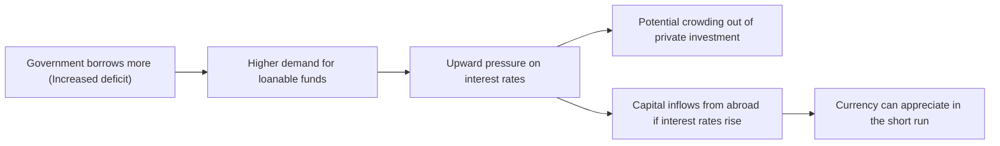

## Introduction
Have you ever watched the news and thought, “So the government’s increasing spending again—what’s that going to do to the currency?” Yeah, me too. It’s not always obvious at first glance. In fact, fiscal policy—through government spending and taxation—can shape currency values in ways that sometimes feel contradictory. This chapter explores those links in depth, moving beyond the more general coverage of Monetary Policy you might remember from Section 5.1. We’ll look at how expansionary policies might boost economic activity, how hefty deficits sometimes lead to higher interest rates, and why the overall effect on a currency isn’t always straightforward. Everything here is essential for the CFA® 2025 Level II exam, especially once you start seeing vignettes that blend fiscal announcements with interest rate and exchange rate data.

Remember, this section ties closely to the broader discussion of exchange rates, growth, and global macroeconomic interactions. We’ll walk step by step, weigh the theory, use real-world examples, and give you glimpses of item-set style questions. By the end, you’ll have a solid feel for how fiscal decisions ripple through markets—and how to think quickly on your feet when you come across them in an exam vignette.

## Government Spending, Taxation, and Budget Deficits
Fiscal policy essentially means the government pulling levers involving spending (G) and taxation (T). When G > T, there’s a budget deficit that must be financed by issuing debt (sovereign bonds) or other means. The interesting part is how changes to G and T can affect currency values:

- Expansionary fiscal policy (increases in government spending or tax cuts):  
  • Stimulates aggregate demand, boosting economic growth in the short run.  
  • Might create inflationary pressures if the economy is already near full capacity, which can, ironically, weaken the currency in the medium to long run.  
  • Could also strengthen the currency if markets are convinced that stronger growth will attract foreign capital.  

- Contractionary fiscal policy (reduced spending or higher taxes):  
  • Aims to slow down an overheating economy, helping stabilize prices.  
  • May reassure investors about public debt levels, sometimes causing currency appreciation if risk perceptions improve.  
  • Might dampen growth, which can be negative for currency prospects if the economic slowdown is too severe.

It’s all about investor sentiment and those tricky future expectations. “Confidence” is a word you’ll hear a lot: if markets believe expansionary stimulus will increase productivity and not skyrocket debt, people might gravitate to that currency. If they’re worried about inflation or ballooning deficits leading to a messy default scenario, well, the currency might tank.

## Crowding-Out Effect
The crowding-out effect refers to the possibility that when the government borrows heavily to fund deficits, it competes with private borrowers for available loanable funds, pushing interest rates higher. Let’s try a small visual to see how that might work:

So, you might see a short-run spike in currency value because higher interest rates can attract foreign capital. Foreign investors love higher returns, so they buy local currency to invest in “safe” government bonds. That capital inflow can appreciate the currency. But if deficits remain large and the government seems less able to pay off its debt, over the long run, the narrative can flip to worries about sustainability, rising default risk, or future inflation. If confidence cracks, capital might flee, and the currency can face downward pressure.

Best Practice:  
• Keep an eye on bond yields and credit spreads. A surge in yields might indicate that markets are less confident about the government’s fiscal health.  

Potential Pitfall:  
• Overlooking the timeline. The short-run boost in currency from capital inflows can mask longer-term vulnerabilities.

## Fiscal Multipliers
If you’re thinking, “Wait, so how does government spending ripple through the economy?”—that’s where fiscal multipliers come in. The multiplier is the ratio by which an initial change in spending gets magnified into total output changes. For instance, if the government spends 100 units on infrastructure, and the resulting total increase in GDP is 150 units, the multiplier is 1.5.

In a closed economy with minimal imports, multipliers tend to be bigger. Why? Because more of that spending stays within the local economy; fewer leakages occur. In an open economy, especially one that imports a lot, a chunk of that demand boost immediately leaves the country when buying foreign goods. Thus, the higher the marginal propensity to import, the smaller the multiplier.

Mathematically, for a simplified open economy:


\text{Multiplier} = \frac{1}{1 - (c(1 - m))}


where:
- \\( c \\) = marginal propensity to consume
- \\( m \\) = marginal propensity to import  

If this multiplier is large, the government’s spending or tax cuts can significantly boost aggregate demand, potentially raising interest rates (to the extent that loans and inflation expectations climb). Currency demand can rise if foreigners want to invest in a quickly growing economy, but if the result is large deficits or inflation, the currency may falter.

**A Quick Example**:  
• Marginal propensity to consume (c) = 0.8.  
• Marginal propensity to import (m) = 0.2.  
Then:

\text{Multiplier} = \frac{1}{1 - (0.8 \times (1-0.2))} = \frac{1}{1 - 0.64} = \frac{1}{0.36} \approx 2.78
  
A government purchase of $100 million might translate into $278 million worth of final demand, all else equal. That’s quite the expansionary push, though no real-world scenario is quite so clean.

## Sovereign Debt Burden
Large and growing government deficits can feed into a mounting sovereign debt. If markets start to question a nation’s ability (or willingness) to service that debt, they may demand higher interest rates. Ratings agencies may step in with downgrades. All of that can put immediate downward pressure on the currency.

In extreme cases, ballooning debt can shake investor confidence to the point where capital flees in anticipation of potential default—or that the government might “fix” the problem by printing more money (leading to inflation). Unsurprisingly, that spells trouble for the currency.  

Remember some notable crises:
- The eurozone sovereign debt crisis (2010–2012) pulled the euro down amidst fears of Greek, Portuguese, and other defaults.
- Several emerging market debt crises (e.g., Argentina at times) triggered harsh devaluations.

## Market Perception and Political Stability
The part we sometimes forget: finance is deeply psychological. If a newly elected government promises large infrastructure projects without clarifying how they’ll fund them, markets might get jumpy. Or if there’s gridlock, investors may worry that high deficits won’t be addressed at all. That can push yields up (who wants to buy these bonds if you’re not sure the government can enact stable policies?), put downward pressure on the currency, or both.

Conversely, if a government is perceived as fiscally disciplined and stable, capital tends to stick around. Market participants—bondholders, equity investors, currency traders—thrive on stability. Even if the government occasionally runs deficits, as long as there’s a credible plan to manage them, the currency might remain resilient.

Personal Note: Years ago, I remember reading an analysis that described how an emerging market government’s political turmoil led to an almost immediate spike in bond yields. The yield rose because people sold off local currency bonds, anticipating that a leadership shake-up would upend the fiscal plan. The currency depreciated within days. That’s how quickly sentiment can shift!

## Fiscal Policy Coordination with Monetary Policy
You might recall from Section 5.1 that monetary policy can be expansionary (like QE, lowering interest rates) or contractionary (raising rates, quantitative tightening). When fiscal policy is expansionary but monetary policy is also loose, you have a scenario of simultaneous stimulative forces:

- Short-run effect: The economy might see strong growth, and interest rates could remain low if the central bank suppresses them.  
- Possible inflationary effect: Over time, markets may worry about inflation, pushing the currency down, or forcing the central bank to react by tightening eventually.

In contrast, if the government ramps up spending while the central bank is tightening (to fight inflation or stabilize the currency), you get a push-pull effect: the government is injecting demand, but higher interest rates from the central bank may hamper private investment. Sometimes the currency can appreciate from higher interest rates, but if deficits keep rising, it’s a tug of war between short-term flows (of capital) and long-term concerns (debt sustainability).

Debt monetization is another hot topic. That’s when the central bank essentially buys up government bonds, financing deficits with newly created money. It keeps government borrowing costs lower, but if overdone, can lead to inflation and eventual currency weakness. Markets don’t love it unless they see a credible exit strategy.

## Empirical Evidence and Historical Episodes
If you look at episodes like post-2008, some countries took a more expansionary fiscal route (e.g., the United States with the American Recovery and Reinvestment Act), while others, especially in Europe, implemented austerity (like Greece or Spain). In the early days, the US dollar fluctuated significantly—initially weakening amid concerns about ballooning deficits, then strengthening as growth rebounded and investors looked at the U.S. as one of the healthier places to park their capital.

Meanwhile, countries forced into austerity faced subdued growth, leading to high unemployment and slower recoveries, but sometimes to improved currency strength once deficits were reined in—though that effect was certainly not uniform or guaranteed.

## Link to Confidence and Exchange Rate Risk Premium
A major theme in currency markets is the concept of the “risk premium.” Investors demand higher returns if they sense greater risk of default, inflation, or broader economic instability. Sometimes, ironically, a big expansionary policy can reduce the risk premium if it results in robust growth and an optimistic outlook that the government can meet its obligations more easily. Other times, large deficits raise the risk premium if markets see insolvent finances. That’s why markets often fixate on the debt-to-GDP ratio or the trajectory for deficits—both are big signals for where risk might be headed.

Think of it like trust in your best friend’s ability to pay back a loan. If they keep borrowing and have no plan for paying you back, you might demand a higher interest rate. Similarly, if a country’s fiscal deficits balloon without a path to managing them, currency holders demand some premium—or just avoid investing altogether, hurting the currency in the long run.

## Country-Specific Factors
Institutional quality plays a massive role. A government with strong rule of law, transparent budgeting, robust tax collection, and credible policies can run deficits without triggering a meltdown in its currency or bond markets. Emerging markets sometimes face more acute problems in this regard: a spike in deficits can quickly spark panic if investors perceive a lack of credible institutions, or if political uncertainties loom large.

Additionally, countries with reserve currencies (e.g., the U.S. dollar, historically) often enjoy more leeway to run deficits. They can finance debt at lower costs because foreign investors still prize the liquidity and perceived safety of their bonds. Meanwhile, smaller or riskier economies might see huge exchange rate volatility for even moderate deficits.

## Practice Exercises
Before we launch into a short item-set style quiz, let’s conceptualize how this might appear on your CFA exam. You’ll typically be provided with a vignette describing a country’s recent fiscal announcements—maybe they’re cutting taxes to stimulate demand, or maybe they’re imposing austerity measures following a credit downgrade. You might see details on bond yields, credit spreads, or currency forwards. Then you’ll be asked how the exchange rate is likely to move, how real interest rates might shift, and how investors’ risk perceptions may evolve.

Often, you’ll run into subtlety: maybe interest rates are up, but the currency is falling. Or expansionary policy is announced, yet the currency is stable. Always remember that markets price in expectations. If an expansionary policy is widely anticipated, that’s already built into current exchange rates.

Example Setup:
• Country A announces a 10% increase in infrastructure spending, financed purely by issuing domestic debt.  
• The country’s central bank has signaled neutrality, neither tightening nor loosening monetary policy.  
• Rating agencies are considering a possible downgrade due to rising debt loads.  

Questions might ask:  
• Does this shift more likely increase or decrease short-term interest rates?  
• Would we expect the currency to appreciate or depreciate under these circumstances—and why?  
• How does the (potential) rating downgrade factor into the exchange rate risk premium?

These are the kinds of analytical steps you’ll practice to confidently tackle the real exam.

## Key Takeaways and Final Exam Tips
• Always evaluate both the short- and long-term implications of deficits on currency.  
• “Confidence” is a crucial intangible factor—fiscal expansion can boost an economy but erode faith in its debt sustainability.  
• Watch the interplay between fiscal and monetary policy. A supportive central bank might dampen interest rate increases, but it could fuel inflation.  
• For your exam, read vignettes carefully. Watch for signals about investor sentiment, credit ratings, or bond yield changes to glean which way the currency may move.  
• Manage your time effectively: item sets can present multiple data points (budget announcements, yield curves, inflation forecasts). Tackle them in a systematic manner.

## Glossary
• Fiscal Policy: The use of government spending and taxation to influence economic conditions.  
• Budget Deficit: When government expenditures exceed revenues over a specified time period.  
• Crowding Out: The process whereby government borrowing raises interest rates, potentially reducing private sector investment.  
• Fiscal Multiplier: The ratio of a change in national income to an initial change in government spending or taxation.  
• Sovereign Debt: Debt securities issued by a national government.  
• Austerity: Policy measures aimed at reducing fiscal deficits, often through spending cuts and/or tax increases.  
• Debt Monetization: When a central bank purchases government bonds, effectively financing fiscal deficits with newly created money.  
• Risk Premium: The additional yield demanded by investors to compensate for higher perceived risks such as default or inflation.

## References and Suggested Readings
- CFA Institute Level II Curriculum (current edition), “Fiscal Policy Implications.”  
- International Monetary Fund (IMF), Fiscal Monitor Reports:  
  https://www.imf.org/en/Publications/FM  
- Blanchard, Olivier, and Roberto Perotti. “An Empirical Characterization of the Dynamic Effects of Changes in Government Spending and Taxes on Output.” The Quarterly Journal of Economics.  
- For deeper insights, see relevant sections in Keynesian and Monetarist literature, plus ongoing research in academic journals on sovereign debt crises.

## Test Your Knowledge: Fiscal Policy & Market Reactions



### A country announces a major increase in government spending financed by borrowing. Which of the following short-term effects is most likely if markets perceive a low risk of default?

- [ ] Currency depreciation due to immediate inflation concerns
- [x] Currency appreciation due to increased foreign capital inflows attracted by higher interest rates
- [ ] A decline in real interest rates and currency depreciation
- [ ] No effect on currency if monetary policy is unchanged

> **Explanation:** Expansionary fiscal policy often increases interest rates when financed by large borrowing, attracting foreign capital. While inflation concerns can arise later, in the short term, a stronger currency is likely if default risk is perceived as low.

### Which of the following scenarios best illustrates crowding out in action?

- [ ] Private investment rises dramatically, as government spending reduces taxes on corporations.
- [x] Increased government deficits push interest rates higher, discouraging private investment.
- [ ] Reduced government spending decreases interest rates, encouraging private investment.
- [ ] Government incentives that lower private sector borrowing costs overall.

> **Explanation:** Crowding out occurs when government spending and borrowing compete with the private sector for funds, raising interest rates and discouraging private investment.

### When the fiscal multiplier is larger in an open economy, which key factor typically contributes to that effect?

- [ ] High marginal propensity to import
- [ ] Low marginal propensity to consume
- [ ] High marginal tax rate
- [x] Low marginal propensity to import

> **Explanation:** The lower the marginal propensity to import, the higher the share of government spending that remains in the domestic economy, thus boosting the multiplier effect.

### A country is running large fiscal deficits and faces a potential credit rating downgrade. Which of the following outcomes is most likely if the downgrade materializes?

- [ ] An immediate rally in the currency as investors interpret the downgrade as a sign of imminent policy tightening
- [ ] No significant change in bond yields if the news was anticipated
- [x] Higher bond yields and potential currency depreciation
- [ ] Lower bond yields due to improved transparency

> **Explanation:** A credit rating downgrade usually signals heightened default or repayment risk, leading investors to demand higher yields and often triggering currency weakness.

### Which of the following is most consistent with an expansionary fiscal policy combined with a tight monetary policy?

- [x] Higher interest rates and potentially a stronger currency in the short run
- [ ] Lower interest rates and a weaker currency in the short run
- [x] A tug-of-war effect on the economy, with fiscal pushing growth and monetary restraint pulling back
- [ ] Rapid collapse in labor markets and deflation

> **Explanation:** Tight monetary policy generally raises interest rates (which can strengthen the currency), while expansionary fiscal policy spurs demand. This creates a partial offset between the two policy stances.

### Suppose a government implements monetary debt monetization to finance fiscal deficits. In the medium term, which of the following outcomes is most plausible?

- [x] Increased inflation risk and possible currency depreciation
- [ ] Reduced inflation and a stronger currency
- [ ] Immediate improvements in the country’s credit rating
- [ ] Crowding in of private investment

> **Explanation:** Monetizing debt may keep borrowing costs down initially, but it injects new money into the economy, raising inflation expectations and placing downward pressure on the currency over time.

### In evaluating the exchange rate impact of large deficits, why is investor sentiment particularly important?

- [x] Sentiment can shift rapidly, affecting both capital flows and currency demand
- [ ] It never changes government bond yields or credit spreads
- [x] Sentiment is unrelated to inflation expectations
- [ ] Once established, sentiment usually stays constant

> **Explanation:** Investor sentiment is a key driver of capital flows and currency valuations. Negative sentiment can lead to sudden capital flight, whereas positive sentiment can lead to large inflows, boosting the currency.

### Political instability in a country with a high debt-to-GDP ratio can lead to which of the following immediate outcomes?

- [x] Sharp sell-off in government bonds and depreciation of the currency
- [ ] Rapid improvement in sovereign credit ratings
- [ ] Heightened public trust in the government’s fiscal plans
- [ ] Guaranteed improvement in foreign investment

> **Explanation:** Political instability can cause investors to reassess risk, potentially triggering a sell-off of bonds and a subsequent depreciation of the currency.

### An open economy with a high marginal propensity to import announces massive tax cuts. Which effect is most likely to be muted due to open-economy conditions?

- [x] The fiscal multiplier
- [ ] Long-term interest rates
- [ ] Budget budget deficits
- [ ] Central bank inflation targets

> **Explanation:** When the economy imports a significant portion of goods, part of the stimulus “leaks” abroad, weakening the overall impact of fiscal policy on domestic output (thus lowering the multiplier).

### True or False: A well-executed stimulus package, even if it increases the budget deficit, can strengthen a currency in the short term if markets believe it will bolster economic growth without causing runaway inflation.

- [x] True
- [ ] False

> **Explanation:** If market participants have confidence in the government’s ability to spur growth, they may purchase more of that nation’s assets, driving up demand for its currency in the short run.


