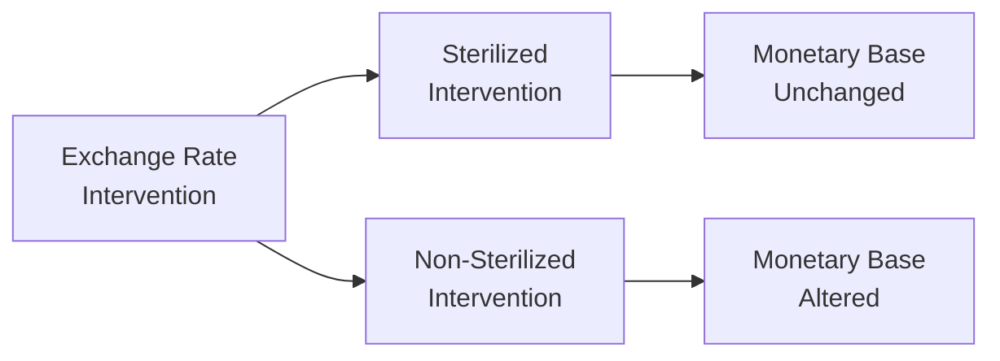

## Distinction Between Sterilized and Non-Sterilized Intervention

Sometimes, sipping my morning coffee, I get this friend who asks me, “Why do central banks sometimes jump into the foreign exchange (FX) market?” It’s a fair question. Basically, central banks step in to influence the exchange rate when they feel it’s necessary—maybe to stabilize their currency or ensure their economy remains competitive.

When a central bank intervenes, it can do so in two ways: “sterilized” or “non-sterilized.” In sterilized intervention, the central bank executes an offsetting domestic operation (like selling or buying government securities in its home market) to keep the domestic monetary base (the money supply) roughly unchanged. In non-sterilized intervention, the bank doesn’t do these offsetting transactions, so the money supply directly shifts.

• Sterilized Intervention:  
  Think of it like this: The central bank buys foreign currency by paying with local currency, but then it also “soaks up” that newly released local currency by selling equivalent amounts of government bonds on the local market. Result: more or less no net impact on domestic interest rates or monetary supply.  
• Non-Sterilized Intervention:  
  Here, the central bank buys or sells foreign currency, but doesn’t conduct an offsetting open market operation. So the monetary base changes. If a central bank buys foreign currency with newly printed domestic currency, it increases money supply, often lowering domestic interest rates (all else equal).

In the short run, either type of intervention might move the exchange rate, at least briefly. However, many analysts argue that non-sterilized interventions pack a stronger punch because they alter the underlying liquidity conditions, whereas sterilized interventions are often undone by broader market forces unless they send a strong policy signal.

Below is a simple visual showing how these interventions connect:

## Exchange Rate Targeting

Countries use various exchange rate regimes. Some prefer a firmly fixed peg (tying their currency to a major one like the USD), while others adopt a managed float (the currency generally floats, but the central bank can smooth out volatility). A free float means minimal official interference, though in practice, no float is 100% free.

• Fixed or Pegged Regimes:  
  The central bank commits to buying or selling domestic currency at a specified exchange rate. An example is Hong Kong’s currency board, linking HKD to USD.  
• Managed Float:  
  Some countries allow their currency to fluctuate but step in here and there to “guide” the exchange rate if it overshoots or undershoots a preferred band.  
• Free Float:  
  The currency is left mostly to market supply and demand. Although, “free float” might still see occasional interventions if the exchange rate deviates sharply.

When governments target an exchange rate, they’ll often purchase or sell reserves (usually in major currencies like USD, EUR, or JPY) to nudge the domestic currency in a desired direction. This process can be a juggling act: devoting too many reserves can strain central bank balance sheets or disrupt domestic liquidity.

## Motivation for Currency Intervention

You might wonder, “Why do central banks even bother?” Well, motivations vary:

• Export Competitiveness:  
  A weaker currency makes domestic goods cheaper abroad, boosting exports. Think of countries heavily reliant on trade—some might lean toward an undervalued exchange rate.  
• Fighting Imported Inflation:  
  A stronger currency makes imported goods cheaper, helping contain inflation but potentially hurting exports (since domestic goods become more expensive for foreign buyers).  
• Defensive Moves:  
  Sometimes, interventions are reactive, spurred by excessive speculation, capital flight, or sudden surges in demand for or against local currency.

Over time, though, relentless efforts to keep a currency undervalued can trigger international backlash. Trading partners (and entities like the WTO or IMF) might label such policies as currency manipulation, potentially leading to tariff retaliations or diplomatic tensions.

## Capital Controls in Practice

Capital controls are measures that limit or regulate cross-border money flows. Typically, these controls show up as:

• Ownership Caps:  
  Restrict how much foreign equity or bonds an investor can hold.  
• Taxes on Capital Inflows:  
  Saddle foreign investors with additional costs if they want to buy local assets.  
• Reserve Requirements:  
  Impose special holding requirements on local financial institutions for foreign currency liabilities or short-term foreign borrowings.

In emerging markets, these measures are sometimes used to:  
1) Discourage “hot money” inflows that can fuel asset price bubbles.  
2) Reduce capital flight during times of crisis.  
A historic example is Malaysia imposing capital controls to stabilize the ringgit during the late 1990s Asian Financial Crisis. By restricting outflows, Malaysia hoped to prevent panic-driven currency plunges.

## Effectiveness of Intervention

The effectiveness of interventions—whether it’s by direct FX transactions or capital controls—depends on several conditions:

• Market Depth:  
  In very liquid currency markets, a central bank may need massive operations to move the needle. If daily transaction volumes dwarf the bank’s reserves, even big interventions might have minimal long-term effect.  
• Policy Coordination:  
  Interventions can be more potent if multiple central banks coordinate simultaneously, sending a united signal to the market.  
• Credibility:  
  One of the biggest factors: if the market believes the central bank is fully committed and has ample muscles (i.e., large reserves, strong policy support), the intervention stands a better chance of success.

Yet, there’s persistent debate over how long any direct intervention effect can last. Skeptical analysts argue that eventually, fundamentals (like a country’s growth prospects, inflation, interest rates, and trade balance) reign supreme, overshadowing any short-term central bank moves.

## Political and Policy Considerations

FX intervention isn’t exclusively financial. It’s deeply political. A government that heavily intervenes might face accusations of violating free-market principles or ignoring trade agreements. On the flip side, not intervening enough could undermine confidence if markets are highly volatile.

A classic example is the Swiss National Bank (SNB) setting a “cap” on the Swiss franc against the euro from 2011 to 2015. The SNB publicly announced that it would buy unlimited amounts of foreign currency to prevent excessive franc appreciation. Investors took that as a firm line in the sand—until early 2015, when the SNB abruptly abandoned the cap, causing a massive spike in the franc’s value that took markets by surprise.

## Costs and Trade-Offs

• Balance Sheet Risks:  
  Central banks accumulate foreign currency reserves. If they end up selling them at a loss or if those reserves lose value (like a weaker USD while you hold billions in USD), that hurts the central bank’s balance sheet.  
• Overvaluation Risk:  
  Propping up a currency beyond its “fair value” can lead to large sudden depreciations when the intervention ends, jarring businesses, banks, investors, and policymakers alike.  
• Policy Conflicts:  
  Maintaining a peg can tie the central bank’s hands on domestic monetary policy. Trying to keep interest rates high to defend a currency peg might strangle growth, or vice versa.

## IMF Role and Global Framework

The International Monetary Fund (IMF) has a nuanced stance on capital flows and exchange rate interventions. Generally, the IMF advocates liberalized capital accounts and stable, flexible exchange rates. Still, it recognizes that—especially in times of severe crisis—capital controls or short-term interventions can be an essential “pressure valve.”

The IMF encourages transparency and sets guidelines around how and when interventions should be used. For instance, countries should ensure that measures are temporary, well-targeted, and do not discriminate too harshly against foreign investors.

## Empirical Case Studies

• China’s Capital Controls  
  China maintains tight oversight on capital flows—both inflows and outflows—and historically intervened to keep the renminbi from appreciating too quickly. Some manufacturing-heavy economies criticized this approach, seeing it as an unfair trade advantage; others argued that China’s big moves minimized harmful speculation during the 2008 crisis.  
• Malaysia’s 1998 Controls  
  Facing currency meltdown in the Asian Financial Crisis, Malaysia introduced strict controls to stop capital flight, pegging the ringgit against the USD and restricting offshore trading. Although controversial, it arguably insulated Malaysia from deeper turmoil.  
• Swiss Franc Cap (2011–2015)  
  This intervention aimed to ward off deflationary pressures by preventing an overvalued franc. Initially, it worked. But once confidence that the peg would hold began to wane—and the SNB decided to scrap it altogether—the franc soared, rattling global markets.

## Practice Exercises

Imagine a fictional emerging market called Trenzonia. Due to promising tech exports, Trenzonia experiences huge capital inflows, which lead to an appreciating currency, rising property prices, and local stock market surges. The central bank gets nervous about inflation pressures. In response, it imposes partial capital controls: new foreign investments in Trenzonia’s real estate sector must stay locked in for at least three years. Additionally, the bank starts selling local currency and accumulating USD reserves to keep the exchange rate from strengthening too much.

We might ask:  
• How do these capital controls interact with the central bank’s objective of stabilizing the currency?  
• Will foreign investors become wary of investing, potentially choking future growth?  
• Could the central bank’s interventions lead to a build-up of questionable USD assets on its balance sheet?

These are the types of item-set scenarios you’ll see in the Level II exam. You’ll need to diagnose the interplay of capital flows, currency stability, investor sentiment, and broader economic fundamentals.

---

## Glossary

• Sterilized Intervention:  
  Central bank FX action that is offset by domestic open-market operations to keep the monetary base unchanged.  
• Non-Sterilized Intervention:  
  Currency intervention not offset by domestic operations, thus changing the money supply.  
• Capital Controls:  
  Regulatory measures that restrict or tax capital inflows/outflows.  
• Exchange Rate Peg:  
  A system in which a country’s currency is fixed to another currency or a basket of currencies.  
• Managed Float:  
  A currency regime in which the exchange rate floats but the central bank intervenes periodically.  
• Foreign Currency Reserves:  
  Currencies held by a central bank for the purpose of influencing exchange rates or settling cross-border obligations.  
• IMF Guidelines:  
  Recommendations from the International Monetary Fund on the permissible scope and nature of currency interventions and capital controls.  
• Currency Manipulation:  
  Deliberate efforts to undervalue or overvalue a currency beyond its fundamental equilibrium for competitive advantage.

---

## References and Suggested Readings

• CFA Institute Level II Curriculum, “Exchange Rate Intervention and Capital Controls,” current edition.  
• The IMF’s “Annual Report on Exchange Arrangements and Exchange Restrictions” – (https://www.imf.org).  
• Reinhart, Carmen, and Todd Smith, “Temporary Controls on Capital Inflows,” Journal of International Economics.

---

## Test Your Knowledge: Intervention Objectives and Capital Controls



### Which of the following best describes a sterilized intervention?

- [ ] A central bank that changes the monetary base by buying foreign currency.  
- [x] A central bank that buys or sells foreign currency but offsets the effect on the money supply through open market operations.  
- [ ] A currency framework that allows supply and demand to drive FX rates without any government intervention.  
- [ ] A central bank only conducting open market operations in the domestic bond market with no foreign currency transactions.

> **Explanation:** In a sterilized intervention, the central bank conducts an offsetting domestic operation to keep the monetary base unchanged.

### One reason a central bank might deliberately keep its currency undervalued is to:

- [ ] Attract expensive imports.  
- [x] Stimulate exports by making them cheaper overseas.  
- [ ] Discourage local manufacturing.  
- [ ] Reduce foreign demand for its government bonds.

> **Explanation:** A weaker currency often helps domestic exporters by making their goods cheaper in foreign markets.

### In a non-sterilized intervention where the central bank purchases foreign currency, what immediate impact might occur?

- [x] An expansion in the domestic money supply if there is no offsetting operation.  
- [ ] A reduction in the domestic money supply if there is no offsetting operation.  
- [ ] Zero effect on the domestic money supply.  
- [ ] A forced revaluation of the currency by international bodies.

> **Explanation:** By purchasing foreign currency with newly printed domestic currency, monetary base expands unless sterilized.

### Under a managed float exchange rate system, the central bank:

- [ ] Never intervenes.  
- [x] Occasionally intervenes in the FX market to stabilize or guide the currency.  
- [ ] Keeps the currency fixed to a single currency, like the USD.  
- [ ] Lets the currency float freely with no oversight.

> **Explanation:** A managed float typically implies some level of intervention when the currency swings too far from desired levels.

### A major risk associated with maintaining a strict currency peg is:

- [x] Running out of foreign currency reserves if the central bank continually defends the peg.  
- [ ] Reduced import competition.  
- [x] Limiting the central bank’s ability to conduct independent monetary policy.  
- [ ] Lower risk of inflation.

> **Explanation:** A strict peg can require the central bank to spend large amounts of reserves defending it; plus, interest rates might be pinned to the anchor currency’s policy stance, constraining domestic policy.

### Capital controls are often used by emerging market nations primarily to:

- [x] Restrict volatile capital flows that can disrupt currency and local asset prices.  
- [ ] Remove all foreign investment from the country.  
- [ ] Forcefully undervalue the currency in perpetuity.  
- [ ] Prevent all foreign trade.

> **Explanation:** The primary goal is to reduce speculation, contain “hot money,” and stabilize the exchange rate/financial system.

### According to the IMF’s guidelines, capital controls should ideally be:

- [x] Temporary and well-targeted to address specific instabilities.  
- [x] Transparent and consistently applied to avoid confusion among foreign investors.  
- [ ] Secretly implemented to surprise the markets.  
- [ ] Introduced without notice and indefinite in length.

> **Explanation:** The IMF suggests that capital controls be used cautiously, with clear objectives and a defined time horizon.

### Which of the following best characterizes a potential downside of non-sterilized intervention?

- [x] Changes in the monetary base can conflict with a central bank’s domestic policy goals.  
- [ ] It permanently sets the new exchange rate, preventing any further shifts.  
- [ ] It never affects short-term interest rates.  
- [ ] It must be coordinated globally to be effective.

> **Explanation:** Because non-sterilized intervention directly affects the money supply, it may conflict with broader monetary policy objectives.

### When a central bank announces a currency peg but later abandons it, markets often react by:

- [x] Rapidly repricing the currency, which could cause abrupt appreciation or depreciation.  
- [ ] Doing nothing, since pegs are rarely taken seriously.  
- [ ] Maintaining the same pegged rate indefinitely, ignoring the central bank’s decision.  
- [ ] Eliminating the possibility of exchange rate volatility altogether.

> **Explanation:** The removal of a peg can lead to large and sudden exchange rate swings because investors quickly adjust their views of fair value.

### The statement “Capital controls can help manage hot money inflows but risk deterring long-term investments” is:

- [x] True  
- [ ] False  

> **Explanation:** While capital controls sometimes reduce speculative inflows, they can also deter legitimate foreign investors who worry about future restrictions or stringent regulations.


