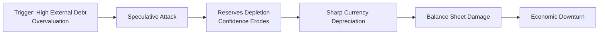

### Understanding Currency Crises

Sometimes you’ll hear the phrase “currency crisis” tossed about whenever a nation’s exchange rate starts tumbling. But a true currency crisis is more than just a little slump in value—it's a sudden, sharp decline in the currency’s worth that often drags the entire economy down with it. I remember reading about the 1997 Asian crisis back when I was just a student, and I remember thinking, “Wow, this came out of nowhere!” But in hindsight, there were plenty of warning signs.

Speculative attacks, capital-flow reversals, and abrupt crashes in the currency’s exchange rate can all spark a crisis. Economists typically talk about three “generations” of currency crisis models. The first generation focuses on inconsistent government policies—like financing huge budget deficits by printing money—leading to a steady loss of foreign reserves. Second-generation models warn of self-fulfilling prophecies: if enough investors think a devaluation is imminent, they sell the currency, and that itself causes the devaluation. Third-generation models add the role of a weak financial system, where currency depreciation hits corporate or government balance sheets hard (especially if they hold a lot of foreign-currency debt), triggering a broader economic meltdown.

### Key Macro Indicators to Watch

Before you say, “So how do I actually spot these crises before they happen?” let’s talk about some of the biggest red flags:

• Large current account deficits: If a country is importing way more than it’s exporting, it has to pay for those extra imports somehow—often by borrowing from international markets. A persistent deficit can eventually undermine confidence in the currency.

• Rapidly expanding external debt: If the government or local companies keep borrowing in foreign currency, they risk not being able to service that debt if the local currency depreciates.

• Unsustainable public debt: If fiscal deficits are big and debt starts ballooning, markets may fear that the government can’t keep things under control. That fear alone can spark a run on the currency.

• Low foreign exchange reserves: Adequate reserves help central banks stabilize the currency during rough patches. If reserves are too low compared to short-term external debt or import needs, investors may smell trouble.

Here’s a quick snapshot of hypothetical early indicators:

| Indicator                     | Potential Red Flag                         |
|------------------------------|--------------------------------------------|
| Current Account Balance      | Large persistent deficit                   |
| Foreign Exchange Reserves    | Reserves less than 3 months of imports     |
| Government Debt to GDP       | Rapid increase; rising interest burdens    |
| External Debt Maturity       | High proportion of short-term debts        |
| Inflation Rate               | Significantly above trade partners         |
| Real GDP Growth              | Slow or contracting near rumor or crisis   |

### The Issue of Real Exchange Rate Overvaluation

An overvalued real exchange rate is like stretching an elastic band too far—it can snap back sharply. If domestic inflation keeps exceeding that of major trading partners, but the nominal exchange rate doesn’t adjust, the currency becomes “too expensive.” Exports start to decline, current account deficits worsen, and foreign investors hesitate to bring in new money because they sense a looming devaluation. Eventually, the pressure piles up, and once it gives way, the currency can plunge quickly.

Think about a country that fixes its nominal exchange rate at an artificially high level. This fosters the illusion of stability, but if prices at home climb faster than abroad, that real exchange rate becomes more and more overvalued. One day, investors might decide, “Nope, we’re out,” and a speculative attack begins.

### Sudden Capital Flight and Investor Sentiment

Ever seen how fast a herd of gazelles can take off at the slightest hint of a predator? Global investors can behave similarly once they sense fear. If perceptions of a country’s debt sustainability deteriorate or doubts surface about its macro policies, funds can exit in a blink. Downgrades by rating agencies often accelerate panic. One negative media report—“This country’s reserves are dwindling!”—and contagion can spread, leading large institutional players to pull out. This capital flight not only depletes the country’s foreign reserves but also sends the exchange rate skidding.

### Balance Sheet Mismatches

Here’s where things can get really sour. Suppose local corporations have borrowed heavily in USD or EUR. They earn revenue in their local currency, but that currency is now in free fall. Even a small devaluation can blow up their debt-servicing costs overnight. This mismatch between assets (local currency) and liabilities (foreign currency) turns painful very quickly. The same is true for governments that issue bonds in foreign currency. When there’s a mismatch on this scale and scant hedging in place, a mild depreciation can morph into a deep economic crisis.

### Policy Inconsistencies and Political Instability

Imagine you peg your currency to the USD, but your monetary policy is very expansionary, driving inflation above US levels. Eventually, the peg won’t look credible. Markets track these inconsistencies: they see a country that says it’s committed to a stable exchange rate yet runs policies that undermine that stability. On top of that, political instability—frequent leadership changes, uncertain elections, or social unrest— can scare away foreign investors. If the next administration might overhaul monetary policy, no one wants to be the last one holding that currency when things unravel.

### Crisis Prediction Models

Economists and policymakers have tried to formalize Early Warning System (EWS) models that keep tabs on a bunch of indicators:

• Reserve levels vs. short-term external debt  
• Real interest rates  
• Inflation trends  
• Current account balance  
• Commodity price fluctuations (for commodity-dependent economies)

These models spit out signals whenever a threshold is breached: for example, if foreign reserves drop to under three months of import coverage or when short-term external debt surpasses total reserves. But remember: EWS models can be a bit like smoke alarms. They might go off with every little whiff of trouble (false alarms) or sometimes they might stay silent until your entire kitchen is blazing (missed crises). That’s why analyst judgment, combined with quantitative modeling, remains indispensable.

Below is a simple visual of how a currency crisis can unfold:

### A Look Back at Historical Currency Crises

We can glean so much from past blow-ups. Look at the Mexican Peso Crisis (1994): Mexico ran down its reserves propping up the peso, yet simultaneously carried significant short-term dollar-denominated debt. Once confidence wavered, investors rushed the exits. Or the 1997 Asian Financial Crisis: several Southeast Asian nations had pegged their currencies to the USD and carried big external debts. When export growth slowed, reserves dropped, and speculation poured in, sending THB, IDR, and KRW plunging.

The 1998 Russian Ruble crash saw the combo of weak oil prices (major export revenue drained), high public deficit, and shaky investor sentiment. And Argentina (2001) offers a cautionary tale on maintaining a currency board under high fiscal deficits—eventually, the board collapsed, leading to a dramatic default and economic crisis.

### Contagion Effects

Currency panics don’t always stop at the border. If a neighbor country shares similar vulnerabilities—overvalued exchange rate, weak reserves, or heavy foreign debt—investors might think, “They’re next.” This is how multiple economies in a region can get pulled down together. Episodes like the Asian crisis of 1997 underscore that sentiment-based and trade-based linkages can transmit shock waves throughout entire regions very quickly.

### Practice Exercises

A typical Level II-style item set might give you a scenario featuring a country called “Albanica” (completely fictional) with rising inflation, a political scandal rocking the finance ministry, and a growing current account deficit financed by short-term external loans. Data might show inflation at 10%, real GDP growth slowing to 1%, reserves down by 20% over the last six months, and increasing rumors of a central bank official resigning. You might be asked:

• Which indicators represent early warning signals?  
• How might rating downgrades or political shake-ups affect currency stability?  
• What policy measures could mitigate these vulnerabilities (e.g., tighter monetary policy, foreign currency interventions, or capital controls)?  

Approaching these item sets requires more than just memorizing bullet points. You’ll need to interpret data tables or charts and then connect the dots—just like a detective following leads.

### Exam Tips and Key Takeaways

• Memorizing metrics is fine, but practice reading data sets in a “big-picture” way. Look for mismatches: large deficits plus low reserves or high debt plus an overvalued currency.  
• Remember that second- and third-generation models emphasize market psychology and balance sheet vulnerabilities, not merely a faulty peg.  
• Be prepared for questions that integrate policy decisions from earlier subtopics in this chapter. For instance, if the government is simultaneously hiking interest rates (to defend the currency) but also running large deficits, walk through the potential conflicting signals this sends to investors.  
• Pay attention to corporate or government external liabilities. A question might depict a firm’s net liabilities denominated in USD and how a 15% devaluation impacts its interest coverage ratio.  
• Don’t hesitate to mention intangible factors like political risk or corruption in your analysis. The exam often tests your ability to apply qualitative reasoning.  

### Glossary

• **Speculative Attack**: Large-scale selling of a currency due to expectations of a future devaluation or depleted FX reserves.  
• **Currency Crisis**: A sharp depreciation of a country’s currency leading to broader economic turmoil.  
• **Balance Sheet Effects**: The adverse impact on borrowers if foreign-currency liabilities swell relative to local-currency assets.  
• **Contagion**: The propagation of economic or financial shocks from one country to others.  
• **Early Warning System (EWS)**: A quantitative model tracking key indicators to gauge the risk of a currency crisis.  
• **Real Exchange Rate**: The nominal exchange rate adjusted for relative price levels or inflation rates.  
• **Reserve Adequacy**: A measure of foreign reserves’ capability to cover short-term external obligations (e.g., short-term debt, months of imports).  
• **Debt Sustainability**: A government or economy’s ability to manage debt obligations without external default or relief.

### References and Suggested Readings

- CFA Institute Level II Curriculum, “Identification and Analysis of Currency Crises,” current edition.  
- Krugman, Paul. “A Model of Balance-of-Payments Crises.” Journal of Money, Credit and Banking.  
- Kaminsky, Graciela, Saul Lizondo, and Carmen Reinhart. “Leading Indicators of Currency Crises.” IMF Staff Papers.

## Test Your Knowledge: Early Warning Signs of Currency Crises



### Which of the following best describes a speculative attack?

- [ ] A policy measure to maintain a currency peg by raising interest rates
- [ ] A natural increase in currency volatility during an election year  
- [x] A large-scale selling of a currency due to expectations of devaluation or reserve depletion  
- [ ] A cooperative arrangement among central banks to share FX reserves  

> **Explanation:** A speculative attack occurs when market participants, fearing a currency devaluation, conduct significant selling of that currency, thereby increasing the likelihood of a self-fulfilling crisis.

### A key distinction between first- and second-generation currency crisis models is:

- [ ] The first-generation model focuses on political instability, whereas the second-generation model focuses exclusively on commodity prices.  
- [ ] The first-generation model is no longer relevant, while the second-generation is authoritative.  
- [x] The first-generation model emphasizes inconsistent monetary policies leading to reserve depletion, while the second-generation model highlights self-fulfilling expectations.  
- [ ] Both models focus solely on balance sheet mismatches.  

> **Explanation:** First-generation models emphasize policy inconsistencies that lead to reserve losses over time. Second-generation models incorporate self-fulfilling expectations and confidence effects as potential crisis triggers.

### Which of the following macro indicators is typically viewed as a critical red flag for an impending currency crisis?

- [ ] High domestic savings rates  
- [x] Rapidly increasing short-term external debt  
- [ ] A marginal surplus in the trade balance  
- [ ] Stable real exchange rate  

> **Explanation:** Rapidly increasing short-term external debt can undermine investor confidence, as it strains the country’s ability to meet obligations if the currency suddenly depreciates.

### If a country’s currency appears overvalued in real terms, it means that:

- [ ] The nominal exchange rate is below its historical average.  
- [x] Domestic goods and services have become more expensive relative to foreign markets, leading to potential external imbalances.  
- [ ] Inflation in the country is lower than in its main trading partners.  
- [ ] Investors are likely to buy more of the currency for carry-trade benefits.  

> **Explanation:** Real overvaluation occurs when domestic prices or wages rise faster than those of trading partners without a compensating movement in the nominal exchange rate, making exports less competitive and imports more attractive.

### Which scenario best illustrates a balance sheet mismatch that could exacerbate a currency crisis?

- [ ] Locally owned firms earn all revenues in USD but have local currency expenses.  
- [x] Corporations borrow in USD while generating most revenue in local currency, exposing them to FX risk.  
- [ ] Banks lend to domestic clients at variable local interest rates under stable currencies.  
- [ ] A government issues long-term local currency debt at a fixed rate.  

> **Explanation:** When corporations borrow in a foreign currency but earn revenue in the local currency, a sudden depreciation in the local currency can make debt repayment prohibitively expensive, deepening a crisis.

### How might political instability accelerate a currency crisis?

- [x] Investors may lose confidence, triggering capital flight and speculative attacks.  
- [ ] Political instability usually dampens market volatility.  
- [ ] It ensures easier access to the IMF and other external lenders.  
- [ ] It automatically leads to a current account surplus.  

> **Explanation:** Uncertain leadership and policy direction can erode investor confidence, motivating them to withdraw funds rapidly, thus contributing to a currency crisis.

### Early Warning System (EWS) models often use which of the following indicators to detect potential currency crises?

- [x] Reserve adequacy ratios compared to short-term external debt  
- [ ] Trends in cultural expenditure by the government  
- [x] Real interest rates and inflation differentials  
- [ ] Tax breaks for small businesses  

> **Explanation:** EWS models typically track macroeconomic and financial indicators such as foreign reserves, short-term debt, inflation, and interest rates to evaluate a country’s vulnerability.

### During the 1997 Asian Financial Crisis, many countries had:

- [ ] Extremely low public debt and consistently high interest rates.  
- [x] Currency pegs to the USD, large external borrowings, and insufficient foreign reserves.  
- [ ] Surplus current accounts in multiple consecutive quarters.  
- [ ] Overly flexible exchange rates and no foreign debts.  

> **Explanation:** A hallmark of the Asian Financial Crisis was overreliance on external debt and rigid currency pegs, combined with inadequate reserves, which led to devastating devaluations once market sentiment turned negative.

### “Contagion effect” in the context of currency crises refers to:

- [x] The spread of crisis from one country to others, often due to perceived similarities in vulnerability.  
- [ ] A temporary improvement in trade balances across neighboring countries.  
- [ ] The spread of inflationary pressures through an economy’s supply chain.  
- [ ] An agreement by central banks to unify interest rates.  

> **Explanation:** Contagion occurs when a crisis in one country causes investors to reassess risk in nearby or “similar” markets, leading to rapid outflows and potential currency instability in those places as well.

### A current account deficit is always a guarantee of an imminent currency crisis. True or False?

- [ ] True  
- [x] False  

> **Explanation:** While large and persistent current account deficits can be a red flag, they do not guarantee a crisis. Additional factors—like strong capital inflows, adequate reserves, and robust foreign currency earnings—may mitigate immediate vulnerability.


