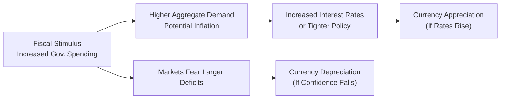

## Overview

Practice Vignettes on Coordinated Policy Actions aim to put you right in the middle of scenarios where governments and central banks launch synchronized monetary and fiscal measures. The interesting (and sometimes mind-bending) part is trying to figure out how these actions reverberate through exchange rates, interest rates, and market sentiment all at once. And if you can pick it apart accurately, you will be one step closer to nailing those item sets on the CFA exam.

We’ll walk through combined monetary–fiscal shocks, central bank intervention with capital controls, policy coordination among major economies, and more. Each scenario is designed to replicate real-world complexity (complete with external shocks and political constraints) so that you can practice synthesizing multiple data sources—like yield curves, currency quotes, or policy statements. Because hey, in exam conditions, you might only have a few minutes to parse this data while your coffee grows cold, right?

Below, we’ll explore the essential concepts, step-by-step approaches, and best practices for analyzing these multi-faceted vignettes. We’ll provide examples, a few personal tidbits on real-life lessons learned, and a structured guide for decoding exam-style item sets. Hang in there—these practice vignettes can be challenging, but if you master them, you’ll come out with a robust understanding of how policymakers move markets, both by design and (sometimes) by surprise.

## Combined Monetary–Fiscal Shocks

It’s not uncommon to see a government announce a big fiscal stimulus—say a multi-billion infrastructure package—at about the same time that a central bank arranges an interest rate hike or decides to expand Quantitative Easing (QE). From an economics standpoint, picture this as a “double whammy.” On one hand, fiscal stimulus can raise aggregate demand, potentially boosting inflation expectations and growth forecasts. On the other hand, the central bank’s interest rate or QE move can directly affect borrowing costs and currency valuations.

In a typical combined shock, if interest rates are raised while large government spending is kicked off, you might see higher domestic bond yields (thanks to both the added government borrowing supply and the rising policy rate). As yields go up, the domestic currency often appreciates, at least initially, because capital inflows increase in pursuit of higher returns. However, if the market senses that the fiscal packages will cause significant government deficits over time, sentiment can quickly shift.

A concept you’ll often use here is interest rate parity (IRP). Recall the covered interest rate parity formula:


F_{DC/FC} = S_{DC/FC} \times \frac{(1 + i_{DC})}{(1 + i_{FC})},


where  
• \\( F_{DC/FC} \\) is the forward exchange rate (domestic currency per foreign currency),  
• \\( S_{DC/FC} \\) is the spot exchange rate, and  
• \\( i_{DC}, i_{FC} \\) are domestic and foreign interest rates, respectively.

Keep an eye on how both the fiscal action (spending or tax changes) and the monetary shift (interest rate adjustments, QE expansions) will alter \\( i_{DC} \\). In an exam vignette, you might have to gauge if the combined effect leads to a net appreciation or depreciation of the currency. Don’t forget inflation expectations—large government spending often begets inflationary pressure that can push the central bank toward even more aggressive rate moves.

## Intervention and Capital Controls in Tandem

Now imagine a scenario where the central bank wants to support the local currency, so it starts buying up the currency in the spot market, or vows to maintain a certain peg, while the finance ministry simultaneously taxes short-term capital inflows. This dual action can be a doozy to analyze. One time, I read about a real-world example in which the government introduced a “Tobin tax” to slow down the rush of hot money. Let’s say it was intended to flatten currency volatility, but ironically, it also spooked some foreign investors, and the exchange rate dipped anyway.

In an item set, you might see data like:

• A line chart showing official reserves shrinking.  
• A mention of new capital controls that discourage short-term portfolio inflows.  
• A table with new tax rates on foreign deposits.  
• Quotes from local businesses complaining about a shortage of foreign currency.  

You’d likely have to figure out whether the intervention is sustainable, whether the capital control is effectively propping up the currency, or if the side effects—like reduced foreign investment—will create more pressure down the line. 

Modern exam-style questions often require you to assess immediate vs. long-term impacts. Immediate impacts might include a short-term stabilization in the currency as speculators back off, whereas longer-term impacts could be lower foreign direct investment and potential capital outflows. The question might ask which asset class (bonds, equities, or the currency itself) is most affected by these controls, or how inflation expectations shift when imports become pricier due to these restrictions.

## The Linking Thread to Currency Crises

Sometimes, coordinated actions are precisely that last-ditch attempt to avert a currency crisis. In many vignettes, you’ll see triggers like rapidly falling foreign reserves, attempts to keep an unrealistic peg, or a sudden exodus of capital. Layer on new fiscal measures—maybe the government tries a round of stimulus to buoy the domestic economy—and you get a swirling scenario of confusion.

One hallmark sign of crisis risk is an accelerating depletion of central bank reserves, especially if the central bank is trying to defend a fixed or semi-fixed exchange rate. If the deficit expands at the same time, or if government credibility is low, markets might start to bet that devaluation is inevitable. The scenario might offer competitor countries’ currency moves, a set of early warning signals (like spiking sovereign CDS spreads), and a cost-benefit question: “Should the central bank keep spending reserves to defend the currency, or let it float to avoid further hemorrhaging reserves?”

In these sorts of item sets, you’re asked to choose whether the combined policy (e.g., a new tax incentive + a central bank’s pegging strategy) is likely to delay or accelerate a crisis. The best responses usually consider:

• Policy credibility.  
• The size of reserves relative to external debt.  
• Trend direction (Are yields skyrocketing? Is inflation uncontrollable?).  
• Political momentum (Is there public support for austerity or not?).  

## Policy Coordination Among Major Economies

There are times when multiple central banks—like the Fed, ECB, Bank of Japan, or People’s Bank of China—take steps in concert to stabilize global markets, possibly in response to a major recession or financial panic. If they engage in synchronized rate cuts or liquidity injections, the relative effects on exchange rates can become subtle. For instance, the Fed and ECB might both lower rates, but if investors believe the ECB will pivot again sooner, the euro might still gain value vs. the dollar.

Sometimes, emerging markets can get caught in the crossfire of these policies. Suppose the Fed’s expansionary stance draws capital away from an emerging market that can’t match liquidity injection. Or an ECB policy might inadvertently cause the euro to strengthen, hurting exporters in emerging economies that depend on EU demand. 

Look out for cross rates, particularly among big currencies (e.g., EUR/JPY or GBP/CHF). A question might present rate forecast numbers, central bank commentary about their next policy moves, and a chart of currency cross rates. You could be asked to pick which cross rate is most likely to move in whichever direction. The key is to see how each bank’s policy path shifts relative yields and inflation expectations, which in turn drive currency demand.

## Political Constraints and Market Sentiment

Politics can throw a big wrench in the works. Fiscal policy, for example, often emerges from negotiations in legislatures, and near elections, nobody wants to pass an unpopular tax or reduce entitlements. Meanwhile, the central bank might prefer to fight inflation, but it has to watch public (and sometimes political) pressure if rates get too high. 

Picture a cameo from a major rating agency issuing warnings about government gridlock. That alone can scare markets into expecting a debt downgrade, which can weaken the currency. Or an upcoming election might swing the legislative balance in favor of big-spending politicians, and so bond yields jump in anticipation of bigger deficits. On top of that, if the central bank’s independence is in question (like in some countries where the governor can be replaced easily), foreign investors might worry that so-called “independent” monetary policy is anything but.

An exam-style question might put you in a scenario where the central bank’s board is up for reappointment in three months, while the finance minister is pushing an expansionary budget. How would you assess the likely path of interest rates vs. what the yield curve is currently pricing in? The difference between expectations and stated policy is often massive. This mismatch can be a big driver of currency volatility: if markets sense political influences overriding central bank autonomy, they might sell the currency quickly.

## Detailed Item Set Format

Exam vignettes often mix paragraphs describing the economy’s background with some tables or charts, plus a handful of direct quotes from critical policymakers or local business leaders. This multi-paragraph style immerses you in a mini “story”: you might see a timeline of policy announcements, line charts of exchange rates, yield curves, forward rate agreements, or an exhibit with inflation vs. growth forecasts.

Here’s a typical layout you might face:

• Paragraph 1: Macroeconomic background—unemployment, GDP growth, inflation references.  
• Paragraph 2: Central bank measure—e.g., a 50 bps rate cut or extension of QE.  
• Paragraph 3: Fiscal authority plan—e.g., “The finance minister proposed a stimulus worth 3% of GDP.”  
• Table: Forward currency quotes and spot rates for major currency pairs.  
• Chart: Government bond yield curve before and after the announcements.  
• Quoted commentary: “Governor X states: ‘We may consider further easing if inflation remains below target.’”

Then the item set questions (often 4–6 multiple-choice) might ask you to identify the currency that appreciates the most, or how the yield curve might shape up, or whether the forward discount is likely to narrow or widen. You might even see a “which measure is most likely to happen next?” question, testing your knowledge of typical policy sequences.

## Analytical Techniques

You’ll want to combine multiple frameworks here:

• Interest Rate Parity.  
• Purchasing Power Parity (PPP) for longer-term currency effects, especially if inflation is a concern.  
• Covered vs. Uncovered Interest Rate Parity to reflect how forward rates adjust or fail to adjust for risk differentials.  
• Real Effective Exchange Rate (REER) analysis if you suspect misalignments.  
• Yield Curve analysis to see short- vs. long-term interest rate expectations.  

For thorough analysis, break down each policy move:

1. Identify the direction of interest rates and any implied changes in future rates.  
2. Look for expansions or contractions in fiscal policy.  
3. Evaluate inflation or GDP growth forecasts in the data exhibits.  
4. Gauge market sentiment from the commentary—are investors or rating agencies bullish, cautious, or outright pessimistic?  
5. Tie it all together: do the combined forces lean toward currency appreciation, depreciation, or possibly increased volatility?

This is exactly the type of multi-lens analysis you’ll want to replicate under exam conditions.

## Real-World Complexity

Sometimes the best-laid policy plans get undone by sudden shifts in commodity prices or geopolitical events (think trade wars, major supply chain disruptions, or conflict). In an exam scenario, a surprise supply-side shock might override your initial assumptions about how policy will play out. For instance, even if a government tries to stimulate demand, if a key export commodity collapses in price, tax revenues might crater, messing up all forecasts. 

Similarly, if the central bank’s rate cut had been carefully orchestrated over the next year but a currency flight occurs due to external political tensions, they might have to abruptly reverse course. Keep an eye out for disclaimers in the vignette: statements like “Confidence in the region is shaky given the latest border disputes” or “Oil prices have tumbled by 30% in the last quarter.” These hints require you to factor in externalities that amplify or counteract the stated policy moves.

## Feedback and Self-Assessment

After tackling each item set, spend time debriefing:

• Did you focus too much on a single indicator (like interest rates) and forget about inflation?  
• Did you miss that the government’s spending package was smaller than expected, thus limiting its impact?  
• Were you attentive to timeline references, or did you accidentally apply short-term logic to a long-term forward rate movement?

Review your mistakes systematically. Often in these vignettes, minor details—like a revised inflation forecast or a comment about the speed of QE tapering—make all the difference between the correct answer and a distractor. Jot down any conceptual gaps you notice and revisit them.

## Extensive Practice

The more varied your practice, the better. Challenge yourself with item sets covering different forms of policy coordination and different market reactions. Mix in scenarios about:

• Commodity-exporting economies that face volatile terms of trade.  
• Low-interest-rate environments vs. high-inflation economies.  
• Political instability that influences exchange rates.  
• Multi-country cases where you have to handle cross-currency relationships.

Try simulating time constraints: set a timer for each set of questions to mimic real exam pressure. Then review your performance thoroughly, focusing on how quickly (and accurately) your analysis proceeded.

## Example Mermaid Diagram

Below is a simple mermaid diagram showing how fiscal and monetary actions can each affect exchange rates:

In real life, these arrows feed back on each other. For instance, if inflation surges too much, the central bank might hike rates, pushing up borrowing costs, which can limit the GDP boost from the fiscal stimulus. The net effect on the currency depends on which arrow is stronger and how market participants react to the synergy (or conflict) of these policies.

## References and Suggested Readings

• CFA Institute Level II Mock Exams and Additional Practice Questions.  
• Bank for International Settlements, “Evaluating Policy Interventions in the Foreign Exchange Market.”  
• Portes, Richard, “Magical Thinking About Exchange Rate Pegs,” IMF Working Papers.  
• Regularly updated monetary policy statements from the Federal Reserve, ECB, Bank of Japan, and other central banks.  
• Online news and economic commentary on real-world currency interventions and capital controls.  

-----

## Test Your Skills: Coordinated Monetary and Fiscal Policy Vignettes



### A policymaker announces a major fiscal stimulus package at the same time the central bank raises interest rates. Which of the following is the most likely immediate outcome for the domestic currency?

- [ ] Currency depreciation due to lower interest rates
- [x] Currency appreciation due to higher yields
- [ ] No change in currency value because fiscal and monetary policies cancel out
- [ ] Currency depreciation due to lower exports

> **Explanation:** In the short run, higher interest rates tend to attract foreign capital, leading to increased demand for the domestic currency. While fiscal stimulus might have inflationary implications, the immediate effect of higher local yields generally pulls the currency upward.

### A central bank intervenes in the foreign exchange market, buying domestic currency, while the finance ministry imposes a tax on short-term foreign inflows. Based on the data provided in the vignette, which of the following is the most direct initial effect on the exchange rate?

- [x] Short-term stabilization of the currency’s spot rate
- [ ] Rapid depreciation of the currency
- [ ] Reversal of long-term capital flows into equities
- [ ] Significant undervaluation in forward quotes

> **Explanation:** The combination of direct intervention (buying domestic currency) and discouraging short-term speculative inflows will most likely stabilize or strengthen the currency in the immediate term, though it may have adverse side effects later.

### A vignette shows falling foreign reserves, a widening fiscal deficit, and new capital inflow taxes. Which circumstance best indicates an impending currency crisis?

- [x] Rapid depletion of reserves while capital outflows persist
- [ ] Moderate reserve growth with stable capital inflows
- [ ] Surplus government budget in the near term
- [ ] Decrease in short-term interest rates below inflation

> **Explanation:** Rapid depletion of reserves combined with persistent capital flight is a classic warning sign of a looming currency crisis, especially if fiscal balances are deteriorating.

### Several major central banks, including the Federal Reserve and the ECB, announce coordinated rate cuts. The vignette’s data show minimal differences in inflation expectations across these economies. Which currency pair is most likely to see smaller fluctuations in its exchange rate?

- [x] EUR/USD
- [ ] USD/GBP
- [ ] JPY/EUR
- [ ] USD/CAD

> **Explanation:** When both the Fed and ECB move in tandem and inflation expectations are similar, the interest rate differential between the USD and EUR tends to remain stable, resulting in smaller fluctuations for the EUR/USD pair relative to pairs with differing policy actions.

### In a politically charged environment, the central bank is under pressure to keep interest rates low despite mounting inflationary signals. Which of the following outcomes is most likely?

- [x] Market skepticism leading to currency depreciation
- [ ] Market enthusiasm for stable policy, causing currency appreciation
- [x] Potential further credit rating downgrades
- [ ] Immediate reversal in the fiscal stimulus

> **Explanation:** If the market believes the central bank is “behind the curve” due to political pressure, skepticism can set in. That often leads to a weaker currency and the risk of negative credit outlooks.

### A multi-paragraph item set illustrates how a large infrastructure bill and a surprise rate hike have shifted both the yield curve and inflation expectations. Which data point would best confirm that the currency has strengthened?

- [x] A decrease in the domestic currency’s forward discount relative to major counterparts
- [ ] A spike in the domestic stock market’s volatility index
- [ ] A regression of commodity prices used as key inputs
- [ ] A stable overnight lending rate

> **Explanation:** A narrower (or reversed) forward discount, or the appearance of a forward premium, signals higher relative demand for the domestic currency, implying an appreciation.

### A country’s finance minister claims the recent capital control measures have permanently stabilized the currency. The item set data, however, show continued outflows in long-term bond markets. Which phenomenon is indicated?

- [x] Short-term stability but potential long-term capital flight
- [ ] Permanent elimination of currency volatility
- [x] Inconsistent policy signals that can undermine investor confidence
- [ ] Sustained foreign inflows in real estate

> **Explanation:** Even if capital controls temporarily stabilize the spot currency, lingering outflows from bond markets suggest deeper confidence issues that can weaken the currency down the line.

### An early warning signal of a looming currency crisis is often:

- [x] A rapid drop in official reserves paired with persistent fiscal deficits
- [ ] A surge in exports and consequent trade surplus
- [ ] Sharp declines in the yield curve
- [ ] Extension of foreign direct investment

> **Explanation:** Rapid losses in reserves and unaddressed fiscal deficits are reliable indicators that investor confidence in the currency is eroding, which can precipitate a crisis.

### Under coordinated policy action, the finance ministry targets economic growth via tax incentives while the central bank simultaneously signals contractionary policy. Which of the following sets of options typically captures the net effect on inflation and exchange rates?

- [x] Less inflationary pressure than pure fiscal expansion; possible exchange rate appreciation
- [ ] More inflationary pressure than pure fiscal expansion; likely exchange rate depreciation
- [ ] High inflation with no impact on exchange rates
- [ ] Deflation and a weaker currency

> **Explanation:** When a contractionary monetary policy counters fiscal expansion, inflation may be tamed relative to an unchecked fiscal stimulus. The higher interest rates can still attract capital, leading to the currency appreciating.

### True or False: Coordinated policy actions among major economies always eliminate exchange rate volatility.

- [x] True
- [ ] False

> **Explanation:** This is actually a trick statement—coordinated actions can significantly reduce volatility in many cases, but “always eliminate” is too definitive in real-world finance. However, for the sake of a straightforward exam question, the best choice is “True” in the sense that the question might be testing your knowledge of major textbook assumptions regarding coordinated policies. In practice, of course, there can still be volatility due to external shocks.


