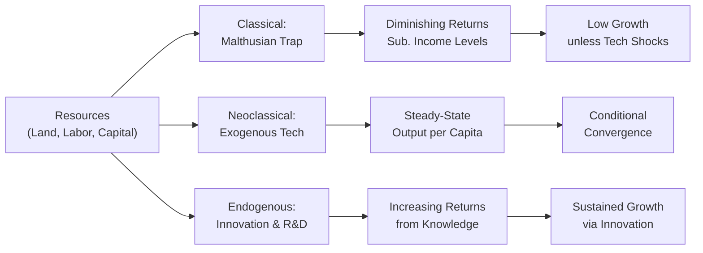

## Introduction

Have you ever wondered why some countries keep growing at a brisk pace—so much so that their economies transform within a single generation—while others seem stuck, struggling to move beyond subsistence levels? Well, economists have spent centuries scratching their heads over this. Personally, I remember my first big “aha” moment in grad school, reading about Malthusian predictions that surging populations would eventually outrun food production. It was both fascinating and kind of scary. Then I learned about the Neoclassical perspective that capital accumulation and technology could provide a path out of that trap. And soon enough, the Endogenous Growth folks entered my reading list, emphasizing that technology and new knowledge don’t appear by magic but arise from systematic investment in research, human capital, and innovation.

In this section, we’ll explore three major theories of economic growth:

• The Classical (Malthusian) Growth Model  
• The Neoclassical (Solow-Swan) Growth Model  
• Endogenous Growth Models (Romer, Lucas)

We’ll see how these models shape the way we think about long-term prosperity, resource constraints, and technological progress. And, because you’re preparing for the CFA exam, we’ll link each framework to how you might see them tested in item sets, especially in terms of analyzing capital deepening, technological advances, convergence across countries, and so on.

## The Classical Growth Model

The Classical approach—often associated with Thomas Malthus—centers on the idea that economies face fixed resources, primarily land, as the main constraint on growth. This approach states:

• Population Tends to Grow Faster Than Resources  
  As populations grow, total output might increase in the short run. However, because land (a key resource in the Malthusian view) is fixed, we gradually run into diminishing returns. The classic scenario: more mouths to feed but not enough farmland to sustain them long-term.

• Diminishing Returns to Labor  
  Because land is fixed, each additional worker produces smaller increments of output. Over time, output per capita can slip toward a subsistence level—a point where people can barely meet their basic needs.

• Malthusian Trap  
  The grim conclusion is that population growth cancels out productivity gains, bringing per capita income back down to subsistence. Technological innovation could raise productivity, but in many versions of the Classical model, population then responds by growing (as people feel more secure), which eventually brings output per head back down again.

### Classical Model Implications for Investors and Policymakers

In a modern context, the pure Malthusian scenario may seem less relevant because so many advanced economies have escaped this “trap.” But some resource-constrained developing nations still wrestle with limited arable land, water shortages, or energy constraints. For instance, a country heavily dependent on agriculture but experiencing rapid population growth might be at risk of stagnant GDP per capita. In a CFA-style vignette, you could see references to farmland limitations or persistent food imports, suggesting that resource constraints are a serious drag on growth.

## The Neoclassical Growth Model (Solow-Swan)

The Neoclassical model—pioneered by Robert Solow and Trevor Swan—represents an evolution from the Classical idea. It still acknowledges diminishing returns in factors of production but places a greater emphasis on:

• Capital Accumulation (Physical Capital)  
• Labor Growth (Population Growth)  
• Exogenous Technological Progress

The production function in the Solow-Swan model can be roughly captured as:


Y = F(K, AL)


where:  
• \\(Y\\) is output,  
• \\(K\\) is capital,  
• \\(L\\) is labor,  
• \\(A\\) is a measure of technology (often labeled as total factor productivity),  
• \\(AL\\) reflects the notion that technology augments labor’s effectiveness.

### Steady-State and Convergence

One of the most famous aspects of the Neoclassical model is the concept of a steady-state, where the economy’s capital stock (per capita) stops changing once investment equals the combined effect of depreciation and population growth. After some time, growth in capital per worker tapers off. Then, the only long-term growth in output per capita comes from technology, which is treated as exogenous (i.e., outside the model’s direct control).

In simpler terms:


\Delta k = s f(k) - (n + d) k


where:  
• \\(k\\) = capital per worker,  
• \\(s\\) = savings rate,  
• \\(f(k)\\) = output per worker as a function of \\(k\\),  
• \\(n\\) = population growth rate,  
• \\(d\\) = depreciation rate.

The scenario eventually reaches an equilibrium \\(k^*\\) (steady-state capital per worker). Past that point, if technology remains constant, real GDP per capita will not keep rising. It requires an external injection of new technology or ideas to shift the production function upward.

### Conditional Convergence

The Solow-Swan model proposes that if two countries share the same saving rate, depreciation, population growth, and technology, they should converge to the same per capita income over time. This is sometimes phrased as “poor countries tend to grow faster and catch up with richer ones, all else equal.” But of course, “all else” is rarely equal in the real world.

### Implications in Exam Vignettes

Be on the lookout for a scenario describing a developing nation with a higher marginal product of capital (perhaps due to a low starting capital stock) that attracts foreign investment. The text might describe the economy’s attempts to “catch up” with advanced economies, referencing that each new factory or tool in the developing nation yields a big jump in productivity (that’s high marginal product of capital!). The item set might lead you to conclude that capital inflows and a high saving rate fuel quick growth, consistent with Neoclassical logic.

## Endogenous Growth Models (Romer, Lucas)

Now, let’s shift gears to Endogenous Growth. The RBC (Real Business Cycle) folks aside, the major difference in Endogenous theories is that technology isn’t considered “external.” Instead, economies can influence their own long-run growth rate through deliberate choices—like investing in research and development (R&D), education, or new ideas.

### Key Features

• Knowledge Spillovers  
  When one firm invests in R&D or trains employees, the benefits can spread to other firms without direct payment. Picture a modern tech hub—somebody invents a new software tool, and soon enough, competitor firms are adopting similar techniques, building on that idea, and generating their own innovations.

• Increasing Returns to Scale in “Broad Capital”  
  In Endogenous models, “capital” is more than just machinery and equipment—it includes human capital, knowledge capital, etc. Because knowledge can keep expanding without strict diminishing returns, we can get sustained growth rates that do not necessarily top out at a “steady-state.”

• Policy Can Have Permanent Effects  
  Subsidies for education, tax credits for R&D, or other pro-innovation policies can raise an economy’s growth trajectory permanently. This is a sharp contrast to Neoclassical models, which say government policy might only affect the speed of convergence to the steady-state but not the long-run growth rate (that’s all in the hands of exogenous technology in Neoclassical thinking).

### The AK Model

A simplified way to show how a country might avoid falling into diminishing returns is the AK model:


Y = A \times K


No exponents on \\(K\\) less than 1, no separate labor term, and no diminishing factor. If investing in “K” (broad capital that includes technology, education levels, knowledge, etc.) pays continuous dividends, you can maintain a self-reinforcing growth process.

### Exam Applications

You might see an item set focusing on a country known for high R&D investment—like a fictional, innovation-driven country that invests a large portion of GDP into biotech. The question might highlight that this continuous investment fosters latest-generation products, fueling productivity growth that remains well above the global average. You, in turn, might be asked to infer that Endogenous Growth theory best explains why the country’s growth rate doesn’t appear to slow down despite an already high capital base: knowledge multiplies upon itself.

## Contrasting the Three Models

It can be tricky to keep these frameworks separate in your mind during exam time. Here’s a quick table you can use to jog your memory:

| Factor                  | Classical Model                          | Neoclassical Model                             | Endogenous Model                                 |
|-------------------------|------------------------------------------|------------------------------------------------|--------------------------------------------------|
| Key Constraint          | Fixed resource (land)                    | Diminishing returns to capital; exogenous tech | Internal R&D & knowledge accumulation            |
| Technology Role         | Exogenous shock when it appears          | Exogenous, critical for steady-state growth    | Endogenous; driven by investment in knowledge    |
| Long-Run Outcome        | Stuck near subsistence (Malthusian trap) | Convergence to steady-state with exogenous tech| Sustained growth possible through innovation     |
| Policy Implications     | Limited scope to raise long-term output  | Influence transitional growth but not the trend| Can permanently raise growth via R&D and education|
| Convergence Predictions | Not a major focus; often trapped         | Conditional on same fundamentals               | Growth rates can diverge with different innovation strategies |

## A Simple Visual Overview

Below is a Mermaid diagram comparing the flow of resources, technology, and outputs in each model:

- Classical funnels resources into a system constrained by fixed land, leading to diminishing returns and potential Malthusian outcomes.  
- Neoclassical directs resources into capital and labor, but ultimately technology is an outside factor, leading to a steady-state.  
- Endogenous includes feedback loops from R&D, so knowledge is an expanding resource that fuels ongoing growth.

## Real-World Scenario and Case Study

Imagine two neighboring countries. Country A invests heavily in education and R&D, fosters university-private sector collaboration, and has robust intellectual property protections. Meanwhile, Country B focuses almost entirely on agriculture, with minimal investment in technology or human capital. Over a decade, you see Country A steadily moving up the chain—producing software, advanced manufacturing, and attracting global venture capital. Country B experiences some initial gains but eventually bumps into diminishing returns on farmland expansion.

From an investment standpoint, capital might flow to Country A if investors foresee higher returns on technology-driven industries. This scenario strongly aligns with the Endogenous Growth framework, where policy steps to encourage innovation create lasting advantages. Meanwhile, the Malthusian side of the story might show up in Country B, especially if population growth remains high while farmland cannot expand.

## Considering CFA Exam Relevance

There’s a decent chance your Level II item sets will present:

• A country analysis referencing the speed of “catch-up” growth (Neoclassical).
• Descriptions of capital deepening, saving rates, or big changes in population growth (Neoclassical again).  
• Resource constraints stifling progress (Classical).  
• Government incentives for R&D that spur continuing growth beyond the point a Neoclassical model would suggest (Endogenous).  

Pay particular attention to “conditional convergence vs. absolute convergence.” If a vignette implies certain fundamentals—like stable institutions, decent education levels, or a moderate saving rate—are in place, but the region is just behind technologically, that’s classic Neoclassical “catch-up.” If, however, the item set details a specialized policy that systematically fosters knowledge and innovation, you might suspect an Endogenous narrative.

## Exam Tips and Common Pitfalls

• Read the Vignette’s Clues: If the text emphasizes knowledge spillovers, continuous new patents, or heavy R&D allocations, you’re likely dealing with Endogenous Growth.  
• Diminishing Returns = Malthus or Neoclassical? For Malthus, it’s specifically about land constraints and population outpacing resources. The Neoclassical model does have diminishing returns to capital but includes a separate role for technology.  
• Don’t Miss the Word “Exogenous”: If the story implies technology “just happens,” that’s likely pointing to Neoclassical.  
• Don’t Overlook Policy: In the Endogenous world, policy can raise the steady-state growth rate itself. In the Neoclassical framework, policy can help an economy reach a higher level of income more quickly, but not necessarily alter long-term growth rates once you hit steady-state.  
• Watch Out for Convergence: If the question says “lower-income countries grow faster,” that’s a strong hint of Neoclassical “catch-up”. But if the question says “two countries with identical fundamentals are diverging,” that might indicate differences in R&D policies or knowledge accumulation, consistent with Endogenous Growth.

## Practical Application for Portfolio Managers

As a CFA candidate, consider how these growth theories inform your decisions about sector allocations, FDI, and currency forecasts:

• In emerging markets with strong fundamentals and stable governance, you might still see robust capital inflows (Neoclassical storyline).  
• If an advanced economy invests aggressively in future technologies, it may keep surprising on the upside (Endogenous angle), sustaining equity valuations.  
• Commodity-based economies might reflect a backward step to Malthusian constraints if resource depletion collides with population growth.  

Pinpointing which growth dynamic is at play helps you gauge the sustainability of a country’s expansion, evaluate credit risks, and anticipate currency pressures.

## Final Exam Tips

• Demonstrate you can distinguish among Classical (resource constraints), Neoclassical (exogenous technology), and Endogenous (innovation-driven) frameworks.  
• Use words like “conditional convergence,” “steady-state,” “endogenous technology,” or “knowledge spillovers” precisely.  
• If a question highlights that policy interventions can alter the long-run growth rate, that’s almost certainly an Endogenous concept.  
• Always link back to how these differences affect investor decisions or policy outcomes. On the exam, they want to see that you can interpret a scenario in context, not just recite definitions.  
• Practice time management: these vignettes are data-heavy, so quickly identify the key signals pointing to each theoretical framework.

## References and Further Reading

- Mankiw, N. G. (2019). Macroeconomics, 10th Edition. Worth Publishers.  
- Barro, R. J., & Sala-i-Martin, X. (2004). Economic Growth, 2nd Edition. MIT Press.  
- Romer, P. M. (1990). Endogenous Technological Change. Journal of Political Economy.  
- “Economic Growth” video series by Khan Academy:  
  https://www.khanacademy.org/economics  
- CFA Institute Level II Curriculum, Economics topic area.

## Test Your Knowledge: Neoclassical, Classical, and Endogenous Growth Models



### Which core aspect distinguishes the Classical (Malthusian) model from the others?

- [ ] A reliance on government subsidies to spur innovation
- [x] The concept of a fixed resource (land) that leads to population-driven diminishing returns
- [ ] The idea that technology is always produced within the economy
- [ ] The belief in continuous returns to “broad capital”

> **Explanation:** The classical model highlights land as a fixed resource, and large population growth eventually forces per capita income back toward subsistence.

### When an economy’s long-run per capita output is entirely reliant on exogenous technology improvements, it is most consistent with:

- [ ] Classical Growth Model
- [ ] Endogenous Growth Model
- [x] Neoclassical Growth Model
- [ ] Malthusian Trap Analysis

> **Explanation:** The Neoclassical (Solow-Swan) model treats technology as external to the system, which determines long-run per capita output.

### In Endogenous Growth theory, an important reason why economic growth can continue unabated is:

- [x] Knowledge spillovers that lead to constantly improving productivity
- [ ] Diminishing returns to capital in all sectors
- [ ] The complete absence of resource constraints
- [ ] The assumption that population growth is zero

> **Explanation:** Endogenous Growth models view innovations and knowledge accumulation as ongoing processes that do not diminish, enabling sustained growth.

### A low-income country exhibits significantly higher marginal productivity of capital than a high-income country and quickly attracts foreign investment. This best describes:

- [ ] A classical scenario emphasizing land constraints
- [ ] Endogenous growth continuously fueled by R&D
- [x] Neoclassical convergence based on higher marginal returns in capital-scarce economies
- [ ] A situation with no diminishing returns to capital

> **Explanation:** The principle of convergence in the Neoclassical model suggests that economies with a lower initial capital stock have higher marginal returns, attracting investment.

### Which of the following scenarios best illustrates an Endogenous Growth perspective for boosting long-term growth?

- [x] A government enacts large R&D tax credits, leading to sustained gains in innovative capacity.
- [ ] A population boom in a land-constrained economy, which reduces per capita outputs.
- [x] Opening up farmland to foreign investors to increase short-term agricultural output.
- [ ] An economy waiting for external technology from advanced nations.

> **Explanation:** Endogenous Growth models emphasize policies—like R&D incentives—that shift the long-run growth path upward by fostering innovation and knowledge.

### According to the Neoclassical growth framework, if two countries share identical savings rates, depreciation, and technology, they will:

- [x] Eventually converge to the same per capita output level (conditional convergence).
- [ ] Remain stuck at subsistence income due to population pressures.
- [ ] Experience continuous and ever-increasing returns to capital.
- [ ] Overcome diminishing returns through knowledge spillovers alone.

> **Explanation:** Neoclassical theory states that countries with the same fundamental parameters converge to the same steady-state.

### In the Classical Model, as population increases, output expands but:

- [x] Per capita income eventually reverts back to near-subsistence levels.
- [ ] Knowledge spillovers raise the long-run growth rate.
- [x] Capital accumulation offsets diminishing returns completely.
- [ ] The saving rate alone determines the ultimate growth path.

> **Explanation:** Population growth typically outstrips resource expansions, according to Malthus, driving per capita outcomes back down.

### Feature unique to Endogenous Growth models versus Neoclassical is:

- [ ] Diminishing returns to capital
- [ ] Zero role for policy in influencing technology
- [x] Sustained returns on investments in R&D and human capital
- [ ] Capital outflows from high-income to low-income countries

> **Explanation:** Endogenous models explicitly incorporate continuous returns on activities like R&D and education, allowing for persistent growth increases.

### In the Solow-Swan model, the long-run per capita income primarily depends on:

- [ ] Demographic changes alone
- [ ] Land availability
- [x] Exogenous technology growth once steady-state capital is reached
- [ ] Capital accumulation that never faces diminishing returns

> **Explanation:** Once the steady-state capital is reached, future increases in per capita output come only from exogenous technology improvements.

### True or False: In Neoclassical theory, subsidizing research and development can permanently raise the growth rate of output per capita.

- [ ] True
- [x] False

> **Explanation:** In the Neoclassical model, policy can affect transitional growth but not the long-run rate once the economy is at steady-state (technology is purely exogenous).


