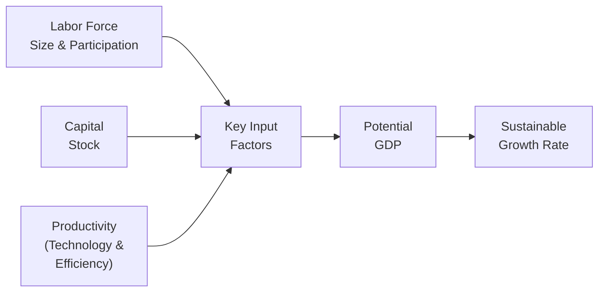

## Understanding Potential GDP

Have you ever thought about how fast an economy can really grow without, well, blowing up into uncontrollable inflation? Sometimes it feels like a balancing act: push too hard, and we risk overheating; hold back, and we never live up to our full potential. Potential GDP is precisely that elusive concept—essentially the maximum sustainable output an economy can produce over time without triggering persistent inflationary pressures. 

CFA Level II candidates might find potential GDP relevant in many contexts—from analyzing business cycles and forecasting equity returns to evaluating monetary and fiscal policy implications. It’s no secret that, during expansions, actual GDP often creeps above (or below) its potential, creating an “output gap.” But what influences potential GDP, and why is it such a big deal?

Potential GDP is heavily connected to the “supply side” of the economy. Labor, capital, and productivity—these three musketeers determine how robust an economy can become over the long haul. In fact, policy analysts, investment managers, and corporate strategists frequently reference potential GDP to assess whether growth is sustainable or just a short-lived burst reliant on cyclical factors. In my experience, ignoring the concept of potential GDP is like skipping an entire scene in a movie—you miss vital clues about how the story might unfold.  

## Key Determinants of Potential GDP

Potential GDP doesn’t just happen by accident; it’s the product of various structural factors that shape an economy’s capacity:

### Labor Force

• Labor Force Size & Participation: A larger workforce generally implies greater productive capacity. However, demographic trends—like an aging population—can shrink the labor force, while favorable immigration policies or higher labor participation can boost potential GDP.  
• Skills & Education (Human Capital): Believe it or not, it’s not just how many people you have but how skilled and adaptable they are. Enhanced education and vocational training can drive the economy forward, letting you squeeze more output out of every hour worked.  

### Capital Stock

• Physical Capital: Machinery, factories, infrastructure—these are the backbone of production. An increase in physical capital investment often boosts capacity.  
• Infrastructure Quality: Even if you have the world’s largest factory, it won’t help much if roads, ports, and communication networks are substandard. Good infrastructure lowers costs, spurs productivity, and fosters innovation.

### Productivity and Technological Progress

• Technological Capabilities: Advances in technology—be it automation, software development, or new industrial processes—tend to make each unit of labor and capital more efficient.  
• Institutional Frameworks: Sometimes we forget that well-functioning legal and financial systems can be equally important. If it’s easier to start businesses, enforce contracts, and finance new ideas, productivity typically goes up.  
• Organizational Innovation: Even small managerial or strategic improvements can enhance productivity. For instance, adopting new supply chain strategies or improving internal processes can yield significant gains in output per unit input.

The interplay of these factors can be visualized quite nicely:

In well-developed economies, these elements typically exhibit stable growth, whereas emerging markets may show bursts of growth as they adopt better technology or attract more foreign capital.

## The Output Gap

If we talk about potential GDP, we won’t get too far without encountering the concept of the output gap. The output gap measures the difference between actual GDP and potential GDP:

• Positive Output Gap: This arises when actual GDP surpasses potential GDP, often indicating the economy is “running hot.” You might see rising inflation, workforce shortages, or surging asset prices. Central banks typically react by hiking interest rates or tightening monetary conditions to cool things off.  
• Negative Output Gap: Here, the economy is underperforming relative to its capacity. There is idle labor and unused production facilities. In such periods, policymakers may adopt stimulus measures—like cutting rates or boosting government spending—to nudge the economy back toward potential.

In plain English, the output gap gives us a sense of whether the economy still has room to grow before hitting capacity constraints. Think of it like a speedometer: going above the posted limit (positive gap) may increase the risk of getting a “ticket” (inflation and tightened policy), while going too slowly (negative gap) means you’re leaving economic potential untapped.

## The Sustainable Growth Rate (SGR)

Over the long run, an economy’s growth potential is captured by its Sustainable Growth Rate (SGR). It’s essentially the rate at which an economy can grow year after year without igniting inflationary pressures or depleting resources. Many consider it the same as the growth rate of potential GDP, although in practice we often approximate.

A popular conceptual formula is:

$$
\text{SGR} \approx \Delta L + \Delta P 
$$

Where:  
• \\( \Delta L \\) = Growth rate of the labor force  
• \\( \Delta P \\) = Growth rate of productivity  

Of course, it’s rarely this simple in the real world. For instance, capital investment and depreciation rates, structural economic shifts, or changes in legislation that impact labor force participation can all alter the SGR. But for exam scenarios, if you see references to “trend growth,” “long-run growth potential,” or “capacity constraints,” those are major hints that you want to tie your thinking back to the concept of the SGR.

### Identifying Shifts in the SGR

Exam item sets often pepper hints about structural changes that could shift an economy’s SGR. For example, suppose a vignette states:

• The government just rolled out a major infrastructure plan, expecting to upgrade internet and transportation networks nationwide. 
• There is a new wave of graduates from a highly regarded technical university. 
• Companies are investing heavily in R&D.

All these indicators typically imply that the economy’s productive capacity is on the rise, which in turn can bump up potential GDP and the SGR.

On the other hand, if you read about a declining birth rate, restrictive immigration policies, and underinvestment in new technologies, you can guess that the SGR might grind lower. Remember to distinguish short-term cyclical growth from a true structural upshift in potential GDP.

## Interpreting Vignettes

You might be reading a hypothetical country scenario for the CFA exam that describes some new technology policy or fiscal stimulus—maybe it references an aging workforce or changes in labor legislation. Here’s how to approach it:

• Watch for Clues About Structural vs. Cyclical Growth: If the text frames new capital investment or improved technology, that’s likely a structural improvement boosting potential GDP. If it’s just a one-off consumption bump, that’s probably cyclical.  
• Evaluate Whether Growth is Sustainable: If actual GDP is quickly approaching or exceeding potential GDP, that might indicate inflation is set to rise, leading to future policy tightening.  
• Anticipate Monetary or Fiscal Policy Shifts: A positive output gap can trigger restrictive monetary policies, while a negative output gap may spark expansionary measures.

## Impact on Investment Analysis

### Equities

From an equity analyst’s standpoint, higher potential GDP growth tends to raise the ceiling on corporate earnings growth. When the economy’s capacity expands, companies generally see increased demand, better productivity, and (hopefully) improved profitability. Also, if the SGR is moving higher for structural reasons (like technology improvements), many sectors—particularly technology, infrastructure, and capital goods—could enjoy higher valuations due to expectations of faster earnings growth.

### Fixed Income

Bond investors keep a close eye on potential GDP and the output gap as well. If an economy is producing above potential (positive gap), inflationary pressures may nudge central banks to hike rates. This can cause bond yields to rise and bond prices to drop. Conversely, in a negative gap situation, low inflation and slack demand might give central bankers more leeway to keep rates lower for longer.

Meanwhile, forward-looking investors often gauge the probability that sustained high growth (above potential) will eventually push inflation up, leading to hawkish policy responses that can ripple through the yield curve and corporate credit spreads. 

### Multi-Asset Portfolios

Portfolio managers who juggle equity, bond, and alternative holdings will incorporate potential GDP forecasts into their strategic allocations. If the SGR for a market is robust, they might tilt more capital toward equities or real assets. If SGR is sluggish or at risk of decline, they might favor defensive assets or shift to regions with higher growth prospects. Indeed, analyzing potential GDP can help managers overweight or underweight certain economies based on long-term fundamentals.

## Practical Example

Let’s consider a hypothetical economy called “Novaland.” Over the past five years, Novaland’s labor force has grown around 1% annually. Core productivity metrics—and we’re talking about improvements in manufacturing processes, IT adoption, and overall organizational efficiency—have been rising at roughly 2% per year. If you wanted to model Novaland’s SGR, you might approximate it at 3% (1% + 2%).

Now let’s imagine the government invests heavily in AI-driven automation, sets up new skill-development programs, and invests in large-scale renewable energy projects. Suddenly, the labor force might expand faster as more people join the workforce, and productivity could jump if advanced AI significantly increases output per worker. The SGR could well shift up to, say, 3.5% or even 4%, reflecting a new normal for Novaland’s long-run growth potential.

On the exam, they might present a scenario with charts or statements about unstoppable surges in output, rumored capacity constraints in certain sectors, or an imminent policy pivot. By tying these statements back to the concept of potential GDP and the output gap, you can better predict whether the government or central bank will respond by adjusting interest rates, taxes, or government spending. 

## Best Practices and Common Pitfalls

• Don’t Confuse Cyclical with Structural: Just because actual GDP is high today doesn’t necessarily mean the economy’s potential has risen. Many a candidate has stumbled by assuming a cyclical expansion translates directly into a permanent rise in potential GDP.  
• Watch for Leading Indicators of Productivity: Technological changes, improved resource management, or better skills training can elevate potential GDP, so keep an eye out for hints referencing these factors.  
• Mind the Lag: Changes in labor force participation or capital investment take time to translate into higher production capacity. Vignettes might mention “phase-in” or “initial adoption,” implying that the SGR shift is gradual.  
• Output Gap Clues: A mismatch between current growth and resource utilization signals either slack or overheating. If a vignette features job shortages, wage pressures, or rising inflation, that likely means a positive gap.

## Exam Relevance and Final Tips

Examiners frequently use potential GDP and SGR themes in item sets to test your ability to distinguish between short-run cyclical factors and longer-term structural trends. You might:

• Calculate or compare trends in labor force growth and productivity to identify changes in sustainable growth.  
• Discuss how an economy’s stage in the business cycle (positive or negative output gap) influences policy direction.  
• Interpret a central bank’s policy stance in response to perceived shifts in potential GDP.

Bring your critical thinking tools and remember: If an economy’s actual output is surging above potential, expect inflation concerns and possible tightening. If it’s underperforming significantly, watch for easing. 

## References

• IMF World Economic Outlook Reports: [https://www.imf.org/en/Publications/WEO](https://www.imf.org/en/Publications/WEO)  
• BIS Working Papers on Potential GDP: [https://www.bis.org/publ/work.htm](https://www.bis.org/publ/work.htm)  
• OECD Economic Outlook: [https://www.oecd.org/economic-outlook/](https://www.oecd.org/economic-outlook/)  
• CFA Institute Level II Curriculum, “Economic Growth” Readings  

----

## Test Your Knowledge: Potential GDP and the Sustainable Growth Rate



### Which factor primarily raises an economy’s potential GDP?

- [ ] Lower interest rates over a short period
- [ ] Temporary government subsidies
- [x] Technological innovation that improves productivity
- [ ] A sudden boost of consumer spending

> **Explanation:** A sustainable increase in potential GDP generally arises from factors that enhance long-term production capacity, such as technological innovation. A one-off boost in spending or short-term rate cuts typically only drive cyclical growth. 

### An economy currently produces at its potential GDP. If actual GDP rises abruptly above that level, what can we most likely expect?

- [ ] Decreasing inflationary pressures and looser monetary policy
- [x] Rising inflationary pressures and a possible tightening of monetary policy
- [ ] A permanent increase in the SGR
- [ ] No changes in interest rates or pricing

> **Explanation:** When actual GDP exceeds potential GDP, the positive output gap typically sparks higher inflation. Central banks often respond by tightening monetary policy to slow down price increases.

### A decline in a country’s labor force participation rate, assuming other factors are unchanged, generally causes:

- [ ] Short-term growth to surge
- [x] A lower potential GDP over the long run
- [ ] A higher output gap
- [ ] No effect on sustainable growth

> **Explanation:** A smaller labor force reduces the economy’s productive capacity, likely lowering its potential GDP and the sustainable growth rate. 

### In analyzing a country’s SGR, you note a significant jump in capital stock and new technology adoption. The best conclusion is that:

- [ ] Cyclical growth is going to slow quickly
- [ ] Actual GDP is well above capacity
- [x] Potential GDP and SGR may be trending higher
- [ ] The labor force growth rate must be slowing

> **Explanation:** Greater capital investment and cutting-edge technology often strengthen structural factors that push potential GDP and the sustainable growth rate upward.

### If a vignette highlights rising wages, a shortage of skilled workers, and climbing inflation, it most likely indicates:

- [ ] A negative output gap
- [ ] SGR is automatically higher
- [x] The economy is operating above its potential GDP
- [ ] Consumer demand is dropping

> **Explanation:** Labor shortages and rising wages typically signal that capacity constraints are being tested, indicating a positive output gap, and inflation is on the rise.

### Which best describes the Sustainable Growth Rate (SGR)?

- [ ] The maximum possible annual GDP growth rate if everyone is employed
- [ ] A short-term government-imposed limit on growth
- [x] The long-run rate at which an economy can grow without creating inflationary pressures
- [ ] The immediate spike in GDP after fiscal stimulus

> **Explanation:** The SGR reflects a long-term, stable rate of expansion that the economy can maintain without significant inflationary pressure.

### Measured against potential GDP, the difference between actual GDP and potential GDP is called:

- [ ] Capacity shortfall
- [ ] Inflation–deflation gap
- [x] The output gap
- [ ] GDP ratio

> **Explanation:** The difference between actual and potential GDP is the “output gap,” used to identify whether the economy is under- or overperforming relative to its sustainable capacity.

### Which of the following structural changes might best increase potential GDP?

- [x] Investing in nationwide infrastructure, such as railroads and internet connectivity
- [ ] Lowering economic growth expectations
- [ ] Offering short-term tax rebates to boost consumer spending
- [ ] Closing borders to limit labor market competition

> **Explanation:** Long-term investments in infrastructure can significantly raise productive capacity and thus potential GDP, while short-term spending boosts typically only add cyclical demand.

### An economy’s actual GDP has been below potential GDP for several quarters. Policy responses in this scenario often include:

- [ ] Increased tax rates to curb demand
- [ ] Raising interest rates to fight inflation
- [ ] Implementing wage freezes to reduce labor costs
- [x] Expansionary measures to stimulate growth

> **Explanation:** A persistent negative output gap suggests underutilized resources and high unemployment, prompting most governments to apply expansionary policies—such as tax cuts or lower interest rates—to push the economy toward its potential.

### True or False: If labor productivity growth rises from 1% to 3%, the Sustainable Growth Rate will increase by 2% regardless of changes in labor force growth.

- [x] True
- [ ] False

> **Explanation:** In a simplified equation, the SGR equals labor force growth plus productivity growth. An increase in productivity growth from 1% to 3% alone would raise the sum by 2 percentage points, all else held equal.




