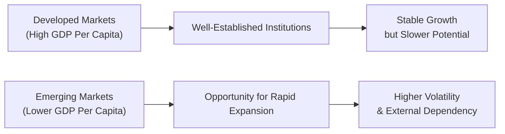

## Introduction

I remember chatting with a former colleague who worked in both New York and Nairobi. He would say, “Well, in the US, the roads just exist; in Kenya, we have to fight for every bit of asphalt.” His point was that something as basic as infrastructure—good roads, reliable electricity, decent internet—can make or break a country’s growth story. And that is precisely the conversation we tackle in this section: what causes developed markets (DMs) to have stable, though perhaps slower, growth, and what fuels emerging markets (EMs) to leap ahead (and sometimes stumble) in their pursuit of higher GDP?

Below, we’ll explore how various factors—such as demographics, governance, infrastructure, and more—can either enhance or constrain a nation’s long-term expansion. Then, we’ll connect these insights to potential CFA exam scenarios, especially the item set (vignette) format that might ask you to compare two markets with starkly different economic fundamentals.

## Key Enhancers for Growth

### Openness to Trade
One major catalyst for growth is how open a country is to global trade. When economies lower tariff barriers and actively encourage exports and imports, they benefit from:
• Technology transfer (new production techniques “flowing in”).
• Raw material affordability and supply chain optimization.
• Increased competition, which often drives domestic firms to innovate or reduce inefficiencies.

For instance, you might see a vignette describing a country that joins a regional trade bloc, prompting an influx of foreign direct investment (FDI) and boosting local job creation. On the exam, they could ask you to assess the likely impact on wages, productivity, and price levels.

### Investment in Education and R&D
Quality education and research foster human capital development and innovation, fueling productivity growth. Think about how Germany is famous for its technical apprenticeships, or how South Korea invests heavily in STEM research—these investments often correlate with robust long-term growth. A strong research ecosystem also helps economies move up the value chain, producing higher-margin goods or services rather than simply manufacturing low-value items.

### Sound Macroeconomic Policies
Emerging markets often face the classic struggle of maintaining stable inflation while trying to push economic expansion. However, countries that adopt credible institutions—like an independent central bank—and maintain responsible fiscal deficits often enjoy lower borrowing costs and stronger currency stability. In the CFA exam context, it’s common to see a question about two countries with vastly different inflation rates and how that affects foreign investment or interest rate parity (see Chapter 3 for more details on interest rate parity conditions).

### Strong Governance and Institutions
By “institutions,” we’re talking about effective government bodies, a reliable legal system, financial transparency, and so forth. If property rights and contract enforcement are weak, foreign investors might be spooked. Likewise, corruption can siphon off resources that would otherwise go into productive investments like roads, schools, or healthcare. Strong institutional frameworks create a fertile environment for businesses to flourish and for individuals to trust the system.

## Common Constraints on Growth

### Demographics and Labor Force
Developed markets, such as Japan or many Western European countries, are aging rapidly. An older population typically means fewer new workers entering the labor force—thus limiting the natural rate of GDP growth unless productivity gains offset smaller labor pools.

Emerging markets often have a demographic dividend—lots of young people ready to work. However, if the education system is underperforming or the economy fails to create enough jobs, that “potential” can morph into instability or underemployment. On a CFA exam vignette, you might see a scenario comparing an aging economy reliant on advanced robotics to an EM brimming with young workers but lacking education or infrastructure.

### Political Instability or Conflict
Political turmoil can scare off investment—domestic or foreign. Even short bouts of unrest (e.g., coups, civil strife, or severe policy uncertainty) might lead to capital flight. Countries with recurring conflicts might experience chronically low investment, stalling long-term growth. 

### Poor Infrastructure
I once spent two hours in a taxi on an unpaved road just trying to reach a factory that was only a few miles out of town. This personal anecdote drives home that poor roads and unreliable electricity can hamstring productivity. Companies may have to build their own power plants, water facilities, and in some cases even roads, which significantly raises costs.

### Overreliance on Commodities
If a country leans heavily on a single commodity, it risks volatile export revenues, especially if global commodity prices swing drastically. Such reliance can limit stable growth, leading to the so-called “resource curse,” where excessive focus on extracting natural resources undermines both diversification and institutional development.

### Unsustainable Debt Levels
When governments (or private sectors) borrow beyond their capacity, especially in foreign currency, they become vulnerable to external shocks—like a sudden decline in export earnings or a sharp rise in global interest rates. This dynamic can derail growth, force painful austerity measures, or even trigger currency crises. 

## Developed vs. Emerging: Two Different Journeys

To visualize these differences at a high level, consider the following flowchart:

• Developed Markets (DMs): Rely on innovation, services, and advanced infrastructure. Typically face demographic headwinds (aging populations), slower growth rates, but enhanced stability.  
• Emerging Markets (EMs): Often have bigger leaps in GDP thanks to industrialization and a youthful population, but they can experience dramatic downturns if external financing dries up or if governance fails.

## Exam Relevance and Vignette Applications

In the CFA exam, a typical item set could describe two fictional countries—say, “Northland” (a developed market) and “Southovia” (an emerging market). You might be given data on population growth, inflation, trade policies, or institutional quality. Then, you’ll be asked to:

• Identify which country is likely to have higher potential growth.  
• Evaluate risks, such as commodity price swings or political strife, that could constrain growth.  
• Relate these differences to forecasting exchange rates, interest rates, and corporate earnings (concepts covered elsewhere in this volume).  

Be sure to link these constraints and enhancers directly to the concept of potential GDP (see Section 6.2 for deeper discussion). A strong item set answer typically highlights how demographic trends, human capital, or policy credibility can alter a nation’s trajectory.

## Final Takeaways for the CFA Exam

• Keep an eye on key metrics: demographic profiles, FDI inflows, debt-to-GDP ratios, and institutional quality.  
• Understand that advanced economies often hinge on productivity, while emerging markets can rely heavily on labor-force expansion.  
• Connect the dots: a high corruption index might lower growth and raise borrowing costs, or a robust education system could enhance a country’s productivity potential.  
• Remember that external shocks—like a global financial crisis—can hit emerging markets harder, although developed countries are not immune.  

A big part of the exam is weaving these points together to demonstrate that you grasp not just the “what,” but the “why.” If a country’s central bank is credible, that fosters investor confidence, which in turn supports currency stability and encourages domestic investment. By contrast, if there's a fear of expropriation or legal uncertainty, capital might flee, hurting growth.

## References and Further Reading

- World Bank “Global Economic Prospects” reports:  
  https://www.worldbank.org/en/publication/global-economic-prospects  
- UN Human Development Reports:  
  https://hdr.undp.org/  
- CFA Institute Level II Curriculum case studies on EM vs. DM growth patterns  

-----

## Practice Questions: DM vs. EM Growth Dynamics



### Which factor typically enhances long-term growth potential in both developed and emerging markets?

- [ ] Large current account deficits
- [x] Strong institutional frameworks
- [ ] Rapid inflation
- [ ] Overreliance on a single export commodity

> **Explanation:** Effective governance, rule of law, and institutional strength foster investor confidence and sustainable growth in both DM and EM economies.

### Which demographic trend most commonly constrains growth in developed markets?

- [ ] Rapidly increasing birth rates
- [x] An aging population
- [ ] High presence of skilled foreign workers
- [ ] Large-scale rural-to-urban migration

> **Explanation:** Many DMs face aging populations, reducing labor force expansion and putting pressure on social services, thereby slowing potential GDP growth.

### Why is a stable macroeconomic policy framework considered essential for emerging markets?

- [ ] It makes capital flows unnecessary.
- [x] It creates confidence among foreign investors, reducing risk premiums.
- [ ] It guarantees perpetual double-digit GDP expansion.
- [ ] It allows governments to operate without legal frameworks.

> **Explanation:** Sound macroeconomic policy (e.g., low inflation, credible central bank) steadies investor perceptions of country risk, leading to more stable capital inflows and lower borrowing costs.

### How might high corruption levels affect an emerging market’s economic growth?

- [ ] It always increases investment by eliminating red tape.
- [x] It can raise the cost of doing business and deter foreign capital.
- [ ] It guarantees a stable corporate environment.
- [ ] It rarely has any significant impact on long-term GDP.

> **Explanation:** Corruption creates uncertainty, increases business costs, and undermines institutional trust, which often reduces both domestic and foreign investment inflows.

### In a typical CFA exam vignette comparing DM and EM growth, which statement is most accurate?

- [ ] DMs rely primarily on labor force expansion to drive growth.
- [ ] EMs often have patriarchal institutions, while DMs do not.
- [x] EMs may grow faster due to younger populations but can be more volatile.
- [ ] DMs rarely benefit from innovation or R&D spending.

> **Explanation:** Many EMs boast younger populations that contribute to rapid labor force growth, but weaker institutions and dependence on external financing can create volatile economic swings.

### A country with strong infrastructure and a high literacy rate is more likely to:

- [x] Have higher productivity and attract more FDI.
- [ ] Discourage exporter participation.
- [ ] Encounter large trade imbalances due to capital flight.
- [ ] Experience total reliance on agricultural exports.

> **Explanation:** Good infrastructure and educated workers boost productivity and investor appeal, supporting sustainable growth.

### Which of the following often amplifies external vulnerability in emerging markets?

- [x] Foreign currency debt
- [ ] Unique cultural heritage
- [x] Reliance on commodity exports
- [ ] Overinvestment in R&D

> **Explanation:** Carrying debt denominated in foreign currency leaves borrowing nations exposed to exchange rate risk. Heavy commodity reliance can lead to large revenue swings if global prices change abruptly.

### What is a key aspect of a demographic dividend that supports EM growth?

- [ ] A shrinking labor force
- [x] A high proportion of working-age individuals relative to dependents
- [ ] Lack of in-country management expertise
- [ ] Surplus of retirees reinvesting pension funds

> **Explanation:** When a population has many working-age people and fewer dependents, resources can be allocated more effectively to boost production and overall economic output.

### In the context of developed markets, productivity gains are crucial because:

- [x] They compensate for a shrinking labor force.
- [ ] They automatically lead to hyperinflation.
- [ ] They ensure that no further capital investment is needed.
- [ ] They discourage technological improvements.

> **Explanation:** As population growth slows or even declines in many DMs, productivity improvements become essential for continued GDP growth.

### True or False: Political instability in emerging markets usually has no impact on long-term growth potential.

- [ ] True
- [x] False

> **Explanation:** Political instability often deters both local and foreign investment, increases capital flight risk, and weakens institutional trust—thereby constraining long-term growth prospects.


