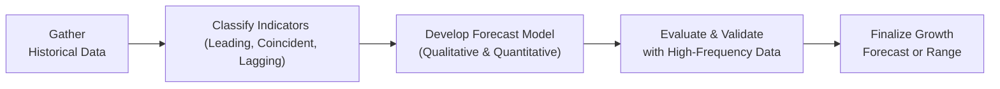

## Introduction
I can still recall my very first internship experience, where my manager handed me a stack of spreadsheets and asked me to “forecast next quarter’s GDP growth.” At the time, I had no clue about leading indicators—let alone the difference between something that signaled a recession ahead of time versus something that merely confirmed it once it slammed you in the face. But as I dug deeper into the data, I grew fascinated by how many tools were out there to gauge economic performance.

Fast-forward to your CFA Level II journey: you’ll likely see exam vignettes presenting unique snippets of macro data—such as consumer surveys, retail sales figures, or capital expenditure reports—and you’ll need to stitch them together to form a coherent growth outlook. Understanding economic indicators and forecasting tools is crucial to that skill. In this section, we’ll explore the different types of indicators, discuss various forecasting techniques, walk through a structured approach to growth forecasting, and highlight common pitfalls so you can avoid them in your exam practice (and in real life).

## Classification of Economic Indicators
Economic indicators are typically grouped based on whether they signal, move along with, or confirm changes in economic activity. Knowing how each class behaves can help you place a barrage of data in context.

### Leading Indicators
Leading indicators tend to move ahead of the overall economy. They provide clues about where the economy might be going in the near future—even before official data (like GDP) is published.  

Common examples include:
• Purchasing Managers’ Index (PMI)  
• New Orders for Manufacturing  
• Building Permits  
• Consumer Sentiment Index  

These data points are particularly alluring to analysts because they can help predict the next phase of the business cycle. For instance, consistent declines in new building permits might warn of future slowdowns in construction and household spending.

### Coincident Indicators
Coincident indicators move in tandem with the broader economy; they track what’s happening right now. They are a kind of real-time barometer. While these indicators don’t provide an early warning signal, they confirm the current state, helping you understand whether the economy is in an expansion, contraction, or somewhere in between.

Examples of coincident indicators include:
• Real GDP  
• Industrial Production Index  
• Employment Levels  

In an exam vignette, coincident indicators might show conflicting directions (e.g., consumption is up while industrial production is down). You’ll need to parse these nuances carefully, integrating multiple signals to diagnose where the economy is in the business cycle.

### Lagging Indicators
Lagging indicators confirm trends after they have begun. They are a bit like the rearview mirror of economic data. Although they won’t help you get ahead of changes, they provide validation that a new cycle has truly emerged.

Examples commonly cited:
• Consumer Price Index (CPI) inflation  
• Unemployment rate  
• Inventory-to-sales ratios  

If these indicators are trending upward while the economy is already expanding, that’s a strong sign the expansion is well under way.

## Forecasting Techniques
Forecasting can be approached both qualitatively and quantitatively—or, as is often the case in practice, with some blend of the two. Each method has its pros and cons, and your choice might hinge on data availability, the complexity of the economic environment, and your personal (or firm’s) forecasting philosophy.

### Qualitative Approaches
Qualitative forecasting relies on expert judgments, consensus-building, and scenario planning to craft narratives around future developments. It’s especially handy when data is sparse or when unprecedented events (like a new trade war or major regulatory overhaul) potentially invalidate purely statistical models.

• Expert Opinion: Sometimes, you just want the best minds in the field to give their perspectives.  
• Delphi Method: Typically involves gathering forecasts anonymously from a panel of experts, summarizing them, and redistributing the summary for further comment, converging toward a refined forecast over multiple rounds.  
• Scenario Writing: Analysts develop multiple plausible stories about the future—optimistic, pessimistic, and base-case. Each scenario is fleshed out with assumptions about key variables such as interest rates, policy decisions, and global demand.

### Quantitative Approaches
When you have historical data that’s statistically robust, quantitative methods can be incredibly powerful. They help you examine correlations, detect patterns, and produce numerical values for your forecasts.

#### Time-Series Models
Time-series models rely on patterns in historical data to predict future values. Two commonly used methods:

• Autoregressive (AR) Models: These use past observations of the variable itself (e.g., last quarter’s GDP growth) to forecast future values. A simple AR(1) model might look like:


X_{t} = c + \phi_{1} X_{t-1} + \epsilon_{t}


where:
– \\(X_{t}\\) is the value of the series at time t  
– \\(c\\) is a constant term  
– \\(\phi_{1}\\) is the coefficient applied to the previous period’s value  
– \\(\epsilon_{t}\\) is the error term  

• ARIMA (AutoRegressive Integrated Moving Average): Extends AR models to account for trends (integration) and incorporate moving averages (MA) of past errors.

#### Econometric Models
Econometric models (often multiple regressions) link GDP growth (or another target variable) to several explanatory variables—like interest rates, consumer spending, investment levels, or even demographic factors. For instance:


\text{GDP Growth}_{t} = \beta_{0} + \beta_{1}\,\text{Interest Rate}_{t} + \beta_{2}\,\text{Consumer Spending}_{t} + \epsilon_{t}


The advantage of econometric models is that they let you see how changes in each explanatory variable might affect growth—holding everything else constant. But be wary of omitting key variables or ignoring structural changes that can skew results.

#### Leading Indicator Composite Indexes
Many analytical agencies or research institutions combine multiple leading indicators into a single “composite” index. For example, The Conference Board Leading Economic Index (LEI) for the United States weighs factors like new orders, average weekly manufacturing hours, and stock prices, among others, to gauge the health of the economy. Another resource is the OECD’s Composite Leading Indicators, used to monitor and predict turning points in the cycles of economic activity.

These indexes help simplify the interpretation of multiple data points into a single, user-friendly metric. That said, it’s essential to check exactly which variables go into the index and how they’re weighted.

## Common Steps in Growth Forecasting
Integrating your chosen indicator set into a cohesive forecast can be a bit like cooking: you gather your ingredients, decide on a recipe, and then taste-test before finalizing. Let’s break down a recommended process:

• Analyze Historical Patterns: Review historical GDP growth data, identifying expansions, slowdowns, or recessions. Observe how leading and coincident indicators performed during previous cycles.  
• Identify Structural Changes: Look out for major policy shifts (tax reforms, new trade agreements), demographic trends (aging population, large immigration inflows), or technological disruptions (widespread AI adoption).  
• Incorporate Global Linkages: Factor in the economic health of main trading partners, global commodity prices, and foreign exchange rates. A country heavily reliant on oil exports will have very different vulnerabilities than a high-tech service economy.  
• Evaluate High-Frequency Indicators: Watch weekly or monthly data like jobless claims, retail sales, or consumer surveys that update more frequently than (say) quarterly GDP.  
• Cross-Check with Surveys: Business sentiment surveys, such as PMI, can confirm or challenge the signals from purely statistical analysis. Consumer confidence surveys provide clues about future consumption behavior.

## Common Pitfalls
Forecasting is as much art as it is science, and a few traps consistently challenge even the best analysts:

• Overreliance on Backward-Looking Data: Historical patterns can be instructive, but unexpected shocks (think geopolitical events, pandemics) might make old relationships obsolete.  
• Political Shocks or Policy Uncertainty: Large-scale changes in government spending or an overhaul of tax systems can create structural breaks in data. Models built on old data may go off track if they don’t incorporate these changes.  
• Model Specification Errors: Omitting key variables, or incorrectly assuming linear relationships, can yield flawed forecasts. In many exam scenarios, you’ll need to identify when a simplified approach might fail.  

## Relevance to CFA Level II
In the exam’s item set (vignette) format, you may see partial (and sometimes seemingly conflicting) data: a leading indicator pointing downward but a coincident indicator looking stable. You’ll need to provide a nuanced assessment of future economic performance rather than a simple, black-and-white conclusion. Additionally:

• You might be required to calculate short-run forecasts using time-series data presented in a chart or table.  
• You could be asked to interpret a composite leading indicator index or a newly published econometric study.  
• You may encounter scenario-based questions where you weigh qualitative inputs—like political developments—against quantitative data.

Confidence in your ability to parse these signals will be key to forging strong answers and demonstrating that you’re more than just a number cruncher.

## Example: Simple Forecast Exercise
Let’s do a quick demonstration. Imagine a scenario in which a fictitious country, Econoland, shows:

• A consistent increase in new manufacturing orders (leading indicator).  
• Stabilizing retail sales (coincident indicator).  
• A slightly rising unemployment rate, but from historically low levels (lagging indicator).  
• A major government plan for increased infrastructure spending (structural policy shift).

Piecing these together, how might we arrive at a short-term GDP forecast of, say, 2.5%?

1. Leading signals are strong (new manufacturing orders up), suggesting near-term production and job creation.  
2. Coincident retail sales are stable, implying consumer spending is not slipping.  
3. The unemployment rate is a lagging indicator, so a mild uptick might not be as alarming—especially if it is coming off an unusually low base.  
4. Infrastructure spending could provide an extra push to future growth, offsetting weaker segments of the economy.

Therefore, the near-term outlook appears moderately positive. On the exam, you might be asked: “Which data points justify your forecast?” or “How might the infrastructure plan alter your econometric model?” Practicing these steps in smaller case studies can sharpen your exam skills.

## Visualizing the Forecasting Process
Below is a Mermaid flowchart illustrating a simplified forecasting workflow. It’s helpful to keep this process in mind when you see data-laden vignettes:

## Conclusion
If all of this feels a little overwhelming, don’t worry. Forecasting is partly iterative—each step refines your thinking, just like each CFA exam practice session improves your test-taking instincts. The key is to stay flexible, remain skeptical, and cross-verify with multiple data sources whenever possible.

Exam tip: Don’t get swayed by a single indicator. Look for convergence among various types (leading, coincident, and lagging). If you see major contradictions—for example, the PMI dropping but retail sales surging—be ready to articulate why these divergences might exist and how they could affect your final forecast.

## References
- The Conference Board Leading Economic Index:  
  https://www.conference-board.org/data/bcicountry.cfm  
- OECD’s Composite Leading Indicators:  
  https://www.oecd.org/sdd/leading-indicators  
- CFA Program Curriculum—Use official practice examples to hone forecasting question approaches.

---

## Test Your Knowledge: Forecasting Tools and Economic Indicators



### Which best describes a leading economic indicator?
- [ ] Data collected from financial statements that confirm a previous trend.
- [x] A measurable factor providing early signals of future economic performance.
- [ ] An indicator moving simultaneously with the overall economy.
- [ ] A factor that confirms an existing trend in the economy.

> **Explanation:** Leading indicators, such as new manufacturing orders and consumer sentiment, help predict economic turns before they occur.

### Which of the following is an example of a coincident indicator?
- [ ] Purchasing Managers’ Index (PMI)
- [ ] Unemployment rate
- [x] Real GDP
- [ ] New building permits

> **Explanation:** Real GDP is a coincident indicator; it moves in line with the economy’s overall performance.

### Which qualitative forecasting method seeks consensus from a panel of experts using anonymity and iterations?
- [ ] Scenario planning
- [ ] Econometric modeling
- [x] Delphi method
- [ ] ARIMA

> **Explanation:** The Delphi method gathers expert opinions anonymously through multiple rounds, refining the forecast at each stage.

### In a time-series model, an AR(1) process typically includes:
- [x] A constant term, a coefficient multiplied by the previous value, and an error term.
- [ ] Multiple independent variables representing economic conditions.
- [ ] Only a single moving average term with no previous values.
- [ ] A combination of different autoregressive orders and multiple smoothing parameters.

> **Explanation:** An AR(1) uses only the previous period’s value as the predictor, along with a constant and an error term, making it a simple autoregressive structure.

### Econometric models for forecasting GDP growth typically:
- [x] Use multiple explanatory variables like interest rates or consumer spending.
- [ ] Exclude structural breaks to maintain data consistency.
- [x] Rely on regression analysis to understand relationships between variables.
- [ ] Rely solely on time-lagged monthly data with no real-time inputs.

> **Explanation:** Econometric models usually include several explanatory variables and rely on regression-based techniques to quantify relationships. However, structural breaks should not be ignored (one of the pitfalls).

### Which is a common pitfall in economic forecasting?
- [x] Overreliance on historical data without accounting for shocks.
- [ ] Using both leading and lagging indicators together.
- [ ] Including consumer sentiment measures.
- [ ] Adjusting forecasts for policy changes.

> **Explanation:** Overfitting a model to past data without accommodating unexpected disruptions can lead to incorrect forecasts.

### What is one important benefit of composite leading indicator indexes?
- [x] Simplifying multiple data points into a single metric.
- [ ] Removing the need for econometric analysis.
- [x] Providing straightforward signals about potential turning points.
- [ ] Perfectly predicting inflation trends over a 10-year horizon.

> **Explanation:** Composite indexes help combine and interpret multiple leading data points, though they’re not foolproof for long-term predictions.

### A lagging indicator is likely to:
- [x] Confirm an economic trend after it has begun.
- [ ] Predict major changes before they start.
- [ ] Move precisely in lockstep with real-time GDP readings.
- [ ] Remain unaffected by structural economic shifts.

> **Explanation:** Lagging indicators provide confirmation of existing trends rather than early clues about what’s coming next.

### When leading indicators suggest a decline but coincident indicators remain stable, an analyst should:
- [x] Investigate the divergence and consider potential delays or sector-specific factors.
- [ ] Immediately conclude no economic slowdown is on the horizon.
- [ ] Disregard leading indicators as inaccurate.
- [ ] Focus solely on lagging indicators for clarity.

> **Explanation:** Divergent signals warrant deeper analysis; leading and coincident indicators can temporarily deviate, and an analyst needs to reconcile the discrepancy.

### True or False: Consumer Price Index (CPI) inflation is always considered a leading indicator.
- [ ] True
- [x] False

> **Explanation:** CPI inflation is generally classified as a lagging indicator because it typically confirms trends that have already taken shape in the economy.


