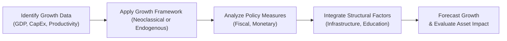

## Analyzing Growth Data in an Investment Context

Sometimes, you’ll see an item set in the exam that gives you a whirlwind of macro data—GDP growth rates, inflation, unemployment trends, and even notes on tech enhancement or education reforms—and says, “Now, which asset class is attractive here?” And you’re like, “Um, wait, how do I piece all that together?” Well, this piece is all about that. We’ll dive deep into how real GDP growth and structural or cyclical factors shift the potential output of an economy. Then we’ll see how that translates into decisions around which equities or bonds look appealing based on the economy’s growth trajectory. Sound good?

Below, we’ll explore practical vignettes that mimic what you’ll see on the CFA® Level II exam. We’ll walk through how to dissect the data, connect it to growth models, and interpret the results in terms of investment decisions. Let’s go!

## Typical Item Set Scenarios

A common scenario might include:
- Country A implementing structural reforms (infrastructure and education) to spur productivity.  
- Country B relying more heavily on cyclical demand (consumer spending booms) without significant policy changes.  

The item set might show you GDP forecasts, demographic shifts, proposed policy changes, and snapshots of corporate earnings growth. Your task is to figure out how these data points shape the future environment. Do we expect faster productivity gains (pushing up potential GDP) or just a short-term surge in demand (possibly triggering a boom-bust cycle)? After concluding that, you often must judge how these growth expectations translate into attractiveness of equities, bonds, or other investment vehicles.

### Case Example: Equities Allocation

Imagine an analyst evaluating two emerging-market economies for an equity fund allocation. One economy has a strong labor force, invests heavily in technology, and has stable government policies aimed at promoting free trade. The other experiences rapid demand growth from a one-time consumer credit expansion but invests very little in public infrastructure. Even if both are forecast to grow at, say, 4% next year, the sources of that growth differ. The first might maintain (or even accelerate) growth beyond next year, while the second might flame out if credit conditions tighten. So the lesson? Always look under the hood at quality vs. quantity of growth.

## Frameworks for Growth Evaluation

When analyzing vignettes on economic growth, you’ll typically rely on one or more theoretical frameworks:

- Neoclassical Growth Model: Emphasizes diminishing returns to capital. Long-run growth depends on exogenous factors like technology.  
- Endogenous Growth Model: Suggests technology and innovation can be influenced by internal factors (like R&D, education, and investment in human capital).  
- Classical View / Malthusian Elements: Sometimes included to highlight the limits of certain resources or how population grows faster than resource availability, though this is less common in modern macro modeling.

### Using Growth Models in Vignette Interpretation

You might see a table that says “In the last five years, Country X spent 5% more of GDP on research and development each year,” or “Country Y invests heavily in education.” Under an endogenous growth lens, you might conclude that Country X’s potential output is likely to shift higher relative to Country Y. Meanwhile, a purely neoclassical lens might lead you to consider whether they face diminishing returns or whether technological growth is truly exogenous. For exam item sets, usually a combination of these perspectives aids your final conclusion.

## Structural vs. Cyclical Growth

Distinguishing between structural and cyclical growth is crucial in making sense of the data. Structural growth arises from improvements in supply-side factors, like technology or labor force quality. Cyclical growth is short-term, driven by fluctuations in aggregate demand.

- Structural Growth Example: A government invests in highways and broadband, or it enacts educational reforms that might only yield results in 10 years.  
- Cyclical Growth Example: Retailers experience a holiday shopping splurge, or a government stimulus program temporarily boosts consumption.

### Linking Growth Type to Investment Decisions

• If growth is primarily cyclical and above potential, we often expect rising inflation pressures and likely monetary tightening. This can push bond yields up (and bond prices down) while potentially capping equity valuations if the tightening leads to higher discount rates.  
• If growth is structural (long run), it supports higher corporate earnings over time without necessarily stoking immediate inflation. That scenario often benefits equity markets, especially those sectors related to technological advancements, or areas leveraging improved human capital.

## From Forecast to Asset Allocation

So how, exactly, should you tie a growth forecast to whether you buy stocks, sell bonds, or hold cash? In practice, you:
1. Compare Actual vs. Potential GDP. Determine if the economy is operating above, at, or below capacity.  
2. Factor in Demographic Trends. An aging population might weigh on long-term growth, or strong immigration might boost the labor force.  
3. Evaluate Policy Environment. Expansionary monetary or fiscal policy might jump-start consumer demand, while supply-side reforms (like tax incentives for R&D) can spur longer-run productivity.  
4. Combine Both Macro & Micro Analysis. Overlay what’s happening at the firm or sector level (are they capitalizing on structural improvements?) with the big macro picture.  

### Example Calculation: Potential GDP

One simplified formula used in growth-related analysis is:


\text{Potential GDP} = \text{TFP} \times f(K, L)


where TFP stands for Total Factor Productivity, and \\( K, L \\) are capital and labor inputs, respectively. A big jump in TFP (through technology or improved efficiency) can shift an economy’s potential output significantly. In a vignette, you might see an analyst note that TFP is expected to rise due to new R&D incentives, signaling a possible bull case for that market’s equities.

## Identifying Inflationary or Recessionary Gaps

Vignettes often provide a mix of data:
- Real GDP growth relative to potential (e.g., “Estimates suggest the economy’s potential growth is 3%, while current reported growth is at 5%.”).  
- Inflation indicators and capacity utilization.  

If real GDP growth exceeds potential for a sustained period, that economy likely faces inflationary pressures, increasing the odds of tight monetary policy. This environment might cause short-term interest rates to rise, which can hurt bond valuations. On the other hand, if growth is below potential, policymakers may lower rates to stimulate the economy, potentially supporting bond prices and eventually reviving equities.

## Practical Mermaid Diagram: Growth Analysis Steps

Below is a quick flowchart showing how you might approach growth data in a vignette. You’d start by collecting the data, picking a suitable growth framework (neoclassical/endogenous), integrating policy or structural considerations, and then forecasting how growth will impact asset prices.



## Answering Vignette Questions Effectively

When faced with a data-packed vignette, chunk it into manageable sections:

1. Tabular Data (e.g., GDP, labor force participation, CapEx): Look for upward or downward trends, outliers, or contradictory signals.  
2. Textual Analysis (analyst reports, policy announcements): Note whether the government is focusing on short-term demand management or long-term competitiveness.  
3. Growth Model Assessment: Decide if the data correspond more closely to neoclassical (capital deepening with diminishing returns) or endogenous frameworks (persistent productivity gains).  
4. Final Interpretation: Are we seeing a cyclical upswing or a structural improvement? How should that influence equity vs. bond allocations?

### Reliability of Data and Pitfalls

Data can be deceiving—especially in exam vignettes. Maybe the economy’s GDP jumped 4% this year due to one-off events (like a major sporting event or a big government contract). In that case, it might not forecast a sustainable long-term trend. Always look for disclaimers or footnotes: “Analyst’s model does not account for partial data from private sectors” might hint that the data is incomplete. If a question specifically flags data reliability, approach the final answers with caution.

## Practical Vignette Example

Suppose you’re given the following scenario:
- Country Alpha invests 2% of GDP annually in advanced tech R&D.  
- Country Beta invests 5% in consumer subsidies but only 0.5% in R&D.  
- Both expect a 4% annual GDP growth in the next two years.  
- The policy environment in Alpha is stable, with modest inflation. Beta’s inflation is trending at 6%, and the central bank signals possible rate hikes.

How do you interpret this?

1. Both countries show decent near-term growth, but Beta’s growth is mostly cyclical or short-term, fueled by consumer subsidies.  
2. Because Beta’s inflation is high, it may soon face monetary tightening, undercutting bond prices.  
3. Alpha invests in technology, which might raise TFP and push up potential GDP in the long run. This suggests equities could benefit from sustained productivity gains.  
4. Put it all together for your final conclusion: If forced to choose over a longer horizon, you might find Alpha’s equity market more attractive. Over the shorter horizon, Beta’s cyclical upswing could provide a short burst but watch out for the negative side effects of rate hikes.

## Linking Growth Forecasts to Asset Class Performance

Think of it like a big puzzle:  
- Equities often thrive if an economy has stable or accelerating growth, particularly if the growth is structural (higher EPS, stronger margins).  
- Bonds do better when growth is at or below potential (keeping inflation and interest rates relatively low).  
- If growth is well above potential, central banks usually intervene with rate hikes, pressuring bond prices and possibly cooling down equity exuberance.

### Python Snippet: Quick Growth Calculation

Here’s a tiny example of how you might approximate potential GDP growth in Python, especially if you’re building an internal model. (This is just to illustrate how one might do quick calculations for forecasting—no need to memorize Python for the CFA exam!)

```python
tfp_growth = 0.015  # 1.5%
capital_growth = 0.02  # 2.0%
labor_growth = 0.01  # 1.0%

potential_gdp_growth = 0.4 * tfp_growth + 0.3 * capital_growth + 0.3 * labor_growth

print(f"Estimated Potential GDP Growth: {potential_gdp_growth * 100:.2f}%")
```

In a real scenario, you’d refine the weights, but this snippet is a quick demonstration of concept. If a vignette told you that TFP growth, capital formation, and labor growth each changed, you could alter these rates and see how potential GDP might shift.

## Best Practices and Common Pitfalls

• Don’t Overlook the Output Gap: If you see the phrase “current output is well above potential,” think inflation risk and rate hikes.  
• Keep an Eye on External Factors: Global commodity price spikes or currency depreciation can also play a big role. The exam might slip in a detail about global supply constraints—don’t ignore it!  
• Watch for Contradictory Data: If the text says “unemployment is rising,” but consumption is also skyrocketing, question whether the data is short-term or whether there’s a different structural dynamic at play.  
• Time Horizons Matter: A short-run cyclical boom can overshadow long-run structural weaknesses (or vice versa). The exam might ask, “Which country is more attractive for a 10-year investment horizon?” and your answer could differ from a 1- to 2-year horizon perspective.

## Practice Vignettes: Making It Real

One of the best ways to master these concepts is to practice item set questions that simulate real or hypothetical countries. Look for data on:
- Policy statements (fiscal or monetary).  
- Structural reforms (infrastructure, education, R&D spending).  
- Demographics (aging, immigration, birth rates).  
- Productivity data (output per worker).  

Then interpret how these shape potential vs. actual growth and draw investment implications for fixed income, equities, or alternative assets.

## Final Exam Tips

• Read the Vignette Carefully: It’s easy to miss a detail about inflation or a subtle statement about policy changes that can change your conclusion.  
• Connect the Dots: Don’t just label a piece of data. Show how it influences your overall assessment of cyclical or structural growth and subsequent asset implications.  
• Practice Time Management: In the real exam, you’ll have multiple item sets. If you get stuck on the macro data, move on to the more direct finance questions—then come back with fresh eyes.  
• Keep a Macro to Micro Flow: Start from the big picture (GDP growth trends, policy) and then narrow down to the specific question (equities or bonds?).

## References and Further Reading

- CFA Institute’s End-of-Chapter Practice Problems—Level II Economics.  
- McKinsey Global Institute Research on Productivity and Growth:  
  – https://www.mckinsey.com/mgi  
- “Journal of Economic Perspectives” for peer-reviewed discussions on growth.  
- Academic references on Neoclassical vs. Endogenous Growth Theories in your local university library.  

--------------------------------------------------------------------------------

## Growth Impacts on Investment Decisions: Practice Questions



### Determining Factors of Potential GDP

- [ ] Changes in short-term consumer sentiment
- [x] Improvements in technology leading to higher productivity
- [ ] One-time holiday sales surge
- [ ] Temporary tax rebates

> **Explanation:** Potential GDP reflects long-run capabilities of an economy. Technology improvements boost productivity and thus raise potential output, whereas a one-time surge in sales or consumer sentiment doesn’t inherently shift that long-run capacity.

### Spotting Meaningful Structural Shifts

- [x] Increased government spending on education and R&D
- [ ] Seasonal fluctuations in employment during tourist season
- [ ] Opportunistic retail discounts in holiday periods
- [ ] Temporary commodity price spikes

> **Explanation:** Structural shifts usually come from long-term factors like expanded education and R&D. Seasonal fluctuations and retail discounts are short-term or cyclical elements.

### Impact of an Accelerating Output Gap Above Potential

- [x] Likely upward pressure on inflation
- [ ] Reduced likelihood of interest rate hikes
- [ ] Increase in bond prices
- [ ] Decrease in central bank intervention

> **Explanation:** When real GDP consistently overshoots potential, the economy risks overheating, leading to inflation. Central banks usually manage this via tightening, which puts upward pressure on rates and downward pressure on bond prices.

### Evaluating a Rapidly Growing Emerging Economy

- [ ] Always implies sustainable structural growth
- [x] Could be driven by temporary factors like credit expansions
- [ ] Indicates immediate rate cuts by the central bank
- [ ] Necessarily means safe conditions for bond investors

> **Explanation:** Quick growth in emerging markets might rely on short-term factors such as easy credit rather than lasting improvements like technology or infrastructure. This can quickly reverse under tighter monetary conditions.

### Linking Structural Reforms to Equity Outlook

- [x] Structural reforms can enhance long-term earnings potential
- [ ] They have no bearing on equity performance
- [x] They might boost a firm’s productivity and competitiveness
- [ ] Such reforms only matter to fixed-income markets

> **Explanation:** Structural reforms (e.g., infrastructural investments and better labor quality) can elevate a company’s long-run profitability, supporting equity markets. While fixed-income markets are concerned as well, ignoring the equity dimension is a mistake.

### Understanding Endogenous Vs. Neoclassical Growth

- [x] Endogenous growth suggests technology investment can be influenced internally
- [ ] Neoclassical growth never considers diminishing returns
- [ ] Endogenous growth only applies to small, closed economies
- [ ] Neoclassical growth sees tech changes as always under a country’s direct control

> **Explanation:** Endogenous growth theory posits that technology improvements can be spurred by internal factors (like R&D). The neoclassical model treats technological progress as exogenous, and it typically highlights diminishing returns to capital.

### Recognizing Cues for Monetary Tightening

- [x] Persistent inflation above target
- [ ] Sustained negative output gap
- [x] Overheating economy operating above potential
- [ ] Significant improvements in labor productivity only

> **Explanation:** Central banks usually consider tightening monetary policy when inflation is stubbornly high and the economy is producing beyond its long-run capacity. A negative output gap suggests the opposite scenario.

### Short vs. Long Term Horizon Discrepancies

- [x] An economy may appear attractive short-term but might face structural hurdles later
- [ ] Long-term prospects always reflect current stock market performance
- [ ] Only short-term demand matters to stock valuations
- [ ] Structural improvements make no difference in the near term

> **Explanation:** Sometimes an economy experiences a short-term boom even if it lacks strong fundamentals. Over the long run, structural factors (like technology or labor force education) often prove more decisive in sustaining performance.

### Interpreting Unconventional Policy Announcements

- [x] Can signal government intentions to stimulate or restrain demand
- [ ] Rarely have any effect on asset prices
- [ ] Generally irrelevant to structural growth projections
- [ ] Always lead to immediate GDP growth

> **Explanation:** Government interventions—such as unconventional monetary policy or large-scale infrastructure programs—can profoundly affect both the business cycle and longer-term potential growth. They typically influence asset prices by altering the discount rate, inflation expectations, or competitiveness.

### Are Policy-Driven Structural Improvements Always Guaranteed?

- [x] True
- [ ] False

> **Explanation:** It’s tricky, right? It sounds like a guarantee, but in reality, while supply-side policies (like tax incentives or R&D support) aim to foster an economy’s long-run capacity, the effectiveness of policy depends on execution and market conditions. In the exam, or in real life, caution and thorough analysis are necessary.


