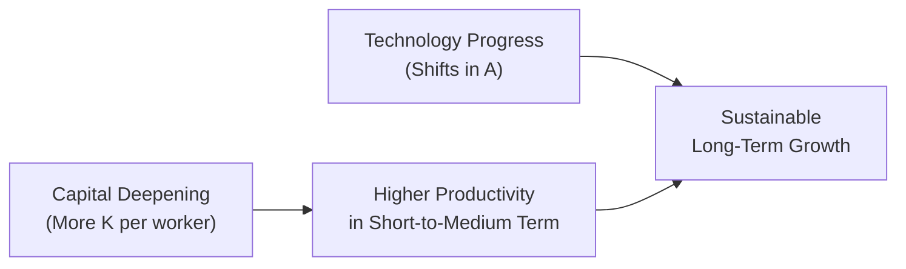

## Overview and Key Concepts

Sometimes, I remember being in a café—yep, a good old coffee chat with a friend—discussing why a country’s economy was roaring ahead while its neighbor’s growth was slowing. We ended up talking about capital deepening and technological progress for almost an hour. Let’s unpack these concepts here in a more structured way, though hopefully just as engaging.

Capital deepening and technological progress are two major engines that push an economy forward. While both can increase productivity, they work somewhat differently. Capital deepening is about increasing the amount of capital (like machinery, infrastructure, or even intangibles) per worker. Technological progress is about improving how we use those resources—innovations that change the production methods, boost efficiency, or create entirely new products.

Understanding how these forces intertwine is key for investment analysts, especially if you’d like to forecast which industries or countries are poised to grow. Let’s break down the nuances.

## Capital Deepening

Capital deepening occurs when there’s more capital stock per worker. This might mean a new factory building or upgraded machinery that helps workers produce things faster (or at a better quality). Even intangible forms such as software and patents count here, reflecting how “capital” no longer simply means forklift trucks or copy machines.

### Diminishing Marginal Returns

Investment analysts pay close attention to something called diminishing marginal returns. If you continuously add capital to a fixed number of workers, each incremental addition of capital eventually yields less extra output than the previous one. At first, giving your staff modern computers instead of old ones might lead to a substantial jump in productivity, but after everyone has a top-of-the-line setup, adding even more computing capacity doesn’t help as much.

In more formal terms, if the production function is:


Y = A \cdot K^{\alpha} \cdot L^{1-\alpha},


increases in \\( K \\) relative to \\( L \\) (that is, capital deepening) will raise output \\( Y \\). But as \\( K \\) grows large compared to \\( L \\), the benefit from each additional unit of capital shrinks because \\(0 < \alpha < 1\\).

### Savings and Investment Spur Capital Accumulation

Economies typically don’t get more capital out of thin air. Households, firms, or governments need to save or invest. High savings rates can fund local investment. If domestic savings aren’t sufficient, foreign direct investment (FDI) might step in to fill the gap—this is often the story for many emerging markets seeking inflows of foreign capital to jumpstart industrialization.

Governments can encourage or hinder these processes in all sorts of ways. Imagine a stable tax policy that rewards businesses for reinvesting profits, or an environment with strong property rights. Such conditions help attract both domestic and foreign capital, leading to more capital deepening over time.

### Practical Example: Manufacturing Upgrade

If a country invests heavily in automated production lines, each worker can manage multiple production tasks simultaneously. Productivity goes up quickly—this is capital deepening in action. In the short- to medium-term, it can significantly elevate output. But as machines proliferate, eventually the next piece of equipment might not revolutionize efficiency like the first did.

## Technological Progress

Technological advances are a different story. We all know that “technology” can evolve much faster than building yet another plant. While capital deepening makes labor more productive through sheer accumulation of assets, technological progress can shift the entire production function upward. Innovation might come from improved processes (like just-in-time inventory systems), new products (like advanced semiconductors), or more efficient ways of organizing resources and workflows.

### Endogenous vs. Exogenous Technology

Now, the older approach (the Solow model in its simplest form) assumed technology was “exogenous,” meaning it arrived from outside factors, almost like a random gift from the innovation gods. More recent “endogenous growth” theories suggest technology evolves because of intentional R&D investments, intellectual property protections, education systems, and the general environment that fosters or hinders creativity. It’s not just luck—policy and corporate strategy do matter.

### Non-Diminishing Returns

Unlike capital deepening, technological advances can sustain growth without necessarily hitting the same kind of diminishing returns. If your economy keeps innovating, you can keep pushing the envelope. Of course, there can be bottlenecks—there’s no guarantee that an innovation pace is steady—but as theory and practice have shown, tech leaps can have a profound, long-lasting impact on growth rates.

### Example: Smartphone Revolution

One vivid example is the transformation brought by smartphones and advanced mobile devices. It’s not just about building more phone factories (capital deepening). It’s about how the technology itself—better processors, software, and network infrastructure—enables entirely new fields like app development, cloud computing, and 24/7 connectivity. Capital deepening helps producers make more phones, but technological progress changes the entire global landscape of communication and productivity.

## Distinguishing Them in the Solow Growth Model

If you recall the typical exponential or logistic curves from your studies, capital deepening moves you along that production curve—giving each worker more capital to use. Technological progress, on the other hand, lifts the entire curve upward. You can see it as two separate effects:

• Capital deepening: Gains in output per worker but subject to diminishing returns.  
• Technology shifts (A in the production function): Sustained, longer-term growth potential with repeated innovations.

In a sense, capital deepening can keep your boat afloat and maybe raise it a bit, but technology is the tide that can lift all boats together.

Below is a simple diagram to visualize how capital deepening and technological progress relate in a typical model:



In this flowchart, both capital deepening and technological progress eventually contribute to growth, but technology is what can continually move your productivity frontier to new heights.

## Empirical Evidence and Convergence

Historically, emerging economies rely strongly on capital deepening, especially in early development stages. Factories, roads, utilities—these are the backbone of industrial takeoff. In low-income countries, simply getting more capital equipment to workers can provide a quick momentum boost. But once an economy reaches a certain upper-middle-income level, the question becomes: “Okay, do they have the innovative capacity (R&D, education, supportive institutions) to push forward technologically?” That’s often a tricky turning point.

### Convergence Hypothesis

In classical growth theory, there’s the idea that poorer countries can “catch up” to richer ones by adopting existing technology. This is sometimes labeled “conditional convergence,” implying that as soon as you have the right institutional setting, you can import advanced technology from more developed nations. However, the real-world evidence is mixed. Some countries manage this extremely well, while others slump, failing to foster the environment for beneficial technology adoption.

## Why It Matters for Investment Analysts

• Identifying Growth Drivers: If a company or country invests heavily in capital equipment, you might see near-term boosts in output and possibly corporate earnings. But watch for the point at which diminishing returns might set in.  
• R&D and Patent Trends: Firms that spend heavily on research and file numerous patents might be investing in long-term technology-driven growth. That can impact valuations, especially for tech or pharmaceutical firms that thrive on innovation.  
• Government Policy & Infrastructure: Keep an eye on policies that promote stable macro conditions, property rights, and supportive R&D environments. Economies with these features often pivot from capital accumulation to more robust technology-based expansions.

## Case Study: Industry Shifts

Let’s say you’re analyzing two manufacturing firms in different countries—one that invests heavily in robotics (capital deepening) and another that invests in advanced analytics software (technological progress). Both might see productivity gains, but the software-driven firm could find new efficiencies or create new product lines if the software evolves. The robotics-driven firm might run into diminishing returns if they keep adding identical robots without further process innovation.

## A Quick Python Snippet (Optional Demonstration)

Below is a playful demonstration in Python (not something you need on the CFA exam, but it illustrates how you might model the impact of capital deepening vs. technology). Feel free to skip if you’re not into coding:

```python
import matplotlib.pyplot as plt
import numpy as np

# We'll vary K, assume L=1, alpha=0.3, and see how Y changes for different A

alpha = 0.3
L = 1
K_values = np.linspace(1, 100, 100)

A_low = 1.0
A_high = 1.5

Y_low = [A_low * (K**alpha) * (L**(1-alpha)) for K in K_values]
Y_high = [A_high * (K**alpha) * (L**(1-alpha)) for K in K_values]

plt.figure(figsize=(8,5))
plt.plot(K_values, Y_low, label='A=1.0 (Lower Tech)')
plt.plot(K_values, Y_high, label='A=1.5 (Higher Tech)', linestyle='--')
plt.title('Capital Deepening vs. Tech Level')
plt.xlabel('Capital (K)')
plt.ylabel('Output (Y)')
plt.legend()
plt.show()
```

In a chart like this, both lines slope upward as \\(K\\) increases (capital deepening), but the higher-tech line rests well above the lower-tech one.

## Common Pitfalls

• Overreliance on Capital Deepening: Some analysts place too much faith in short-run capital accumulation without recognizing that at some point, growth might stall.  
• Underestimating the Power (and Timing) of Innovation: Technological leaps can be unpredictable or might require significant lead time. Don’t expect overnight results, but also don’t discount the compounding impact once an innovation catches on.  
• Insufficient Attention to Policy Frameworks: You might see a developing market with high savings rates, but if property rights or political stability are shaky, capital investment might not materialize or be used productively.

## Exam Application Tips

For the CFA Level II exam, you’ll likely encounter questions that frame an economy’s trajectory in a vignette style. Maybe they’ll provide data on R&D expenditures, saving rates, or policies boosting capital stock. You’d be asked to distinguish how capital deepening explains some of the growth—and how technology drives the rest. Be prepared to identify which factor is most critical to sustaining longer-term growth.

Additionally, watch for item-set questions that describe attempts to draw foreign investment—like big tax breaks or new trade agreements—and connect how those policies facilitate capital deepening. Or you may see a case analyzing how a tech initiative (like 5G adoption) might shift a country’s production function in the future.

## References

- Mankiw, N.G. (2019). “Macroeconomics.” Worth Publishers.  
- Romer, P.M. (1994). “The Origins of Endogenous Growth.” The Journal of Economic Perspectives.  
- CFA Institute: Level II Curriculum, Economics sections on growth and technology.  
- World Bank Data on R&D Expenditure: https://data.worldbank.org/indicator/GB.XPD.RSDV.GD.ZS  

## Test Your Knowledge: Capital Deepening vs. Technological Progress



### In analyzing an emerging market economy, which factor best indicates capital deepening rather than technological progress?

- [ ] R&D spending on autonomous systems
- [x] Rapid expansion of factory machinery per worker
- [ ] Patents granted for internet-based solutions
- [ ] Surge in software start-up incubators

> **Explanation:** Capital deepening specifically relates to increasing the quantity of capital (like factory machinery) per worker, whereas R&D spending or patents reflect technology-driven innovation.

### Which statement best characterizes diminishing marginal returns in capital accumulation?

- [ ] Increases in capital per worker lead to unlimited productivity gains.
- [ ] Increases in technology automatically reduce the capital-labor ratio.
- [x] Each added unit of capital will eventually yield smaller increments in output.
- [ ] Each unit of capital increases output at a constant rate across all values of K.

> **Explanation:** Diminishing marginal returns mean that beyond a certain point, each additional unit of capital provides less additional output than the previous one.

### In the Solow Growth Model, how does technological progress typically appear?

- [ ] A movement along the production function.
- [ ] A decrease in capital’s share of output.
- [ ] An increase in the capital-labor ratio.
- [x] An upward shift of the entire production function.

> **Explanation:** According to the Solow model, capital deepening typically moves the economy along the production function, but technological advancement shifts it upward.

### In endogenous growth theories, what is the main driver of long-term growth?

- [ ] Increased capital per worker due to external investment.
- [x] Ongoing innovation driven by R&D and knowledge spillovers.
- [ ] One-time improvements fueled by global trade policies.
- [ ] Diminishing returns leading to a steady-state of zero growth.

> **Explanation:** Endogenous theories emphasize how continuous innovation (and knowledge accumulation) propels long-term growth from within the economy.

### Which policy is most likely to encourage capital deepening in the short-to-medium term?

- [x] Tax incentives for corporations to reinvest in new machinery.
- [ ] Increased university grants for basic science research.
- [x] Expanding power grid infrastructure for factories.
- [ ] Price controls on retail goods.

> **Explanation:** Providing tax incentives and expanding industrial infrastructure usually leads to more capital investment, thereby boosting the capital stock per worker.

### Why can technological progress lead to sustained long-term growth, unlike capital deepening alone?

- [x] Technology upgrades don’t necessarily face diminishing marginal returns like capital does.
- [ ] Technological improvements reduce output but expand labor supply.
- [ ] Capital deepening automatically accelerates technology adoption.
- [ ] Technology adoption depends solely on foreign investments.

> **Explanation:** Continuous technological innovation can keep pushing the growth frontier, whereas capital deepening eventually confronts diminishing returns.

### Which scenario describes a possible pitfall of focusing solely on capital deepening?

- [x] An economy invests heavily in machines but sees a slowdown in incremental output gains.
- [ ] The government dedicates more funding to research labs, boosting patent filings.
- [x] Consumer demand surges due to novel product breakthroughs in biotech.
- [ ] A software company invests in high-end coding tools and sees unlimited returns.

> **Explanation:** When an economy focuses primarily on physical capital, over time each new machine yields fewer gains, leading to growth slowdowns if technology is stagnant.

### How might high domestic savings benefit an emerging economy?

- [x] It provides funds for local firms to invest in more machinery, fueling capital deepening.
- [ ] It automatically drives technological breakthroughs in artificial intelligence.
- [ ] It guarantees indefinite economic growth without policy support.
- [ ] It prevents foreign direct investment from entering the market.

> **Explanation:** A high savings rate means more local capital, which often funds new machinery or infrastructure, thus enhancing capital deepening.

### Which feature suggests a shift from capital-driven growth to technology-driven growth in a country?

- [ ] Rising proportion of workers employed in heavy manufacturing plants.
- [ ] Continuously increasing capital-to-labor ratio but stagnant labor productivity.
- [ ] Declining R&D spending across all major industries.
- [x] A surge in new patents, start-ups, and significant innovations in process efficiency.

> **Explanation:** Indicators such as patents, new tech companies, and improved efficiencies point toward technological progress as the primary growth engine.

### True or False: Because of diminishing marginal returns to capital, an economy cannot experience growth through capital deepening alone in the long run.

- [x] True
- [ ] False

> **Explanation:** In the absence of technological progress, diminishing marginal returns to capital make sustained long-term growth solely through capital deepening nearly impossible.


