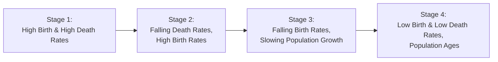

## Understanding Demographic Shifts in Economic Context

When I was younger and just dipping my toes into macroeconomics, I remember someone telling me, “Pay attention to demographics—people shape the economy more than anything else.” At the time, I didn’t quite appreciate how big a factor this could be. But as you explore this subtopic, you’ll see that demographic changes influence everything from GDP growth to pension systems, asset prices, and policy decisions. 

Demographics refer to the statistical characteristics of populations: age distribution, birth rates, mortality, immigration patterns, and more. For economists and financial analysts, even seemingly small shifts—like marginal changes in the birth rate or an uptick in older workers retiring—can meaningfully alter labor-force dynamics and investment outcomes. 

Below, we’ll walk through the key dimensions of demographic changes, from age distributions and dependency ratios to labor force participation rates and immigration. We’ll also spotlight how these shifts play out in the real world, why they matter for economic growth, and how investors might anticipate or respond to them.

## Age Distribution and Dependency Ratios

Have you ever noticed how certain countries—like Japan or Italy—have large populations over the age of 65, while others—like many in sub-Saharan Africa—have median ages in the 20s? This distribution of ages significantly influences an economy’s structural capacity for growth and productivity.

Age distribution captures the proportion of young (under 15), working-age (often 15 to 64), and older (65+) individuals within a population. A younger population typically offers a larger pool of labor for future growth, but it also means a high number of dependents (children) relative to current workers. An older population might struggle with workforce shortages and ballooning healthcare expenditures.

The dependency ratio measures the share of the non-working population (usually children under 15 and elderly over 65) relative to the working-age population. A high dependency ratio means fewer taxpayers and potentially more stress on social welfare systems. Countries with high youth dependency (e.g., very high birth rates) might lack immediate economic output from those young individuals. Meanwhile, countries with high old-age dependency face rising pension and healthcare costs, potentially straining government budgets.

In practice, it’s common to see the following tension:

• High youth dependency: Often found in developing regions with high birth rates. Governments and families must invest heavily in education, childcare, and basic infrastructure.  
• High old-age dependency: Common in developed regions, where fertility rates are lower, life expectancy is high, and pension systems must be carefully managed to avoid shortfalls.

A large working-age population can be a huge boost to growth—referred to as a “demographic dividend”—if the right policies and supportive conditions (e.g., education, healthy business environment) exist. However, that dividend eventually dissipates as the population transitions into older age groups.

## Labor Force Participation Rates

Labor force participation (LFP) is the share of working-age individuals either employed or actively looking for work. You might recall scanning job market data from the Bureau of Labor Statistics in the US or following the monthly employment figures from Eurostat in the EU. They highlight changes in LFP, which can reflect demographics, economic conditions, cultural expectations, and policy frameworks.

### Key Influencing Factors

• Cultural norms and attitudes: For instance, female labor participation has risen over the decades in many countries, as social norms shift and women increasingly take on professional roles.  
• Economic incentives: Higher wages, job availability, and lower tax burdens often pull people into the labor market. On the flipside, disincentives—like high marginal tax rates on secondary earners—can keep participation rates lower.  
• Retirement policies: Early retirement incentives can shrink the labor force, while delayed retirement policies can expand it.  
• Supportive services: Access to affordable childcare is often a critical factor enabling more parents (especially mothers) to join the workforce.

### Significance for Growth

Raising labor force participation is one of the most immediate levers a government can pull to boost potential GDP. When more people work, or at least look for work, you increase the economy’s productive capacity. There’s a classic example: in many advanced economies, encouraging older workers to delay retirement (e.g., raising the official retirement age) partially offsets the impacts of aging. A higher labor force participation rate can compensate for slower population growth or a smaller cohort of young adults.

Different countries show stark contrasts. For example, consider Japan’s concerted effort to increase female labor participation (“womenomics”) to counter a shrinking and aging populace. Or the various European policies aimed at keeping older employees in the workforce longer—through adjustments to pension plans and benefits. 

## The Role of Immigration

Now, let’s talk about one of the most debated and, to be honest, emotionally charged topics: immigration. From an economic standpoint, immigration can be a powerful tool. It adds to the labor force (usually in the prime working ages) and can help mitigate an aging population’s impact on productivity and financial sustainability. Indeed, many developed countries rely on immigration to keep their populations from shrinking. 

### Skilled vs. Unskilled Immigration

• Skilled immigration: These workers often fill gaps in highly specialized fields like technology, engineering, healthcare, and finance. This fosters innovation, entrepreneurship, patents, and ultimately higher productivity. Countries compete for these talents—just think of all the “startup visas” or “express entry” programs designed to attract sought-after skill sets.  
• Unskilled immigration: While less glamorous in media headlines, unskilled workers perform essential roles in agriculture, construction, and services. This can hold down labor costs and support entire industries, but it’s also prone to political controversy about wage competition and social integration.

### Immigration Policy Considerations

Countries use diverse policy levers: points-based systems (e.g., Canada), family reunification programs (e.g., the US), or more stringent caps and quotas. For advanced economies facing potential labor shortages and ballooning pension expenses, more accommodative immigration policies can relieve pressure. On the other hand, overly restrictive policies or xenophobic sentiments can reduce the inflow of labor, limiting growth potential and possibly exacerbating demographic imbalances.

## Economic Impact of the Demographic Transition

Most nations follow a demographic transition path that typically unfolds in three or four identifiable stages. It’s a classic concept, but it helps illustrate how birth rates and death rates evolve over time. Let’s visualize it briefly in a simple diagram:

• Early Stage: Both birth and death rates are high, keeping population growth subdued.  
• Transitional Stage: Mortality falls thanks to medical advances and better living conditions, but birth rates remain high for a while, leading to a rapid population growth “bulge.”  
• Advanced Stage: Eventually, fertility drops in line with better education, urbanization, and shifting cultural norms. The population ages, and growth can decline or become negative.  

This transition alters the composition of the labor force and drives changes in savings patterns, investment needs (e.g., schools in earlier stages vs. retirement homes in later stages), and capital allocation. For instance, an emerging market moving from Stage 2 to Stage 3 can enjoy a massive wave of labor force entrants—this is where the so-called demographic dividend can supercharge growth, provided the country invests in human capital and fosters job creation.

## Implications for Investors and Policymakers

### Pension System Sustainability

One of the biggest headaches for policymakers is ensuring pensions are adequately funded in the face of rising longevity and lower birth rates. Many pension systems—public or private—rely on younger workers actively paying into the system to support retirees. If that base shrinks, governments may face ballooning liabilities, leading to calls for higher taxes, reduced benefits, or even structural pension reforms. 

As an investor, it’s worth monitoring whether a country’s pension obligations might create fiscal pressures, especially in developed economies. This can manifest in higher sovereign yields (due to doubt about fiscal sustainability) or shifts in bond issuance strategies.

### Industry Shifts and Sector Analysis

An aging population tends to boost certain sectors like healthcare, pharmaceuticals, and age-friendly real estate, while younger demographics drive demand for education, entertainment, and job training. Investors might watch for these sectoral opportunities or threats in their portfolio allocations.

### Labor Supply Constraints and Productivity Improvements

Where demographic trends point to slower population growth, or strict immigration policies hamper workforce expansion, economies must find new ways to remain productive—most notably through capital deepening (as discussed in other sections of this chapter) and technological innovation. 

Sometimes, you’ll see a country with a shrinking labor force rely on automation, artificial intelligence, or robotics to maintain output. This can be a big driver of productivity. It can also catalyze structural changes in both labor markets and corporate strategies, opening up investment opportunities in disruptive tech companies, robotics manufacturers, or telemedicine platforms.

### Policy levers and Potential Challenges

• Extending Working Lives: Countries might increase the statutory retirement age or incentivize older workers to stay in the labor force.  
• Encouraging Higher Fertility: This is tricky and often slow-acting. Policies include direct payments (child benefits), tax breaks, improved parental leave, or free daycare.  
• Luring More Immigrants: Many advanced economies have recognized that liberalized immigration—especially with a fast track for in-demand skills—can reboot population growth and maintain competitiveness.

In reality, each of these levers carries political and social complexities, and not all measures are equally feasible in every environment. Still, the direction of policy can significantly shape an economy’s long-term growth prospects, cost of capital, and investment climate.

## Best Practices and Common Pitfalls for CFA® Candidates

• Measure the ratio carefully: When analyzing a country’s economic performance, pay attention to the specific definition of “dependency ratio.” Is it using ages 0–14 and 65+? Or does it take 0–19 and 60+? A small shift in age brackets can significantly alter the interpretation.  
• Keep an eye on policy shifts: Retirement age reforms or new immigration acts can dramatically affect labor force expectations.  
• Build scenario analyses: For instance, how would a 1% rise in the labor force participation rate affect potential GDP in a developed economy with stagnant population growth?  
• Evaluate sustainability: Pension liabilities often lurk “off-balance-sheet.” Understanding a country’s future obligations is crucial for anticipating macro stress.  
• Watch for data sources: Different agencies or think tanks measure the labor force participation rate (and define working age) differently. 

## Quick Anecdote on Immigration

I once chatted with a client who was concerned about wage stagnation in her home country. She blamed immigration for driving down salaries in certain low-skilled jobs. But in her field—software engineering—employers were desperate for specialized, high-skilled candidates. As it turned out, immigrants filling vacant roles in one sector can strengthen the economy and create new overall opportunities. The net effect of immigration isn’t always intuitive—so always use data to cut through emotional or political noise.

## Summary of Key Takeaways

• The size and composition of a workforce, influenced by birth rates, aging, and immigration, directly shape a nation’s long-term productivity and growth potential.  
• Labor force participation rates capture how effectively an economy is mobilizing its eligible population into productive roles.  
• Immigration policies can bolster or constrain workforce dynamics, especially in aging societies.  
• Policymakers must balance retirement benefits, healthcare, and immigration controls in ways that keep the fiscal system sustainable and growth oriented.

## Glossary

Dependency Ratio: The ratio of non-working population (children/elderly) to the working-age population; critical for evaluating social service burdens.  
Demographic Transition: The shift from high birth/death rates to lower birth/death rates as part of a country’s development process.  
Labor Force Participation Rate: The proportion of the working-age population either employed or actively seeking employment.  
Fertility Rate: The average number of children a woman bears in her lifetime.  
Population Aging: The process by which the share of older individuals in a population increases, typically driven by lower fertility rates and higher life expectancy.  
Pension System: A government-sponsored or private plan providing retirement income.  
Migration Policy: A set of rules regulating the inflow and outflow of foreign nationals to address labor market needs, cultural integration, or security considerations.

## Practical Exam Application and Final Tips

CFA Level II often puts these topics into macroeconomic vignettes, where you might see references to an aging region or a country introducing new immigration reforms. Be ready to quantify how changes in labor force growth or dependencies can alter broader economic metrics like GDP forecasts or long-term interest rates. You might also need to assess how such demographic factors feed into capital deepening and technology adoption (tying back to other sub-sections of this chapter).

• Focus on linking demographic data to growth expectations.  
• Carefully handle any stats about fertility, mortality, or net migration—ensure you read the question’s definitions thoroughly.  
• Expect to interpret or tabulate changes in age cohorts. For example, a forward-looking question might show a jump in 65+ population and ask for the implications on pension liabilities.

For success in item-set format, practice scanning exhibits summarizing demographic data. Then consider how that might affect a country’s monetary, fiscal, or structural policies. Maintain a balanced perspective—demographics can be slow-moving but have profound, lasting effects on financial markets.

## References and Further Reading

• Bloom, D.E., & Canning, D. (2008). “Global demographic change: Dimensions and economic significance.” Population and Development Review.  
• IMF Staff Discussion Notes on “Labor Force Participation and Demographics.”  
• OECD “International Migration Outlook,” available at https://www.oecd.org  

## Test Your Knowledge: Demographics, Labor Force, and Immigration Factors



### Which best describes the dependency ratio?

- [ ] The ratio of total population to the employed population.
- [ ] The difference between birth and death rates.
- [x] The ratio of non-working population (children/elderly) to working-age population.
- [ ] The proportion of unemployed individuals in the economy.

> **Explanation:** The dependency ratio specifically measures the portion of the population (often under 15 and over 65) dependent on those in the working-age group.

### An economy with a high old-age dependency ratio is most likely to experience what?

- [ ] Lower healthcare expenditures.
- [x] Rising pension and healthcare costs.
- [ ] Rapid growth in the youth labor force.
- [ ] Decreasing median age in the population.

> **Explanation:** A high old-age dependency ratio signals a larger share of retirees relative to workers, usually creating upward pressure on healthcare and pension systems.

### Which of the following is a direct factor that might increase a country's labor force participation rate?

- [ ] Low wage growth.
- [ ] Reduced investment in job training.
- [ ] Earlier retirement incentives.
- [x] Affordable childcare support.

> **Explanation:** Access to affordable childcare often encourages parents—particularly women—to remain in or join the workforce.

### In a demographic transition model, which phase is often characterized by rapidly falling death rates while birth rates remain high?

- [x] Transitional stage (Stage 2).
- [ ] Early stage (Stage 1).
- [ ] Advanced stage (Stage 4).
- [ ] Post-transition (Stage 5) with negative population growth.

> **Explanation:** The transitional stage sees death rates decline first due to healthcare improvements, while birth rates remain high for some time.

### What is a principal rationale for liberal immigration policies in aging advanced economies?

- [x] To infuse a younger labor force and ease pension burdens.
- [ ] To decrease the labor force participation rate.
- [ ] To reduce human capital.
- [ ] To raise the old-age dependency ratio.

> **Explanation:** By welcoming younger immigrants, aging economies can expand their labor force and help offset pension and healthcare costs for the older population.

### When analyzing a country's potential growth, why is it important to consider changes in labor force participation?

- [ ] Because labor force participation has no real impact on economic output.
- [x] Because a higher participation rate can increase the economy’s productive capacity.
- [ ] Because it usually leads to lower female employment.
- [ ] Because it is irrelevant during demographic transitions.

> **Explanation:** Those who are actively participating in the labor force are either working or looking for work, thus contributing (or aiming to contribute) to output.

### All else equal, which scenario is likely to optimize a nation’s “demographic dividend”?

- [x] Large working-age cohort combined with supportive policies (education, job creation).
- [ ] Rapidly declining birth rates and no policy interventions.
- [ ] Strict retirement mandates at an early age.
- [ ] Excessive reliance on foreign direct investment without labor development.

> **Explanation:** A demographic dividend arises when a large segment of the population (in the working-age range) finds suitably productive employment, often aided by robust policy frameworks.

### In which situation might skilled immigration be most beneficial to the host economy?

- [x] When local firms face shortages of specialized professionals, e.g., software engineers.
- [ ] If unemployment is extremely high in all skill categories.
- [ ] When the host economy is experiencing a demographic early stage.
- [ ] When wage growth is negative across all sectors.

> **Explanation:** Skilled immigrants fill critical skill gaps, boost innovation, and potentially raise efficiency in high-value industries.

### Which statement best illustrates a potential downside of strict immigration policies in a developed economy with an aging population?

- [ ] It commonly leads to outflow of local workers to other countries.
- [ ] It always reverses the process of population aging.
- [ ] It molds a more flexible labor market.
- [x] It may limit labor supply growth and slow economic expansion.

> **Explanation:** Restrictive policies can shrink the pool of young workers entering the economy, reducing overall labor growth and potential GDP.

### A country at an advanced stage of demographic transition with a low birth rate and a shrinking population is likely to benefit most from a policy that encourages:

- [x] Increased immigration of working-age individuals.
- [ ] Reduced labor force participation.
- [ ] Early retirement incentives.
- [ ] Strict caps on population movement.

> **Explanation:** Bringing more working-age individuals from outside can mitigate the productivity and tax base pressures that arise from an aging, shrinking population.


