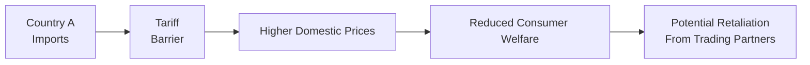

## Introduction

Well, let’s dive right in: trade barriers, resource constraints, and the quest for future growth—these concepts might sound huge, but trust me, they’re some of the most fascinating pieces of the global economic puzzle. As an analyst or investor, you’re bound to encounter them. Maybe you’ve flipped through the newspaper one morning and seen headlines about tariffs or climate concerns, and you’ve probably wondered how all that chatter might affect capital flows or your own investment decisions.

In many ways, trade barriers are like friction in an otherwise smooth system; they can slow down global integration and dampen economic expansion. Resource constraints add another layer: if raw materials are running short or if a country relies heavily on a single commodity, future growth can be stifled. And if we think about bigger trends—like climate change and green technology—well, they’re pretty much game-changers. So, let’s talk through these topics systematically, weaving in real-world scenarios and ideas that can help you see how everything connects to the broader theme of economic convergence.

## Trade Barriers

Trade barriers come in many shapes and sizes: tariffs, quotas, export subsidies, licensing requirements, and product standards. Each type creates a wedge between domestic and international prices or between domestic markets and international competition. The fundamental point is that barriers restrict the free flow of goods and services.

### Types of Barriers

• Tariffs. A tariff is basically a tax on imports. Suppose Country A slaps a tariff on steel imports to protect domestic steelmakers. In the short run, local producers might be thrilled because they face less foreign competition. But in the long run, the entire economy could experience higher prices for steel inputs, which raises the cost of production for downstream industries (like auto manufacturers). Sometimes it ends up feeling like winning the battle but losing the war.

• Quotas. Quotas place a numerical limit on the amount of a product that can be imported. They function similarly to tariffs by restricting supply, driving up prices of imported goods, and shielding domestic producers from direct international competition.

• Export Subsidies. Instead of taxing imports, governments might subsidize domestic exports outright. This makes local goods cheaper abroad, expanding a country’s presence in foreign markets. However, these subsidies can distort global trade flows, potentially prompting retaliation from trading partners.

• Non-Tariff Barriers. These can be licensing requirements, product standards, or stringent regulatory measures that make it harder for foreign firms to sell products domestically. While sometimes well-intentioned (e.g., ensuring safety or health standards), they can also be used as a disguised form of protectionism.

### Short-Term vs. Long-Term Effects

In the short term, protecting domestic industries via trade barriers can seem beneficial, especially if you’re trying to preserve employment in a certain sector or nurture an infant industry until it’s globally competitive. I recall a personal anecdote: back in grad school, I met an entrepreneur who was thrilled that her country imposed quotas on foreign textiles—her local clothing line initially boomed. But after a few years, she felt stuck in a non-competitive bubble, isolated from the quality and productivity gains that come from open global markets.

Long-term, barriers typically harm overall efficiency and innovation. When companies lack foreign competition, they may rest on their laurels, invest less in research and development, fail to adopt best-in-class practices, or overprice goods and services. Plus, there’s always a risk of counter-tariffs—when foreign nations retaliate, the entire system can spiral into a trade war. That can be a major headache for both policymakers and investors.

### Visualizing Tariff Impacts

Below is a simple flowchart showing how a tariff can affect the chain from importation to consumer welfare:



As you can see, the story often begins with the intention to protect domestic jobs. Then prices rise, consumers pay more, international tensions escalate, and markets can get skittish.

## Resource Constraints

Trade barriers don’t exist in a vacuum—resource constraints are also crucial. A nation endowed with abundant oil, for instance, might appear well-positioned for growth. But if that resource is finite and the society neglects to diversify, the result can be short-lived prosperity followed by stagnation. Sometimes that’s referred to as the “resource curse.”

### Natural Resources and the Resource Curse

The resource curse is the somewhat ironic situation where countries with vast natural resources (e.g., minerals, oil, or precious metals) end up with slower or more volatile growth than countries with fewer resources. Overreliance on commodities can inhibit development of other sectors, hamper technology adoption, and make a country more vulnerable to commodity price swings. Moreover, governance can become tricky: an easy stream of resource royalties might reduce the political incentive to invest in infrastructure or human capital.

### Depletion Risks

Non-renewable resources (like fossil fuels) will run out eventually, or at least become more expensive to extract. Over-exploitation may yield great wealth now, but it can harm long-term growth if the income isn’t reinvested in alternative productive activities. Countries that spot depletion trends early and invest in advanced technology (or build powerful trade networks) often maintain their competitive edge. Others might face abrupt slowdowns when the “golden goose” is gone—or simply less golden than before.

### Alternate Energy and Sustainability

Guess what the big buzzwords are these days? Sustainability and green tech. Investments in solar, wind, or other renewable energies can reduce dependence on finite resources, create new industries, and even open up fresh export opportunities. Now, this isn’t a magic bullet. Green tech requires capital, robust policy frameworks, and consistent R&D spending. Yet, for countries worried about resource constraints, pivoting toward sustainable solutions can promote stable, long-term growth while contributing proactively to environmental goals.

## Future Growth Considerations

As we layer trade barriers on top of resource constraints, we start to see how the global economy is heavily interconnected. The supply chain for, say, electronic goods might cross half a dozen countries before it reaches the store shelves. Something as simple as imposing a tariff on one component can ripple across the globe, altering growth trajectories in multiple markets.

### Global Supply Chains

Trade liberalization, in general, helps facilitate complex global supply chains, where each country specializes in stages of production it can do most cost-effectively. Barriers, on the other hand, can disrupt these supply chains, driving companies to restructure or relocate production. If you’re analyzing a multinational firm’s supply chain, you want to keep track of both the official trade policies and the potential for sudden political shifts.

### Climate Change and Environmental Regulations

Sure, it’s easy to say carbon taxes or environmental regulations are local issues. But consider this: many products rely on energy-intensive processes. With climate change in the mix—and new regulations on emissions, waste management, or carbon pricing—firms reliant on high-emission technologies might struggle. Over time, these complexities shape competitive advantages globally. Countries that proactively transition to cleaner energy might secure a lead in new industries and reduce their exposure to the volatility of fossil-fuel markets.

### Technology Transfer

One of the major upsides to open trade is technology transfer. Emerging markets that allow foreign direct investment (FDI) often gain better access to new production methods, management practices, and specialized knowledge. That fosters what we call “catch-up” or “convergence,” where lower-income nations grow faster than advanced economies by adopting existing technology. However, if trade barriers block these technology flows—perhaps by limiting foreign ownership or restricting licensing agreements—convergence can slow down.

## Implications for Convergence

Convergence is that lovely concept suggesting poorer countries can close the income gap with richer ones, provided they adopt better technology, invest in education, and maintain open market structures. Trade barriers are a big threat: if you limit knowledge spillovers or capital inflows, your economy’s ability to catch up can take a serious hit.

• Restricted Trade and Convergence. Protective measures may keep out foreign competition—and, inadvertently, foreign expertise, advanced machinery, or managerial best practices. This can limit productivity growth.  
• Strategic Resource Management. Countries that manage resource wealth carefully (e.g., by investing in schools, roads, or new technologies) can convert resource income into broader development gains. If they remain open to trade, they can also diversify their export base, thus mitigating the risk of resource depletion.

## Risk Management for Analysts

When analyzing investment opportunities, it’s important to incorporate scenario analysis around possible changes in trade policies or resource endowments. You know how political winds can shift rather suddenly—one moment you’re reading about free trade frameworks, and the next, you might see new tariffs or strict export controls.

• Politically Driven Barriers. Keep an eye on election cycles, especially in major economies with a history of protectionist leanings. Scenario planning can help you hedge portfolio exposure.  
• Sectoral Impacts. Some industries (like steel, autos, or agriculture) tend to be more prone to trade disputes. Others might be heavily affected by resource constraints, like metals mining or energy.  
• Global Commodity Cycles. Commodity producers can face volatility in both supply and demand. If you’re analyzing a commodity-dependent economy, be sure to track how effectively it’s reinvesting resource revenues into sustainable activities.

Below is a small Python code snippet that demonstrates how you could run a simplified sensitivity analysis on import/export data for, say, a resource-rich country. Of course, in reality these analyses can be a lot more complex, but hopefully it’ll spark your imagination:

```python
import pandas as pd
import numpy as np

data = {
    'Month': pd.date_range('2023-01-01', periods=12, freq='M'),
    'Oil_Exports': [100, 110, 95, 105, 115, 120, 118, 116, 119, 123, 125, 130],
    'Tariff_Change_Impact': [0]*12  # placeholder
}
df = pd.DataFrame(data)

tariff_introduction_month = 5  # zero-based index for June
tariff_effect = 0.05

for i in range(tariff_introduction_month, len(df)):
    df.loc[i, 'Tariff_Change_Impact'] = df.loc[i, 'Oil_Exports'] * tariff_effect

df['Adjusted_Exports'] = df['Oil_Exports'] - df['Tariff_Change_Impact']

print(df)
```

In this contrived example, the code subtracts a 5% “tariff penalty” from monthly exports. In real life, you might incorporate more robust data and even dynamic relationships (i.e., exports decline more if other countries retaliate, resource depletion changes baseline supply, etc.).

## Glossary

• **Tariff**: A tax on imported goods aimed at protecting domestic industries or raising government revenue.  
• **Quota**: A limit on the quantity of a good that can be imported, which restricts supply and raises domestic prices.  
• **Resource Curse**: The paradox wherein countries with abundant natural resources sometimes experience slower economic growth due to overreliance on commodity exports and underinvestment in other sectors.  
• **Sustainability**: Meeting present resource needs without compromising the ability of future generations to meet theirs, often linked to the prudent use of renewables and green technology.  
• **Trade Liberalization**: Policies aimed at reducing or removing trade barriers, thereby promoting free flow of goods, services, and often technology.  
• **Technology Transfer**: The process of spreading technology from one entity (e.g., multinational firm or developed country) to another, aiding productivity and convergence.

## References and Further Reading

• Krugman, P., Obstfeld, M., & Melitz, M. (2018). “International Economics: Theory & Policy.” Pearson.  
• World Trade Organization reports:  
  https://www.wto.org  
• Energy Transition Outlook from International Energy Agency (IEA):  
  https://www.iea.org  

And if you want some broader context on growth theory (tying resource management into bigger macro frameworks), be sure to check out chapters on growth models in standard macro textbooks or the official CFA Institute curriculum materials in preceding chapters (especially Chapter 6 on economic growth drivers).

## Exam Tips and Final Thoughts

• When you see an item set describing a country adopting, say, steel tariffs, think through both the short-term protective elements and the longer-term macroeconomic consequences.  
• Look for clues pointing to retaliation or for changes in capital flows (like foreign direct investment) that might be deterred by such barriers.  
• Resource constraints in the scenario? Pay special attention to whether the country invests in technology or remains heavily commodity-dependent. That will affect growth forecasts and the viability of any carry trade or investment strategy.  
• On the exam, remember that trade barriers negatively impact the free flow of not just goods, but also technology—ultimately hindering productivity improvements.  

Anyway, always keep your eyes and ears open for hidden hints: a quick note about a new environmental regulation or a pending quota can have huge knock-on effects. By looking at potential scenario outcomes and analyzing sectoral data, you’ll be far more equipped to respond confidently in the exam—and in real-world investment decisions.

---

## Test Your Knowledge: Trade Barriers, Resource Constraints, and Future Growth



### Tariffs and Domestic Industries

- [x] They can protect nascent industries in the short run but may reduce overall efficiency in the long run  
- [ ] They only benefit foreign producers while harming domestic producers  
- [ ] They are always beneficial to both domestic consumers and producers  
- [ ] They have no potential to provoke retaliatory measures from trading partners  

> **Explanation:** Tariffs can protect infant industries temporarily, but they often lead to higher domestic prices, less competition, and lower efficiency. Retaliation is also a real risk.

### Resource Curse Concept

- [x] Countries with abundant natural resources may experience slower or volatile growth  
- [ ] It means any natural resources will inevitably run out due to overextraction  
- [ ] It arises when a country only exports manufactured goods  
- [ ] It is only relevant to oil-producing countries  

> **Explanation:** The resource curse describes how reliance on abundant resources can slow broader development and leave countries vulnerable to commodity crashes or underinvestment in other sectors.

### Quotas vs. Tariffs

- [x] Quotas limit the amount of a product that can be imported, whereas tariffs impose a tax on imports  
- [ ] Both quotas and tariffs only apply to agricultural products  
- [ ] Quotas apply to exports, while tariffs apply to imports  
- [ ] Quotas typically generate government revenue, while tariffs do not  

> **Explanation:** Quotas cap volume directly; tariffs are taxes that raise the cost of imported goods. Tariffs can generate revenue for the government, while quotas do not inherently do so.

### Non-Tariff Barriers

- [x] Can include licensing, product standards, or restrictive regulations  
- [ ] Refer only to subsidies that governments give to domestic producers  
- [ ] Are never used in developed countries  
- [ ] Always increase total welfare  

> **Explanation:** Non-tariff barriers restrict trade through means other than taxes, such as strict product standards or licensing requirements, and can affect global welfare and competition.

### Technology Transfer and Convergence

- [x] Technology transfer supports convergence by allowing emerging markets to adopt advanced production methods  
- [ ] It prevents emerging markets from catching up with developed countries  
- [x] Restrictions on foreign ownership can hinder technology spillovers  
- [ ] It has no impact on productivity  

> **Explanation:** Openness to foreign investments and collaborations can accelerate technology flows, boosting growth rates in emerging markets. Barriers to foreign ownership impede these benefits.

### Depletion Risks

- [x] Over-exploitation of non-renewable resources can limit long-term growth  
- [ ] Depletion risks do not affect commodity prices  
- [ ] Only developed countries worry about depletion  
- [ ] Technological innovation has no role in mitigating resource depletion  

> **Explanation:** When non-renewable resources are depleted without reinvesting profits into sustainable activities or innovation, future growth may stall.

### Global Supply Chains and Trade Barriers

- [x] Barriers can disrupt complex supply chains and increase production costs  
- [ ] Supply chains are unaffected by tariffs  
- [x] Companies may relocate if trade barriers become too high  
- [ ] Barriers never affect multinational corporations  

> **Explanation:** Tariffs or quotas can raise input costs and force companies to rethink where they source materials or manufacture products.

### Environment and Future Growth

- [x] Climate-related regulations can reshape comparative advantages in global trade  
- [ ] Environmental regulations are always negative for economic growth  
- [ ] Future growth is unaffected by climate or sustainability concerns  
- [ ] Countries with resource abundance do not need to care about environmental issues  

> **Explanation:** Climate policies and sustainability shifts can create new industries or destroy outdated ones, fundamentally altering a country’s competitive position.

### Protecting Infant Industries

- [x] While theoretically beneficial in the short run, it can reduce competitive pressures and hamper innovation  
- [ ] Always results in immediate revenue for the government  
- [ ] Ensures domestic firms remain globally competitive forever  
- [ ] Is a strategy exclusively used by large developed economies  

> **Explanation:** Infant industry protection can shelter local firms in early stages, but unless the protection is time-bound and carefully managed, it often leads to inefficiencies and stunted growth.

### Scenario Analysis

- [x] True
- [ ] False

> **Explanation:** Scenario analysis is crucial for analysts to anticipate potential changes in trade policy, resource availability, or economic shocks—allowing more robust investment planning.


