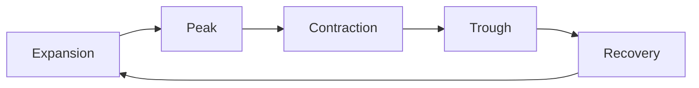

## Introduction
Business cycles can feel a tad mysterious—one moment, the economy is roaring, and the next, it seems like everything is cooling down. I remember chatting with a friend who was looking to buy a house back in 2007, right before a major downturn. At the time, interest rates were low, optimism was high, and it felt like the ride would never end. But hey, less than a year later, the market went into full-blown contraction. That’s the thing: understanding business cycle phases can help you stay ahead of these big shifts—or at least try!

In this section, we’ll examine each major phase of the business cycle, highlight asset classes and sectors potentially poised to do well (or poorly) in each phase, and show how leading and lagging indicators can inform investment decisions. We’ll also talk about the roles of fiscal and monetary policies, which sometimes act like catalysts to accelerate or moderate these natural cycles.

## The Five Phases of the Business Cycle
Economists typically discuss five main stages in a business cycle:

1. Expansion  
2. Peak  
3. Contraction (Recession)  
4. Trough  
5. Recovery

An easy way to visualize these stages is to think of them like waves: the economy rises (expansion), hits a crest (peak), falls (contraction), bottoms out (trough), and then recovers (recovery)—before eventually rising again. Let’s illustrate that with a quick diagram:

### Expansion
Expansion is the phase where the economy grows steadily. Gross domestic product (GDP) increases, employment rises, and consumer spending tends to be strong. When you see new businesses popping up, job boards crammed with openings, and folks feeling upbeat about future prospects, you’re likely in an expansion.

• Asset Implications:  
  – Cyclical equities (e.g., consumer discretionary stocks, industrials) often shine because consumers and businesses have more to spend.  
  – Commodities can also perform well if industrial demand is rising.  
  – Shorter-duration bonds may remain more stable than longer-duration issues if interest rates gradually tick upward.  

### Peak
At some point, the economy may reach a peak—the official turning point that marks the end of an expansion. Here, you might see capacity constraints: workers are harder to hire, factories are barely keeping up, and inflation pressures may creep in.

• Asset Implications:  
  – Rising interest rates can hurt long-term bond prices and heavily leveraged firms.  
  – Valuations of growth-oriented equities may start to feel “frothy.”  
  – Defensive sectors (e.g., utilities, consumer staples) may look more attractive if inflation risk makes investors wary of cyclical names.

### Contraction (Recession)
Eventually, excesses and imbalances lead to a contraction or recession. GDP growth slows (or becomes negative), unemployment rises, and spending drops. Companies scale back production and look for ways to cut costs.

• Asset Implications:  
  – Defensive equities (healthcare, utilities) or high-grade bonds often outperform riskier assets.  
  – Equity prices can fall sharply, especially for cyclical sectors.  
  – Safe-haven investments (e.g., government bonds in strong fiscal environments) may see inflows.  

### Trough
A trough is essentially the economy’s low point—the “rock bottom” after a recession, where GDP stops shrinking but remains weak. Sentiment is often subdued. This can, ironically, be a prime time for investors to bargain hunt and consider risk assets that have been beaten down.

• Asset Implications:  
  – Contrarian investors may look for undervalued stocks or bonds with strong fundamentals.  
  – Businesses and consumers begin to anticipate the next upswing, making this an attractive entry point for those with a longer-term horizon.  

### Recovery
As confidence rebuilds, businesses begin to hire again, production picks up, and consumer spending gradually rebounds. That’s the shift into a recovery—kind of like the first signs of spring after a harsh winter.

• Asset Implications:  
  – Equities, particularly those in cyclical industries, may start rising again.  
  – Corporate bonds from reputable issuers might be attractive if spreads begin to tighten.  
  – Fixed-income yields might inch up if central banks are less inclined to stimulate the economy.

## Macroeconomic Indicators to Spot the Cycle
To figure out where we are in the cycle, analysts use a range of macroeconomic indicators:

• GDP Growth: Expansions show rising GDP; contractions show falling or negative GDP.  
• Inflation: Tends to rise later in expansions and can stay elevated at the peak. It usually falls during recessions.  
• Employment Data: Low unemployment often accompanies peaks, while high unemployment can linger in recessions.  
• Consumer and Business Confidence: High confidence suggests expansion; low confidence often hints at contraction.  

The combination of these data points helps shape our view of whether the economy is nearing a peak, or perhaps sliding into a contraction.

## Leading vs. Lagging Indicators
Ever wish you had a crystal ball for the economy? Leading indicators are the next best thing (sort of!). These data points move ahead of the economy, giving us hints about the future. Meanwhile, lagging indicators are more like a rear-view mirror, telling us how the economy has been doing.

• Leading Indicators:  
  – Manufacturers’ new orders  
  – Building permits or housing starts  
  – Equity market performance  
  – Yield curve slopes  

• Lagging Indicators:  
  – Unemployment rate  
  – Inflation (CPI) readings  
  – Corporate profit reports  

For example, if housing starts are falling and equity markets are struggling, that’s often a sign the cycle may be nearing a peak or moving into contraction. On the other hand, if manufacturing orders surge and yield curves steepen, it might be time to buckle up for an expansion.

## Asset Class Performance Across the Cycle
Let’s talk about investment implications and sector rotation. While every cycle is unique, certain patterns tend to repeat:

• Early Expansion: Cyclical stocks (e.g., consumer discretionary, technology, industrials) typically rise, reflecting optimism. Yields may remain relatively low but can start to trend up.  
• Mid-Expansion: Broad equity markets can keep rallying, though valuations get pricier. Commodity prices may move up if demand keeps rising.  
• Late Expansion: Inflation can spur central banks to raise interest rates. This might harm bond prices (especially long-duration). Investors may rotate into sectors like consumer staples and healthcare.  
• Contraction: Defensive stocks, like utilities and consumer staples, often hold up better. Government bonds may rally if interest rates fall in response to recession.  
• Trough to Recovery: Risky assets like equities become cheap; if the outlook for recovery is bright, cyclical sectors bounce fastest.

A big part of the “when to rotate” puzzle is anticipating how quickly the economy will move through each phase. That is where leading indicators and central bank watching become essential.

## The Role of Fiscal Policy
Governments play a significant role in shaping the amplitude of these cycles. During contractions, discretionary fiscal policy often involves increased government spending and tax relief. Meanwhile, automatic stabilizers—like unemployment benefits—kick in when the economy struggles, providing a floor under disposable income.

As the economy expands, rising tax revenues and lower spending on social benefits reduce budget deficits (or build surpluses). Fiscal measures can sometimes delay a recession or hasten a recovery, but there’s a risk that overstimulation contributes to inflation or debt accumulation.

## Central Bank Intervention
Monetary policy can influence interest rates, credit availability, and financial market sentiment:

• During expansions, central banks might raise rates to cool inflation risks.  
• During recessions, they often lower rates (or implement quantitative easing) to encourage borrowing and support both business and consumer spending.  

Ever notice how a surprise rate cut can spark a quick stock-market rally? That’s no coincidence: markets respond right away to changes in liquidity and borrowing costs.

## Practical Scenario: Identifying the Cycle Phase
Imagine you see a combination of:

• Slowing GDP growth (but still positive)  
• High capacity utilization (factories near full tilt)  
• Steadily rising consumer prices  
• A flattening yield curve  

From these clues, you might infer the economy is nearing a peak—a time when cyclical stocks might begin to lag, and rotating into more defensive sectors or shorter-duration bonds could be prudent.

## Sector Rotation Strategies
Sector rotation means you shift your sector weightings depending on whether you anticipate expansion, peak, contraction, or recovery. For example, moving into technology and industrials at the start of an expansion can give you a head start on the upswing. Later, pivoting into consumer staples might protect your portfolio if you expect a downturn.

Of course, timing is never perfect—there’s always the risk of being a bit early or late. But thoughtful rotation strategies, backed by solid research on economic indicators, have historically offered returns that can outperform a static buy-and-hold approach when done skillfully.

## Pulling It All Together
In summary, each business cycle stage has its own “personality,” shaped by various macro indicators, market psychology, and policy interventions. Recognizing these shifts can help you decide when to hold cyclical stocks, load up on government bonds, or pivot into defensive sectors. While no approach guarantees success, a good grasp of business cycle dynamics definitely gives you a chance to adapt your investment strategy as conditions change.

## Additional References
• “Business Cycles and Forecasting” by Kondratieff & Schumpeter.  
• CFA Institute Level II Curriculum, Economics Topic Area, “Business Cycles and Economic Fluctuations.”  
• Federal Reserve Economic Data (FRED): https://fred.stlouisfed.org  

## Test Your Knowledge: Business Cycle Mastery Quiz



### Which of the following best describes the economic environment during the Contraction (Recession) phase?

- [ ] Consumer spending remains robust
- [ ] Valuations for cyclical stocks typically reach record highs
- [x] Unemployment tends to rise significantly
- [ ] Real GDP growth is typically at its strongest

> **Explanation:** In a contraction or recession, GDP growth slows or becomes negative, and companies tend to reduce their workforce, causing unemployment to rise.

### Which of the following indicators is most likely to be a leading indicator?

- [x] Building permits
- [ ] Unemployment rate
- [ ] CPI inflation figures
- [ ] Average duration of unemployment

> **Explanation:** Building permits are a leading indicator because they reflect future construction activity. Unemployment and CPI inflation are typically lagging indicators.

### During the Peak phase of a business cycle, which investment shift might investors consider?

- [ ] Rotating heavily into cyclical equities
- [x] Moving toward defensive sectors like consumer staples
- [ ] Shorting all long-term government bonds
- [ ] Selling all bonds to hold 100% equities

> **Explanation:** As the economy peaks, inflation and potential rate hikes can start weighing on cyclical stocks. Defensive sectors, such as consumer staples or utilities, often become more attractive.

### Which statement best characterizes the Trough phase?

- [x] It is typically the lowest point before a recovery begins
- [ ] It is marked by surging CPI and interest rates
- [ ] Corporate earnings are usually at an all-time high
- [ ] GDP growth is steadily rising

> **Explanation:** The trough is the point where economic contraction has bottomed out, and recovery is set to begin, though broader signs of improvement may still be weak.

### In an Expansion phase with moderate inflation, which asset class might receive greater investor interest?

- [x] Cyclical equities (e.g., consumer discretionary)
- [ ] High-yield bonds only
- [x] Commodities that track increased economic activity
- [ ] Fixed annuities

> **Explanation:** When GDP is growing and inflation is moderate, cyclical equities and certain commodities often benefit from rising demand. High-yield bonds can also perform well but carry more credit risk.

### A key role of discretionary fiscal policy during a recession is to:

- [x] Increase government spending or cut taxes to stimulate demand
- [ ] Reduce government spending to slow the economy
- [ ] Steepen the yield curve intentionally
- [ ] Impose higher corporate taxes to curb inflation

> **Explanation:** In a recession, governments often use discretionary fiscal policy to boost demand through higher spending or lower taxes.

### Which statement about monetary policy is correct?

- [x] During expansions, central banks may raise rates to control inflation
- [x] During recessions, central banks may lower rates to encourage borrowing
- [ ] It has no effect on the business cycle at all
- [ ] It is the main cause of turning points in the business cycle

> **Explanation:** Monetary policy can cool down an overheating economy by raising rates or stimulate a flagging economy by lowering rates.

### In identifying the stage of the business cycle, an unexpected fall in manufacturers’ new orders and a drop in home building permits most likely indicates:

- [x] A possible transition into contraction
- [ ] A move from contraction into recovery
- [ ] The economy is stable at the trough
- [ ] A full-blown expansion

> **Explanation:** Falling new orders and building permits often signal a slowdown, hinting that the economy may be shifting from expansion or peak to contraction.

### How might investors respond if they believe the economy has just reached its trough?

- [x] Pick undervalued cyclical equities with strong fundamentals
- [ ] Sell all risk assets and buy gold only
- [ ] Increase allocation to defensive sectors
- [ ] Remain fully in money market instruments

> **Explanation:** Once the economy has hit a trough, investors often look for recovery opportunities in discounted risk assets, particularly cyclical stocks poised to rebound as the economy improves.

### The development of automatic stabilizers (like unemployment benefits) is intended to:

- [x] Lessen the amplitude of economic cycles without explicit government intervention each time
- [ ] Amplify the effect of every minor contraction
- [ ] Replace monetary policy as the primary tool of economic management
- [ ] Stimulate inflation during expansions

> **Explanation:** Automatic stabilizers help moderate swings in the economy. They provide support in a downturn without requiring a new legislative stimulus package.


