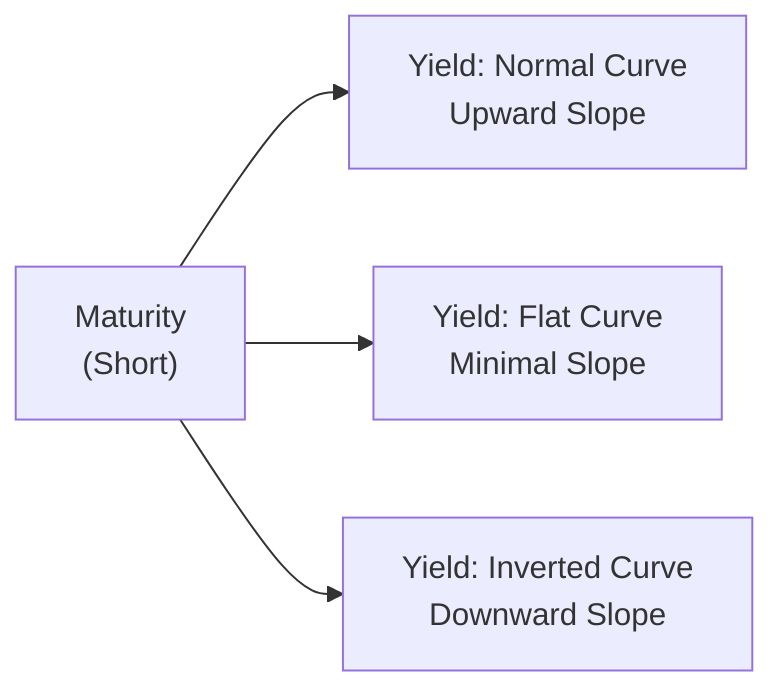

## Overview

Have you ever wondered why sometimes short-term interest rates are higher than long-term rates? Or why, after a big central bank announcement, the whole yield curve just jolts upward? I remember, back in my early days, assuming that a “normal” yield curve was a given—an upward slope with lower short rates and higher long rates. Then came the financial crisis, and I realized yield curves can invert and go flat, practically flipping everything I thought I knew. This section focuses on these fascinating shapes and how they shift with economic cycles, plus the forces driving interest rate volatility. We’ll also explore credit spreads—those extra yields corporate bonds offer over (relatively safer) Treasuries—and the interplay between default risk, liquidity, and market sentiment. Finally, we’ll talk about how investors apply yield curve analysis to real-world asset allocation decisions.

## Defining the Yield Curve and Its Shapes

A yield curve plots the yields (or interest rates) for bonds that have similar credit quality but different maturities—commonly, government bonds. On the horizontal axis, we have time to maturity. On the vertical axis, we have the yield. By looking at the slope or shape of this curve, we get an idea of the market’s outlook on future interest rates, inflation, and broader economic trends. The main yield curve shapes include:

• Normal (Upward-Sloping): Characterized by lower yields on shorter maturities and higher yields on longer maturities.  
• Flat: Short- and long-term yields are very close, indicating uncertainty or a transition point in the economic cycle.  
• Inverted: Short-term yields exceed long-term yields, often considered a warning sign for economic downturns or lower growth expectations.

Here’s a simple Mermaid diagram illustrating these shapes conceptually:



Though the actual chart in financial markets would look more like a line plot, this diagram helps visualize the classic shapes. Sometimes the curve is “humped,” meaning yields are higher at intermediate maturities than at either short or long maturities, but the three shapes above are usually the main focus in economic analysis.

## Yield Curves through the Business Cycle

Yield curves do not exist in a vacuum. They tend to align with different phases of the business cycle:

• Early Expansion: Typically, a steep yield curve might appear as short-term rates remain low (central banks may be supporting recovery) while investors expect stronger growth down the line, so longer-term yields drift up.  
• Mid-Cycle Growth: The curve often normalizes. Monetary policy might tighten, so short-term rates climb, while longer-term rates stabilize if inflation is deemed under control.  
• Late-Cycle/Early Recession Fears: The yield curve can flatten when investors expect slowing economic growth; short-term yields increase as central banks attempt to contain inflation (or run out of room to cut rates), while long-term yields remain fairly stable or even fall due to weaker growth expectations.  
• Inverted Curve Environment: Historically, an inverted curve often precedes recessions. Investors may be buying long-term bonds aggressively (pushing those yields lower) in anticipation of economic slowdown and future rate cuts. Gather enough gloom, and you get a downward slope.

I recall how in early 2019, a partial yield curve inversion triggered headlines suggesting a possible recession. While it’s not a foolproof timing weapon (sometimes the curve inverts well before a downturn), it’s definitely a canary in the coal mine.

## Sources of Interest Rate Volatility

Interest rates rarely stand still. They move around daily—sometimes by only a basis point or two, other times by tens of basis points or more if, say, the Fed or ECB makes a surprise announcement. Generally, interest rate volatility stems from:

• Monetary Policy Surprises: Central banks might unexpectedly raise or lower policy rates, or hint at changes in quantitative easing (QE), spurring bond markets to reprice.  
• Inflation Shocks: Sharp changes in inflation expectations change the demanded compensation for holding nominal bonds. If markets suddenly believe inflation is on the rise, yields can jump.  
• Economic Data Releases: GDP numbers, labor reports, or consumer confidence surveys can shift the outlook for economic growth and monetary policy, driving bond yields up or down.  
• Geopolitical and Global Disruptions: War, trade tensions, or global financial crises can create a flight-to-quality environment, pushing yields on safe havens (e.g., U.S. Treasuries) downward and raising yields (and spreads) on riskier assets.  
• Market Liquidity and Sentiment: Even outside macro fundamentals, shifts in risk appetite or portfolio rebalancing can cause rapid swings in yields.

Occasionally, you see days when yields move 10–15 basis points with little real economic news. That can reflect traders covering positions, refined inflation views, or just a mismatch in buyer/seller supply-demand on a given day.

## Credit Spreads and Risk Appetite

While government bond yields get a lot of attention, credit spreads can be equally informative. A credit spread is the yield difference between a corporate bond (or other non-government bond) and a government bond of the same maturity. If you look at an investment-grade corporate bond that yields 5% while a comparable Treasury yields 3%, the credit spread is 2 percentage points or 200 basis points.

Credit spreads change due to:

• Default Risk: If a corporation’s fundamentals weaken or its credit rating goes down, investors demand a higher yield.  
• Liquidity Risk: Less-traded bonds require higher yields to compensate for the difficulty of exiting the position quickly.  
• Market Sentiment and Risk Appetite: In high-risk environments (e.g., an imminent recession or crisis), investors flee to safer assets, pushing up yields on corporate bonds relative to Treasuries.  
• Economic Cycle: During expansions, investors are more comfortable holding riskier bonds, so spreads often tighten. During downturns (or approaching a potential downturn), spreads often widen, reflecting heightened default concerns.

When there’s a “flight-to-quality,” credit spreads can widen dramatically in a short time. Recall the 2008–2009 crisis when spreads on high-yield bonds skyrocketed because nobody wanted to hold risky debt amid widespread defaults.

## The Interplay among Default Rates, Liquidity, and Market Sentiment

Credit spreads don’t move in isolation. They interlock with the broader environment:

• Default Rate Expectations: Rising defaults in, say, the high-yield market can be a leading indicator of a deeper recession. Even fears of rising defaults can push spreads higher.  
• Liquidity Conditions: When liquidity dries up (think panic selling or abrupt redemptions from bond funds), credit spreads can widen, regardless of actual credit fundamentals.  
• Market Sentiment: Sentiment changes can happen overnight. A negative tweet from corporate leadership, a rating agency’s downgrade, or a government policy shift can sour the mood, increasing spreads.  
• Monetary and Fiscal Policy: If central banks announce corporate bond-buying programs (like some did in certain crises), that can compress spreads by reassuring investors there is a ready buyer. On the flip side, restrictive policies or withdrawal of liquidity can cause spreads to widen.

In bullish markets, credit spreads sometimes seem almost too tight—investors stretch for yield, ignoring rising default risks. Then, a piece of bad news triggers a jump in spreads as everyone rushes to the exits. Watching these moves can be invaluable for timing bond trades or adjusting sector allocations.

## Yield Curve Analysis for Asset Allocation

Yield curve shapes and credit spreads frequently guide decisions about where along the curve (i.e., short, intermediate, or long maturities) to invest. Consider these tactics:

• Going Shorter-Dated when Expecting Interest Rate Rises: If you anticipate a rate hike cycle or find the yield curve is likely to flatten, you might avoid locking in long-dated bonds. Short-dated securities can limit potential losses from rising yields.  
• Extending Maturity (Riding the Yield Curve) when Economic Expansion Is Likely: If the yield curve is steep, and you think we’re still in an early expansion, longer maturities might offer higher yields plus price appreciation if credit conditions remain favorable.  
• Sector Rotation within Credit: If you believe corporate defaults are set to rise, you might cut back on high-yield bonds, focusing on safer investment grade or government bonds. Conversely, if you sense stable or improving credit fundamentals, riskier bonds might provide attractive spreads.

One common technique used by portfolio managers is “yield curve positioning,” such as a barbell strategy (holding very short-dated and some very long-dated bonds) or a bullet strategy (concentrating on a particular segment). The approach you pick can be influenced by your forecast for yield curve slope changes.

## Vignette: When Yield Curves Shift and Credit Spreads Move

Imagine a scenario:  
• Economic data shows flattening GDP growth, and inflation is unexpectedly slowing.  
• The central bank signals a pause in its rate-hike cycle, meaning short-term interest rates might not rise much further.  
• Corporate earnings are still fair, but forward guidance is cautious. Analysts predict a moderate slowdown within a year. Investors collectively wonder if a recession is looming.  

In response:  
1) The yield curve, which had been fairly flat, inverts slightly as investors start buying longer maturities in expectation of eventual rate cuts and weaker growth.  
2) Credit spreads on BBB-rated bonds over Treasuries widen from 150 bps to 200 bps. High-yield spreads jump by 100 bps to offset the increased perceived default risk.  
3) Many portfolio managers rotate out of cyclical sectors (e.g., automotive, energy) and into more defensive ones (healthcare, utilities) or simply buy more Treasuries.  

As a manager, you might consider revising your bond strategy: short-duration positioning if you believe rates will still rise in the short run; or purchasing higher-quality bonds to avoid default risk in riskier segments. These signals, gleaned from the yield curve shape and credit spreads, guide your asset allocation calls.

## A Quick Python Illustration of Yield Curve Shifts

Sometimes it’s helpful to visualize data quickly. Below is a tiny code snippet (purely for demonstration) showing how you could plot an initial yield curve vs. a new yield curve after certain shocks. (This code is not on the exam, but can help you see the data side of yield curves.)

```python
import matplotlib.pyplot as plt

maturities = [1, 2, 3, 5, 10, 20]
yield_curve_before = [2.5, 2.7, 2.9, 3.1, 3.4, 3.8]
yield_curve_after  = [2.7, 2.8, 2.9, 3.0, 3.2, 3.5]

plt.plot(maturities, yield_curve_before, marker='o', label='Before Shock')
plt.plot(maturities, yield_curve_after, marker='o', label='After Shock')
plt.xlabel('Maturity (Years)')
plt.ylabel('Yield (%)')
plt.title('Yield Curve Shift')
plt.legend()
plt.show()
```

In a real-world scenario, you might incorporate daily yield curve updates, credit spreads, or even incorporate advanced statistical models for shaping your interest rate expectations.

## Best Practices and Common Pitfalls

• Stay attuned to monetary policy announcements and the release of key economic indicators (e.g., inflation, GDP, unemployment). These can jolt interest rates or widen/narrow credit spreads quickly.  
• Don’t rely on the yield curve alone to predict recessions or expansions—while correlations are strong historically, it’s not an infallible timing tool.  
• In credit spreads, watch for divergences between fundamental risk (e.g., default rates, coverage ratios) and market-based spreads. Investors might be complacent, failing to price in underlying credit deterioration.  
• Avoid overreacting to short-term noise. Sometimes yields or spreads spike for partial technical reasons. Understanding the bigger picture is crucial for a balanced response.

## Conclusion and Additional Resources

Yield curves and credit spreads are powerful signals about economic conditions and market sentiment. An inverted curve can warn of a possible recession, whereas steep curves hint at growth. Credit spreads reflect the market’s appetite for risk and can offer clues about default risk trends. By understanding these concepts—and practicing scenarios where yield curves shift or spreads move unexpectedly—you’ll be better equipped to manage bond portfolios, hedge interest rate risk, and anticipate overall market moves.

For further exploration:

• “Fixed Income Securities” by Frank Fabozzi.  
• BIS Quarterly Review (https://www.bis.org/publ/qtrpdf/r_qt) for global bond market developments.  
• CFA Institute Level II Curriculum, Fixed Income Topic Area, particularly sections covering yield curve analysis, interest rate risk, and valuation.

## Final Exam Tips

• Practice reading yield curve data from real market sources (e.g., Fed websites) and see if you can identify shape trends.  
• Correlate yield curve shapes with macroeconomic indicators like GDP, CPI, or unemployment.  
• For credit spreads, keep an eye on corporate bond indexes across ratings (AAA, BBB, high-yield).  
• In item sets, watch out for subtle hints in the vignette (e.g., corporate management’s tone on default risk), as these can be clues to how credit spreads might behave.  
• Time management: Don’t dwell too long on the theoretical underpinnings. Instead, interpret the data points quickly and move to the rationale behind your answer.

-------------------------

## Test Your Knowledge: Yield Curve & Credit Spread Dynamics



### Which shape of the yield curve is typically seen as a warning sign for an upcoming recession?

- [ ] A humped yield curve
- [ ] A steep yield curve
- [x] An inverted yield curve
- [ ] A flat yield curve

> **Explanation:** An inverted yield curve is when short-term yields exceed long-term yields and has historically preceded recessions.

### Which of the following most accurately describes a “flight-to-quality” scenario?

- [ ] Investors selling government bonds to buy stocks
- [x] Investors selling riskier bonds to buy safer bonds
- [ ] Raising cash to invest in distressed corporate debt
- [ ] Investors rotating from short-term Treasuries into municipal bonds

> **Explanation:** When markets get spooked, participants typically rush into safer assets like government bonds, driving yields on those bonds lower and widening credit spreads on riskier debt.

### A sharp contraction in economic growth, combined with weak corporate earnings forecasts, is most likely to:

- [x] Widen credit spreads
- [ ] Tighten credit spreads
- [ ] Have no effect on credit spreads
- [ ] Flatten the yield curve without affecting corporate borrowing costs

> **Explanation:** As the economic outlook worsens, default risks rise, and investors demand higher yields on corporate bonds relative to government bonds, thereby widening credit spreads.

### If inflation expectations fall dramatically, which part of the yield curve typically reacts most noticeably?

- [ ] Short-term rates only
- [ ] Credit spreads
- [ ] Zero-coupon bonds only
- [x] Long-term rates

> **Explanation:** A drop in inflation expectations often impacts long-term yields more significantly because they embed expectations for inflation over the life of the bond.

### When the yield curve is flat, which of the following strategies might a portfolio manager consider?

- [x] Barbell strategy focusing on short and long maturities
- [ ] 100% cash with no bond exposure
- [ ] Buying only zero-coupon bonds across all maturities
- [x] Bullet strategy centered on intermediate maturities

> **Explanation:** In a flat yield curve environment, many managers employ barbell (short + long) or bullet (intermediate) strategies to manage duration and yield pick-up opportunities. Both are valid approaches.

### Suppose a bond has a 5-year maturity and is yielding 4%, while a similar-maturity Treasury is yielding 2.5%. What is the credit spread?

- [x] 1.5 percentage points
- [ ] 2.5 percentage points
- [ ] 4.0 percentage points
- [ ] 6.5 percentage points

> **Explanation:** The credit spread is the difference between the corporate bond’s yield (4%) and the Treasury’s yield (2.5%), i.e., 1.5%.

### Which of the following factors is generally not a primary source of interest rate volatility?

- [ ] Monetary policy surprises
- [ ] Changes in inflation expectations
- [ ] Geopolitical risks
- [x] Currency interventions by small central banks that do not hold major reserve currencies

> **Explanation:** Major monetary policy changes and inflation expectations directly affect interest rate volatility. Smaller central banks’ currency interventions are less likely to move global bond yields in a meaningful way, though there can be exceptions in highly interlinked markets.

### A highly liquid bond is compared to a less liquid bond, both with the same maturity and issuer rating. The less liquid bond will most likely:

- [ ] Have a tighter credit spread due to scarcity
- [ ] Sell at a higher price
- [x] Require a higher yield to compensate for liquidity risk
- [ ] Remain unaffected by liquidity conditions

> **Explanation:** Less liquid bonds must offer higher yields to attract investors who shoulder greater risk of not being able to sell quickly at a fair price.

### Which yield curve shape most often suggests a healthy economic expansion with rising future interest rates?

- [ ] Inverted
- [ ] Flat
- [x] Steep
- [ ] Humped

> **Explanation:** A steep yield curve generally signals that short-term rates are relatively low and the market expects higher rates and stronger growth in the future.

### True or False: A credit spread is solely determined by default risk and is not influenced by market sentiment.

- [ ] True
- [x] False

> **Explanation:** Credit spreads are influenced by a variety of factors, including default risk, liquidity, and investor sentiment. During times of market stress, spreads can widen even if default risk has not objectively increased.


