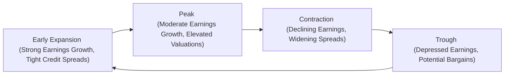

## Introduction
Well, if you’ve ever found yourself scratching your head while watching equity and bond markets swing wildly during different stages of the business cycle, trust me—you’re not alone. Many of us in the investment world (myself included) have wondered why perfectly reasonable valuation multiples seem to morph into something entirely different once the economy shifts from expansion to contraction, or vice versa. It’s not just random noise. There’s a method to the madness, and it often comes back to how market participants anticipate future earnings, credit risks, and discount rates throughout these different phases.

In this section, we’re going to unravel how both equity and debt markets respond to the ups and downs of economic growth. We’ll talk about profit margins, sales growth, and the interplay between interest rates and corporate spreads. We’ll also explore classic valuation models—like the Dividend Discount Model (DDM) and free cash flow approaches—showing how assumptions around growth and discount rates can shift dramatically during each phase of the business cycle. And yeah, we’ll definitely touch on mean reversion, one of those big-picture concepts that keeps us all honest when valuations get too frothy. Let’s dive in.

## Corporate Earnings, Profit Margins, and Sales Growth Across the Business Cycle
A big driver of equity valuations is corporate earnings. The business cycle can be broken down into several stages—expansion, peak, contraction (or recession), and trough. As you might guess, corporate earnings, profit margins, and overall sales growth tend to fluctuate at each stage.

• Expansion  
  During the early expansion phase, consumer and business confidence typically rises, leading to increased spending and investment. Companies might see accelerating revenue growth, improving profit margins, and favorable earnings surprises (situations where actual earnings exceed analyst forecasts). Sectors like consumer discretionary and industrials—commonly referred to as “cyclical sectors”—tend to benefit the most in this environment. Defensive sectors such as utilities, consumer staples, or healthcare may not see as dramatic a boost, though they remain more resilient when things turn sour.

• Peak  
  As we approach the peak, growth rates may slow a bit. Profit margins can still hold up reasonably well, often because companies haven’t yet started to see the full impact of rising wages or increasing raw material costs. Valuations can get lofty in certain industries—particularly those that have had an impressive run. Experienced investors keep an eye out for potential signs of stress, such as a flattening yield curve or weaker-than-expected corporate guidance.

• Contraction (Recession)  
  Eventually, economic output shrinks, consumer spending slows, and unemployment rises. Earnings may decline, profit margins tighten, and corporate default risk can climb, especially for firms with weaker balance sheets. During this phase, cyclical companies might suffer more, so their stock prices may fall significantly. However, high-grade fixed income or defensive equities often retain some appeal as investors seek safety.

• Trough  
  The trough is a period of low or negative growth—kind of feels like everyone’s hunkered down, waiting for the dust to settle. Interestingly, this can also be a time when savvy investors hunt for bargains. Why? Because valuations might have become incredibly depressed, ready to rebound when early signs of economic recovery reappear.

## Common Valuation Multiples and Their Cyclical Shifts
Two of the most frequently cited valuation multiples in equity analysis are the Price-to-Earnings (P/E) ratio and the Price-to-Book (P/B) ratio. In bond markets, investors track yield spreads over the risk-free rate (i.e., credit spread risk) to gauge relative value.

• P/E Ratio  
  The P/E ratio compares a company’s stock price to its earnings per share. During expansions, a company’s earnings might rise quickly, which can keep the P/E at moderate levels even if share prices are climbing. As the cycle matures, earnings growth may slow, but if investors remain optimistic about future profits, P/E ratios can become elevated, sometimes indicating that valuations are stretched. During contractions, earnings can crater, pushing P/E ratios higher even if prices have fallen (the “E” in P/E gets smaller, and that can overinflate the multiple).

• P/B Ratio  
  The Price-to-Book ratio compares market price to the firm’s book value (essentially, the value of the company’s assets minus its liabilities, as recorded on the balance sheet). In an expansion, a rising P/B ratio may be justified if new investments generate returns above the cost of capital. In downturns, particularly if companies are expected to write down asset values, the P/B might plummet, sometimes falling below 1.0 for distressed firms.

• Yield Spreads  
  In debt markets, yield spreads (the difference between the yield on a corporate bond and a risk-free government security) are a crucial barometer of market sentiment about credit risk. During expansions, spreads usually tighten as default risk is perceived to be lower. As soon as signs of economic stress emerge—say, in a late-cycle or recession environment—spreads often widen to reflect greater default risk. That dynamic can cause bond prices to drop, particularly for lower-rated issuers.

## Mean Reversion in Valuations
If there’s one concept that humbles all of us sooner or later, it’s mean reversion. The idea is simple: variables such as P/E ratios or credit spreads tend to revert to a historical average over time. Now, that doesn’t mean we know exactly when or how quickly the reversion will happen. But when valuations deviate wildly from historical norms, caution is typically warranted. This is why protracted booms where P/E multiples remain sky-high for a while can be followed by abrupt crashes. Overly negative sentiment in the depths of a recession can similarly create opportunities, because valuations might be beaten down well below historical averages, primed for an eventual bounce.

## The Impact of Discount Rates and Bond Yields on Valuation
Equity valuations and bond valuations both rely heavily on discount rates. To discount future cash flows, we start with the risk-free rate (often proxied by Treasury yields), then add a premium to capture credit risk, equity market risk, liquidity, and so forth. Here’s a closer look:

• Equity Discount Rate  
  In a simplified Dividend Discount Model (DDM), for instance, the discount rate might be expressed as  
  $$
  r = r_\text{f} + \beta (r_\text{m} - r_\text{f}),
  $$
  where \\( r_\text{f} \\) is the risk-free rate, \\( \beta \\) is the sensitivity of the stock to the market, and \\( (r_\text{m} - r_\text{f}) \\) is the market risk premium. When the economy is strong, interest rates might begin to rise if central banks see inflationary pressures. That higher \\( r \\) reduces the present value of future dividends, tending to depress valuations if expected cash flows don’t climb enough to compensate.

• Bond Yields  
  Bond prices move inversely to yields. As interest rates climb, bond prices typically fall. When the business cycle is strong, central banks might hike rates, pushing up yields on government and corporate bonds. Meanwhile, if investors start to worry about a turning point or a recession, corporate credit spreads can widen, pushing bond yields even higher for riskier paper—and thus lowering bond prices. Investment-grade bonds can be somewhat insulated, but high-yield (junk) bonds often see larger price declines because those spreads can balloon rapidly when recession looms.

## Projecting Equity Valuations Using Expected Earnings and Macro Forecasts
Ever notice how corporate guidance and macro forecasts can significantly shift the equity story? That’s because equity valuations aren’t just about the present—they’re about future cash flows and the economy’s trajectory.

• Earnings Projection Approaches  
  Many analysts build a detailed pro forma income statement based on GDP growth assumptions, industry outlook, and individual company data. Suppose you expect GDP growth to slow from 3% to 1% in the coming year, with consumer confidence dipping accordingly. You might scale back expected revenue growth for a retailer, which in turn influences expected profit margins and net income. The result is typically a lower projected EPS—and thus, potentially a lower fair value for the stock.

• Cyclical Swings in Margins  
  One thing to keep in mind: profit margins are not static. For instance, if you’re modeling a semiconductor company—a famously cyclical sector—don’t just apply the same margin assumption year after year. During upturns, margins may expand well above historical averages, while in downturns, they can shrink quickly, especially if factories are forced to idle capacity.

• Integrating Information into Valuation Models  
  Valuation models like the Gordon Growth Model,  
  $$
  P_0 = \frac{D_1}{r - g},
  $$
  become more realistic if you carefully adjust \\( g \\) (the long-term growth rate) based on macro conditions. You might break down the growth component into multiple stages: a higher near-term growth rate if you believe a firm will outperform in the early expansion, followed by a more conservative “steady-state” growth rate once the economy cools and reverts to a long-term trend line.

## Incorporating Business Cycles into DDM and Free Cash Flow Models
Let’s dig a bit deeper: almost every equity analyst worth their salt uses either a Dividend Discount Model (if the firm has a stable dividend policy) or a Free Cash Flow to Equity (FCFE) approach. Both require assumptions around growth and discount rates. 

• Multistage Dividend Discount Model  
  Often, analysts will apply a higher short-term growth rate for the early years if they think the macro environment is favorable, then reduce the growth rate to a stable long-term average. In a contraction phase, or if central banks have jacked up rates, you might assume a higher discount rate to reflect increased uncertainty, which can knock down the model’s fair value.

• Free Cash Flow Valuations  
  For free cash flow models, you project revenue, expenses, capital expenditures, and changes in working capital across the business cycle. It can be helpful to do scenario analysis: one scenario where the economy recovers robustly (leading to higher sales and margins), another scenario where a recession drags on and top-line growth is minimal.

## How Bond Prices Adjust with Changing Interest Rates and Shifting Credit Risk
Bond valuations are famously sensitive to interest rates and credit spreads. Here’s how the mechanics typically look over a cycle:

• Early Expansion to Peak  
  Rates are often low at the start of an expansion—maybe the central bank is still trying to stimulate the economy (think quantitative easing or moderate policy rates). Over time, though, improving economic conditions can push rates upward, lowering bond prices and sometimes widening the spread for lower-quality issuers if inflation and rate hikes are expected to hamper borrowing ability.

• Contraction  
  In a recession, central banks often cut rates in an attempt to spur growth, which can boost the prices of high-quality bonds. However, corporate spreads for riskier firms can widen if defaults are expected to rise. This divergence can create interesting relative-value opportunities, especially if you believe the recession will be brief and spreads are overly pessimistic.

## Practical Visually-Aided Overview

In the diagram above, the arrows illustrate the cyclical flow from expansion to peak to contraction to trough and back again. Notice how early expansions often feature tight credit spreads (because risk is perceived as low) and strong earnings growth, peaks can see elevated valuations, contractions bring about declining earnings and widening spreads, and troughs can be a time to pick up assets at discounted prices.

## Best Practices, Pitfalls, and Strategies
• Watch Out for Overly Optimistic Forecasts  
  During a euphoric market, it’s easy to get caught up in “new paradigm” thinking—believing that valuations are justified by permanently higher margins. Mean reversion usually catches up.

• Factor in Discount Rate Changes  
  Even if a company’s fundamentals look strong, a rising discount rate can severely damage your valuation. Keep tabs on the macro environment and central bank policy signals.

• Use Scenario Analysis  
  Projecting one single path for earnings is rarely enough. Prepare at least a bull, base, and bear scenario to capture the range of potential outcomes.

• Look at Risk Management Tools  
  In corporate bonds, consider the role of duration, convexity, and liquidity. For equities, watch sector rotation patterns as the cycle evolves.

## Personal Reflections
I remember the first time I analyzed a cyclical manufacturer’s equity during a deep recession. The P/E ratio was over 40 (which seemed shocking), but the company’s earnings were near rock-bottom. Once the economic tide turned, its earnings soared, and that “high” P/E melted down to a very attractive multiple—almost overnight. It taught me never to rely on a single snapshot. Whether you’re looking at equities, bonds, or any other asset class, the business cycle context matters immensely.

## References for Further Exploration
• “Equity Valuation: Applications and Processes” – CFA Institute Level II Curriculum (2025).  
• Damodaran, A. (2012). “Damodaran on Valuation.” Wiley Finance.  
• Moody’s and S&P Global Credit Market Commentaries for corporate bond spread trends and macro outlook.  

## Sample Exam Questions: Valuations Across the Business Cycle



### Equity Valuation Under Different Growth Scenarios
- [ ] Use a single long-term growth rate, regardless of macro conditions.
- [x] Adjust growth rates to reflect cyclical changes in sales and margins.
- [ ] Base earnings estimates solely on industry trends.
- [ ] Only use trailing 12-month earnings to estimate fair value.

> **Explanation:** A key insight is that growth rates can vary significantly depending on whether the economy is expanding or contracting. Adjusting growth assumptions for cyclical changes in revenue and profit margins is essential.

### Mean Reversion Concept
- [x] It describes how valuation metrics tend to shift back to historical averages over time.
- [ ] It is only relevant for bonds and not equities.
- [ ] It implies that valuations remain constantly high in expansions.
- [ ] It is entirely unpredictable and should be ignored in valuations.

> **Explanation:** Mean reversion is the notion that variables like P/E ratios do not stay at extremes forever; they tend to revert toward their long-term average.

### Credit Spread Fluctuations
- [ ] Credit spreads tighten mainly during recessions.
- [ ] Credit spreads remain constant through the business cycle.
- [x] Credit spreads typically widen during contractions and narrow in expansions.
- [ ] Credit spreads are unaffected by default risk perceptions.

> **Explanation:** Credit spreads reflect perceived default risk. In contractions, default risk rises, and spreads widen; in expansions, the opposite often holds true.

### Discount Rate Impact
- [ ] A high discount rate increases present value calculations.
- [ ] The risk-free rate is unrelated to the discount rate.
- [x] Rising discount rates generally lower present values for both equities and bonds.
- [ ] A discount rate is only used in bond valuation, not in equities.

> **Explanation:** Discount rates directly affect present value. A higher rate means future cash flows are worth less in today’s dollars, reducing valuations for both stocks and bonds.

### Dividend Discount Model (DDM)
- [ ] Ignores future growth assumptions.
- [x] Relies on expected dividends and discount rates.
- [ ] Is rarely used for any valuation.
- [ ] Is only applicable for companies in cyclical industries.

> **Explanation:** The DDM computes the present value of expected future dividends using an appropriate discount rate. It’s commonly used for stable dividend-paying stocks.

### Defensive vs. Cyclical Sectors
- [ ] Defensive sectors are more volatile than cyclical sectors.
- [x] Defensive sectors are less sensitive to the business cycle.
- [ ] Cyclical sectors always outperform defensive sectors.
- [ ] Defensive sectors do not earn profits during expansions.

> **Explanation:** Defensive sectors (e.g., utilities, consumer staples) are less sensitive to economic cycles than cyclical sectors. They may provide more stable returns during downturns.

### P/E Ratio During a Recession
- [x] Can appear high even if the stock price has fallen, because earnings might have dropped more.
- [ ] Always remains low due to depressed stock prices.
- [ ] Usually becomes negative as companies lose money.
- [ ] Never changes, regardless of earnings levels.

> **Explanation:** Even if prices fall, earnings can decline even more, causing the ratio to rise. It’s crucial to understand that under cyclical pressure, “E” can drop significantly.

### Yield Spreads in a Peak Phase
- [ ] Typically highest at economic peaks.
- [ ] Remain unaffected by monetary policy.
- [x] Often remain tight if default risk is perceived to be low, but can start to widen if markets sense a slowdown.
- [ ] Are only relevant to government bonds.

> **Explanation:** Near a peak, default risk might still be low, thus spreads can stay tight. However, once the market senses a slowdown, spreads begin to widen in anticipation of more challenging conditions ahead.

### Impact of Rising Interest Rates on Bond Prices
- [x] Bond prices generally fall as interest rates rise.
- [ ] Bond prices generally increase as interest rates rise.
- [ ] No relationship exists between bond prices and interest rates.
- [ ] Bond prices always move in the same direction as interest rates.

> **Explanation:** Bond prices and yields move inversely. If interest rates rise (yields up), then existing bond prices tend to fall to offer competitive yields to new buyers.

### True or False: Growth Assumptions in Equity Valuation Should Remain Constant Throughout the Cycle
- [ ] True
- [x] False

> **Explanation:** Growth assumptions should reflect the cyclical nature of the economy. Projecting one constant growth rate ignores how sales, margins, and macro factors evolve over different cycle phases.




