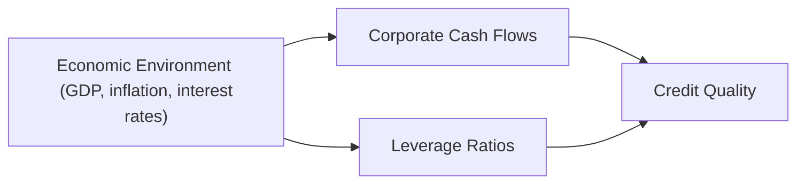

## Introduction

Sometimes, we see “credit risk” and instantly imagine large banks combing through stacks of complex debt instruments. While that’s partly true, the bedrock of credit risk is really about one question: Can a company pay back what it owes? And believe me, that question depends as much on the economy’s temperature (hot, cold, lukewarm, or downright freezing) as it does on the company’s own management and strategic decisions. 

When the global economy is booming, customers are spending more, revenues climb, and servicing debt feels easier. But if central banks hike rates or GDP growth stalls, many once-steady firms find themselves struggling, and lenders grow wary—widening credit spreads and monitoring every new data release like hawks. Let’s dig into exactly how the economic environment influences corporate credit quality, covering everything from the big macro signals to nitty-gritty financial ratios.

## Key Drivers of Corporate Credit Quality

Credit analysts (and your friendly neighborhood CFO, too) often zero in on a handful of vital signs to gauge corporate credit health. Let’s briefly walk through them:

• Cash Flow Stability: Stable cash flow provides a cushion, letting a firm meet debt obligations reliably. If you have consistent revenue streams and limited variability in your expenses, you’re generally in better shape. During recessions, that “stability” can vanish if consumer demand dries up or if cyclical industries take a direct hit.

• Leverage Ratios: This is basically how much debt a firm has relative to its earnings or equity. One common yardstick is the Debt/EBITDA ratio. Suppose a company’s total debt is $500 million, and its annual EBITDA is $100 million, so Debt/EBITDA = 5×. If interest rates spike, that same debt becomes costlier to refinance or roll over, making a 5× ratio far more alarming than it was in a 2% interest-rate world.

• Liquidity: Ever heard the saying, “Cash is king”? Access to liquidity—whether from cash on hand, bank credit lines, or easily marketable securities—often saves the day if income temporarily declines. Companies with limited liquidity face bigger challenges when credit conditions tighten or when there’s an economic downturn.

• Industry Outlook: Even a rock-steady firm, if operating in a struggling sector, can see its credit quality deteriorate. If you’re in discretionary consumer goods and the economy heads into a recession, you might see your top line drop faster than in less-sensitive industries like utilities or basic consumer staples.

## Macroeconomic Factors Affecting Credit Metrics

It’s all connected. If central banks raise rates—maybe to combat rising inflation—corporations find it costlier to borrow and refinance. A slowdown in GDP growth, especially if paired with high borrowing costs, can lead to:

• Lower consumer spending → Lower revenues  
• Higher financing costs → More stress on key ratios like interest coverage  
• Tighter lending conditions → Decreased access to new capital  

In many cases, those changes in macroeconomic variables directly alter a company’s capacity to generate free cash flow. And as that capacity shrinks, leverage, coverage, and liquidity metrics can deteriorate.

Let’s visualize how macroeconomic factors flow into a firm’s credit quality.

In downturns, default rates typically rise as sometime-stable firms find themselves cash-strapped. Lenders, spooked by the uptick in risk, may widen spreads—even for higher-quality issuers—thus increasing borrowing costs across the board. It’s a self-reinforcing cycle: economic weakness spurs credit stress, which in turn can compound real-sector weakness.

## Cyclical vs. Non-Cyclical Industries

A short anecdote: I once analyzed two companies—one a luxury apparel brand and another a staple food producer—during a mild economic slump. The apparel company’s sales cratered by 20% in a couple of quarters, sending credit analysts into a tizzy. Meanwhile, the food producer saw minor bumps in freight and commodity costs but continued selling its products at a stable pace, and it hardly skipped a beat. That scenario shows why cyclical or discretionary industries typically face sharper downturns compared to non-cyclical sectors like utilities, consumer staples, or healthcare.

• Consumer Discretionary (Cyclical): Travel, entertainment, electronics, fashion—sales can tumble if consumers tighten spending. Credit spreads for these industries usually widen more significantly in economic slowdowns.

• Consumer Staples (Non-Cyclical): Grocery items, basic household goods—demand tends to remain constant. Firms aren’t entirely recession-proof, but they generally see more resilient earnings, which soothes credit markets.

• Countercyclical Sectors: Certain discount retailers or business turnaround specialists might even see an uptick in demand during downturns. They become a safe haven for customers on tighter budgets, sometimes boosting their relative credit standing.

## Macroeconomic Forecasts and Stress Testing

Analysts often rely on GDP growth forecasts, inflation expectations, or interest rate projections to predict how a firm’s ability to generate cash might shift. This is where macro stress testing steps in: under hypothetical adverse scenarios—like a severe recession or a two-percentage-point interest rate hike—an analyst recalculates the firm’s coverage ratios, cash flow, and even a Z-score (a widely used bankruptcy predictor). 

Z-score models, for instance, might combine metrics such as:

• Working Capital / Total Assets  
• Retained Earnings / Total Assets  
• EBIT / Total Assets  
• Market Value of Equity / Total Liabilities  
• Sales / Total Assets  

By applying a hypothetical drop in sales and a jump in liabilities or interest expense, credit specialists can see how close the firm could get to that dreaded “financial distress” zone.

## Integrating Macro Inputs into Corporate Cash Flow Analysis

Analyzing a firm’s credit strength means looking not just at historical performance but also at projected statements. Let’s walk through a simplified, step-by-step approach:

• Start with Base-Case Economic Assumptions: For example, assume GDP grows at 2%, the central bank’s policy rate is 3.5%, and inflation is 2%.  

• Tailor Revenue Forecasts: If the firm is in a cyclical sector, scale revenue growth according to your macro assumptions (e.g., slight growth might mean a modest revenue rise). If it’s non-cyclical, you might incorporate relatively stable demand.

• Factor in Cost Pressures: If inflation picks up, raw materials and labor might get more expensive. For industries reliant on commodities (petroleum, metals, or agricultural inputs), a spike in commodity prices can pinch margins.

• Adjust Leverage and Interest Coverage: As interest rates rise, the expected interest expense increases, which can dent your coverage ratio (EBITDA / Interest). If that ratio dips below a comfort threshold—say, less than 2×—credit quality perceptions may decline quickly.

• Stress Test Scenarios: Now layer on a “downside” scenario, with lower GDP growth (or negative), higher borrowing costs, and perhaps a 10% revenue slump. Recalculate debt coverage and liquidity positions. If the firm’s newly projected free cash flow is insufficient to cover debt maturities, big red flag.

## Real-World Example: Rising Rate Environment and Debt Coverage

Imagine a mid-size manufacturing firm—call it ABC Manufacturing. As of year-end:

• Debt Outstanding: $200 million  
• Annual EBITDA: $40 million  
• Interest Expense (current rates): $10 million  

So its interest coverage is 40 / 10 = 4×. A healthy ratio but not stellar. Now suppose interest rates jump by 2% across the board. ABC’s new annual interest expense might climb to $14 million. If at the same time, we assume a mild recession that clips 10% off EBITDA, dropping it to $36 million, then coverage falls to 36 / 14 ≈ 2.57×. That’s a sizable drop. A further slump, say an EBITDA of $32 million, would create a coverage ratio of just 2.3×. You can see how quickly credit metrics deteriorate.

As a result, ABC might see rating agencies and lenders re-assessing the firm’s credit quality. Borrowing at favorable terms becomes harder, and if the economy worsens, debt covenants might loom uncomfortably close.

## Pitfalls, Best Practices, and the Analyst’s Role

Just like any analysis, hooking your forecast to a single macro scenario can be dangerous. Maybe your baseline is wrong. Maybe that interest rate path we all anticipated doesn’t materialize. Or perhaps inflation roars above expectations, spooking bond markets with much sharper rate hikes. Best practices often include:

• Using Multiple Scenarios: A base case, a best case, and a worst case.  
• Monitoring Leading Indicators: Housing starts, consumer sentiment, PMI, etc. They often show economic turning points early, giving you time to adjust credit analysis.  
• Checking Liquidity Buffers: Even if a firm has high leverage, strong liquidity sometimes allows it to weather short-term shocks.  
• Reviewing Industry Outlook: If the entire sector is in decline, even the best-run firm could face downward pressure on its credit quality.

As an analyst, your job is to merge macro insights with a firm-level perspective, maintaining a healthy skepticism. Don’t oversimplify either the macro environment (it can shift quickly) or the corporate fundamentals (like ignoring seasonal or cyclical fluctuations in revenues). Combining both views with a robust scenario analysis method helps you produce a more accurate, dynamic credit evaluation.

## Conclusion and Final Exam Tips

Linking corporate credit quality to economic conditions is one of those tasks that sounds straightforward but can get complicated on the exam. My advice? Practice scenario analysis diligently. In a vignette format, the data might be scattered—look for signals like GDP projections, interest rate environment hints, or sector-specific remarks. Integrate them systematically into your projected ratio calculations.  

• Common Pitfalls: Forgetting to adjust interest expense when the scenario mentions higher yield spreads; ignoring the possibility of revenue declines for cyclical sectors in an economic slowdown.  
• Constructed-Response Strategy: Outline your approach clearly, referencing macro assumptions. Show how each key ratio (leverage, coverage, liquidity) changes with the scenario.  
• Time Management: Quickly identify the relevant macro assumptions and zero in on their effect on the firm’s future debt service metrics.  

The ability to synthesize macro data with corporate fundamentals is often a deciding factor in mastering Level II item sets—and it’s a skill that real-world credit analysts wrestle with every day.

## References

• CFA Institute Level II Curriculum—Corporate Issuers and Corporate Finance  
• Saunders, A. (2019), Credit Risk Modeling, 3rd Ed.  
• European Central Bank and Federal Reserve stress test documentation (macroeconomic scenario design)  
• Moody’s, Standard & Poor’s, Fitch official publications on corporate credit ratings  

--------------------------------------------------------------------------------

## Quiz: Corporate Credit & Economic Conditions



### Which of the following factors best reflects a firm’s short-term ability to meet its debt obligations?

- [ ] Leverage ratio
- [ ] EBIT margin
- [x] Liquidity position
- [ ] P/E ratio

> **Explanation:** Liquidity position indicates a firm’s ability to handle near-term obligations. While leverage and margins are critical, they don’t necessarily reflect short-term cash availability as clearly as liquidity metrics.

### Which statement about the relationship between macroeconomic conditions and credit spreads is most accurate?

- [x] Credit spreads often widen during economic downturns as investors perceive higher default risk.
- [ ] Credit spreads remain constant regardless of the economy.
- [ ] Credit spreads typically narrow in recessions.
- [ ] Credit spreads and default risk are unrelated.

> **Explanation:** In economic downturns, default risk perception increases, prompting wider spreads to compensate investors for heightened risk.

### An analyst reviewing a mining company’s stress test results sees a hypothetical scenario where commodity prices decline by 15%, reducing operating revenue. Which of the following ratios is most directly affected and signals potential problems for bondholders?

- [ ] Dividend payout ratio
- [x] Interest coverage ratio
- [ ] Price-to-book ratio
- [ ] Return on equity

> **Explanation:** A drop in operating revenue will negatively affect EBIT or EBITDA, which directly impacts the interest coverage ratio. Bondholders watch this metric to gauge how comfortably a company can pay interest.

### During a period of rising interest rates, what is the most immediate effect on a heavily indebted corporation?

- [x] Higher interest expense, reducing net income.
- [ ] Lower operating expenses, boosting free cash flow.
- [ ] Lower capital expenditures, improving leverage ratios.
- [ ] Higher liquidity reserves from refinancing.

> **Explanation:** Rising rates generally increase interest expense for companies with variable-rate debt or those forced to refinance at higher coupon rates.

### Which of the following is true regarding cyclical vs. non-cyclical (defensive) industries?

- [x] Cyclical industries often face sharper revenue declines during economic downturns.
- [ ] Non-cyclical industries see immediate profit surges in recessions.
- [x] Consumer staples are commonly considered defensive.
- [ ] All cyclical industries completely shut down operations in recessions.

> **Explanation:** Cyclical industries face bigger hits to demand when the economy contracts, whereas defensive (non-cyclical) industries, like consumer staples or utilities, are less sensitive to economic fluctuations.

### A firm has an EBITDA of $50 million and annual interest costs of $10 million, implying a coverage ratio of 5×. If inflation and rate hikes push interest costs to $14 million while EBITDA remains $50 million, what is the new coverage ratio?

- [ ] 5.00×
- [ ] 4.17×
- [x] 3.57×
- [ ] 3.25×

> **Explanation:** New coverage ratio = $50 million / $14 million ≈ 3.57. It shows the effect of higher interest costs.

### In corporate credit analysis, which metric is most relevant when assessing the degree of a company’s debt burden relative to its operational performance?

- [x] Debt-to-EBITDA ratio
- [ ] Quick ratio
- [x] Interest coverage ratio
- [ ] Dividend yield

> **Explanation:** Both Debt-to-EBITDA and Interest Coverage are classic metrics to measure how burdensome debt is relative to the firm’s ability to generate operating earnings and pay interest.

### During a recession, an auto manufacturer’s bond rating is downgraded. Which factor most likely contributed to the downgrade?

- [x] Declining sales of new vehicles due to weaker consumer demand
- [ ] A drop in the creditworthiness of its main competitor
- [ ] A switch to a more fuel-efficient product line
- [ ] Stable raw material costs

> **Explanation:** Auto sales are highly cyclical, and a recession typically reduces demand for big-ticket items like cars. Lower sales reduce the manufacturer’s ability to service debt, likely triggering a rating cut.

### A retail firm that caters to budget-conscious consumers sees an increase in sales during an economic slowdown. This firm is best classified as:

- [ ] A cyclical consumer discretionary retailer
- [x] A countercyclical retailer
- [ ] A luxury goods supplier
- [ ] A derivative risk provider

> **Explanation:** Some discount and budget retailers can be countercyclical, actually benefiting from tighter consumer budgets when the broader economy slows.

### If an economic scenario sees a deep recession lasting multiple quarters, which statement is TRUE regarding corporate credit?

- [x] Default rates typically rise, and lenders demand larger risk premiums.
- [ ] Default rates typically fall because firms spot the recession in advance.
- [ ] Credit spreads typically narrow as supply of bonds decreases.
- [ ] Lenders significantly reduce scrutiny of borrowers during recessions.

> **Explanation:** Economic recessions often push more companies toward financial distress, raising default rates and prompting lenders to charge a higher risk premium.


