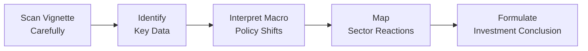

## Introduction and Context

Business cycles are never static—one year it’s accommodative monetary policy, the next it’s unanticipated fiscal tightening, and somewhere in between stands our beloved equity market, swaying between cyclical and defensive sectors. In exam item sets (a.k.a. “vignettes”), abrupt shifts in policy or investor sentiment can radically change the outlook for certain sectors or even entire economies. The big question is: how do we interpret these shifts—and, more importantly, how do we put that interpretation into practice under time pressure?

In this section, we’ll explore how you can quickly parse a vignette that contains one or more macro signals (like a sudden central bank rate hike, new government fiscal stimulus, or a wave of positive market sentiment). Then we’ll look at how to identify the right clues for sector rotation decisions. We’ll also cover some pitfalls: times when the apparent textbook reaction might be overshadowed by confounding global linkages or plain old investor fear. Let’s walk through the structure for a typical analysis.

## Quick Parsing of Macroeconomic Vignettes

Before diving into the “sector rotation” part, let’s talk about the approach to reading these vignettes. If you’ve studied Chapter 8.1 through 8.4, you already know that changes in interest rates, credit spreads, yield curves, and overall economic conditions are all interlinked. This interplay becomes quite elaborate in exam scenarios. Here’s a short systematic approach:

1. Read the scenario once to get a big-picture feel. Is the setting mid-expansion, or are they hinting at a slowdown (maybe manufacturing data dropped)?  
2. Identify explicit or implied policy changes. Perhaps the text says “The central bank is set to raise rates by 50 bps next quarter…” or "A new stimulus package of $500 billion in infrastructure spending…"  
3. Note any investor sentiment clues. Is the scenario describing “improving consumer confidence” or “massive investor outflows from equities”?  
4. Organize the data quickly—especially details like GDP forecasts, yield curve shapes, inflation expectations, or sector performance.  
5. Assess which stage of the business cycle the scenario suggests and recall the typical sector winners or losers in that phase.  
6. Factor in external or global linkages that might alter the usual pattern (like a severe commodity price shock).  

### Example: The One-Paragraph Vignette

Imagine a vignette that says, “The national GDP forecast has been revised up from 2.0% to 3.2%. Meanwhile, the central bank signaled an upcoming 25 bps rate increase to tame inflation pressures. Industrial production is at a three-year high, and consumer confidence remains elevated despite rising energy costs.”  

At first glance, it hints we’re still in a growth phase—consumer confidence is high, industrial production is strong. But the upcoming rate hike might dampen credit-sensitive sectors (like real estate or consumer durables) in the near term. You’d want to keep an eye on cyclical sectors that might continue to do well if the overall economy is expanding, but remain cautious about overexposed industries that rely on cheap financing. And yes, that might lead you to rotate partially out of certain consumer discretionary stocks if you believe interest-rate-sensitive consumption may drop soon.

## Policy Shifts: A Double-Edged Sword

Policy shifts come in many flavors:

• Monetary expansions (e.g., interest rate reductions, quantitative easing)  
• Monetary tightenings (interest rate hikes, balance sheet reduction)  
• Fiscal expansions (stimulus packages, increased government spending)  
• Fiscal tightenings (tax hikes, spending cuts)

### When Tightening Meets Growth

Sometimes monetary tightening doesn’t necessarily mean the economy is slowing. In mid-to-late expansions, a central bank might raise rates to keep inflation in check, all while corporate earnings remain robust. In such a scenario, cyclical sectors can keep rallying for a bit—until higher rates finally cool off consumer spending and capital expenditures.

### Fiscal Stimulus and Market Euphoria

On the other hand, a big infrastructure spending push can ignite euphoria for sectors connected to construction, commodities, and heavy equipment—although crowding-out effects can also raise interest rates over time. If the vignette specifically calls out a surge in government bond yields after the stimulus announcement, you may anticipate rising financing costs that eventually cool certain interest-rate-sensitive sectors (like housing).

## Investor Sentiment: The Amplifier

This is one part of the puzzle that people often underestimate. Even if the fundamentals suggest a moderate shift—say, a small interest rate cut—investor sentiment can amplify or negate that shift. Bullish sentiment can turn a modest policy tweak into a full-blown equity rally, while bearish sentiment can overshadow a positive news story.  

In real life, we’ve witnessed times when a central bank cut rates, but markets still sold off, maybe because the cut signaled a deeper worry about the economy’s health. So the “direction” of the policy might conflict with the “motive” or investor interpretation. Watch those subtle cues in the text: “analysts worry that the surprise cut signals more profound trouble behind closed doors” is a direct clue about how sentiment might unravel an otherwise textbook interpretation.

## Sector Rotation Logic

Sector rotation is the art (and some might say science) of shifting into industries that stand to benefit from the evolving phases of the economic environment or from specific policy actions.

• Early Recovery: Financials, consumer discretionary, and industrials often do well.  
• Mid Expansion: Technology, materials, and continued strength in industrials.  
• Late Expansion: Energy or commodity-related sectors can rally on inflation pressure; less cyclical names begin to gain favor as the cycle matures.  
• Recession: Defensive sectors (health care, consumer staples, utilities) generally hold up better.

### Mapping Policy Shifts to Sectors

If a vignette states, “Central Bank x has embarked on quantitative tightening, aiming to reduce the balance sheet by $500B,” you might consider that bond yields could rise, which impacts interest-rate-sensitive sectors negatively (think real estate, homebuilders). Defensive sectors—like consumer staples—may become relatively more appealing when monetary conditions tighten. By contrast, if there's mention of a new infrastructure bill, materials and industrials could surge from increased demand and higher commodity prices.

### Sentiment Overlays

Don’t forget the overlay of bullish or bearish mood. If the text says something like, “Despite a rate hike, investor confidence soared on robust earnings,” you might see cyclical stocks keep pushing higher, at least in the short run. In other words, it’s not always a linear path—investor psychology is that intangible X-factor that exam vignettes sometimes highlight with phrases like “traders brushed off rate concerns” or “fears of a deeper economic malaise overcame optimism about the stimulus.”

## Step-by-Step Vignette Practice

Below is a conceptual “flow” we often use when tackling these item sets:

### 1. Read the Scenario Describing Economic Data

Remember to skim for the “headline” figures or statements: the new GDP forecast, interest rate moves, inflation data, or announcements from the finance ministry/treasury. If an external shock is mentioned (oil supply disruption, trade war, etc.), highlight it.

### 2. Identify Relevant Signals

Check if we’re near a peak or a trough, or if we’re in an expansion or early recovery. Look for explicit mentions of increased government spending (fiscal expansion) or a contraction (fiscal austerity). Confirm investor or business sentiment—maybe you see improved job numbers and a jump in consumer surveys.

### 3. Determine Likely Winners and Losers

Use your knowledge of the business cycle and sector sensitivities. For example:

• Rising rates: banks might benefit short-term from higher net interest margins, but homebuilders might see demand slip.  
• Stimulus: Industrial, materials, or consumer discretionary could get a boost.  

Check for any references to burdens on certain industries—maybe new taxes or regulatory changes that weigh on big tech or energy.

### 4. Watch for Potential Trick Details

Sometimes the text includes a subtle mention that “Global commodity prices have fallen 20%.” Even if the local economy is strong, a big commodity downturn might hamper materials or energy-tilted stocks. Also, watch for currency moves—an appreciating local currency might hurt exporters.

### 5. Answer the Questions Systematically

Relate your final answers to frameworks from the curriculum, referencing standard business cycle analysis, sector rotation strategies, and the interplay between policy and sentiment. Don’t forget that a single policy measure might have multiple short- and long-term impacts.

## Common Pitfalls

• Over-simplifying the effect of a rate hike: Not all hikes slow the economy immediately; the context matters.  
• Ignoring global shocks: The vignette might mention foreign markets or commodity price shifts that overshadow local policy.  
• Failing to parse sentiment signals: If the text says investors remain bullish, that can override some negative fundamentals in the short run.  
• Missing the difference between immediate vs. lagged effects: Some policy changes (like taxes on certain industries) can be immediate, while infrastructure spending might take time to filter through.  

## A Personal Anecdote on Sentiment

I once chatted with a fund manager who, in simpler times, bet heavily on cyclical stocks during a moderate rate-hike cycle. He reasoned, “If the central bank’s hiking, the economy’s strong enough to handle it—cyclicals can run for another few quarters.” Sure enough, cyclical stocks soared. But then a wave of negative news triggered a slide across all equities. His fundamental call still looked fine, but investor psychology turned sour, and all the good logic in the world couldn’t hold back the tide. Ultimately, he waited it out and eventually was proven right—but it’s a reminder that you can be “right” in fundamentals but temporarily “wrong” in market price.

## Practice Scenario: Sector Rotation in Action

Let’s illustrate with a short hypothetical scenario:

“The government of Country Q announces a significant construction and infrastructure development plan, worth 3% of GDP, alongside moderate wage growth and historically low unemployment. However, inflation concerns emerge, prompting the central bank to consider raising rates by 50 bps. Meanwhile, energy price volatility spikes global uncertainty, but local consumer confidence remains stable.”

Three immediate thoughts:

1. **Infrastructure Stimulus** suggests a tailwind for industrials, materials, and possibly energy (though that depends on global prices).  
2. **Rate Hike** typically slows financing-driven industries, but it may not overshadow the positive effect of fiscal injection—especially in the near term.  
3. **Energy Price Volatility** could lead to inflation concerns, possibly boosting short-term interest in alternative energy or resource-related sectors.  

## Framework for the Exam

When you face item-set questions in the exam, they’ll often ask:

• Which sector benefits the most given the described policy shift?  
• Which sector is likely to underperform if the central bank tightens monetary policy?  
• How does overall market sentiment interact with this scenario?  

Try not to overthink. Follow the flow:

• Confirm the macro environment (growth, inflation, unemployment trends).  
• Pinpoint the policy shift and interpret its likely immediate and longer-term impact.  
• Factor in investor sentiment if described.  
• Combine those elements to identify sectors/industries that gain or lose.  

## Best Practices and Time Management

Time’s always an issue. Here’s a quick tip: circle or underline the key economic data (like “GDP grows at 3%, inflation at 2.5%, central bank raises rates 25 bps”). Then in the margin, jot down a quick note: “Increasing rates → potential negative for housing but positive for banks; stable inflation → no immediate meltdown.” This helps you keep a laser focus on the big triggers.

## Conclusion and Exam Tips

• **Contextualize** each policy announcement or sentiment shift with your knowledge of the business cycle.  
• **Don’t get stuck** on small data if you see big signals (like a massive stimulus overshadowing a 25 bps hike).  
• **Consider** whether the market might be in an optimistic or pessimistic mood; that alone can shift typical “textbook” sector responses.  
• **Practice** reading the entire vignette carefully before looking at the questions. Then refer back to the vignette as you answer.  
• **Brush up** on your knowledge of sector sensitivity: financials do better with moderate rate hikes in a strong economy, but might suffer if credit conditions deteriorate sharply.  

## References for Further Study

• CFA Institute’s “Practice Problems and Mock Exams” for Level II. Official item-set questions are your best guide to the real test’s style.  
• Ferson, W. E., & Harvey, C. R. (Journal of Finance). “Sector Rotation in Stock Markets.” A deep dive into timing and rotation strategies.  
• Government policy reports such as the Congressional Budget Office (CBO.gov) for a real-life look at policy impacts on the economy.

---

## Test Your Mastery: Policy Shifts, Investor Sentiment & Sector Rotation



### When a country’s central bank raises interest rates while GDP growth remains above trend and consumer confidence is high, which sector adjustment is most likely in the short term?

- [ ] Energy stocks will rapidly underperform due to higher consumer borrowing costs.
- [x] Certain financial stocks (e.g., banks) may benefit from improved net interest margins.
- [ ] Consumer staples will generally outperform as inflation surges.
- [ ] Utilities will benefit from higher borrowing costs.

> **Explanation:** In a moderately strong economy, higher interest rates can help banks by widening net interest margins. Not all cyclical sectors suffer immediately if consumer confidence is still robust.

### A fiscal stimulus plan that allocates significant government funds to public infrastructure projects typically benefits which sector first?

- [ ] Pharmaceutical companies.
- [x] Industrials and materials.
- [ ] Consumer staples.
- [ ] Telecommunication services.

> **Explanation:** Public infrastructure spending fuels demand for construction, machinery, and raw materials, boosting industrials and materials early in the process.

### If a vignette mentions that market participants are worried a sudden rate cut “signals deeper issues” in the economy, which of the following best describes the role of sentiment?

- [ ] Sentiment has no effect; monetary policy is determinative.
- [x] Negative sentiment can overshadow potential short-term gains from a rate cut.
- [ ] Positive sentiment always follows a rate cut, regardless of context.
- [ ] It is irrelevant if consumer confidence is already high.

> **Explanation:** Investors may interpret an unexpected rate cut as a red flag about underlying economic weakness, driving risk aversion.

### In a peak economic phase with rising inflation and a flattening yield curve, which sector is commonly rotated into for defensive positioning?

- [ ] Consumer discretionary stocks.
- [x] Consumer staples or health care.
- [ ] Industrials.
- [ ] Construction materials.

> **Explanation:** As the economy nears its peak, many investors pivot into staples and health care, which traditionally hold up better when growth starts to cool.

### A vignette describes an economy facing a surge in global commodity prices while implementing fiscal tightening. Which combination might we expect?

- [x] Higher input costs hurting margins, with reduced government spending dampening demand.
- [ ] A broad-based rally in all cyclicals due to the improving economy.
- [x] Some potential outperformance in defensive stocks.
- [ ] A collapse in consumer staples due to increased cyclical spending.

> **Explanation:** Surging commodity prices raise input costs, tightening fiscal measures can reduce spending, and defensive sectors are often more resilient in a doubly challenging environment.

### Which key step should a candidate take first when approaching a multi-paragraph vignette that mentions multiple policy shifts?

- [x] Quickly identify the main macroeconomic signals (growth rates, policy changes, sentiment).
- [ ] Skim the questions first and ignore the vignette context.
- [ ] Look only for sector-specific metrics.
- [ ] Memorize yield curve shapes without reading further.

> **Explanation:** In your initial read, extract the primary macro signals—such as growth forecasts, interest rate changes, or sentiment cues—for an organized approach.

### If a government imposes new environmental regulations raising costs for energy companies, but overall GDP is accelerating, how might a candidate weigh the two impacts?

- [x] Consider that rising macro growth might help many companies, but the energy sector faces unique headwinds.
- [ ] Conclude that all sectors will benefit equally from GDP growth.
- [x] Recognize a potential sector-specific underperformance despite broader economic strength.
- [ ] Assume environmental costs will be negligible across the board.

> **Explanation:** Despite strong economic growth boosting most sectors, new regulations can uniquely hamper the energy sector’s profitability, leading to a possible rotation away from energy.

### Which of the following pitfalls is most common when analyzing policy shifts in a vignette?

- [ ] Overemphasizing global commodity prices.
- [x] Failing to account for investor sentiment when interpreting the policy’s effect.
- [ ] Believing cyclical sectors can never thrive during tightening.
- [ ] Assuming that all fiscal stimuli immediately reduce interest rates.

> **Explanation:** Sentiment is a powerful, sometimes unpredictable amplifier or dampener of policy impacts. Dismissing it can lead to incorrect conclusions.

### Suppose the vignette states that consumer sentiment is strong but the yield curve has recently inverted. How might an analyst reconcile these seemingly conflicting signals?

- [x] Recognize that near-term consumer optimism exists, but the inverted yield curve raises longer-term recessionary concerns.
- [ ] Conclude that consumer sentiment will always override curve signals.
- [ ] Dismiss the yield curve as irrelevant to the business cycle.
- [ ] Assume an immediate recession is guaranteed.

> **Explanation:** The contradiction implies a short-run robust demand but a cautious outlook for longer-term economic conditions. Many expansions have ended while consumer confidence was still fairly high—timing is key.

### Investor sentiment can amplify the fundamental impact of macro or policy changes. True or False?

- [x] True
- [ ] False

> **Explanation:** If sentiment is bullish, even modest policy changes can trigger rallies. If sentiment is bearish, positives may be overshadowed by broader fears.


