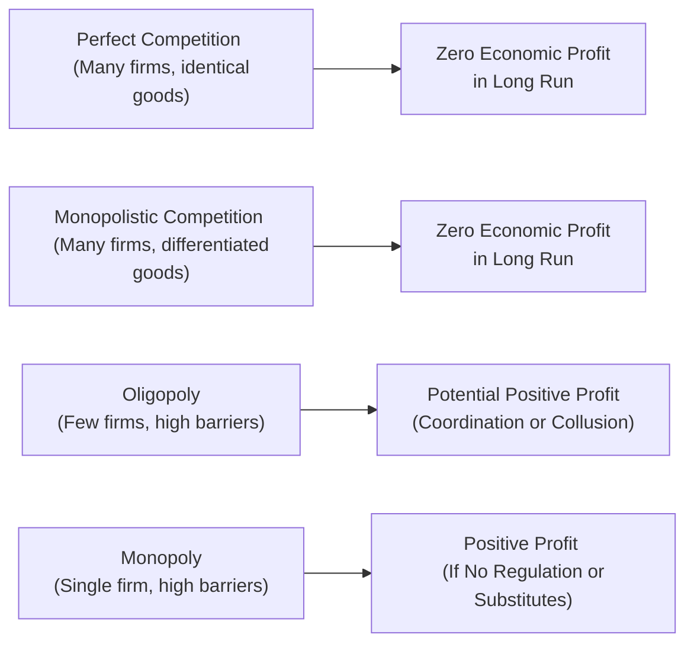

## Introduction and Key Differences

Let’s chat about something that seems so fundamental and yet shapes entire economies: market structures. We’re basically talking about how firms in various industries set their prices, control output, and—maybe most important—respond to competition. When you think about it, whether you’re an investor analyzing a new energy firm or a consumer deciding which phone to buy, the structure of that market matters a ton.

In this section, we’ll dig into four major market structures—perfect competition, monopolistic competition, oligopoly, and monopoly—and walk through the main traits distinguishing them:

- Number of firms in the market
- Barriers to entry
- Pricing power
- Product differentiation

But that’s not all; we’ll also look at short-run vs. long-run equilibrium and discuss how external shocks—like changing business cycles, new technology, or policy shifts—can shake up these structures. The goal here is both conceptual understanding and real-world insight. After all, it’s not just about memorizing definitions for an exam. In finance, these structures profoundly affect valuations, risk assessment, and even your strategic approach to investing (especially if you’re dealing with cyclical industries).

## Core Market Structures

### Perfect Competition
Picture a farmers’ market overloaded with identical apples: no single farmer can charge more than the going rate because customers can buy from the next stall. That’s essentially perfect competition. Many firms, identical products, zero (or negligible) barriers to entry. Everyone’s a price taker, which means if you try to raise your price even a little, your customers march straight over to your competitor.

Key features of perfect competition:  
- Large number of firms.  
- Homogeneous or identical products.  
- Very low (or no) barriers to entry.  
- No or negligible pricing power.  
- In the long run, firms earn zero economic profit (price equals average cost).

Exam Tip: In a perfectly competitive market, marginal revenue equals the market price. Understanding cost curves—especially marginal cost curves—helps to pinpoint the optimal output for each firm.

### Monopolistic Competition
Now imagine a bunch of coffee shops lining a city block. Each sells a slightly different brew with special beans or unique ambiance, giving them at least some wiggle room on price. There are many competitors, but each one differentiates its product in a small way (like brand image or flavor varieties).

Key features of monopolistic competition:  
- Many firms in the market.  
- Slight product differentiation (branding, quality, features).  
- Relatively low barriers to entry (though not zero).  
- Some pricing power, but limited by competition.  
- In the long run, zero economic profit, but typically with brand loyalty providing a short-run edge.

From an analyst’s perspective, these firms often compete through non-price factors, like marketing or product innovation. Over time, new entry erodes abnormal profits, but some established players can maintain a brand-based advantage for a while.

### Oligopoly
This structure is often the most dramatic because the stakes are huge, and few players run the show. Think commercial aircraft manufacturing (Boeing, Airbus) or telecommunication giants. An oligopoly typically has a handful of dominant firms, each with significant market share, so they’re highly interdependent. In other words, if one firm cuts prices, others might follow suit in an all-out price war—or they might quietly collude to keep prices high.

Key features of oligopoly:  
- Few large firms control most of the market.  
- High barriers to entry (massive capital requirements, brand dominances, or technology).  
- Interdependent pricing behavior (think game theory).  
- Potential for long-term economic profit.  
- Possibility of collusion or informal price leadership.

For a CFA® candidate, analyzing an oligopoly can be super interesting. You look at strategic alliances, M&A deals that consolidate the market, or how cyclical demand can force big players to coordinate (or battle it out) when revenues decline. It’s like corporate chess on a grand scale.

### Monopoly
A single mighty firm reigns over the entire market. With no close substitutes for the product or service, the monopoly can set a price substantially above marginal cost—assuming there are no regulatory constraints. Barriers to entry are often huge, ranging from patents to exclusive resource ownership. Because of this, a monopoly is in a position to earn positive economic profits in the long run.

Key features of monopoly:  
- Single seller dominates (or is the only one).  
- High or insurmountable barriers (ownership of key resource, patent, government license).  
- Significant pricing power, subject to demand constraints.  
- Long-run profits can remain positive.  
- Regulation sometimes plays a major role (e.g., utilities).

From a finance standpoint, monopolies can be especially attractive to investors for their stable and above-average profits—unless regulatory action threatens to break them up or impose price controls.

## Comparing Market Structures at a Glance

Below is a quick-reference table summarizing the main features:

| Feature                  | Perfect Competition                         | Monopolistic Competition                      | Oligopoly                                        | Monopoly                                                |
|--------------------------|---------------------------------------------|-----------------------------------------------|--------------------------------------------------|---------------------------------------------------------|
| Number of Firms          | Many                                        | Many                                           | Few                                              | One                                                    |
| Product Differentiation  | None (homogeneous)                          | Some (brand/style variations)                 | Can vary (often standardized, but brand matters) | Unique (no close substitutes)                          |
| Pricing Power            | None (price taker)                          | Limited (brand loyalty)                       | Significant but interdependent                   | Substantial (subject to demand and regulatory limits)  |
| Barriers to Entry        | Very low                                    | Low to moderate                               | High                                             | Very high                                              |
| Long-run Economic Profit | Zero                                        | Zero                                          | Possibly > 0                                     | Usually > 0                                           |
| Example Industries       | Agriculture (theoretical)                   | Retail, restaurants, apparel                  | Auto, airline, telecom                           | Utilities, pharmaceutical with exclusive patent        |

## Short-Run vs. Long-Run Equilibrium

One of the most tricky aspects when evaluating companies is figuring out whether they’re making short-term profits or are in a stable, long-term equilibrium.

- In perfect competition, any abnormal short-term profit lures in new firms, driving the price back to the break-even point (long-run zero profit).  
- In monopolistic competition, the same effect occurs, though product differentiation allows some firms to maintain a slight advantage until new entrants emulate their strategies.  
- Oligopolies can keep returns above competitive levels if they manage to coordinate or use barriers to entry effectively. However, if new technology or trade policies weaken these barriers, long-term profits may slip.  
- In a monopoly, there’s typically no forced convergence to zero profit unless regulatory changes or a new substitute emerges. So that’s the dream scenario for a monopolist—unless the government steps in, that is.

## Business Cycles and Their Impact

Market structures don’t exist in a vacuum. Let’s see how different structures handle expansions, contractions, and everything in between.

- Perfect Competition:  
  In an expansion, firms see higher demand, but so do all their competitors—so price barely budges if supply also increases quickly. In a recession, prices can fall swiftly, and some firms exit since everyone is a price taker and margins are ultra-thin.  

- Monopolistic Competition:  
  Companies may enjoy a modest increase in profit margins when the economy expands, thanks to consumer preference for differentiated products (think premium coffee or boutique clothing). But during a downturn, competition intensifies, and branding alone may not be enough to sustain previous margins.  

- Oligopoly:  
  This is where it gets fun. In a boom, oligopolists might invest in capacity or acquisitions to strengthen their market presence. In a recession, alliances or price-fixing agreements (either overt or tacit) can emerge to keep prices stable—though such collusion can be illegal. A desperate firm might break rank to lower prices just to maintain market share, sparking a price war.  

- Monopoly:  
  If you’re the sole provider of something essential, you can often maintain stable profits through market downturns. However, a severe recession can erode demand, especially if the product isn’t a necessity. Plus, political or social pressure for regulation might increase during tough times.

## Technological Changes and Policy Shifts

Markets can transform practically overnight due to breakthrough technology. Think about how streaming platforms upended broadcast television, or how ride-sharing apps challenged traditional taxi monopolies. Technology can either break down barriers or build new ones (such as proprietary algorithms or network effects).

- Perfect competition isn’t heavily disrupted by smaller tech changes because nobody has real pricing power. But if a tech innovation drastically lowers costs for some producers, marginal producers could be pushed out.
- Monopolistic competition is typically ripe for new entrants who have fresh product ideas, more efficient business models, or a new marketing angle. Online retailers, for instance, have disrupted countless traditional brick-and-mortar specialists.
- Oligopolies can witness dramatic shifts if a new technology arises that reduces the capital requirements or the advantages that big players traditionally enjoyed. However, large oligopolistic firms also tend to have the resources to acquire or replicate promising startups—thus preserving their position.
- Monopoly power might crumble when a patent expires or if a competing technology—often from a different industry—emerges. Regulatory policies (like anti-trust actions) can also end or limit monopoly power.

## A Visual Overview

Here’s a quick flowchart illustrating long-run profit possibilities for different structures:

You can see how different the outcomes can be, particularly between perfect competition/monopolistic competition (where profits tend to be squeezed to zero eventually) vs. oligopoly/monopoly (where persistent profit is more likely).

## Supply, Demand, and Cost Curves

It’s easy to forget that under all these structures, each firm still deals with typical supply and demand forces. They still worry about marginal costs and total costs:

- Perfect Competition: Firm-level demand curves are horizontal, representing the market price. The marginal cost curve above average variable cost is the firm’s supply curve.  
- Monopolistic Competition: The firm faces a downward-sloping demand curve because of product differentiation. But in the long run, new firms shift that demand curve leftward, driving profit to zero.  
- Oligopoly: An individual firm’s demand often depends on what the other firms do. Models like the kinked demand curve sometimes are used to illustrate sticky prices—though real-world oligopoly is more complicated, often involving game theory.  
- Monopoly: Demand is the entire market demand curve. The monopolist’s marginal revenue curve is below the demand curve because selling extra units typically requires lowering the price on all units.

Having a mental picture of those curves aids in grasping how each structure responds to macro shocks: shifts in the overall demand curve (like a recession) or changes in cost curves (like a raw material shortage).

## Real-Life Stories

I still remember a friend who worked in the telecommunication industry complaining about how just a few big companies could influence everything from the data plans we purchase to how they roll out new technologies. That’s oligopoly in a nutshell—entering that space is brutal because it requires huge infrastructure investments, license fees, marketing budgets, etc.

On the flip side, think about how many new coffee or bubble tea shops still keep popping up in big cities, each claiming to have an exciting new flavor profile. Monopolistic competition, right? Even if that niche gets saturated, entrepreneurs keep jumping in, at least until the market is so crowded no one can earn more than a modest return. Then some close down, others pivot, and the cycle repeats.  

## Common Pitfalls and Best Practices

- Overlooking Regulation: In a monopoly, especially in utilities, government oversight can shape the firm’s profit potential more than classical supply-demand analysis.  
- Confusing Oligopoly with Monopoly: Beginners sometimes see a few giant companies in an industry and think “monopoly,” but it’s actually an oligopoly with complex interfirm relationships.  
- Short-run vs. Long-run Profits: Remember that for both perfect and monopolistic competition, economic profit typically goes to zero in the long run (barring some other advantage like a strong brand or technology).  
- Ignoring Entry/Exit Dynamics: The key reason profits are competed away in some structures is because new firms flood in when profits look attractive, and some incumbents exit when losses become unsustainable.  

## Putting It All Together for Investment Decisions

From an investment standpoint, understanding market structure helps you foresee potential shifts in competitiveness and profitability:

- Valuation models often assume stable margins, but that’s risky in perfectly or monopolistically competitive industries.  
- Oligopolistic or monopolistic firms can sustain above-average returns, but you must watch for regulatory changes, new entrants, or transformative tech.  
- During expansions, you might see more M&A or capacity expansion among oligopolistic firms jockeying for top position.  
- During downturns, look out for price wars or strategic alliances in oligopolies, whereas monopolistic firms may try to cut costs or pivot to new products quickly.

When analyzing a company, ask yourself: “How easy is it for a new player to pop up and offer a cheaper or better alternative?” That single question will reveal a lot about the firm’s vulnerability—or staying power.

## Additional Resources

- “Microeconomics” by Pindyck and Rubinfeld.  
- CFA Institute Level II Curriculum, Economics Topic Area (Market Structures).  
- Porter’s Five Forces framework: Harvard Business School publications.  
- Government databases of industry concentration ratios.  
- Industry-specific regulatory commission reports.

---

## Test Your Knowledge: Market Structures and Their Dynamics



### Which of the following statements best describes a key feature of monopolistic competition?

- [ ] Firms have extremely high barriers to entry.  
- [x] Firms sell differentiated products but face competition from other similar products.  
- [ ] A single firm is the sole price setter in the market.  
- [ ] Firms earn above-normal profits in the long run.  

> **Explanation:** In monopolistic competition, there are many firms selling differentiated offerings. In the long run, new entrants compete away economic profits, preventing firms from earning above-normal returns indefinitely.

### In which market structure are firms considered “price takers” and unable to influence market price?

- [ ] Oligopoly  
- [ ] Monopoly  
- [x] Perfect competition  
- [ ] Monopolistic competition  

> **Explanation:** Perfect competition features many firms offering identical products with no individual firm having any pricing power.

### What typically happens to firms’ economic profits in monopolistic competition over the long run?

- [ ] Firms can sustain high economic profits indefinitely.  
- [ ] Firms always incur losses.  
- [x] Firms’ economic profits tend toward zero as new entrants arrive.  
- [ ] Firms are regulated to earn only normal profit.  

> **Explanation:** With relatively low barriers to entry, new firms enter when they see profits, which drives economic profit toward zero in the long run.

### During a downturn, how might an oligopolistic firm respond to try to maintain profitability?

- [x] It might engage in strategic alliances or even tacit collusion with competitors.  
- [ ] It will always engage in a price war, driving profits to zero.  
- [ ] It completely avoids changing its prices.  
- [ ] None of the above.  

> **Explanation:** Oligopolistic firms sometimes cooperate (legally or illegally) to reduce competition and maintain margins. Alternatively, they could start a price war, but they prefer to avoid that if possible.

### Which of the following most closely describes why perfect competition often results in zero long-run economic profit?

- [x] Easy entry removes any price advantages.  
- [ ] Governments cap the profits.  
- [ ] Consumers actively boycott profitable firms.  
- [ ] Production costs are always rising.  

> **Explanation:** Perfect competition has minimal barriers to entry, so new suppliers come in whenever economic profits appear, pushing prices down to the point of normal profit.

### In a monopoly, the firm’s marginal revenue curve:

- [x] Lies below the market demand curve.  
- [ ] Matches the average total cost curve.  
- [ ] Is above the market demand curve.  
- [ ] Is equal to the market demand curve.  

> **Explanation:** A monopolist faces the entire market demand, but because it must reduce price on all units to sell additional units, marginal revenue is below the demand curve.

### Which factor differentiates oligopoly from monopolistic competition?

- [ ] Firms in oligopoly have zero pricing power.  
- [x] Oligopoly usually has high barriers to entry and fewer firms.  
- [ ] Customers cannot distinguish between products.  
- [ ] Oligopoly never exists in mature industries.  

> **Explanation:** The standout features of oligopoly are a small number of dominant firms and high barriers to entry, whereas monopolistic competition has many firms and relatively low barriers.

### Suppose a monopoly is heavily regulated by government price controls. What is a likely result?

- [ ] The firm retains unlimited pricing power.  
- [x] The firm’s ability to earn above-normal profit may be severely limited.  
- [ ] The firm becomes a perfect competitor instantly.  
- [ ] Barriers to entry disappear overnight.  

> **Explanation:** Price controls can erode a monopolist’s ability to charge above-competitive prices, limiting its monopoly profit.

### All else equal, a rise in consumer incomes (economic expansion) is most likely to benefit which type of firm more significantly?

- [ ] Perfectly competitive firms making identical commodities.  
- [x] Monopolistically competitive firms offering differentiated, higher-end goods.  
- [ ] Monopolies that produce highly regulated goods.  
- [ ] None of the above.  

> **Explanation:** During economic expansions, consumers often shift toward differentiated or premium products, benefitting the pricing power of monopolistically competitive firms.

### In an oligopolistic market, true or false: game theory is commonly used to explain firms’ pricing strategies?

- [x] True  
- [ ] False  

> **Explanation:** Oligopoly often involves interdependent decision-making. Game theory (like the Prisoner’s Dilemma) is used to model how firms might collude or undercut prices.



---

**Remember**: Understanding the nuances between different structures is a building block for predicting a firm’s pricing behavior, evaluating its profit potential, and ultimately making more informed investment decisions. The next time you read a vignette about an industry’s heavy concentration ratio or an innovative startup shaking up an incumbent, keep these frameworks in mind—they’re your roadmap to identifying key risks and opportunities.
