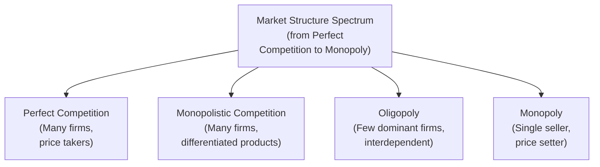

## Introduction
So, I remember chatting with a colleague in the industry who was baffled by how certain companies—like a local utilities firm—seem to effortlessly produce stable earnings, while smaller retail businesses constantly fight tooth and nail to stay afloat. The difference, as we eventually uncovered, lay largely in market structures and the associated competitive advantages. In more formal terms, everything from a firm’s revenue stability to its cost of capital can hinge on which type of market structure the company operates in. Some folks even call it the “invisible engine” that shapes profitability.

This section focuses on the interplay between market structures and asset valuation. With an understanding of perfect competition, monopolistic competition, oligopoly, and monopoly, you’ll see how different structures drive or limit a firm’s ability to generate sustainable free cash flow. We’ll explore discounted cash flow (DCF) valuation, regulatory interventions, cost dynamics, and how to anticipate changes in market power. By the end, you should feel confident analyzing and valuing firms in a range of structures—armed with both theoretical grounding and practical insights for exam-style vignettes.

## Understanding Market Structures

Market structures range from highly competitive arenas with countless small firms, all the way to single-player monopolies. Here’s a quick visual overview:

Each of these structures carries different implications for price setting, profit margins, regulatory risk, and ultimately how we value the firms operating within them.

### Perfect Competition
In a state of perfect competition, there are numerous firms producing a standardized product. Each firm is a price taker—meaning no single participant has sufficient market share to influence price. Economic theory argues that, in the long run, economic profit tends toward zero as new entrants flood any market where firms earn above-normal returns. 

• Firms have almost no market power, so they typically can’t pass on cost increases to consumers without losing sales.  
• Product homogeneity means brand loyalty is minimal.  
• Any cost advantage is typically short-lived.  

From a valuation perspective, discounted cash flow modeling suggests that excess returns in this environment should theoretically be arbitraged away. While short-term profits may exist under unusual circumstances (like a sudden supply disruption), they are quickly eroded as competitors catch up. Valuations in such industries are more susceptible to cyclical downturns, and it can be challenging to maintain a consistent free cash flow (FCF) growth trajectory.

### Monopolistic Competition
In monopolistic competition, there are still many sellers, but products are somewhat differentiated—think of clothing, restaurants, or beauty products. While firms in this structure do have a modest ability to set prices (based on branding or unique features), profit margins remain under persistent pressure as new entrants and existing rivals emulate successful offerings.

• Firms differentiate by style, quality, or brand image, generating modest pricing power.  
• Advertising and marketing become critical drivers of success.  
• Long-run economic profit can still trend toward zero because new competitors can replicate features or branding appeal.  

Valuing a company in a monopolistically competitive market often involves forecasting certain short-term periods of above-average returns. For instance, a new brand might enjoy a few years of strong margins. But as copycats jump in, growth eventually stabilizes, compressing margins.

### Oligopoly
Oligopolies are markets dominated by a handful of sellers, such as the airline, automobile, or telecommunication industries. This structure typically leads to interdependent decision-making: each firm’s strategy significantly impacts the others.

• Few dominant players and potentially high barriers to entry (capital requirements, patents, licensing).  
• Possibility of collusion or tacit agreements—though strictly regulated by antitrust policies in many regions.  
• Stable or somewhat more predictable profits; however, a price war can disrupt equilibrium and slash margins quickly.  

From a valuation standpoint, oligopolistic industries often command higher multiples (P/E ratios, for example) because stable cash flows and some measure of pricing power can be sustained—provided there are no adverse regulatory actions or major technological disruptions. The risk, of course, is that if one major player tries to grab market share by slashing prices, the entire industry can be thrown into a downward spiral, compressing valuation multiples across the board.

### Monopoly
A monopoly is where one firm is the sole supplier of a product or service with no close substitutes. The classic example might be a regulated public utility, or an innovative technology firm holding a unique patent. In a monopoly:

• The single seller can often dictate prices within regulatory constraints.  
• Barriers to entry are typically very high (e.g., patents, licenses, brand loyalty, or exclusive control over a resource).  
• Economic profit can be sustained for an extended period.  

Valuations in monopoly environments can be richly priced if regulation permits the company to reap the benefits of its exclusive market. On the flip side, if there’s a big regulatory push or disruptive technological shift, that valuation premium can evaporate shockingly quickly.

## Linking Market Structures to Asset Valuation

### Impact on Free Cash Flows and Sustainable Competitive Advantage
It’s one thing to discuss market structures in purely abstract terms, but from a finance perspective, what we really want to know is: how does any of this feed into FCF? How do we spot a sustainable competitive advantage? In perfect competition or monopolistic competition, it’s really tough to maintain consistently high free cash flow. Rivals see juicy margins and jump in—poof, there goes your advantage. 

Oligopolies and monopolies, on the other hand, can sometimes generate stable or growing cash flows over a longer horizon. Investors may pay a valuation premium for this predictability, especially if the business can fend off new entrants or leverage economies of scale and brand equity to remain profitable.

A key concept here is economic profit (i.e., returns above a normal required rate of return). It’s largely about whether a firm can defend its margin in the face of competitive threats. In an oligopoly, a few entrenched players often achieve some version of that. In a monopoly, you might see outsize economic profits until regulators or innovators show up with a better (or cheaper) way to do business.

### Cost Structures and Margin Pressures
Market structure heavily shapes how a firm approaches cost management:

• In perfect competition and monopolistic competition, cost minimization is essential because you can’t raise your price without losing business. A cost leadership strategy might be your main route to success.  
• In an oligopoly, you can rely on brand loyalty, product differentiation, or scale economies to maintain margins, but you still watch your main competitors carefully. If they slash prices, you may feel pressured to follow.  
• In a monopoly, you have a greater ability to pass on cost increases, although government entities or consumer backlash can limit your freedom to increase prices indefinitely.  

During cyclical downturns, cost structures matter a lot. In a recession, demand shrinks, and if your margins weren’t robust to begin with, you could quickly slip into negative free cash flow. However, a monopolistic or oligopolistic firm might manage the downturn more effectively, sustaining valuations better than a competitive industry forced to engage in near-cost pricing to survive.

### Growth Assumptions in DCF or Dividend Discount Models
Let’s say you’re applying a standard dividend discount model (DDM) or a multi-stage DCF approach. One of the trickiest parts is forecasting the growth rate. Monopolies can often maintain above-average growth for longer because serious entry barriers keep new firms out. Meanwhile, in a more crowded market structure, your “fade” or “convergence” to normal returns might be quicker.

For example, you might use a two-stage DCF for a company in monopolistic competition, assuming it sustains a 10% growth rate for five years before leveling off to 3%. But for a near-monopoly with strong brand loyalty, you might believe it can maintain that 10% (or close) growth for a decade before finally dropping to a stable 3%. Small changes in these assumptions—especially the “duration” of high growth—have huge implications for valuation.

### Regulatory Environment and Potential Disruption
Regulatory frameworks can significantly alter how we view valuation. Antitrust policies can force a monopoly or oligopoly to break into smaller units, or curb a dominant firm’s pricing. That is a direct and immediate threat to economic profit. We sometimes call this regulatory risk—the risk that changes in government policy or enforcement will chip away at the advantage a firm enjoys.

Disruptive technology is another critical factor: a single innovation—say, a new direct-to-consumer distribution platform—can annihilate what looked like an iron-clad oligopoly in a few years. Just ask folks who used to run DVD rental stores. Ideally, a forward-looking valuation tries to capture the probability of disruption. But, well, forecasting technology is tricky because breakthroughs and user adoption can be unpredictable.

## Real-World Example: Shifting from Monopoly to Competition
Imagine that LilyCom, a fictional telecommunications provider, enjoys near-monopoly status in a mid-sized emerging economy. The firm’s robust free cash flow arises from locked-in subscriber plans, minimal competition, and favorable regulation. The local government historically permitted LilyCom to set prices at a comfortable markup in exchange for building out infrastructure in remote regions.

However, new legislation aims to stimulate competition by awarding mobile spectrum licenses to international telecom giants. LilyCom now faces at least two formidable rivals with global experience and deeper pockets. Suddenly, LilyCom’s once-stable cash flow projections look shaky. Its management must decide whether to slash prices to retain market share or attempt to differentiate through service quality.

An item-set style scenario might include the following data excerpt:

• Current subscribers: 10 million  
• Current ARPU (average revenue per user): \$20/month  
• Forecast competitor entry in 12 months  
• Capital expenditure commitments to expand 5G coverage  
• Government statement: “We want robust competition to drive consumer prices down by an estimated 25%.”  

Questions could ask you to evaluate how the new entrants’ arrival and resulting price pressure affect LilyCom’s DCF valuation. You might re-estimate the expected revenue growth, factor in the increased capex, and adjust the terminal value. The shift from monopoly-like conditions toward oligopolistic competition would likely compress LilyCom’s margins significantly.

For the exam, you need to interpret data on revenue forecasts, cost structures, and policy changes. Then you apply them to a DCF formula or dividend valuation model. Your job is to figure out whether the firm’s cost leadership or brand loyalty might cushion the blow, or if the inbound competition will slash projected free cash flows enough to reduce the firm’s valuation precipitously.

## Glossary of Key Terms
• Economic Profit: The surplus earned after accounting for all opportunity costs. In highly competitive industries, profits tend toward zero in the long run, while monopolies or oligopolies can sustain positive economic profits due to barriers to entry.  
• Sustainable Competitive Advantage: An advantage (such as scale, brand, network effects, or government patents) that allows a firm to maintain above-normal returns over an extended period.  
• Regulatory Risk: The risk that government actions (including antitrust policies, price controls, or licensing regulations) may affect a firm’s ability to sustain profit margins.  
• Disruptive Technology: Innovations that fundamentally alter competitive landscapes, often eroding the market power of incumbents.  
• Cost Leadership Strategy: An approach centered on being the lowest-cost producer; commonly seen in competitive markets where price tends to be the main battlefront.  
• Market Power: The extent to which a firm can influence the price or supply of its product or service.  
• Valuation Premium: The increment in a firm’s valuation multiple (e.g., Enterprise Value/EBITDA, Price/Earnings) attributed to greater stability, higher growth prospects, or stronger market power.  
• Antitrust Policy: Government initiatives aimed at preventing abusive monopoly or oligopoly practices and promoting market competition.

## Key Takeaways and Pitfalls
• Monopolies and oligopolies can command higher valuations relative to more competitive structures, largely because of their ability to sustain economic profits and smoother cash flows.  
• However, regulatory oversight and potential disruptions can dramatically alter the competitive landscape, making the upside precarious if antitrust action or new technologies emerge.  
• Perfect and monopolistic competition often lead to narrower (and more volatile) margins. Valuations in these structures are deeply tied to cost management, product differentiation, and the cyclical nature of supply and demand.  
• In DCF or dividend discount models, remember to adjust growth assumptions based on the expected intensity of competition over time. Firms with moats—like certain oligopolies—can sustain above-average growth longer.  
• Keep an eye on external factors like government policy, consumer trends, and technology. Sometimes a single shift can break open a previously sheltered market, punishing valuations that relied on entrenched status.  

## References
• CFA Institute Level II Curriculum, Economics: Market Structure and Firm Valuation Sections  
• Michael E. Porter, “Competitive Strategy,” The Free Press  
• RAND Journal of Economics, various scholarly articles on monopolistic pricing and long-run share valuations  

## Market Structures and Asset Valuation Practice Questions



### Which market structure typically experiences the lowest long-term economic profit in a purely theoretical sense?
- [ ] Monopoly
- [x] Perfect competition
- [ ] Oligopoly
- [ ] Monopolistic competition

> **Explanation:** In perfect competition, free entry and exit forces economic profit to trend toward zero in the long run.

### A firm operating in an oligopoly is most likely to:
- [x] Monitor competitors' actions closely when setting prices.
- [ ] Neglect competitors' prices because it has monopoly power.
- [ ] Offer a product that is completely standardized.
- [ ] Earn zero economic profit in the long run due to easy market entry.

> **Explanation:** In an oligopoly, there are only a few dominant firms, and each firmly tracks the others’ strategic moves to avoid losing market share or igniting a price war.

### In a monopolistically competitive market, firms typically rely on:
- [ ] Pure price leadership due to high barriers to entry.
- [ ] Collusion to maintain stable profits.
- [x] Product differentiation and marketing to generate some market power.
- [ ] Complete control over output and pricing.

> **Explanation:** Monopolistic competition involves many firms offering differentiated products, using branding and marketing to stand out.

### When using a multi-stage DCF to value a monopoly-like firm, a key assumption that might differ from a perfectly competitive firm is:
- [ ] Zero revenue growth in the second stage.
- [ ] Consistent margin compression over time.
- [x] A prolonged period of above-normal returns due to high barriers to entry.
- [ ] Complete elimination of economic profit from year one onward.

> **Explanation:** Monopolies can sustain higher returns longer. In contrast, a competitive market typically sees profit margins decline sooner as rivals enter.

### LilyCom’s situation changing from near-monopoly to an oligopoly (in our example) is most likely to:
- [ ] Immediately increase LilyCom’s economic profit.
- [ ] Create no impact on LilyCom’s free cash flow projections.
- [x] Compress LilyCom’s margins and reduce its valuation.
- [ ] Leave LilyCom immune to price competition.

> **Explanation:** With new entrants, LilyCom faces lower pricing power and reduced profitability, which depresses projected cash flows and valuation.

### Which of the following best describes “market power”?
- [ ] A firm’s ability to produce at the lowest cost in its industry.
- [ ] A firm’s brand recognition among loyal consumers.
- [x] A firm’s influence over the price or supply of its product or service.
- [ ] A firm’s capacity to produce at maximum output.

> **Explanation:** Market power is about a firm’s ability to influence (rather than passively accept) the market price or quantity.

### In a discounted cash flow model, holding everything else constant, a higher assumed sustainable growth rate typically:
- [x] Increases the firm’s valuation because of higher future free cash flows.
- [ ] Decreases the firm’s valuation because of higher risk.
- [ ] Does not affect the valuation, as risk-adjusted rates offset growth.
- [ ] Immediately reduces the cost of capital.

> **Explanation:** A higher growth rate generally increases future free cash flows and thus the present value of those cash flows, raising the overall valuation.

### An antitrust policy that breaks up a monopoly into smaller competing firms most likely:
- [ ] Has no effect on the industry’s competitive structure.
- [x] Reduces the economic profit each firm can earn in the long run.
- [ ] Guarantees greater economic profit for the previous monopolist.
- [ ] Leads to zero consumer surplus.

> **Explanation:** By fostering competition, antitrust actions reduce economic profits once garnered by the monopolist.

### Firms in perfect competition often adopt a cost leadership strategy because:
- [x] They must accept the market price and cannot pass on excess costs.
- [ ] They have the unique ability to raise prices freely.
- [ ] Barriers to entry are almost insurmountable.
- [ ] Brand loyalty is their primary mode of differentiation.

> **Explanation:** Since firms in perfect competition have no pricing power, they must keep costs as low as possible to maximize profits.

### In light of disruptive technology, a once stable oligopoly is:
- [x] Potentially vulnerable if the new technology lowers entry barriers or changes consumer behavior.
- [ ] Completely protected from new entrants due to high capital requirements.
- [ ] Immune to changes in demand or consumer preferences.
- [ ] Guaranteed to retain stable margins indefinitely.

> **Explanation:** Disruptive technologies can undermine the competitive advantages of an oligopoly by reducing entry barriers and shifting consumer demand.


