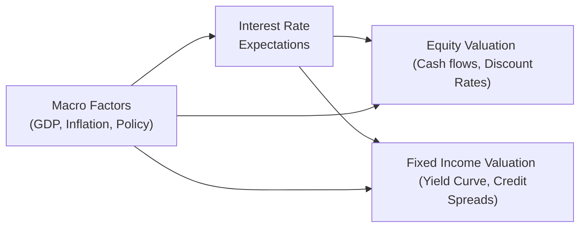

## Introduction and Big-Picture Context
Sometimes, when I think back to the very first time I tried to tie economic growth forecasts into actual, real-life valuations—well, let’s just say I was both excited and a little nervous. I remember fiddling around with growth assumptions in my spreadsheet, thinking, “If GDP growth picks up by just 1%, does that really change a stock’s fair value by that much?” And, whoa, it did. The discount rates shifted, credit spreads tightened or widened, and the equity cash flows soared or shrank depending on my assumptions. That taught me a big lesson: even small changes in macro forecasts can produce outsize effects on both equity and fixed income valuations.

This section focuses on bridging the gap between broader macroeconomic trends—like GDP growth, productivity, demographic shifts, and technology developments—and how those play out in equity and fixed income pricing models. We’ll explore how cyclical vs. structural growth can shape earnings, credit spreads, interest rates, bond yields, and more. And, of course, we’ll discuss how to incorporate sensitivity analysis so you can fully appreciate the potential range of outcomes. Whether you’re a top-down macro enthusiast or a bottom-up stock picker, these insights should help you integrate economic forecasts into your valuations more systematically.

## The Growth–Valuation Connection
Macroeconomic growth rates—especially GDP—are essentially a barometer of the overall health of the economy. When the economy expands robustly, companies often see rising demand for their products and services, typically leading to higher revenue growth and stronger cash flows. In fixed income markets, if the economy is growing faster, bond investors might expect central banks to tighten monetary policy sooner or anticipate slightly higher inflation, creating upward pressure on yields. Conversely, sluggish or negative growth can weigh down corporate earnings and widen credit spreads, raising the cost of capital for both companies and governments.

Broadly, we have two flavors of growth:

• Cyclical growth: Tied to short-term business cycles, influenced by inventory fluctuations, economic policy, and consumer/business sentiment.  
• Structural growth: Longer-term improvements in productivity, demographic changes, or technological leaps that can sustain higher potential GDP over many years—even decades.

Distinguishing between these two is crucial because cyclical growth can be more volatile, whereas structural growth forms the baseline for a company’s long-term revenue outlook.

## Macroeconomic Drivers and Potential GDP
Potential GDP, in simpler terms, is the ideal “speed limit” for an economy without stoking inflation. If actual GDP runs above potential for too long, inflationary pressures may rise, often prompting central banks to push up interest rates. If GDP consistently runs below potential, it indicates spare capacity, which might see monetary easing. Both scenarios ripple directly into equity and bond valuations because:

• Higher rates = higher discount rates for equity valuation, often lowering present values.  
• Higher rates also typically raise sovereign bond yields (e.g., yields of government securities), shifting the entire term structure and potentially altering credit spreads.  
• Conversely, when rates move lower, we may see a boost to equity valuations.

### Key Macroeconomic Influencers  
1. Labor productivity: Gains here mean companies can produce more output with existing resources, leading to higher corporate profitability. This typically boosts share prices and reduces default risk.  
2. Demographic shifts: A younger, growing population can sustain demand growth for decades, while aging demographics may curb consumption patterns.  
3. Technological innovation: Technological leaps often create new markets or disrupt old ones. Think about how the internet and mobile tech reshaped entire industries. Investors track these shifts for potential new growth drivers.  
4. Global trade flows: Changes in trade policies, tariffs, and currency movements affect import/export competitiveness and thus feed directly into GDP.  
5. Resource constraints: Commodity prices and resource availability can either stimulate or hamper output growth.  

From an accounting perspective, under IFRS or US GAAP, companies with strong macro tailwinds may see higher revenues recognized across multiple periods, potentially affecting intangible asset valuations, deferred tax assets, or impairment tests.

## Applying Growth Forecasts to Equity Valuation

### Why Growth Forecasts Matter
At its core, equity valuation—whether through Dividend Discount Models (DDMs), Free Cash Flow (FCF) approaches, or residual income techniques—depends on:

• Forecasting future revenue, earnings, or cash flows.  
• Discounting them back to the present using a risk-adjusted rate.

If you assume real GDP grows at, say, 2% instead of 1%, you might project that a firm’s revenues grow faster than previously forecasted. Add in some operating leverage, and net income might rise by an even greater percentage, which directly boosts present value. But (ah!) that’s not the whole story, because if that growth expectation also pushes up risk-free rates or changes the equity risk premium, your discount rate might shift. The net effect could be positive or negative.

### Integrating Top-Down Macroeconomic Data
Let’s see how a top-down approach might look:

1. Start with GDP forecasts. These could come from International Monetary Fund (IMF) projections, investment banks, or consensus estimates.  
2. Factor in industry growth rates. For example, if you believe consumer spending will outpace GDP by 0.5% due to a surge in e-commerce, you’ll incorporate that into your revenue assumptions for consumer discretionary firms.  
3. Adjust for company-specific drivers. Maybe the company has a unique brand advantage or a new product pipeline.  

You’d then feed these growth rates into your revenue line and carefully watch your cost structure. A strong macro environment might also push up labor or raw material costs, so it’s not just a simple story of higher revenues. 

### Case Example: Small Variation, Large Valuation Changes
Imagine a hypothetical company, TechSpark Inc., that derives 80% of its sales from advanced software solutions. You forecast revenue growth of 5%, aligned with modest GDP expansion plus a tech premium. Then new data arrives, suggesting the economy (and specifically the software market) might soften, dropping your growth forecast a mere 1% to 4%. When you run the numbers in a discounted cash flow (DCF) model over 10 years, you realize the intrinsic share price estimate declines by 8%—a surprisingly big difference from a tiny growth tweak. That’s the power of compounding over multiple forecast periods.

### Sensitivity Analysis
Because these small changes matter a lot, it’s standard practice to run a sensitivity analysis or scenario analysis:

• Base case: 4% real GDP growth, stable interest rates.  
• Bull case: 5% GDP growth, lower interest rates, stronger margins.  
• Bear case: 2% GDP growth, rising rates, margin compression.

By toggling these assumptions, you see the valuation range for TechSpark Inc. In the real CFA exam environment, you might see an item set that includes snippet statements from an economist, partial corporate data about margins, and historical growth rates, and you’d be asked to calculate or interpret how a growth shift affects an intrinsic stock price calculation.

## Incorporating Growth Assumptions in Fixed Income Valuation

### Interest Rates, Yield Curve, and Central Bank Policy
For bonds, especially longer-dated issues, expected economic growth influences yields in at least three ways:

1. Investors demand a higher yield if they anticipate stronger economic performance and, by extension, possible rate hikes or inflationary pressures.  
2. Central banks might tighten monetary policy sooner to curb inflation, shifting the yield curve upward.  
3. Credit spreads can compress if strong growth improves corporate balance sheets and reduces default risk. Conversely, growth slowdowns often widen spreads.

A straightforward example is the yield on a 10-year government bond. If the market believes the economy’s potential growth rate is about 3% real with 2% expected inflation, it might price the nominal 10-year yield around 5% (broadly speaking, ignoring other factors like term premium). If that real growth outlook dips to 2%, you might see yields trending downward since the central bank could keep rates lower for longer.

### Credit Spreads and Default Risk
In corporate bonds, growth expectations directly affect credit risk perceptions. Robust economic conditions typically lead to:

• Lower default rates.  
• Tighter credit spreads over government bonds.  

However, if you suspect a recession is brewing, you might expect corporate earnings to drop, especially for cyclical or heavily indebted companies, suggesting a higher probability of default. Hence, credit spreads widen. In practice, bond analysts may run scenario analyses that map out how changes in GDP growth would affect free cash flow coverage of interest payments, or how cyclical swings impact a firm’s ability to refinance its debt.  

### Practical Example: Corporate Bond Valuation
Let’s say you’re valuing a 5-year corporate bond from a retailer, FashionBoost Co. If you think GDP growth (and consumer spending) will be solid over the next five years, you might reduce the default spread assumption from 2.5% to 2.0%, thereby improving the bond’s market price. Alternatively, if the data points to lower discretionary spending, you might see a half-point or more widening in spreads.

## Cyclical vs. Structural Growth and Asset Valuation
It’s important to figure out if your growth assumptions are cyclical or structural. A cyclical upturn might not change your long-term valuation of a solid industrial firm significantly, because you know that the typical business-cycle turns will happen. But if you believe there’s a new wave of structural improvement—say, widespread AI adoption that lifts productivity across entire industries—then that might raise your estimate of long-run potential GDP, thereby translating into a higher equity valuation or narrower credit spreads.

In many real-world item sets, you might get contradictory economic data. One data set might indicate short-term cyclical weakness, while another signals unstoppable technological progress. Your job is to weigh which factor is likely to dominate valuations. Do you focus on the near-term cyclical slowdown (which might compress next year’s earnings), or do you emphasize the structural uplift (which might expand the firm’s long-run growth trajectory)? The best answers often require balancing both angles.

## Top-Down vs. Bottom-Up Approaches
When your role is to produce or verify growth forecasts, you can use:

• Top-down macro analysis: Start with expected GDP growth, filter down to sector performance, then to individual companies. This approach is quick to implement, but it can miss unique company attributes (or be skewed if your macro assumptions are off).  
• Bottom-up aggregation: Start by forecasting each company’s sales based on specific business drivers (e.g., product lines, cost structures), then aggregate to get a sector or economy-wide perspective. This approach can be more precise but is time-extensive, especially when covering many firms.

In practice, analysts often do both to cross-check results. If your top-down model suggests 5% overall market growth, but your bottom-up analysis aggregates to only 3%, it’s time to investigate. Sometimes, that discrepancy highlights an overlooked trend or a misinterpretation of macro signals.

## Diagram: Linking GDP Growth to Valuations
Below is a simple Mermaid diagram capturing these relationships:

In the diagram, you can see how macro factors (like GDP or inflation) influence interest rate expectations and feed forward into both equity and fixed income valuation models.

## Sensitivity Analysis and Scenario Planning
As mentioned earlier, scenario planning is a must:

1. **Base Scenario**: Use consensus forecasts for GDP, inflation, etc.  
2. **Optimistic/Fast-Growth Scenario**: Assume strong structural gains, technology breakthroughs, or favorable demographics.  
3. **Pessimistic/Slow-Growth Scenario**: Consider recessionary pressures, policy headwinds, or unexpected shocks (e.g., pandemics, geopolitical events).

By toggling each scenario’s assumptions, you’ll see how valuations move. It also helps clarify which factors are the main drivers (e.g., revenue growth, discount rates, cost inflation). Sensitivity analysis is indispensable in exam scenarios and real-life, too.

## Best Practices and Common Pitfalls
• **Avoid linear extrapolation**: Economies operate in cycles, and structural breaks can appear unexpectedly.  
• **Watch for feedback loops**: Higher growth can drive higher rates, which then partially offsets the benefit of higher growth.  
• **Incorporate leading economic indicators**: Surveys like Purchasing Managers’ Index (PMI) or consumer confidence can reveal turning points.  
• **Stay mindful of policy surprises**: Central bank policy shifts can rapidly alter discount rates, especially at major inflection points.  
• **Validate with bottom-up data**: If your top-down outlook implies robust earnings growth, but company guidance is tepid, reevaluate.

## Key Takeaways for the Exam
1. **Know your definitions**: Potential GDP, structural vs. cyclical growth, credit spreads, risk premium.  
2. **Practice item set reading**: Understand how to quickly parse macro/firm-level data in a time-pressured environment.  
3. **Show your calculations clearly**: If asked to compute a bond price or discounted cash flow (DCF), label each step.  
4. **Don’t be overconfident**: Because the exam might throw contradictory data at you, weigh them carefully. That’s half the challenge.  
5. **Blend top-down and bottom-up**: The best analysts cross-check growth assumptions from multiple angles.  

## References and Further Reading
- CFA Institute Level II Curriculum, Economics Topic Readings on “Economic Growth and the Investment Decision.”  
- Barro, Robert. “Economic Growth.” The MIT Press.  
- Damodaran, Aswath. “Investment Valuation: Tools and Techniques for Determining the Value of Any Asset.”  
- IMF World Economic Outlook Reports:  
  https://www.imf.org/en/Publications/SPROLLs/world-economic-outlook  

--------------------------------------------

## Practice Questions: Growth Forecasts in Equity and Fixed Income Valuation



### Which factor best explains why an increase in potential GDP growth might lead to higher bond yields?

- [ ] Lower inflation expectations
- [ ] Reduced borrowing by corporations
- [x] Anticipation of tighter monetary policy
- [ ] Decreased consumption levels

> **Explanation:** Faster economic growth often ushers in expectations of future inflation and higher policy rates, prompting bond yields to rise.

### Which of the following statements is most accurate for cyclical growth versus structural growth?

- [x] Cyclical growth is driven by short-term economic fluctuations, while structural growth arises from long-term productivity improvements.
- [ ] Cyclical and structural growth are synonymous concepts.
- [ ] Structural growth has no impact on long-run potential GDP.
- [ ] Cyclical growth influences bond yields permanently, whereas structural growth does not affect yields.

> **Explanation:** Cyclical growth involves short-term fluctuations tied to business cycles, whereas structural growth stems from longer-term factors like demographics or technology.

### In a simple DCF model, which of the following best describes the effect of raising the long-term GDP growth assumption by 1%?

- [x] It can significantly increase the terminal value, thus expanding the overall equity valuation.
- [ ] It marginally affects the discount rate but does not influence the terminal value.
- [ ] It only impacts near-term revenue forecasts for cyclical industries.
- [ ] It lowers a company’s cost of equity.

> **Explanation:** Even a small increase in growth assumptions can cause a large jump in projected future cash flows, especially in the terminal value calculation.

### Which approach primarily starts with macroeconomic forecasts and then narrows down to specific industries and companies?

- [ ] Bottom-up approach
- [x] Top-down approach
- [ ] Cross-sectional approach
- [ ] Reverse-engineered approach

> **Explanation:** A top-down approach transitions from broad macro data to a particular sector or firm-level analysis.

### If GDP forecasts rise sharply, what might you generally expect for corporate credit spreads?

- [ ] They will widen due to higher default risks.
- [ ] They will remain unchanged, as GDP growth does not affect default risk.
- [x] They will narrow, reflecting improved corporate earnings prospects.
- [ ] They will invert, indicating a pathological market environment.

> **Explanation:** A stronger economy typically boosts corporate profitability, making default less likely, so credit spreads tend to narrow.

### A primary reason that higher GDP growth forecasts can lead to higher discount rates in equity valuation models is:

- [x] Strong growth often causes interest rates to rise, raising the cost of capital.
- [ ] Companies always increase leverage in times of growth.
- [ ] Equity valuations lose sensitivity as growth rises.
- [ ] Investors demand lower returns in a booming economy.

> **Explanation:** When expected GDP growth accelerates, central banks may tighten policy or investors may require higher yields, pushing discount rates upward.

### When adjusting revenue forecasts for an emerging-market firm, which factor is least relevant to structural growth considerations?

- [ ] Technology adoption rates
- [ ] Demographic trends
- [x] Temporary inventory restocking by a single large client
- [ ] Infrastructure expansion policies

> **Explanation:** Inventory restocking is typically cyclical or short-term, having little bearing on the firm’s long-run structural growth.

### Which best describes the relationship between potential GDP growth and inflation?

- [ ] Potential GDP growth and inflation are always positively correlated.
- [x] If actual GDP consistently exceeds potential GDP, inflationary pressures typically rise.
- [ ] Potential GDP has no influence on inflation.
- [ ] Lower potential GDP always leads to deflation.

> **Explanation:** When the economy’s actual output surpasses its potential for too long, demand outstrips supply, fueling price pressures.

### In bond markets, a widening credit spread often suggests:

- [x] Investors see increased default risk or weaker expected earnings.
- [ ] An improved labor market trends positively for corporate profits.
- [ ] Global central banks have cut interest rates significantly.
- [ ] Immediate economic expansion is on the horizon for all issuers, boosting bond prices.

> **Explanation:** Wider credit spreads usually indicate that investors are more concerned about credit risk and expect some potential deterioration in issuers’ abilities to repay.

### True or False: Sensitivity analysis in valuations is used primarily to confirm a single “correct” forecast.

- [ ] True
- [x] False

> **Explanation:** Sensitivity analysis helps explore different outcomes with varying assumptions. It does not confirm a single forecast but rather illustrates potential valuation ranges.


