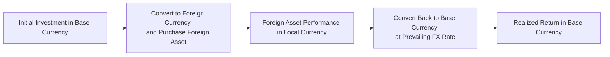

## Introduction
I’ll never forget the day I first discovered how a “winning” investment can turn sour once you factor in the exchange rate. I’d invested in a Japanese equity that shot up 20% in yen terms—fantastic, right? Well, by the time I converted my proceeds back to my own base currency, the yen had depreciated so much that I ended up with barely any gain at all. That one experience taught me more about currency risk than a hundred textbooks could!

In cross-border investing, you’re not just dealing with the usual ups and downs of equity or bond markets; you’re also at the mercy of exchange rate fluctuations. And guess what? Those fluctuations can sometimes be far bigger and faster-moving than the underlying asset’s change in value. Understanding currency-adjusted returns is a critical element of making savvy portfolio choices, especially for CFA Level II candidates who are learning to integrate macroeconomics into real investment decisions.

Below, we’ll explore key issues that arise when your base currency differs from that of your investments. We’ll look at how interest rate differentials and forward markets guide hedging decisions, how to include currency views in asset valuations, and what to do when you face real-world frictions like bid–ask spreads and correlation shifts. By the end, you’ll have a more robust sense of how currency risk permeates nearly every corner of the global investing playbook—and you’ll be better prepared to handle it.

## Local vs. Base Currency Returns
An investor’s “local currency return” is simply the return you observe in the currency where the asset is traded. However, from your perspective—wherever you call home or whichever currency you use to measure your wealth—that local return might mean very little until you convert it back into your base currency.

Let’s say you’re based in the United States, and your home currency is USD. You purchase shares of a European company in euros (EUR). The stock goes from €100 to €110—a 10% return in local currency. During the same period, however, the EUR/USD exchange rate drops from 1.20 to 1.10. Let’s see what that implies in your base currency:

• Before: 
  – Stock price in EUR: 100
  – EUR/USD: 1.20
  – Stock price in USD: 100 × 1.20 = 120 USD

• After:
  – Stock price in EUR: 110
  – EUR/USD: 1.10
  – Stock price in USD: 110 × 1.10 = 121 USD

In local currency (EUR), you see a 10% jump (from 100 to 110). In USD, you’re up from 120 to 121, which is only about a 0.83% increase. The 10% local return is very quickly eroded by the EUR’s depreciation: that is the currency effect coming into play.

Mathematically, you could measure your base currency return as:
  
(1 + R_local) × (1 + R_fx) − 1

where:  
• R_local is the local currency return (in the above example, 10% or 0.10),  
• R_fx is the return arising from currency movement (in the above example, –8.33% or –0.0833, given how EUR/USD changed).

If you’re unlucky, currency movements might more than wipe out your gains. Alternatively, if the foreign currency appreciates, you can turbocharge your returns. This interplay can become quite complicated in multi-currency portfolios—hence the importance of carefully monitoring exchange rate shifts.

## Interest Rate Differentials and Hedging Decisions
One of the big questions faced by cross-border investors is whether to hedge the currency exposure. Often, the decision hinges on interest rate differentials and forward currency market prices. If the forward or expected future exchange rate is unattractive (for instance, if the currency you’re investing in is expected to depreciate), you might decide to hedge that exposure using forward contracts or other derivatives. But if you believe the foreign currency will appreciate, leaving it unhedged could deliver a performance boost.

### Covered and Uncovered Interest Rate Parity
These decisions are usually analyzed within the framework of covered and uncovered interest rate parity (CIRP and UIRP).

Under covered interest rate parity (CIRP), the forward exchange rate should adjust such that you can’t earn a risk-free arbitrage profit by borrowing in one currency, investing in another, and locking in the forward rate. Formally:


F \;=\; S \times \frac{(1 + i_d)^T}{(1 + i_f)^T}


where  
• \\( F \\) is the forward exchange rate (domestic currency per foreign currency),  
• \\( S \\) is the current spot exchange rate,  
• \\( i_d \\) is the domestic interest rate,  
• \\( i_f \\) is the foreign interest rate,  
• \\( T \\) is the time period in years or fraction thereof (e.g., 0.5 for 6 months).

Under uncovered interest rate parity (UIRP), the expected change in the currency’s spot rate should reflect the interest rate differential, but it’s not specifically locked in by a forward contract. Instead, it’s assumed, in theory, that any “excess” yield in one currency is offset by an expected depreciation of that currency. The formula can be expressed as:


E[S_{t+1}] \;=\; S_{t} \times \left(\frac{1 + i_d}{1 + i_f}\right)


Of course, real-world data frequently deviate from UIRP, and that’s where currency speculation (or “leaving your exposure open”) can lead to gains and losses.

## Incorporating Currency Forecasts Into Asset Valuation
If you want to push beyond simply deciding whether or not to hedge, you can incorporate explicit currency forecasts into your valuation of foreign assets. This approach involves two key steps:

• Convert all cash flows into a common reference currency.  
• Adjust the discount rate to reflect currency-specific risks.

### Projected Exchange Rates and Cash Flows
Imagine you’re analyzing a foreign bond that pays coupons in euros. If you want to run a discounted cash flow (DCF) analysis in USD (your base currency), you’d need to forecast the EUR/USD rate at each coupon date. The simplest approach is to multiply the foreign-currency cash flow by your exchange rate forecast to determine each period’s dollar-based cash flow. However, forecasting exchange rates is notoriously complex, so many analysts rely on forward rates implied by interest rate differentials, or they incorporate short-term macro signals for an estimate.

### Adjusted Discount Rates
It’s also possible to keep your projections in the foreign currency and adjust the discount rate to reflect the local currency’s risk-free rate plus any risk premium. Once you arrive at a value in foreign-currency terms, you then multiply by the current spot rate. Either method should (in theory) yield the same result, assuming consistent assumptions about exchange rates, interest rates, and risk. In practice, you want to be mindful of transaction costs, taxes, and the liquidity of the hedging instruments.

## The Mechanics of Currency Hedging
So, how do we protect ourselves against unwelcome currency moves? Three primary tools come to mind: forward contracts, currency options, and currency overlays.

### Forward Contracts
A forward contract locks in a future exchange rate for a specified notional amount of currency. By entering a forward, you eliminate uncertainty about the ultimate settlement rate at some point in the future. Of course, “removing uncertainty” also means giving up any potential windfall if the currency moves in your favor. A key driver of the forward rate is the interest rate differential (as illustrated in the CIRP equation).

Shifting or rolling forward contracts can be tricky. You might have to close out an old forward and open a new one if your investment horizon changes or if the contract expires. Mark-to-market gains or losses periodically occur, so pay attention to the impact on cash flow management—especially if you’re managing collateral or margin accounts.

### Currency Options
Options on currencies (calls and puts) allow you some flexibility. A currency call option gives you the right (but not the obligation) to buy a certain currency at a specified strike price; conversely, a put option is the right to sell a currency. Options can be expensive, particularly if the implied volatility of the currency is high, but they let you preserve some upside if the currency moves favorably.

This might sound ideal compared to forwards (since you can still profit from a favorable currency move), but you pay for that luxury in the form of the option premium. And if you’re transacting in illiquid currency markets (less common pairs), that premium might be steep.

### Currency Overlay
Sometimes you might prefer to delegate the entire currency decision to a specialist manager—this is known as a currency overlay. You keep your underlying assets (like stocks or bonds) in place, but a separate overlay manager is responsible for the currency hedging strategies. They might utilize a systematic approach, fundamental analysis, or a combination of both to manage your currency risks. Overlay can be an efficient way for large institutions to handle multi-currency exposures when internal resources are limited or when a dedicated manager can exploit mispricings across multiple currency pairs.

## Real-World Frictions
Let’s be honest: the theoretical results of interest parity conditions rarely hold perfectly in practice. A few real-world frictions that can disrupt or complicate currency hedging and returns:

**Transaction Costs and Bid–Ask Spreads**  
Buying or selling currency forward, rolling positions, using options—each step can eat into your returns via bid–ask spreads and broker fees. These costs can be especially significant in emerging market or less liquid currencies.

**Market Liquidity**  
Some currencies are pegged (officially or unofficially), some are subject to capital controls, and others are just plain expensive to trade in large volumes. During times of market stress, liquidity can dry up fast, making it hard to roll forward contracts or exit positions at favorable prices.

**Margin Requirements and Financing Costs**  
Hedging instruments might require posting collateral, which means you have to think about cash flow and the opportunity cost of holding collateral. If interest rates are high, the cost of carry might be a factor.

**Multiple Currency Exposures**  
In a global portfolio, you could easily have exposures in five, six, or even a dozen currencies. Managing each pair’s forward, option, or overlay strategy becomes more complex. Correlations among currencies can shift rapidly, so adopting a holistic approach is key.

## Multi-Currency Performance Attribution
From a performance measurement standpoint, you want to separate out how much of your total return is attributable to:
1) changes in the local asset’s price, and  
2) changes in the exchange rate.  

In fact, many portfolio managers break down performance attribution reports to highlight currency effects in each region. This can be eye-opening. A portfolio that looks like a superstar in local currency terms might just have a large foreign-currency tailwind. On the other hand, a manager who “only” posted modest returns might actually be generating strong alpha if they were hedging away harmful currency moves.

When you look at multi-country or regional funds, always consider how currency exposures are being managed and reported. Are they passively hedged? Are they actively taking currency bets to generate alpha? The overall risk-return profile can differ drastically between these two approaches.

## Correlation Shifts Under Stress
Now, here’s a twist: the correlation between currency returns and asset returns can suddenly change under stress conditions, like a financial crisis or a geopolitical shock. Often, you’ll see a “flight to safety,” in which investors pile into currencies such as the U.S. dollar or the Swiss franc. If you were counting on historical correlations to remain stable, you might be in for a nasty surprise.

For instance, suppose you have a portfolio that historically displays negative correlation between currency movements and local equity returns—great for diversification, right? Well, if a crisis hits and everything starts moving in the same direction, your hedge might fail exactly when you need it most. This phenomenon underscores the importance of stress-testing your currency exposures and not relying purely on historical correlation data.

## Putting It All Together
Given all these moving parts—local vs. base returns, forward rates, interest differentials, hedging costs, correlation shifts—how do you actually manage currency in your portfolio effectively? A few practical tips:

• Decide whether you want a strategic hedge ratio. Some institutions pick a “neutral” hedge ratio (like 50% or 100%) on their foreign currency exposures, adjusting only occasionally.  
• If you have a strong view that a currency is undervalued or overvalued, consider adjusting your hedge ratio or using currency options for a partial hedge.  
• Continuously monitor transaction costs and reevaluate your approach if they become prohibitively high.  
• Keep an eye on interest rate differentials. Hedging might be cheaper or more expensive depending on forward spreads.  
• Stress-test your currency exposures under various “worst-case” correlation scenarios.

And, of course, for exam success, practice evaluating vignettes where you see multiple currencies, forward quotes, interest rate data, and cost structures. The item set might ask you to calculate currency-adjusted returns or determine the best hedging approach given certain forecasts on interest rates. As always in the CFA context, the correct answer often hinges on properly interpreting the numbers and applying the right conceptual framework.

## Glossary
- **Base Currency:** The primary monetary unit used by an investor for measuring returns (often the currency of the home country).  
- **Forward Contract:** A legal agreement to exchange a specified amount of one currency for another on a future date at a predetermined rate.  
- **Hedging:** Using financial instruments or market strategies to reduce or eliminate currency risk exposure.  
- **Currency Overlay:** A separate, dedicated management of exchange rate exposures, distinct from the underlying asset selection process.  
- **Uncovered Interest Rate Parity (UIRP):** Suggests that currencies with high interest rates will depreciate by the interest differential relative to currencies with lower rates, leaving no expected profit from switching currencies.  
- **Covered Interest Rate Parity (CIRP):** When forward exchange rates fully reflect interest rate differentials, preventing risk-free arbitrage.  
- **Exchange Rate Pass-Through:** The degree to which changes in exchange rates affect domestic prices of imports and exports.  
- **Correlation Shift:** When correlations among financial variables or assets change suddenly, often under market stress.

## References & Further Reading
- CFA Institute Level II Curriculum, “Exchange Rates and Their Determination.”  
- Levich, Richard. “International Financial Markets: Prices and Policies.”  
- Bank for International Settlements (BIS) research on currency markets: https://www.bis.org/publ/

## Test Your Knowledge: Currency-Adjusted Returns and Portfolio Strategies



### In measuring local versus base currency returns, which of the following is MOST relevant for understanding an investor’s net performance?

- [ ] The expected inflation rate in the investor’s home economy.
- [ ] The correlation between interest rates and secondary market bond prices.
- [ ] The nominal yield of the foreign asset.
- [x] The exchange rate movement between the foreign currency and the base currency.

> **Explanation:** To evaluate net performance in your home currency, you need to consider how the foreign asset’s return in local currency interacts with changes in the exchange rate between that currency and your own.

### According to the formula for covered interest rate parity (CIRP), the forward exchange rate for a 1-year contract is generally determined by:

- [ ] Forecasting next year’s GDP growth in both countries.
- [ ] The current spot rate and the foreign interest rate alone.
- [x] The current spot rate and the interest rate differential between the two currencies for the contract period.
- [ ] The breaks in historical correlation patterns.

> **Explanation:** CIRP states that the forward rate is a function of the spot rate adjusted by the ratio of (1 + i_d) / (1 + i_f) for the relevant time horizon.

### Which hedging instrument allows an investor to benefit from favorable currency movements while limiting downside risk?

- [ ] Forward contract.
- [x] Currency option.
- [ ] Futures contract.
- [ ] FX swap.

> **Explanation:** Options confer the right but not the obligation to buy/sell a currency. They protect against adverse moves but still allow upside potential if the currency moves favorably.

### When a portfolio manager chooses to fully hedge a currency exposure using forward contracts, what is the immediate implication?

- [x] The manager eliminates uncertainty about future exchange rates at the cost of giving up potential gains if the currency appreciates.
- [ ] The manager doubles the currency risk by locking in the spot rate.
- [ ] The manager pays no fees or costs for this execution, making it risk-free.
- [ ] The forward contract ensures positive returns regardless of exchange rate movement.

> **Explanation:** By entering a forward contract, the manager locks in an exchange rate, thereby removing uncertainty but forgoing any potential additional gains from a favorable exchange rate move.

### An investor forecasts that a foreign currency will appreciate significantly. Which of the following actions is MOST consistent with this outlook?

- [x] Leaving the currency exposure unhedged.
- [ ] Entering a forward contract to sell the foreign currency.
- [x] Purchasing foreign currency call options.
- [ ] Purchasing a foreign currency put option.

> **Explanation:** If an investor expects appreciation, it may be advantageous to remain unhedged or to buy call options. Selling forwards or buying puts would be for scenarios anticipating depreciation.

### Which statement is correct regarding uncovered interest rate parity (UIRP)?

- [x] It assumes that the difference in interest rates between two currencies will be offset by an expected depreciation/appreciation.
- [ ] It guarantees a risk-free arbitrage opportunity.
- [ ] It is fully enforced by forward contracts.
- [ ] It ignores any expectation about future spot exchange rates.

> **Explanation:** UIRP holds that currencies with higher interest rates should depreciate by the interest differential such that no excess profit can be made by switching affiliation to those higher rates.

### A currency overlay manager is best described as:

- [x] A specialist who manages currency exposures separately from asset selection within a global portfolio.
- [ ] An individual who runs short-only equity strategies in foreign markets.
- [x] A manager whose only objective is to maximize the underlying security’s total return.
- [ ] A manager who invests in real estate derivatives to hedge currency risk.

> **Explanation:** A currency overlay manager actively manages foreign exchange exposures, leaving the underlying investments to the primary portfolio manager.

### In times of market stress, correlations between currency pairs and asset returns:

- [x] Can shift dramatically, often undermining previously observed diversification benefits.
- [ ] Typically remain constant and thus offer reliable hedging paths.
- [ ] Are irrelevant as currency movements become negligible.
- [ ] Always go to zero, eliminating currency risk entirely.

> **Explanation:** Under stress scenarios, correlations often jump towards 1 or –1, which can compromise hedging effectiveness and diversification strategies.

### Which of the following is a cost that might erode the benefits of currency hedging?

- [x] Bid–ask spreads on currency forwards or options.
- [ ] Stable equilibrium exchange rates.
- [ ] Lower volatility in the national equity market.
- [ ] Higher GDP growth in the base currency country.

> **Explanation:** Bid–ask spreads, commissions, and related transactional overhead can significantly reduce or even outweigh the benefits of currency hedging.

### True or False: If a foreign currency appreciates relative to an investor’s base currency, the investor’s unhedged return on assets denominated in that foreign currency will likely increase.

- [x] True
- [ ] False

> **Explanation:** Appreciation of a foreign currency means more units of the investor’s base currency for each unit of foreign currency, thus amplifying returns earned in that foreign currency when converted back.


