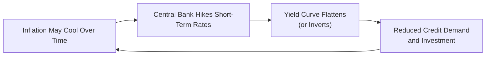

## Understanding Nominal vs. Real Interest Rates

I still remember chatting with a friend, wide-eyed, as we watched interest rates climb and tried to calculate how inflation would chip away at our savings. It was one of those moments that reminded me: the interest rate we see on our bank statement—also known as the nominal interest rate—is not the whole story. We must also consider what inflation is doing to our purchasing power in real terms.

In purely mathematical terms, the approximate relationship among nominal interest rates, real interest rates, and expected inflation can be expressed as:


r_{\text{real}} \approx r_{\text{nominal}} - \pi


where:
• \\( r_{\text{real}} \\) is the real interest rate.  
• \\( r_{\text{nominal}} \\) is the nominal interest rate.  
• \\(\pi\\) is the expected inflation rate.

So, if your nominal yield on a bond is 5% but inflation is expected to be 3%, you’re effectively growing your purchasing power at around 2%. That real gain of 2%—in theory—measures whether you’ll actually be better off next year than you are this year.

## Tighter Monetary Policy and Yield Curve Dynamics

When inflation kicks up, central banks typically respond. Well, they’re sort of forced to respond, right? If prices are rising too fast, the monetary authority might increase short-term rates to cool the economy. The immediate result? A steeper short end of the yield curve, as those short-dated yields spike. Over time, though, if the market senses that inflation could remain persistent and the central bank keeps pushing, the rest of the curve might flatten or even invert.

It can be a bit disconcerting for investors to see that flattening yield curve—some interpret it as a sign of slowing economic activity or even an impending recession. The interplay can be thought of as follows:

Higher short-term rates can reduce borrowing, dampen economic demand, and put the brakes on inflation (in theory). But the price we pay may include some short-term pain for GDP growth and employment.

## Break-Even Inflation (BEI) and TIPS

For many investors, the million-dollar question is: “How much inflation does the market actually expect?” Wouldn’t it be neat if we could just read that off a chart? Well, we sort of can, through the concept of break-even inflation (BEI). It’s the difference in yields between a nominal government bond and an inflation-protected security (like a TIPS in the United States). If you have a 10-year nominal Treasury yielding 4% and a 10-year TIPS yielding 1.5%, the BEI is around 2.5%. Essentially, that 2.5% is the market’s implied average annual inflation expectation over that horizon.

Investors looking to preserve real purchasing power might consider TIPS. These securities adjust their principal (and interest payments) by the Consumer Price Index (CPI). If actual inflation runs higher than expected, TIPS holders benefit from the adjusted principal value. If inflation surprises on the downside, nominal bonds could outperform because TIPS principal adjustments would be smaller than the market initially priced in.

## Inflation’s Impact on Equity Valuation

We often think about inflation in the context of bonds, but inflation can dramatically affect equity prices too. Companies may see higher input costs (like labor and raw materials), which squeeze profit margins if they cannot pass those costs along to consumers. On the other hand, certain sectors—like energy or consumer staples—might benefit from higher nominal prices if demand remains steady. Ultimately, inflation can help revenue growth if prices rise, but it can also weigh on real discount rates. When inflation is volatile, investors may assign higher risk premiums to equity’s expected cash flows, thereby driving down valuations.

So, in a model:

• Higher inflation → potential margin pressure.  
• But possibly higher nominal revenues (depending on price elasticity).  
• Higher uncertainty → an elevated equity risk premium.  
• Elevated equity risk premium → a higher required rate of return → lower valuations.

## Inflation Volatility and the Risk Premium

It’s not just the absolute level of inflation that matters—volatility can rile the markets, too. When inflation is all over the place, it introduces forecasting risk. Lenders and investors then demand additional compensation for that uncertainty, built right into yields. So, real interest rates might actually wind up even higher than you’d guess from a simple inflation forecast if there’s a big risk that the forecast is wrong. Equities can jump or plummet from day to day, spooked by surprise inflation data. And if you happen to be a bond portfolio manager, high inflation volatility is something that keeps you on your toes—duration, convexity, and yield curve positioning suddenly become your new best friends (or worst enemies).

## Historical Episodes: Stagflation in the 1970s

The 1970s stagflation in many developed economies is often used as the prime example of what can go horribly wrong if inflation gets out of control while growth slows. Everyone wants to see robust GDP expansion, but if inflation costs are eating into people’s earnings faster than wages (and corporate profitability) can keep up, it’s a bit of a lose-lose. Stocks and bonds can both underperform in real terms at the same time.

The correlation dynamics between equities and bonds can also shift. There are periods when both asset classes may struggle with negative real returns if the inflation environment is severe. This stifling combination of high inflation and meager growth frequently pushes investors into alternative assets—such as real estate or commodities—that might provide some protection from inflation’s bite.

## Inflation Indexing in Portfolios

One of the big questions advisers hear is, “How do I protect myself from inflation?” Some solutions you may come across:

• TIPS or Similar Securities: Government-issued inflation-protected bonds.  
• Inflation Swaps: Agreeing to swap fixed payments for floating inflation-linked payments.  
• Commodity Exposure: Historically, commodity prices often move with inflation, especially energy.  
• Real Estate: Rents and property values may be somewhat insulated from price-level increases, though this is far from guaranteed.

If you’re running a global, multi-asset portfolio, you might combine these inflation hedges in various proportions to achieve a more stable real return profile. Of course, each inflation hedge has its own risks and return trade-offs.

## Cross-Border Inflation Scenarios and Currency Adjustments

Now, if you’re investing internationally, inflation differentials among countries can wreak havoc on currency values. Suppose the eurozone has significantly higher inflation than the United States, and the European Central Bank (ECB) is slower than the Federal Reserve to tighten policy. In that scenario, capital might flow into U.S. assets, strengthening the dollar, because investors anticipate better real returns in the U.S. Currency shifts can weigh on European exporters (their goods become pricier abroad) and reward U.S. importers. Meanwhile, from a portfolio manager’s vantage point, you’re dealing with potential foreign exchange losses or gains layered on top of the domestic inflation puzzle.

Multinational corporations might see their sales denominated in weaker or stronger currencies. If your production is in a country with high inflation and your sales are in a country with lower inflation, you might face margin pressure. The complexity can rise fast, but the principle is straightforward: differences in inflation rates often lead to long-term adjustments in exchange rates (purchasing power parity), ultimately influencing profitability and asset returns.

## Best Practices and Common Pitfalls

• Stay aware of real, not just nominal, returns.  
• Understand that yield curves can flatten in high inflation if central banks act strongly and the market anticipates recessionary risks.  
• Recognize how break-even inflation can rotate with market expectations—especially in times of volatility.  
• Don’t assume inflation affects all equities uniformly; sector- or company-specific fundamentals matter.  
• Watch out for times of stagflation or other atypical macro conditions that can break traditional stock-bond relationships.  
• Use instruments like TIPS, inflation swaps, or commodities judiciously, but remain mindful of tracking error, liquidity constraints, and cost of hedging.  
• Diversify globally to spread inflation risks, but watch exchange-rate movements that can amplify or offset certain inflationary pressures.

## Encouraging Continual Learning

Inflation, interest rates, and real returns are tightly woven webs that affect nearly every investment decision. In studying them, I’ve often found it helpful to keep an open mind and revisit historical episodes. Patterns tend to appear over decades, showing how inflation can fundamentally shift portfolio performance. Stay curious, test different scenarios, and challenge your assumptions. That way, you’ll be ready for whatever environment emerges, and your portfolio strategies can remain flexible, resilient, and well-prepared.

## Glossary

• Nominal Interest Rate: The observed rate on a security that includes both real return and expected inflation components.  
• Real Interest Rate: The nominal rate minus anticipated inflation, representing true purchasing power growth.  
• TIPS (Treasury Inflation-Protected Securities): US government bonds indexed to CPI, designed to protect holders from inflation risk.  
• Break-Even Inflation (BEI): The yield gap between nominal bonds and inflation-protected bonds, representing the market’s implied inflation expectation.  
• Stagflation: A situation where stagnant economic growth, high inflation, and rising unemployment coexist.  
• Inflation Swap: A derivative instrument allowing market participants to exchange fixed payments for floating payments tied to an inflation rate.  
• Purchasing Power: What can be bought with a specified amount of money; directly impacted by inflation.  
• Yield Curve: A plot of interest rates at various maturities for a comparable type of debt, offering insights into market rate expectations and risk appetite.

## References & Further Reading

• CFA Institute Level II Curriculum, “Inflation, Interest Rates, and the Linkage to Economic Growth.”  
• Mishkin, Frederic. “The Economics of Money, Banking, and Financial Markets.”  
• Federal Reserve Economic Data (FRED): https://fred.stlouisfed.org/ for historical inflation rates and break-even spreads.

## Test Your Knowledge: Inflation, Interest Rates, and Real Return Expectations



### In a simplified model, the real interest rate can be approximated using which equation?

- [x] Real interest rate ≈ Nominal interest rate − Expected inflation
- [ ] Nominal interest rate ≈ Real interest rate − Expected inflation
- [ ] Real interest rate ≈ Nominal interest rate + Expected inflation
- [ ] Expected inflation ≈ Real interest rate − Nominal interest rate

> **Explanation:** The Fisher approximation states that the nominal rate is composed of real rate + expected inflation. Thus, the real interest rate is approximately the nominal rate minus the expected inflation rate.

### Which of the following best describes break-even inflation (BEI)?

- [ ] The difference between short-term and long-term nominal interest rates
- [x] The yield spread between a nominal bond and an inflation-linked bond of the same maturity
- [ ] The annualized difference between actual inflation and inflation expectations
- [ ] A direct index measure of interest rate expectations for the next decade

> **Explanation:** Break-even inflation is calculated as the difference in yields between nominal bonds and their inflation-protected counterparts, indicating the market’s implied inflation outlook.

### When central banks tighten monetary policy in response to rising inflation, what is a common initial impact on the yield curve?

- [ ] It shifts upward with no change in shape
- [ ] It steepens markedly at the long end
- [x] It flattens or might invert due to higher short-term rates
- [ ] It inverts at the long end but remains unchanged in the short end

> **Explanation:** Tighter policy lifts short-term rates first; if markets believe higher rates will cool the economy, long-term rates may rise less or even decline, leading to a flatter or inverted curve.

### Which statement is most accurate regarding inflation’s impact on equity valuation?

- [ ] Higher inflation always increases equity values as nominal revenue grows
- [x] Higher inflation can compress margins if costs rise faster than revenues
- [ ] Inflation volatility always decreases equity risk premiums
- [ ] It primarily affects small-cap stocks but not large-cap stocks

> **Explanation:** While inflation may boost nominal revenues, it can also raise production costs, pressure margins, and add uncertainty that increases the equity risk premium.

### During periods of heightened inflation volatility, bond investors typically demand:

- [x] Higher yields to compensate for increased uncertainty
- [ ] Lower yields due to monetary stimulus
- [ ] The same yield since inflation volatility does not affect bonds
- [ ] Negative real rates to stimulate economic development

> **Explanation:** Inflation volatility makes bond cash flows riskier in real terms, so investors require higher yields to offset that additional uncertainty.

### Which of the following characterizes stagflation?

- [ ] Rapid economic growth and falling inflation
- [ ] High productivity, low inflation, and low unemployment
- [ ] Low unemployment and high nominal wage growth
- [x] Stagnant growth, high unemployment, and high inflation

> **Explanation:** Stagflation is the unfortunate scenario of high inflation paired with weak economic activity and high unemployment.

### Which statement accurately describes TIPS?

- [ ] Pay fixed coupons with no inflation adjustments
- [x] Principal and coupon payments adjust according to inflation
- [ ] Are unaffected by changes in the Consumer Price Index
- [ ] Offer a nominal yield always higher than traditional Treasuries

> **Explanation:** TIPS adjust both principal and coupon payments based on changes in the Consumer Price Index, thus offering inflation protection.

### What might happen in a cross-border scenario if Country A’s inflation significantly exceeds that of Country B?

- [ ] Country A’s currency tends to appreciate due to higher prices
- [x] Country A’s currency tends to depreciate as purchasing power declines
- [ ] Country B’s interest rates automatically match Country A’s
- [ ] This scenario rarely affects currency values

> **Explanation:** Over time, large inflation differentials cause changes in currency exchange rates, typically depreciating the currency in the higher-inflation country.

### Which of the following is a common strategy to hedge against inflation risk in a portfolio?

- [ ] Eliminating fixed income positions altogether
- [ ] Only investing in high-yield bonds
- [x] Adding inflation-linked instruments like TIPS or using inflation swaps
- [ ] Shifting all assets to short-term Treasuries

> **Explanation:** Inflation-linked securities, such as TIPS or inflation swaps, are designed to protect purchasing power and provide explicit inflation hedges.

### True or False: In a hyperinflationary environment, equities and bonds always deliver high real returns to investors.

- [x] False
- [ ] True

> **Explanation:** Hyperinflation usually erodes real returns significantly. Even if equities or bonds rise nominally, they may lag behind the skyrocketing cost of living, leading to negative real returns.


