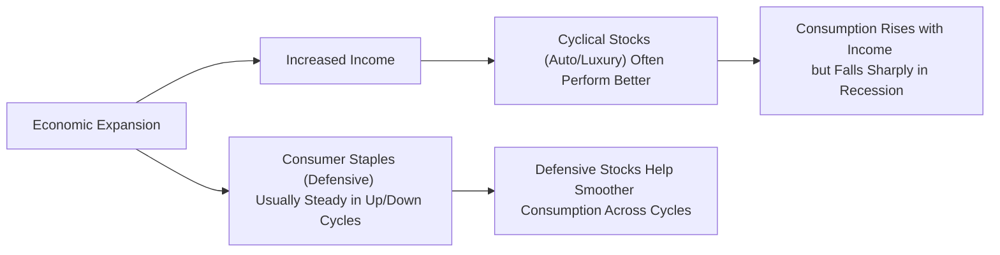

## Introduction
I remember the first time I stared at the concept of the Equity Risk Premium (ERP). I was in the middle of a market upswing, full of excitement and optimism—until I realized how the market rarely moves in a straight line. You’ve probably spotted that feeling, too: the moment you figure out that, yes, equities do offer higher returns than safer assets, but it’s not guaranteed, and you’re definitely shouldering more risk. That difference between what you expect to earn on a stock investment and the return on risk-free assets is called the Equity Risk Premium. And man, can it swing up or down depending on the macro environment!

In this discussion, we’ll explore why the Equity Risk Premium shifts around so much, how it’s linked to consumption patterns, and why that matters for portfolio design. We’ll also delve into the concept of consumption hedging—basically, how owning certain equity sectors can help individuals smooth consumption across good times and bad. Let’s walk through the details step by step.

## Understanding the Equity Risk Premium
The Equity Risk Premium (ERP) is the expected excess return that equities (like stocks) offer over a “risk-free” benchmark. Typically, we compare it to the yield on government T-bills or short-term sovereign notes. Formally, it’s often expressed as:


\text{ERP} = \mathbb{E}[R_{\text{market}}] - R_f


where \\(\mathbb{E}[R_{\text{market}}]\\) is the expected return on the market and \\( R_f \\) is the risk-free rate.

When market sentiment is bullish and the world’s economy is printing healthy GDP numbers, folks might be willing to accept a lower ERP because they believe the economy will continue to surge. Alternatively, in times of serious uncertainty—think a major financial crisis or a global shock—investors might demand a higher ERP. So, ERP is deeply related to macroeconomic factors.

### Macroeconomic Volatility and ERP
If you think about it, economic volatility can really play with investors’ minds. In times when GDP growth is volatile, inflation is unpredictable, or financial conditions are shaky, investors worry that equity earnings might suddenly plummet. Consequently, they demand a heftier premium over safer assets. Conversely, lower macro volatility can calm investors, reducing the ERP.

Monetary policy—like changes in central bank rates, quantitative easing, or liquidity injections—can also influence the ERP. For instance, if interest rates are lowered and liquidity is plentiful, risk-taking appetite might rise, leading to narrower spreads and possibly a lower ERP. The same logic extends to fiscal stimulus: tax cuts or government spending can boost corporate earnings expectations and reduce the perceived risk (or at least shift it), thereby influencing ERP in either direction.

## Consumption Hedging: The Rationale
Have you ever found yourself wanting to keep your overall spending consistent even when your income fluctuates? That’s basically consumption smoothing: people try to maintain stable consumption patterns. Because equities tend to do well when the economy is in expansion mode—and household incomes and consumption are usually higher during these expansions—owning equities can sometimes mitigate the impact of volatility on overall living standards.

But not all equities are created equal. Some stocks are more sensitive to the business cycle (e.g., cyclical sectors like automotive or luxury goods). Others are less volatile relative to consumption changes (e.g., consumer staples or utilities). If you want to align your portfolio with stable consumption, you might prefer to hold equities that aren’t going to tank severely in recessions—like those in stable sectors.

### Pro-Cyclicality vs. Consumption Pattern
Equities are generally considered pro-cyclical assets. This means that when the economy grows, revenues of many firms tend to increase, and stock prices often follow. For an investor whose consumption also rises in expansions, the cyclical nature of stocks might not always help them hedge consumption risk during downturns.

On the other hand, a stock that remains relatively robust even in a downturn—like a consumer staples company selling, say, discount household products—can help reduce the volatility of your total “wealth + consumption” picture. Essentially, if your labor income is falling but your consumer staple holdings remain stable, the overall drop in your total resources might be moderated.

Here’s a simplified flowchart illustrating how cyclical vs. defensive sectors behave across economic expansions:

## Defensive vs. Cyclical Equities
Defensive sectors (e.g., consumer staples, healthcare, utilities) often see persistent demand regardless of the business cycle. These sectors can offer a bit of a cushion for someone worried about maintaining stable consumption if the economy enters a slump. In other words, they serve as partial consumption hedges because their fundamentals are less sensitive to big macroeconomic twists.

Cyclical stocks (e.g., technology hardware, automotive, luxury retail) often thrive when consumer incomes and corporate spending are up. But in times of economic contraction, these sectors can be hit hard. That might mean higher potential returns during expansions—and bigger drops in a recession.

## Real Estate, Commodities, and International Equities
Equities aren’t the only game in town. Keep in mind:

- Real estate: Can have a partial consumption link, especially if we’re talking about residential real estate. However, real estate values often follow interest rate conditions and local supply-demand factors. It’s not always a perfect offset to your consumption risk. Commercial real estate can be cyclical in nature, though certain sectors like multifamily might be more stable.
- Commodities: Typically behave differently from equities. Commodity prices can spike with certain macro or geopolitical events (like oil supply shocks). They may not directly hedge your day-to-day personal consumption, but they can help offset inflation risk if your consumption basket is correlated with food or energy.
- International vs. domestic equities: Investing abroad might diversify some domestic-specific consumption risks. However, you’ll also introduce currency risk and foreign market exposure. In a global downturn, correlations can rise, reducing the diversification benefits.

## Shifts in Risk Premia Due to Policy Changes
When central banks lower interest rates, borrowing becomes cheaper, corporate margins might get a nice lift, and consumer spending can pick up. Investors sense stronger corporate earnings, see less near-term risk, and might be willing to accept a smaller ERP. Conversely, when governments tighten monetary policy or signal upcoming rate hikes, some might require higher compensation from equities.

Fiscal policy also matters. Aggressive government spending programs (like infrastructure bills) can stimulate job creation, buoying consumer income and consumption. This can lead to higher valuations and potentially narrower risk premia. If, however, large fiscal deficits raise concerns about inflation or sovereign risk, the ERP might rise all over again.

In short, systematic risk can be perceived differently based on where the macro policy needle is pointing.

## Linking Risk Premium to Labor Market and Consumer Confidence
A stable labor market can lead to more predictable household incomes, which fosters stable consumption patterns. If households believe their jobs are secure, they’re more likely to buy goods and services, supporting corporate earnings. Investors in equity markets may then see less risk of a big profitability drop and hence demand a lower ERP.

But if layoffs become widespread and consumer confidence craters, the cycle reverses: corporate revenues may dip, fear spreads, and equity investors require a bigger cushion for taking on that heightened uncertainty. The risk premium goes up.

## Forecasting the Equity Risk Premium
Forecasting ERP is a bit like trying to guess tomorrow’s weather—it’s never perfect, but some methods can be more reliable than others.

### Historical Averages
One simple approach is to look at historical average returns above the risk-free rate, sometimes over 10-, 20-, or 30-year windows. That’s often a starting point for many analysts: “In the past 30 years, the market has returned on average 7% over T-bills, so let’s use 7% as our ERP estimate!” The issue? The past might not perfectly represent the future. Macroeconomic structures change over time.

### Forward-Looking Models
A more nuanced approach is forward-looking: you combine assumptions about dividend yields, buyback rates, and future growth in corporate earnings. One commonly referenced model is:


\text{Expected Equity Return} 
\approx \text{Dividend Yield} 
+ \text{Earnings Growth Rate} 
+ \text{Expected Changes in Valuation Multiple}


Subtract \\(R_f\\) to get the forward-looking ERP. Such approaches incorporate macroeconomic assumptions (like GDP growth forecasts, inflation, and interest rates), so watch out for big changes in these underlying assumptions.

### Multi-Factor Approaches
You might also see risk factor models that break down equity returns into different components, such as:

- Market factor (the classic CAPM market premium).
- Style factors (value, size, momentum).
- Macroeconomic factors (inflation, term spreads).

Each factor has an associated risk premium. Summing the relevant factors, minus the risk-free rate, yields the overall expected return. This route can yield more targeted estimates, but it requires a deeper analysis of each factor’s future behavior.

## Integrating Risk Premium into Valuation
From a valuation perspective, we often use the ERP in discount rate formulas, like the Capital Asset Pricing Model (CAPM). In CAPM, the expected return on an asset \\(i\\) is:


\mathbb{E}[R_i] = R_f + \beta_i [\mathbb{E}(R_m) - R_f]


where:
- \\( \beta_i \\) is the sensitivity of asset \\(i\\) to the broader market returns.
- \\(\mathbb{E}(R_m) - R_f\\) is the market risk premium (essentially the ERP if you’re using the broad market as the proxy).

A higher ERP raises the discount rate, which generally lowers stock valuations. If you think the ERP is going to rise, you might see a drop in current equity prices (assuming earnings estimates remain the same).

Multi-factor models (like the Fama-French 3 or 5-factor approach) incorporate additional risk premia for size, value, or other factors. Either way, the ERP is front and center: it’s the fundamental building block for how we go from “risk-free rate” to “equity discount rate.”

## Putting It All Together for Consumption Hedging
When you’re building a portfolio, the interplay between the ERP, macro conditions, and your personal consumption risk matters. Cyclical equities can offer big payoffs in expansions but might leave you exposed if your wages drop in recessions. Defensive equities, on the other hand, can help with smoothing out consumption, often carrying a bit lower beta and thus potentially a smaller risk premium (or a more stable one).

From a policy standpoint, anticipate that when you see major shifts in fiscal or monetary policy, risk premia can pivot, in turn affecting asset prices. Understanding these dynamics not only helps you forecast potential returns but also shapes how you think about your vulnerability to cyclical ups and downs.

## Exam Tips and Pitfalls
• Be crystal clear on the difference between “historical ERP” and “forward-looking ERP.” On the Level II exam, item sets often test your ability to pick the correct discount rate based on the relevant approach.  
• Watch for tricky vignettes that slip in macroeconomic signals, like a dramatic change in consumer confidence or an upcoming central bank policy shift, and connect them to possible adjustments in the ERP.  
• Remember that defensive stocks aren’t immune to downturns. They might just fall less. The exam questions might test your conceptual understanding that no perfect consumption hedge exists in the equity universe except perhaps specialized instruments like income-smoothing derivatives.  
• Factor models can show up. Familiarize yourself with how different risk premia (size, value, macro factors) come together in these models.  
• Time management: If you see an item set with loads of data on historical equity returns, dividends, or GDP growth, quickly identify which approach (historical or forward-looking) the question is nudging you toward.

## References and Further Reading
- CFA Institute Level II Curriculum, “Equity Risk Premium Concepts and Estimations.”  
- Dimson, Marsh, and Staunton. “The Worldwide Equity Premium.”  
- Ilmanen, Antti. “Expected Returns: An Investor’s Guide to Harvesting Market Rewards.”  

## Assessing Risk Premia and Consumption Hedging in Equities



### Which statement best describes the Equity Risk Premium (ERP)?

- [ ] It is the sum of all expected returns within the stock market.
- [x] It is the expected excess return on the market over the risk-free rate.
- [ ] It is always negative during economic downturns.
- [ ] It represents the absolute difference between dividend yield and risk-free rate.

> **Explanation:** The ERP is typically defined as the expected return on an equity market portfolio minus the risk-free rate, reflecting the additional compensation investors demand for equity risk.

### How does macroeconomic volatility generally affect the ERP?

- [x] Higher macro volatility usually increases the ERP.
- [ ] It typically lowers the ERP as investors become more risk-seeking.
- [ ] It has no influence on the ERP.
- [ ] It inverts the yield curve, thus eliminating the ERP.

> **Explanation:** Greater macro volatility means higher uncertainty. Investors demand more compensation (a higher premium) to bear that risk, leading to a larger ERP.

### What is consumption hedging in the context of equity investments?

- [x] Selecting assets that help maintain stable consumption despite economic cycles.
- [ ] Investing in derivatives to eliminate equity market exposure altogether.
- [ ] Timing the market to maximize returns during expansions.
- [ ] Short-selling consumer staples to profit in recessions.

> **Explanation:** Consumption hedging involves choosing assets that are less sensitive to downturns so that any reduction in income or broader economic stress is (partially) mitigated by stable or resilient investment returns.  

### Which type of equity segment is most likely to offer the best consumption hedging properties?

- [ ] Cyclical sectors (automotive, technology hardware).
- [ ] Highly leveraged financial institutions.
- [x] Defensive sectors (consumer staples, utilities).
- [ ] Start-up technology equities.

> **Explanation:** Defensive or staple sectors experience less volatile demand, providing more stable performance across economic cycles, hence supporting a form of consumption hedging.

### In what way can monetary policy shifts influence the ERP?

- [ ] A strict monetary tightening permanently lowers the ERP for all time.
- [ ] Monetary policy has no effect on asset prices or risk perceptions.
- [x] Loose monetary policy can reduce perceived systematic risk, lowering the ERP.
- [ ] Tight monetary policy always eliminates the need for risk premia.

> **Explanation:** When monetary policy is accommodative (low rates, liquidity injections), investors often become more willing to take risk, lowering the demanded premium for equity risk.

### Which market feature most directly explains why investors might require a higher ERP?

- [x] Systematic risk that cannot be diversified away.
- [ ] Risk-free rate fluctuations that drive bond prices higher.
- [ ] The presence of inverse ETFs in the market.
- [ ] Zero default risk on government bonds.

> **Explanation:** The ERP compensates for systematic risk that remains even after diversification, as opposed to idiosyncratic risk which can be diversified away.

### A forward-looking ERP model primarily relies on:

- [x] Expected dividends, buybacks, and growth rates.
- [ ] Rolling historical averages of equity returns since 1900.
- [x] Macro assumptions such as future inflation and GDP growth.
- [ ] Ignoring all macroeconomic data in favor of technical charts.

> **Explanation:** A forward-looking model incorporates expectations for future dividend yields, growth rates, and macroeconomic trends. These data points allow analysts to estimate how stocks are likely to perform relative to risk-free assets.

### In CAPM, if the ERP increases by 1% but everything else remains the same, which of the following is most likely?

- [x] The required return on equity rises.
- [ ] The risk-free rate decreases by 1%.
- [ ] The required return on equity remains unchanged.
- [ ] Beta automatically decreases to compensate.

> **Explanation:** In CAPM, the required return on equity is \\( R_f + \beta ( \text{ERP} )\\). A higher ERP directly increases the required return by \\(\beta \times 1\%\\).

### If an economy's labor market becomes more stable, with fewer layoffs and greater wage predictability:

- [x] Households may demand a lower ERP as consumption risk drops.
- [ ] Equity markets will always crash because of overconfidence.
- [ ] The ERP becomes fully negative.
- [ ] Defensive stocks will become riskier.

> **Explanation:** A stable labor market reduces total income volatility, thus lowering the perceived uncertainty. Households’ willingness to demand large equity premiums often decreases under these conditions.

### True or False: Defensive equities never experience losses during recessions.

- [ ] True
- [x] False

> **Explanation:** While defensive equities (e.g., consumer staples) generally fall less than cyclical stocks in recessions, they are not immune to overall market declines. “Never” is too strong a claim; they typically just perform relatively better on a comparative basis.


