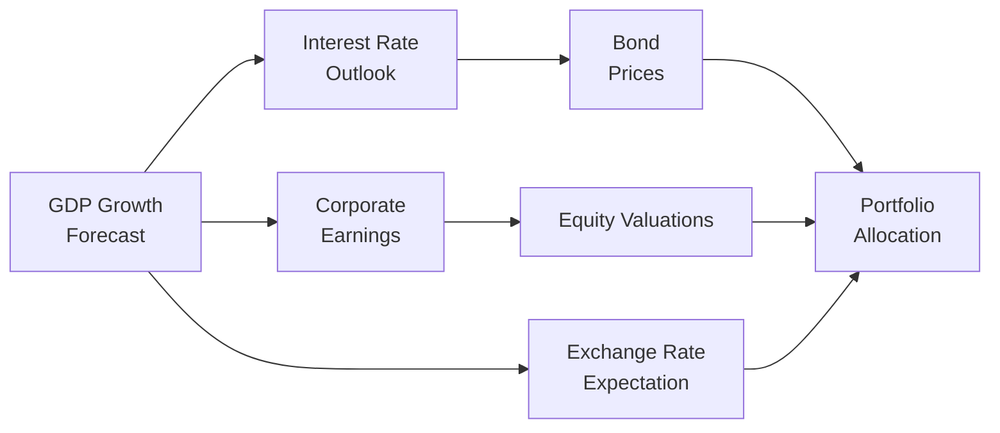

## Introduction

So, you’ve just about wrapped your head around the major macroeconomic factors—like GDP growth, inflation, and currency dynamics. And you can probably recite from memory how these factors typically influence bond yields or equity valuations. But now, at Level II, the exam wants to throw multiple macro variables in the same scenario. You’ll see item sets (vignettes) weaving together everything: growth forecasts, rate curves, inflation signals, and even unexpected announcements from central banks. And let’s just say, it can feel a bit—well—chaotic. 

In this section, we’ll walk through example scenarios that combine all these macro drivers for portfolio strategy decisions. We’ll also talk about best practices: how to quickly scan vignettes, identify distractors, use time wisely, and, yes, incorporate a healthy dose of logic when some indicators may even look contradictory. Honestly, I remember the first time I encountered a deceptively simple paragraph about fiscal policy that turned out to be overshadowed by a single line noting a currency peg—ouch. It taught me to keep an eye out for the “one-liner” details that can flip your entire conclusion. 

We’ll detail a systematic approach to handle these advanced item sets, step by step, from scanning the macro narrative to linking them to interest rate forecasts and eventually to final portfolio recommendations. And trust me, you want that methodical approach to keep you from going in circles under exam pressure. 

## Building Complex Multi-Variable Scenarios

Before we dive directly into step-by-step solutions, let’s outline why multi-variable scenarios can be tricky and how you can approach them.

The CMA (“Combining Macro Analysis”) method is what I like to call your mental blueprint:

• Clarify Key Variables: Identify the big macro drivers—GDP forecasts, inflation data, currency trends, risk appetites, or consumer sentiment.  
• Match Drivers to Likely Outcomes: Link each driver to interest rate changes, corporate earnings, and how it might shift discount rates.  
• Adapt to Conflicting Signals: If growth is up but inflation is stable, see if central banks might remain dovish. Or if risk premiums are surging due to geopolitical tensions, that trumps the mild improvement in consumer demand.  
• Arrive at a Coherent Portfolio View: Factor in cross-asset correlations, hedging costs, and sector rotation. Are you bullish on cyclical stocks now but want to partially hedge currency exposure?  

In earlier chapters (like Chapter 9.1 and 9.2), we reviewed fundamental ways to integrate growth forecasts into equity and fixed income valuations, and to incorporate currency-adjusted returns. Here, we’ll push these concepts further by combining them into more dynamic item sets.

## Step-by-Step Problem-Solving Processes

When you’re confronted with an advanced vignette, sometimes the sheer volume of detail can be intimidating. Let’s break down a general sequence that helps you handle the chaos:

### 1. Identify Key Macro Variables

Scan the vignette and collect the major macro data points. Look for:  
• GDP growth projections (headline and revised figures).  
• Inflation or consumer price index trends.  
• Policy stance: Is the central bank hinting at upcoming rate hikes or cuts? Are government fiscal policies shifting?  
• FX movements and any currency peg or band you should be aware of.  

Parenthetically note any structural or short-term anomalies. For instance, “Despite moderate inflation, the central bank states it may cut rates.” That detail can signal unorthodox policy or recession risks.

### 2. Note Structural or Short-Term Divergences

Sometimes the textbook logic—like “higher inflation → central bank tightens rates”—hits a bump in the road. Political constraints, election cycles, or a central bank credibility issue might cause divergences. Watch for:  
• Government interventions or capital controls.  
• Real economy structural issues (maybe a major slump in labor productivity).  
• Surprise changes in consumer behavior (e.g., households are saving more regardless of low rates).  

### 3. Connect Each Macro Factor to Market Impacts

One driver at a time, articulate how it typically affects markets. For example:  
• A 50 bps rate hike. Typically: Higher interest rates, stronger domestic currency, downward pressure on domestic equity valuations.  
• 2% upward revision to GDP. Typically: Higher expected corporate earnings, potential equity rally, possibly higher interest rates if inflation rears its head.  
• Stable inflation. Typically: Less impetus for immediate monetary policy changes, somewhat supportive for bonds and stable discount rates for equities.  

### 4. Integrate Currency Effects on Returns and Hedging Needs

If the currency is expected to appreciate, your foreign investments may face negative currency translation back into your home currency—unless you hedge. Conversely, if you hold foreign currency assets during a depreciation of your home currency, you get a bit of a value uplift.  
- Evaluate forward points or currency option costs.  
- Think through partial or dynamic hedging, especially if your scenario includes short-term volatility that might subside.  

### 5. Adjust Risk Premia: Consumption Hedging and Sentiment

Shifts in consumer sentiment can raise or lower the equity risk premium. If investors see equity as a good consumption hedge or a high-growth environment, risk premia might compress, driving valuations higher. But if recession fears are creeping in, risk premia might widen, dampening valuations even as central banks cut rates.  

### 6. Reconcile Contradictory Indicators and Arrive at Final Recommendations

In real life—and on the exam—you’ll often see conflicting signals. Maybe inflation is rising, but the central bank is more worried about unemployment. Perhaps you have a strong currency outlook coexisting with a flattening yield curve. Here is the key:  
• Prioritize which indicators have the most immediate or forceful impact on returns.  
• Acknowledge short vs. long run. A near-term shock in interest rates might overshadow a slow-building structural change in the labor market.  
• Decide on your final call: overweight or underweight specific sectors, hedge or not hedge currency exposures, tilt to longer-duration bonds or keep it short.  

Throughout, remember: The exam loves to see well-supported logic, not random guesswork. If you say you’re going underweight consumer discretionary stocks, show how the new tax policy plus rate hikes hamper consumer spending. 

## Scenario-Based Practice Example

Let’s illustrate with a scenario that’s typical of what might appear in a CFA vignette:

• GDP Growth: The economy is expected to grow at 3% next year, up from a previous forecast of 2.4%.  
• Inflation: Projected to remain stable at around 2%.  
• Policy Stance: The central bank has hinted at a 50 bps rate hike next quarter, though core inflation is not surging.  
• Currency: The domestic currency has recently appreciated 5% relative to major trading partners. Some economists predict further appreciation if the central bank hikes as planned.  
• Corporate Earnings: Consumer goods companies have posted robust quarterly results, but industrials are lagging behind.  
• Risk Premium: Investor sentiment remains cautious due to global trade tensions.  

### Breaking Down the Scenario

1. Growth is accelerating (3% forecast), typically bullish for equities and neutral/bearish for bonds if inflation rears its head.  
2. Inflation is stable at 2%, so we might not see super-aggressive hikes. However, a 50 bps move is on the table—slightly hawkish.  
3. Currency appreciation typically weighs on export-heavy sectors (like industrials) but helps domestic importers.  
4. Risk premium is still elevated due to global trade tensions, which might put a damper on cyclical or export-focused industries.

### Potential Portfolio Impacts

- Equities: A modest overweight in consumer or domestically focused industries might be appropriate, given stable inflation and decent GDP growth. However, we might be cautious about industrial exporters.  
- Bonds: With a 50 bps rise in rates looming, shorter durations could minimize interest rate risk. But stable inflation means we’re not expecting a radical shift—maybe the curve flattens a bit.  
- Currency: An appreciating domestic currency might reduce returns from foreign equity holdings. One could consider partial hedges, especially if the forward premium is not too expensive.  
- Risk Premium: The caution in the market suggests we might keep some equity put options or hold higher-quality credit in the bond portion of the portfolio.  

## Reading Critically and Time Management

You only have so much time on the exam, so let’s talk about how to handle an item set in minimal minutes without losing essential data.

1. Quick Macro Scan (30 seconds): Grab the major growth, inflation, policy, and currency figures.  
2. Confirm Relevant Figures (1–2 minutes): Cross-check the narrative to see if any structural detail could pivot the typical interpretation (like a note on an upcoming election or a cap on interest rates).  
3. Identify the Actual Question (30 seconds): Sometimes you’ll see a lot of data, but the question might be about hedging currency risk specifically. Don’t get lost.  
4. Eliminate Distractors (30 seconds): If the vignette gives you a random statistic about wholesale salmon prices but the whole scenario is about industrial manufacturing, read it but don’t necessarily dwell on it.  
5. Make the Link to Portfolio Strategy (1–2 minutes): Decide how each piece of data influences the recommended action (overweight/underweight, hedge/no hedge, short vs. long duration, etc.).  
6. Provide Justification (1 minute): On the exam, you need to articulate your logic succinctly. Outline the cause-and-effect quickly, reference the data, and finalize your selection.

At first, this process can feel frantic. But with repeated practice, you’ll develop a more intuitive sense of what matters. 

## Tackling Contradictory Indicators

Picture a scenario where inflation is ticking upward, but labor market slack remains high, and the central bank is dovish. Wait, what? This might mean the central bank is focusing on employment rather than inflation control, or they believe inflation is only transitory. You want to piece it together:

• If the central bank remains dovish despite creeping inflation, bond yields may stay lower than “textbook logic” would predict. This can support equity valuations.  
• Yet any surprise hawkish shift due to inflation overshoot would slam the bond market and possibly cause a short-lived equity correction.  
• So, you might fine-tune durations or keep a balanced approach in equity sectors, with tilt to high-quality or defensive ones if you’re worried about a sudden policy pivot.

In advanced item sets, it’s precisely these “messy” realities that test your ability to handle real-world data. You might not find a single “correct” path, but the exam often wants you to demonstrate reasoned decision-making and consistent logic.

## Example of a Mermaid Diagram for Macro Linkages

Below is a small diagram to help visualize how different macro drivers can feed into portfolio decisions:

This simplified diagram shows how GDP growth drives both earnings and interest rates, which in turn affect equity valuations, bond prices, and ultimately how we allocate portfolios. Exchange rate expectations also feed into that final decision. 

## Practice Vignette (Mini-Case)

Below is a condensed vignette to demonstrate how the exam might present complex data:

“Country X’s economy is projected to grow by 2.8% next year, a slight upward revision from 2.5%. At the same time, the central bank’s recent statement suggests a neutral stance with no additional rate cuts planned, despite inflation edging closer to its 3% upper target. The unemployment rate remains elevated at 7.2%. Meanwhile, a major trade partner has imposed tariffs on Country X’s automotive exports, and local analysts expect a strong local currency if the central bank reaffirms stability. Consumer spending was robust last quarter, up 2%, and corporate earnings data indicates more robust growth in the healthcare and technology sectors compared to a slowdown in heavy manufacturing. In line with global risk aversion, investors demand higher yields on corporate debt, particularly high-yield bonds. In response, some policy commentators say that the government might step in with fiscal measures aimed at boosting job growth.”

**Question:** “Based on this information, provide a rationale for sector allocations in a domestic equity portfolio and discuss whether a currency hedge is advisable for foreign bond holdings.”

### Possible Analysis

1. **Growth & Policy**: With 2.8% growth, the environment is moderately positive for equities, but a neutral stance from the central bank might mean no new rate cuts—so don’t bank on extra monetary stimulus.  
2. **Inflation**: Approaching 3% but not alarming, so mild inflation is consistent with a neutral to slightly leaning hawkish central bank in the future.  
3. **Trade Tension**: Tariffs on automotive exports hamper that sector, so you might underweight automakers. Healthcare/tech show resilience, so consider overweighting them.  
4. **Currency**: If the local currency strengthens, foreign bond holdings might lose value upon repatriation. A partial hedge might be warranted, depending on forward rate costs.  

**Short Answer**: Overweight sectors that benefit from stable growth (healthcare, tech), underweight manufacturing, and partially hedge foreign bond currency exposure to mitigate potential currency appreciation.

## Getting Comfortable with Scenario Analysis

CFA item sets often ask, “If growth is revised upward by 2% and inflation remains subdued, which asset class or sector benefits the most, and which is vulnerable?” Practicing scenario analysis in your head is essential. Go through potential outcomes and see which asset might behave best. Then, if the question offers a twist—like “What if inflation unexpectedly jumps?”—re-evaluate.  

It’s kind of like playing chess: You think one move ahead, but you also keep in mind how the opponent (the market) may respond if your assumptions are broken.

## Common Pitfalls

1. **Forgetting Currency Effects**: We can’t stress enough how ignoring currency leads to wrong conclusions about real returns.  
2. **Overlooking Risk Premia**: Even if fundamentals look good, a spike in risk aversion can overshadow bullish signals.  
3. **Misreading Policy Stance**: Gifted vignettes might distract you with big inflation numbers while the central bank is actually focusing on something else. Read carefully.  
4. **Time Misallocation**: Spending too long on one detail can sabotage your chance to handle the entire item set thoroughly.  

## Best Practices for Constructing Final Recommendations

- Lay out your assumptions clearly: “We expect short-term rates to rise by 25 bps in the next quarter.”  
- Acknowledge uncertainties: “There is a chance that trade tensions escalate, which would hamper export sectors.”  
- Tie each conclusion back to the data in the vignette: “Given the stable inflation projection and moderate growth, we see little impetus for the central bank to shift from its neutral stance.”  
- Provide an actionable plan: “Therefore, we suggest overweighting technology, underweighting automotive manufacturers, and partially hedging foreign currency exposures.”

## Encouraging Thorough Justification

On the exam, clarity is king. If the question is “Should the investor hedge currency risk?” a simple “Yes, because we expect a stronger local currency” might not earn full credit. Spell it out: “Yes, because local rates may rise relative to foreign rates, leading to further currency appreciation. This would erode any unhedged returns from foreign bonds.” Show the cause-and-effect.

## Glossary

• **Item Set (Vignette)**: A narrative-based question format in CFA exams, requiring you to interpret data from a short passage and exhibits before answering multiple-choice questions.  
• **Scenario Analysis**: Assessing how changes in key variables (like interest rates or GDP) can alter investment outcomes.  
• **Distractor**: Information included in the vignette that may not be directly relevant to your final conclusion, often there to test your ability to parse out what really matters.  
• **Policy Stance**: The overall tone or direction of monetary/fiscal authorities (hawkish vs. dovish, expansionary vs. restrictive).  
• **Sector Allocation**: Distribution of portfolio funds among industries—healthcare, tech, consumer staples, etc.—based on their risk-return profiles and macroeconomic outlook.  
• **Contradictory Indicators**: Economic measures that conflict, such as rising wage growth with low inflation, or strong GDP growth with a flattening yield curve.  
• **Justify Recommendation**: Articulate how data specifically supports a recommended action, linking cause and effect.  
• **Time Management**: Efficiently allocating exam session minutes between reading, analyzing, calculating, and finalizing answers.

## References and Further Reading

• CFA Institute Level II “Practice Problem Sets” in Economics. Focus on multi-variable integration in item sets.  
• Grinold, Richard C., and Ronald N. Kahn. “Active Portfolio Management: A Quantitative Approach.”  
• BlackRock Investment Institute whitepapers for real-world scenario analyses on global asset allocation.

## Final Thoughts

Um, so the bottom line—like any good portfolio strategy plan—is to methodically piece together your macro analysis. Don’t get lost in the swirl of data. Pin down the main drivers, check for policy stances, reconcile opposing signals, then articulate a rational, step-by-step conclusion. And, yep, practice is everything. Work through as many multi-variable scenario items as you can. Over time, you’ll build your confidence, especially in time-pressured exam conditions.

Remember, the exam graders love seeing “why” you proposed a certain strategy—not just “what” that strategy is. In your final minutes, confirm that your logic lines up with the data. And if something in your analysis sounds contradictory, rewrite or re-evaluate that point before you finalize your answer.

Anyway, keep practicing these advanced vignettes. You’ll find that once you have a consistent approach—focusing on the big macro variables and systematically linking them to the markets—the swirling complexities become more manageable.

## Practice Questions: “Advanced Macro Integration for Portfolio Strategy”



### Which of the following best describes the purpose of identifying “distractors” in a multi-variable macroeconomic vignette?

- [ ] Highlight the main macro drivers affecting equity valuations.
- [x] Filter irrelevant information that does not materially affect investment outcomes.
- [ ] Confirm the official stance of the central bank on interest rate hikes.
- [ ] Observe uncorrelated asset classes to hedge currency risk.

> **Explanation:** Distractors are included to test a candidate’s ability to sift out non-essential information. While they may appear significant, they typically have minimal relevance to the question’s ultimate conclusion.

---

### An analyst observes stable inflation, a significant upward revision in GDP growth, and a dovish-policy statement from the central bank. Which outcome is most likely?

- [x] Higher equity valuations due to improved earnings expectations and a supportive rate environment.
- [ ] Lower equity valuations due to a rapid increase in risk premia.
- [ ] Depreciation of the domestic currency irrespective of interest rate changes.
- [ ] Sharp tightening of monetary policy to contain inflationary pressures.

> **Explanation:** With stable inflation and a dovish central bank, growth revisions typically drive higher corporate earnings expectations, supporting equities. There is little impetus for tightening if inflation remains stable.

---

### In analyzing a vignette with both rising GDP growth forecasts and a forecast for moderate inflation, which of the following sectors would likely benefit the most?

- [ ] Export-driven sectors with high foreign exposure.
- [ ] Defensive utilities that thrive only under tight monetary policy.
- [x] Growth-oriented sectors such as technology and consumer discretionary.
- [ ] High-yield bonds that perform best in deflationary scenarios.

> **Explanation:** Growth-oriented sectors, such as tech and consumer discretionary, often benefit from higher GDP growth and moderate inflation. Strong domestic consumption or business investment typically fosters expansions in these areas.

---

### Suppose you anticipate a 50 bps rate hike and moderate inflation, but the vignette states that unemployment remains high. How should you interpret this contradictory signal?

- [ ] The high unemployment rate is irrelevant and should be discarded as a distractor.
- [ ] The central bank will definitely cut rates despite the mention of a 50 bps rate hike.
- [x] The policy stance may focus on containing inflation but is tempered by labor market conditions, indicating a cautious, possibly slower path of hikes.
- [ ] The central bank is extremely hawkish and will raise rates by more than 50 bps.

> **Explanation:** Contradictory signals force you to balance inflation concerns with labor market slack. The central bank may proceed with a planned hike (as inflation is a concern) but move more slowly if unemployment remains elevated.

---

### Why might an analyst partially hedge foreign bond positions if the domestic currency is forecast to appreciate?

- [ ] Because a stronger domestic currency will boost foreign bond returns.
- [x] Because currency appreciation would reduce the total return upon conversion back to the domestic currency.
- [ ] Because appreciating currency only affects equity markets, not fixed-income returns.
- [ ] Because bond prices always rise if the currency appreciates.

> **Explanation:** Currency appreciation decreases returns on unhedged foreign assets when converted back to the domestic currency. A partial hedge can mitigate this currency risk.

---

### A multi-variable macro item set includes a line that mentions potential corporate tax changes. However, the rest of the vignette focuses primarily on inflation and interest rate forecasts. How might you treat this information?

- [x] Quickly evaluate if the corporate tax change meaningfully affects earnings or economic growth, and if not, classify it as a distractor.
- [ ] Ignore it entirely, as taxes never affect market valuations.
- [ ] Base your entire conclusion solely on the anticipated tax policy revisions.
- [ ] That line automatically invalidates the entire rest of the data in the vignette.

> **Explanation:** You should quickly assess the impact of any new detail. If it doesn’t significantly sway earnings, growth, or market sentiment, it might be a distractor. If it does, it deserves deeper integration into the final recommendation.

---

### An item set states that the local currency is pegged to a major world currency at a fixed exchange rate. How should this detail influence a portfolio hedge decision?

- [x] It reduces typical currency fluctuation risk, potentially making hedging less critical.
- [ ] It increases currency risk, demanding a full hedge at all times.
- [ ] It ensures currency volatility spikes if domestic inflation changes.
- [ ] It has no relevance to any form of hedge decision under any scenario.

> **Explanation:** With a currency peg, exchange rate fluctuations are limited (barring a major breakout event). As a result, investors may choose to hedge less. Of course, if the peg collapses, things change drastically, but in stable conditions, typical FX volatility is reduced.

---

### In a scenario where short-term interest rates are increasing and growth is stagnant, which bond strategy might be most appropriate?

- [ ] Emphasize long-duration bonds because interest rates are stable.
- [ ] Overweight high-yield bonds that benefit from rising rates.
- [x] Shorten duration to reduce interest rate risk.
- [ ] Eliminate bonds entirely from the portfolio.

> **Explanation:** When short-term rates increase and growth is not robust, bonds may face price pressure. Reducing duration helps mitigate interest rate risk in a rising-rate environment.

---

### In the face of contradictory indicators—like stable inflation but an unexpectedly hawkish central bank speech—how should an analyst proceed?

- [x] Investigate the central bank’s motive for hawkishness (e.g., forward-looking inflation concerns, policy credibility, or geopolitical risks).
- [ ] Disregard the central bank speech as it conflicts with stable inflation data.
- [ ] Conclude the central bank is bluffing about future rate policy.
- [ ] Immediately shift all funds to cash because the environment is too uncertain.

> **Explanation:** Contradictions require deeper analysis, especially regarding the central bank’s outlook. Often, central banks act on forward expectations or credibility concerns rather than current inflation data.

---

### True or False: Time management in complex vignettes is enhanced by focusing on the final question first, then searching the vignette for only relevant details.

- [x] True
- [ ] False

> **Explanation:** A common strategy is to read the questions to clarify what you’re looking for, then return to the vignette. This helps you filter out distractors and allocate reading time more efficiently.


