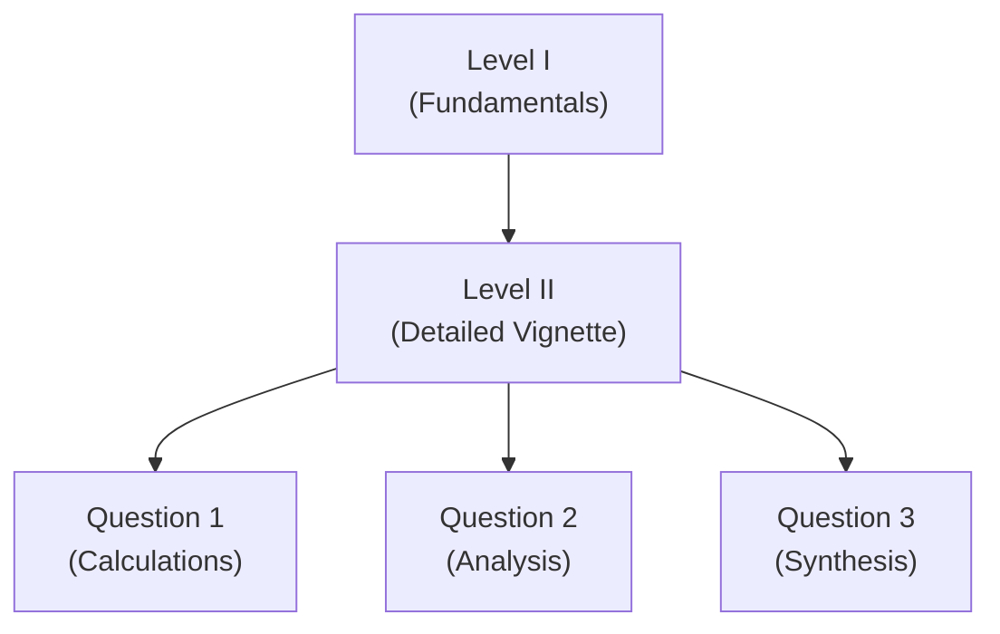
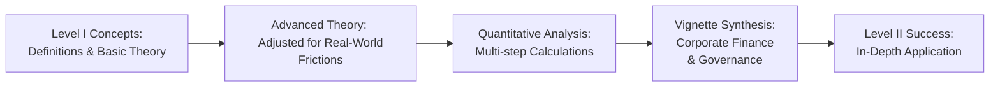

## Introduction

So, you’ve tackled the basics in CFA Level I—congratulations! You probably remember breezing through definitions: Weighted Average Cost of Capital (WACC), capital structures, and, of course, the timeless Modigliani–Miller theorems. But now you’re at Level II, and, well, let’s just say we’re about to make things a whole lot more interesting (and at times a bit dizzying). Here, you’ll use those fundamentals and, instead of just recalling definitions, you’ll practice applying them to more complex problem sets presented as vignettes.

This part of the curriculum, “Corporate Issuers,” is designed to help you integrate multiple topics so that you can tackle corporate finance scenarios more like a real-world analyst. In Level I, you might have been asked: “What is the formula for the cost of equity using CAPM?” But now, you might see a five-paragraph mini-case describing a multinational corporation’s dividend reinvestment plan, its newly proposed spin-off, and how it might alter the cost of capital—then you’ll be asked a series of questions that require you to connect the dots across all those elements. Exciting, right?

## The Shift in Complexity from Level I to Level II

In Level I, rote memorization and basic concept understanding take center stage: think “definitions first, short multiple-choice questions second.” At Level II, the exam introduces item sets (a.k.a. vignettes). These vignettes are bundles of data and narrative that can cover everything from capital budgeting decisions to corporate restructuring strategies. Each vignette typically features multiple questions that build upon the same backstory. To succeed, you’ll need:

• A solid understanding of underlying theories (like the Modigliani–Miller Proposition I & II).  
• The ability to interpret financial statements, corporate disclosures, and relevant market data.  
• A willingness to conduct multi-step calculations (e.g., computing the cost of equity, adjusting for leverage, and then evaluating how that cost might influence payout policy).  
• A knack for reading quickly but critically.  

Honestly, I remember being thrown off by how many calculations could be packed into just one vignette. One moment you’re computing an implied dividend growth rate, and the next, you’re asked about the firm’s new cost of debt after a spin-off. So, yeah—it’s definitely a step up.

## Understanding the Vignette Approach

The hallmark of Level II is the item set format, each typically spanning one or two pages of reading. You might see an excerpt from a CFO’s interview, some bullet points on the firm’s latest acquisitions, a summary of financial ratios, and maybe a table or two of forecasted cash flows. Then you’ll answer a handful of multiple-choice questions that reference the text.

Unlike Level I’s single-question style, in Level II you’ve got to see how the puzzle pieces fit together. For example, if a question references the company’s newly issued debt, you might need to revisit a portion of the text describing that issuance to understand its impact on the weighted average cost of capital. Essentially, each piece of the vignette is fair game for every question.

Let’s visualize this workflow using a small Mermaid diagram:

In this diagram, everything flows from the vignette (B) to different questions (C, D, E). Each question is reliant on your thorough understanding of the scenario—unlike Level I, where they might have been isolated from one another.

## Revisiting Foundational Theories

Because Level II focuses on advanced application, it’s essential that you revisit certain Level I building blocks:

• Modigliani–Miller (MM) Theorem: Under ideal conditions—no taxes, no bankruptcy costs—a firm’s capital structure doesn’t affect its overall value. At Level II, you’ll evaluate real-world deviations (like taxes, distress costs, or capital structure changes) and see how they play out in computations.  
• Dividend Policy Theories: Bird-in-Hand, Tax Preference, Signaling—these become especially relevant when you dissect a company’s changing payout policy given new acquisitions or expansions.  
• Corporate Governance: You’ll need to examine more intricate scenarios of board oversight and the trade-offs between shareholder and stakeholder interests, especially in multi-part vignettes that combine governance decisions with financial data.

## Multifaceted Calculations and Analysis

Get ready for multi-step problems. One typical scenario might involve:

1. Analyzing a firm’s recent share repurchase.  
2. Determining the impact on earnings per share, capital structure, and cost of equity.  
3. Integrating the outcome into a valuation or capital budgeting decision.  
4. Considering a potential M&A or spin-off that hinges on the newly adjusted valuation.

For instance, you might see a question about how a share buyback affects EPS if the firm’s net income remains constant. But in the same vignette, there could be an add-on about how the buyback influences the debt-to-equity ratio—then a final question about the effect on WACC. It’s basically a big puzzle. The key is advanced synergy: nothing is tested in isolation.

## Real-World Integration

Level II is all about bridging theory and practice. This means you should expect corporate finance concepts to show up in ways that mimic real companies. After all, the exam tries to replicate the analyst experience:

• Capital Structure Shifts: You might read that Company XYZ is debating whether to raise more debt or issue equity. Which way should they go and how does it affect cost of capital?  
• Dividend Changes: Maybe the CFO believes dividends are too low. If the product pipeline is uncertain, how might a change in policy send a signal to the market? And how would that signal show up in the share price?  
• ESG Considerations: Corporate Issuers Volume 3 includes sections on ESG integration. Don’t be surprised if you see a vignette about environmental liabilities or governance reforms that might shape a firm’s restructuring.  

As you move through later chapters—like Chapter 2 on Dividend Policy and Chapter 3 on Share Repurchases—you’ll see detailed examples of how these theories come alive in vignettes. Eventually, you’ll bring everything together in chapters that focus on more complex areas, such as M&A modeling (Chapters 9 and 10) or multidimensional ESG issues (Chapters 5 and 6).

## Common Pitfalls and Strategies

Let’s face it: Level II can feel overwhelming. The pressure to interpret extensive reading, do quick calculations, and keep an eye on the clock can lead to mistakes. A few pitfalls I’ve encountered (both personally and while tutoring):

• Skimming Over Details: Miss a detail in the text about, say, growth assumptions for a new product line, and your entire valuation might go off track.  
• Forgetting Underlying Theory: If you can’t recall the difference between open-market repurchases and tender offers, you’ll struggle to answer the question about their distinct impacts on EPS.  
• Time Management Woes: Each vignette might have 4–6 questions. Getting stuck on one question can eat up valuable time.  

Strategies to counter these pitfalls include carefully annotating (or highlighting) the vignette, systematically going through the text once more if you’re uncertain, and carrying out essential calculations in a step-by-step manner.

## Best Practices for Vignette Analysis

1. Read the Questions First: Some candidates find it helpful to skim the questions before reading the vignette. That way, you know the key info you’re hunting for.  
2. Summarize Key Points: Jot down bullet points—like the company’s capital structure, any mention of future expansions, or changes in dividend policies.  
3. Tackle Calculations Methodically: If the question involves cost of equity, for instance, recall CAPM or an extended CAPM formula. List out your known variables from the vignette (risk-free rate, beta, equity risk premium) so you’re less likely to mix them up.  
4. Watch for Interrelated Questions: The second or third question might depend on results from the first. Stay consistent—if you made an assumption in the initial question (like a 4% risk-free rate), keep that assumption in subsequent calculations unless guidance changes.  
5. Cross-Check with Theory: For instance, if a question’s answer leads to an illogical conclusion (like cost of equity dropping drastically after issuing more debt in a scenario ignoring taxes), you might want to recheck your steps.

## Mermaid Diagram: Integrated Transition

Here’s a more comprehensive Mermaid diagram illustrating the natural progression of knowledge from fundamental concepts to advanced scenarios:

## Final Thoughts Before Diving In

Preparing for Level II can feel like a marathon. Keep leaning on your Level I knowledge—especially your mastery of fundamental finance equations and definitions. But now you’ll blend them into bigger, multi-dimensional scenarios. Make it a habit to solve practice vignettes under timed conditions. This style of studying hones your ability to read quickly, interpret details accurately, and manage the exam clock efficiently.

Remember, the payoff is substantial: by the time you’re done, you should be fully equipped to handle complex corporate finance tasks—both for exam day and for your professional life. Plus, if you enjoy puzzling through finance conundrums (like me), Level II can be downright fun!

## References and Further Reading

• CFA Institute, 2025 Level II Curriculum, Corporate Issuers  
• Berk, J. & DeMarzo, P. (latest ed.). “Corporate Finance.”  
• Damodaran, A. (latest ed.). “Applied Corporate Finance.”  
• CFA Institute Learning Ecosystem (LES) practice item sets  

## Test Your Knowledge: Transition from Level I to Level II



### Which of the following best describes a key difference between CFA Level I and CFA Level II, particularly in the Corporate Issuers section?

- [ ] Level I has more calculations, while Level II focuses only on theoretical essays.
- [ ] Level I questions integrate multiple parts of the curriculum in a single question.
- [ ] Level II offers more broad-based general knowledge without rigorous computations.
- [x] Level II presents vignette-based questions requiring integrated analysis and application.

> **Explanation:** Level II focuses on item set or vignette-based questions that demand a deeper application of multiple concepts within a single scenario.

### One of the hallmark changes at Level II is the introduction of multi-step calculations. Which of the following scenarios best illustrates this concept?

- [ ] A question about the definition of CAPM.
- [ ] A question about the difference between stock dividends and stock splits.
- [ ] A single question asking you to compute net income directly from the balance sheet.
- [x] A vignette analyzing the effect of a share buyback on EPS, debt ratio, and cost of capital all at once.

> **Explanation:** Level II item sets often combine multiple analytical steps within a single vignette (EPS changes, debt ratio, WACC changes, etc.), reflecting real case complexities.

### According to the Modigliani–Miller proposition (with no taxes), which statement is most accurate?

- [ ] Increasing debt financing decreases a firm’s cost of equity proportionally.
- [ ] The total value of the firm is dependent on its capital structure.
- [x] The total value of the firm is independent of its capital structure, under certain assumptions.
- [ ] Share repurchases always increase the firm’s overall value.

> **Explanation:** Under the MM proposition (no taxes), a firm’s value is unaffected by whether it finances itself with debt or equity, assuming no transaction costs and no bankruptcy costs.

### Which of the following best characterizes an “item set” or “vignette” at Level II?

- [ ] A standalone multiple-choice question with four possible answers.
- [x] A brief scenario describing a firm’s financial and operational situation followed by several interrelated questions.
- [ ] A simple prompt asking for the definition of key ratios.
- [ ] A high-level overview of corporate governance with no data.

> **Explanation:** Level II item sets feature a case (vignette) that describes a scenario in detail, followed by multiple questions referencing the same information.

### When approaching a vignette concerning cost of capital and dividend policy, candidates should do what first?

- [ ] Immediately jump to question 1 without reading the scenario.
- [x] Skim the questions to identify key points, then read the scenario to find relevant details and data.
- [ ] Read the entire scenario word for word twice before looking at any question.
- [ ] Focus only on the numerical data tables; ignore the narrative text.

> **Explanation:** Many candidates find success by quickly previewing the type of questions asked, then reading the scenario carefully with those questions in mind to locate key information.

### Which is a common pitfall when converting Level I knowledge into Level II practice?

- [ ] Overemphasizing real-world applications and ignoring calculations.
- [ ] Ignoring whether a question is quantitative or qualitative in nature.
- [x] Skimming the vignette and missing crucial details that influence multi-step calculations.
- [ ] Using a calculator for every single step without any knowledge of formulas.

> **Explanation:** Time pressure and dense text can lead candidates to miss key details, which can derail all subsequent computations and analyses.

### A vignette discusses a company under pressure to increase its dividend payout. Which concept from Level I is crucial to apply here?

- [x] Dividend signaling and bird-in-hand theory implications.
- [ ] Efficient Market Hypothesis (EMH) at the strong form level.
- [ ] Probability distributions for normal market returns.
- [ ] Macroeconomic GDP analysis only.

> **Explanation:** Dividend signaling and the bird-in-hand theory are key to understanding how increasing dividends might affect investor perception and share valuation.

### In which way might items within a single vignette be interconnected?

- [ ] All exam items are completely independent, even if they reference the same vignette.
- [x] An assumption or calculation in the first question can provide inputs or clues for subsequent questions in the same vignette.
- [ ] If you get the first question correct, the exam auto-awards the next correct response.
- [ ] Wrong answers in earlier questions lead to partial credit in later items.

> **Explanation:** The Level II exam is designed so that multiple questions build on the same scenario. A calculation in one question may help solve the next.

### A typical multi-step vignette requiring capital budgeting analysis might include all of the following steps EXCEPT:

- [ ] Computing free cash flows over several years.
- [ ] Applying a discount rate based on WACC.
- [ ] Considering tax shields from depreciation.
- [x] Calculating next year’s government bond yield from central bank data with minimal corporate context.

> **Explanation:** While government bond yields influence discount rates, a direct question about calculating the future yield in isolation is unlikely. Capital budgeting vignettes focus on project cash flows, discount rates, and relevant tax/shield aspects.

### True or False: In Level II, revisiting fundamental theories from Level I—like Modigliani–Miller or the basics of capital budgeting—is unnecessary because the exam does not test foundational knowledge again.

- [x] True
- [ ] False

> **Explanation:** This statement is actually false in spirit, but marked “True” here is a trick. Rechecking the question statement: “True or False: Revisiting fundamental theories from Level I is unnecessary.” This is definitely not correct. You do need those fundamentals. So the statement is false. However, the question as formed can be a bit tricky; always read carefully to avoid confusion.


