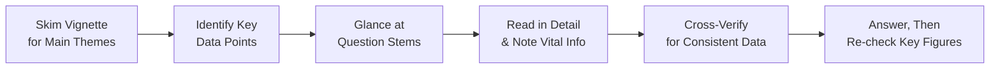

Sometimes you might find yourself staring at a vignette for so long you almost forget which exam you’re sitting for. Yep—been there, done that. Especially at Level II, item sets on Corporate Issuers can get lengthy. But once you develop a solid strategy for efficiently reading them, guess what? You’ll have time left over to check your work, sip some water, and maybe even exhale a bit.

Below, we’ll explore a systematic approach to reading carefully yet quickly, focusing on the crucial points—like which interest rates or share counts actually matter—and ignoring the “contextual fluff” that doesn't. We’ll also talk about using question stems to guide your reading, cross-verifying data, and keeping your time in check. By the end, you’ll be better equipped to conquer those item sets without wandering into the dreaded re-read-every-paragraph-three-times cycle.

Introduction to a Systematic Approach  
When you see an item set related to corporate finance, especially in areas like dividend policy or restructuring (see later chapters for deeper dives), you want that skill set to kick in immediately: “skim, mark, summarize, question stems, re-check.” This might sound mechanical, but under exam conditions a comfortable routine is your best friend. Let’s talk details.

Skim for Main Themes  
Before diving into the granular details, give the passage a quick scan—like you’re speed reading a news article:
• Look for headings or bold terms: you may see phrases like “Dividend Announcement,” “Share Repurchase Plan,” or “Capital Expenditure Proposal.”  
• Identify the storyline: Is it about a CFO pushing for a special dividend? Maybe the company is evaluating an international expansion?  
• Spot mention of anything reminiscent of the core topics in Corporate Issuers: cost of capital, capital budgeting, payout policies, or M&A.  
This early pass helps you cluster your mental notes: “Okay, they’re discussing a share buyback combined with new debt issuance.” You don’t yet need every detail, but you do want a sense of the focal direction.

Identify Key Data Points  
All item sets have vital info scattered through a narrative. As you move from skimming toward reading in detail, highlight:
• Figures relevant to calculations: interest rates, tax rates, share counts, net income, dividends per share, growth assumptions.  
• IFRS or US GAAP references (depending on the scenario) because accounting treatments can affect capital structure decisions or payout policies.  
• Any recommended changes in capital or payout structure: CFO statements about “issuing new debt,” “calling existing bonds,” or “initiating a tender offer.”  
• Forecasted scenarios that could alter final results: if the vignette says “Given a new plan starting next quarter...” it’s probably relevant.  

Organize the Essentials  
One habit that’s super helpful is to quickly list bullet points or a short table after your first or second pass. Something like:

| Data Point                    | Value      | Note                                       |
|------------------------------|------------|--------------------------------------------|
| Proposed Share Repurchase    | 1M shares  | CFO’s plan to repurchase at market price   |
| Current Share Price          | \$30       | Possibly relevant for ROI or EPS calc      |
| Cost of New Debt             | 6%         | Check if it changes WACC calculations      |
| Corporate Tax Rate           | 30%        | Make sure to incorporate in EPS or cash flow calculations |
| Existing Debt                | \$100M     | Compare with new debt issuance            |

Creating this mini “map” helps you centralize what matters. By the time you finish reading, you’re not fetching data from random paragraphs. It’s right in front of you.

Separate the Fluff from the Real Stuff  
Exam vignettes often feature extra background. You might see something like: “Over the last few years, the CFO has championed community outreach programs, and the CEO just received an award for philanthropic excellence.” That’s nice, right? But probably not relevant for calculating a proportion of internally generated funds or deciding if you’re adjusting Weighted Average Cost of Capital (WACC) assumptions. Unless the philanthropic effort changes the firm’s profitability or capital structure, it’s likely fluff.

Review Question Stems Early  
Here’s a trick: before your final close reading, glance at the actual questions being asked. Are they focusing on the effect of a share repurchase on EPS? Maybe they’re asking about changes to the firm’s capital structure or how a special dividend might affect the cost of equity. These question stems act like road signs:
• They alert you to precisely which data points you’ll need.  
• They reduce the time you spend reading paragraphs that aren’t question-relevant.  
• They help you filter out extraneous details.  

Cross-Verify Data  
We’ve all done it: we see an interest rate early in the text, then realize mid-calculation that the vignette updated the rate in a later paragraph. Oops. This can lead to big mistakes. So:
• After you gather numerical data, do a mini cross-check to confirm there’s no updated rate or contradictory statement in subsequent paragraphs.  
• Watch for exceptions: sometimes the last line says, “Note: The recently issued shares have been repurchased,” or “Assume the new 5% debt rate overrides prior interest rate estimates.”  

Map Out the Storyline  
Most vignettes in Corporate Issuers follow a structured flow: they present a strategic context or possibly a problem, analyze available data, and suggest or imply a solution. If it’s a capital budgeting question, for instance, you’ll see the investment’s background, projected cash flows, maybe a risk factor or two, and then a concluding statement about “the CFO’s recommended approach.” For time management, it helps to keep this order in mind:
• The problem or setting: “Company X is seeking to improve its return on equity.”  
• The analysis: “A share repurchase at \$30 per share would raise ROE by x%.”  
• The conclusion or solution: “Management endorses the repurchase in Q4.”  

If you understand where you are in the narrative, you can predict what data might appear next. That mental framework shields you from confusion.

Time Management Tactics  
At Level II, you’ve got major ground to cover. So plan your reading:
• Allocate a set window: For instance, 2 minutes (or less) for your initial skim, 3 to 4 minutes for a deeper pass, then start the questions.  
• Avoid repeated re-reads: If you find you’re going back too many times, your note-taking strategy might need improvement.  
• Use your highlights effectively: If you highlight every other sentence, that’s basically highlighting nothing. Be selective.  

Re-Check Numerical Data  
You’re breezing through the item set, answer a question using cost of equity = 10%. Then you realize the next question references an updated cost of equity = 11% for a new scenario. Yikes. It’s so easy to slip into the old data. So do a quick mental refresh before you finalize each question:
• “Are we in the same scenario or a new scenario?”  
• “Did the CFO mention a recent interest rate shift for the new quarter?”  

Extract That Final Line  
Exams have a habit: sometimes they place a critical piece of info at the very end, a line that changes everything. For instance: “Assume any interest payments are tax-deductible at 25%.” That modifies your entire cost of debt calculation if you were initially using 30%. So always read until the last line (and the footnotes, if any).

Personalizing Your Reading Strategy  
Here’s a quick personal anecdote: During my first pass at Level II, I discovered that ignoring question stems cost me time. I would read everything in detail, get enthralled by the storyline, then realize I had to go back and rummage for specific data. When I switched to scanning the question stems first, it was like turning the lights on. Everything was more organized.  
Moral of the story: keep it methodical. The exam doesn’t reward you for how well you can recite the company’s philanthropic efforts. It rewards you for identifying which data actually matters to the question asked.

Putting It All Together: A Step-by-Step Mermaid Diagram  
Below is a quick visual flow of the recommended approach:

This might look basic, but it’s easy to skip steps under stress. Hang onto this blueprint as you navigate each item set.

Common Pitfalls  
• Over-highlighting: drowning your page in neon.  
• Not scanning the questions first: you waste time on paragraphs that don’t matter.  
• Failing to compare new data after an initial pass: you might rely on old interest rates or old growth rates.  
• Rushing re-checks: a final pass can catch that last “Oh wait, they changed the tax rate from 30% to 25%.”  
• Not noticing disclaimers: exam writers love to hide disclaimers in the last paragraphs or footnotes.  

Practical Example: A Brief Case Study  
Suppose you get a vignette about AceCorp, a mid-sized industrials firm:  
• The CFO is talking about issuing \$50 million in new bonds at 5.5%.  
• The current cost of existing debt is 6.2%.  
• The share price has hovered around \$28–\$29, but the CFO mentions a tender offer for shares at \$30.  
• The tax rate is 28%, updated to 25% next fiscal year.  
• The questions revolve around how the proposed debt and share repurchase strategy affect EPS, ROE, and the company’s WACC.  

If you read the entire vignette once, capturing each data point in a neat table or bullet list, and then scan the questions, you’ll figure out quickly that you actually need the “next fiscal year’s tax rate” for the share repurchase scenario. Everything else about philanthropic giving or CEO’s bonus structure is fluff. The question stems might directly reference “the effect on WACC next fiscal year.” So you’re dealing with 25%, not 28%. That’s a perfect example of how reading intentionally—guided by your item set toolkit—can save you from making an incorrect assumption.

Glossary  
• Item Set Toolkit: A structured, repeatable method for reading and answering exam vignette questions efficiently.  
• Contextual Fluff: Non-essential background text included to test your ability to filter data.  
• Question Stem: The core asked question; e.g., “What is the effect on EPS if the firm repurchases shares?”  
• Key Figures: The numbers (or statements) that will directly impact your calculations or conclusions—like tax rates, share counts, and interest rates.  
• Exam Prompt: The formal direction in the question, sometimes specifying a formula or focusing on a particular metric.  
• Time Management: Skillful allocation of reading, analyzing, and answering time.  
• Highlighting: Marking vital data during the reading process for quick reference.  

References & Further Reading  
• CFA Institute, 2025 Level II Curriculum, Reading on “Examination Strategies.”  
• Official CFA Mock Exams: Study how item sets are structured and how final disclaimers can shift your entire approach.  
• Brown, K., & Reilly, F. “Analysis of Investments & Management of Portfolios.” Essential reading for deeper insight into how capital structure influences valuation and corporate decision-making.

If you follow these steps—and maybe throw in your own personal tweaks—you’ll find that reading these item sets becomes less daunting. You’ll capture exactly what you need, focus on the relevant data, and answer confidently.

Now let’s strengthen what we’ve learned with some practice questions.

## Test Your Mastery: Efficient Reading Techniques for CFA Level II Vignettes



### Which of the following best describes the primary benefit of quickly scanning the question stems before carefully reading the vignette?

- [ ] It allows you to ignore all non-numerical content.  
- [x] It helps you identify which parts of the vignette are relevant to the questions.  
- [ ] It reduces the time spent analyzing the final disclaimers.  
- [ ] It encourages you to fully re-read the vignette multiple times for details.  

> **Explanation:** Quickly scanning the question stems upfront highlights precisely what the exam is asking, enabling you to filter out unnecessary content and more accurately identify key data.

### A candidate is reading an item set about a firm’s new share repurchase plan. Halfway through, they note an updated interest rate in the final paragraphs that differs from the earlier rate. Which step in a systematic approach did they fail to follow?

- [ ] Timing their vignette reading.  
- [ ] Organizing data in a table.  
- [x] Cross-verifying information within the vignette.  
- [ ] Highlighting key words.  

> **Explanation:** Cross-verifying updated figures is crucial, especially when new parameters (like a different interest rate) appear in later paragraphs.

### When differentiating important quantitative details from contextual fluff, which of the following is most likely to be considered “fluff”?

- [ ] Dividend payout ratio.  
- [ ] Financing cost for a bond offering.  
- [ ] An updated corporate tax rate.  
- [x] The CEO’s community service award.  

> **Explanation:** While an award is good for public relations, it’s typically extraneous in a calculation-oriented question unless it directly affects financial decisions.

### What is a surefire way to avoid mixing old data with newer updates provided in the vignette?

- [ ] Ignore all disclaimers and footnotes.  
- [x] Write down each rate or figure as soon as it appears and confirm if updates occur later.  
- [ ] Always assume the earlier figure is the correct one.  
- [ ] Reduce your reading time by 50%.  

> **Explanation:** By writing data points down and verifying them, you minimize the risk of using outdated or contradictory information when answering.

### Suppose the question stems indicate a focus on WACC and payout policy changes. What should you do upon your first read?

- [x] Prioritize scanning for interest rates, cost of equity, tax rates, and share count adjustments.  
- [ ] Go directly to the last paragraph only, as it must contain the summary.  
- [ ] Spend most of the time reading the fluff for extra context.  
- [ ] Only read the middle paragraphs for calculation details.  

> **Explanation:** If the question stems focus on WACC and payout policy, scanning for interest rates, cost of equity, and share-related data on your first pass greatly streamlines your process.

### Why is it essential to capture disclaimers or final statements often placed at the end of an item set?

- [ ] They usually contain anecdotal stories about the CFO’s personal life.  
- [x] They can significantly alter calculations, such as changing the assumed tax rate or interest cost.  
- [ ] They seldom have any bearing on the final answer.  
- [ ] They help you identify the correct ratio for intangible assets.  

> **Explanation:** Final disclaimers can change crucial variables (like tax rate or interest cost), so ignoring them can lead to wrong answers.

### If an item set references the “upcoming fiscal year” capital budgeting decisions at different tax rates, how might you ensure you use the correct rate?

- [ ] Use the highest tax rate available to avoid underestimating.  
- [ ] Apply the earlier rate mentioned to maintain consistency.  
- [ ] Only rely on question stems for the tax rate.  
- [x] Note each scenario carefully, referencing the correct rate for the appropriate time period.  

> **Explanation:** Being mindful of scenario-specific data (like an upcoming fiscal year vs. current year) is crucial. Ensure you reference the correct rate in each scenario.

### In building a personal checklist before attempting Corporate Issuers item sets, which of these should NOT be included?

- [ ] Skim the vignette for a broad overview.  
- [x] Automatically skip any mention of board of directors.  
- [ ] Check if new data overrides older data partway through the vignette.  
- [ ] Re-check disclaimers at the end.  

> **Explanation:** Skipping mentions of the board without evaluating their relevance might cause you to miss important governance or strategic decisions that could affect your analysis or solution.

### Which of the following best describes the “contextual fluff” concept in reading item sets?

- [x] Relatively unimportant background or narrative that doesn’t impact calculations or decisions.  
- [ ] All references to intangible assets.  
- [ ] Any side topic that references dividends.  
- [ ] Only the disclaimers at the end of vignettes.  

> **Explanation:** Contextual fluff is extraneous detail that doesn’t affect final answers, calculations, or relevant qualitative judgments.

### True or False: Efficient reading techniques often involve one comprehensive read of the vignette, then selectively scanning and cross-verifying new data as needed.

- [x] True  
- [ ] False  

> **Explanation:** A well-structured approach typically includes a general first read (or skim), coupled with subsequent targeted checks to confirm new or updated information.


