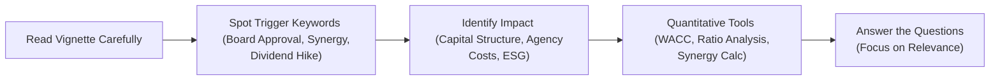

## Understanding the Concept of Vignette Triggers

Sometimes we read a corporate finance vignette and think, “Alright, get to the point—where’s the real action?” Identifying a “trigger” is like spotting a hidden signpost in that story. Triggers frequently appear as brief phrases (e.g., “board approval” or “shareholder vote”) but can carry huge implications: new dividend policy, synergy estimates, or changes in capital structure. Before you dive too deep into the numbers, consider pausing to figure out why that detail made it into the vignette. After all, the exam’s item sets are rarely random; each part is packed with context clues about what the questions may ask.

## Why Triggers Matter

So, why do we care about triggers? Well, corporate finance vignettes at the Level II exam are typically filled with a flood of data. Some details are just noise. Others, though, are signals that practically scream, “You’ll need me later!” If, for instance, you see “the CFO intends to raise new debt through a private placement,” that’s an immediate heads-up to check how leverage changes might affect the firm’s cost of capital or coverage ratios. Ignoring these cues is like walking past a neon “Entrance” sign: you might miss the entire point of the problem.

## Common Trigger Categories in Corporate Issuers

### Strategic Decisions and Current Proposals  
One of the biggest tip-offs in exam vignettes is an explicit mention of a major strategic move. For example:  
• A proposed acquisition: Typically means synergy analysis or changes in corporate structure are coming your way.  
• A planned spin-off: Chances are you’ll see a question on valuation, synergy, or capital restructuring.  
• A big dividend increase: Possibly signals confidence in free cash flow, but also might prompt questions surrounding the firm’s life cycle stage or retention ratio.

### Regulatory Approvals and Board/Shareholder Meetings  
The phrase “subject to board approval” or “pending regulatory clearance” is like a flashing red light. Why? Because these events often require scrutiny from equity holders, bondholders, or both. It might also affect the firm’s risk profile and cost of capital. Watch for references to advice from bankers or rating agencies—it’s fairly common for exam questions to explore the effect on capital structure or coverage ratios once that deal gets a green light.

### Capital Structure Changes  
Capital structure is that classic piece in corporate finance that never seems to go away. Look out for:  
• New debt issuance or convertible bonds  
• Significant share repurchases  
• Major equity offerings (perhaps a secondary offering)  

Such changes typically lead to questions on Weighted Average Cost of Capital (WACC), the debt-to-equity ratio, and whether the firm’s coverage ratio remains robust enough to handle the additional interest burden.

### Synergy, M&A, and Governance Conflicts  
When you see the words “expected synergies,” “cost-saving opportunities,” or “integration benefits,” prepare to estimate synergy or interpret reasons behind an acquisition. Also watch out for governance conflicts: if you read about tension between a CEO and CFO or friction between management and shareholders, that’s a big “trigger” for exploring agency costs or stakeholder alignment. The exam might ask about the impacts on value creation, or how different stakeholder agendas clash with maximizing returns.  

It’s not uncommon, in an M&A scenario, for the vignette to hint at synergy possibilities. As a refresher, synergy can be approximated by:


\text{Synergy} = V_{A+B} - \bigl(V_A + V_B\bigr).


Where:  
• \\(V_{A+B}\\) is the combined value of the merged firms,  
• \\(V_A\\) is the standalone value of firm A,  
• \\(V_B\\) is the standalone value of firm B.

When synergy is positive (and large enough), it could justify a higher purchase price or a specific deal structure.

### Corporate Life Cycle Stage  
Student interns sometimes skip over that short reference to “expanding product lines in emerging markets” or “persistent sluggish demand.” But these lines can give away the company’s life cycle stage. A mention of “rising competition and plateauing sales” might suggest the firm is in maturity, which could be a clue for stable dividend policies. A reference to a possible “transition to new leadership after decades of operations” might flag the decline stage, hinting that management is rethinking capital allocation, possibly to focus on share buybacks or large-scale restructuring.

### Accounting and Reporting Disclaimers  
If the vignette says “under IFRS, the company reports interest expense differently than under US GAAP,” or “the firm’s depreciation schedule was accelerated,” you should note the potential effect on net income and cash flow. The question might revolve around a ratio analysis for IFRS vs. US GAAP differences, or an advanced intangible assets consideration. These disclaimers can also be subtle: sometimes the vignette mentions a fixed asset revaluation that can shift how you interpret equity or book value. In short, keep your eyes open for everything that could shift reported earnings or balance sheet figures.

### Data Classification: Direct vs. Indirect  
When a vignette provides explicit numbers—like a new coupon rate on debt or a revised cost of equity—these are direct data points you’ll plug into your calculations. But keep an eye out for indirect clues: remarks about “substantial cost synergies” or “anticipated synergy of $2 million over five years” can hint at changes to next year’s free cash flow or an adjusted discount rate assumption. The exam might test whether you can glean the implied cost savings or synergy from scattered hints—and incorporate that into your final analysis.

### Commentary on Macro Factors  
We all know that references to interest rates, inflation outlooks, or competitor strategies can be a big deal. The exam might want you to connect the dots between these macro variables and the firm’s cost of capital or capital budgeting approach. A line about “the Fed’s recent rate hike caused the firm’s interest payments to balloon” could lead to questions on coverage ratios, WACC adjustments, or whether the firm should restructure its debt.

## Diagram: Triggers Leading to Key Analysis Areas

In many ways, that’s the entire process: see the trigger, think about what it implies for valuations and corporate decisions, then figure out if you need something like a synergy formula or cost-of-capital re-estimation to solve the question.

## Personal Anecdote: Missing The Obvious

I remember the first mock exam I ever took: I breezed past a line about “the board feels the firm’s share price is undervalued” and promptly missed that the CFO was about to announce a share repurchase program that drastically altered the firm’s leverage. The item set’s entire question hinged on recasting the firm’s debt-to-equity ratio post-repurchase. Lesson learned: if the spotlight is on share price, odds are there’s a buyback or issuance in the works.

## Best Practices for Identifying Triggers

• Write Quick Margin Notes: As soon as you see words like “acquisition” or “ESG risk factors,” jot them down. Sometimes, just capturing the main ideas in shorthand helps keep you alert.  
• Assess Verbs and Adjectives: Phrases such as “intends to,” “upcoming,” or “revised forecast” can be major hints.  
• Use a Systematic Approach: Start with the big strategic elements (mergers, expansions, dividend announcements), then go granular (like IFRS vs. GAAP details).  
• Confirm the Tone: If the CFO expresses excitement and the CEO expresses caution, that discrepancy might be a classic lead-in to an agency cost question.  
• Double-Check Macroeconomics: Because a shift in interest rates or inflation is a staple in many corporate finance scenarios, keep your eyes peeled for effects on capital budgeting or pension liabilities.

## Putting It All Together

Ultimately, being vigilant for triggers in corporate finance vignettes is about bridging the gap between narrative and numerical analysis. The exam—and real-world corporate analysis—requires you to notice subtle changes in strategy, governance, financial statements, or macro conditions that shape the next steps. Don’t underestimate quick references like a “meeting with bankers to discuss capital” or “a note from the global brand manager about environmental concerns.” Each of these can be the piece that explains a new policy, risk factor, or synergy opportunity.

Below is a concise summary of the main triggers you might come across:

| Trigger Category              | Primary Indicators                 | Potential Question Focus                                      |
|-------------------------------|------------------------------------|---------------------------------------------------------------|
| Strategic Decisions           | Proposed M&A, Spin-offs, Restructurings | Synergy analysis, cost savings, post-merger valuations        |
| Dividend & Payout Changes     | Dividend hikes, special dividends, repurchases | Payout policy theories, EPS impact, effect on cost of equity  |
| Governance & Agency           | Board disputes, CEO-CFO conflicts, activism | Agency costs, stakeholder interests, ESG integration          |
| Capital Structure Shifts      | New debt, equity issuance, convertible bonds | WACC recalculations, ratio analysis, coverage tests           |
| Accounting & Reporting        | IFRS vs. US GAAP, depreciation changes | Adjusted statements, ratio changes, advanced accounting disclosure challenges |
| Macro Factors                 | Interest rate changes, inflation outlooks | Sensitivity in cost of capital, strategic shifts, risk management |

## References

- CFA Institute “Corporate Issuers” curriculum, especially the sections on corporate governance, payout policy, and capital structure.  
- Gaughan, P. (latest ed.), Mergers, Acquisitions, and Corporate Restructurings.  
- Damodaran, A. Online resources on synergy valuation:  
  http://pages.stern.nyu.edu/~adamodar/  

## Test Your Skills: Identifying Key Triggers in Corporate Finance Vignettes



### A CFO hints that the company’s share price is significantly undervalued. Which of the following triggers could you anticipate from this statement?

- [ ] An imminent debt issuance
- [ ] A massive dividend payout
- [x] A share repurchase program
- [ ] A new convertible bond issuance

> **Explanation:** A statement indicating that the share price is undervalued typically suggests the firm might consider a share buyback, as management expects the repurchase to be accretive to shareholders.

### A vignette mentions “the proposal is still subject to regulator review and board approval.” Which potential analysis is most directly triggered?

- [ ] Dividend yield analysis
- [x] Impact on capital structure and cost of capital
- [ ] Changes to inventory management techniques
- [ ] Extra intangible asset revaluation

> **Explanation:** Board and regulator approvals typically signal a significant capital or strategic move, often involving additional leverage or equity structure changes.

### When a vignette provides extensive details on a newly issued convertible bond, exam questions most likely focus on:

- [ ] Dividend discount model application
- [x] Adjusted WACC and coverage ratio impacts
- [ ] Inventory turnover optimization
- [ ] Corporate tax strategies

> **Explanation:** Convertible bonds affect the firm’s leverage, interest obligations, and potentially its equity. Expect calculations or discussions around how this changes WACC or coverage ratios.

### A quick sentence in the vignette says, “Management believes consolidation will save $10 million in annual overhead.” This comment typically hints at:

- [ ] The need to revisit intangible asset impairment
- [ ] Comprehensive changes in financial statements under IFRS
- [x] Synergy analysis
- [ ] Dividend reinvestment plan shortfalls

> **Explanation:** Overhead reductions are part of potential synergy benefits, commonly tested in M&A contexts. Expect synergy calculations or a question on synergy’s effect on deal valuation.

### The vignette notes “the firm has a policy of distributing 50% of earnings as dividends and is seeing a slowdown in sales growth.” This indicates:

- [x] High likelihood of stable dividend or possible payout reduction question
- [ ] Expectation of the company repurchasing shares immediately
- [x] Potential alignment with a more mature life cycle stage
- [ ] A shift to IFRS-based financials

> **Explanation:** Higher payout ratios and slowing growth often imply maturity in the corporate life cycle. The exam might explore whether the company can maintain that dividend policy.

### A mention of “the CEO expressing excitement about the new product in an emerging market, while the CFO worries about the rising capital expenditure” is a sign of:

- [x] Potential conflicts of interest or divergent outlooks
- [ ] IFRS vs. US GAAP recognition issues
- [ ] Immediate restructuring of debt
- [ ] Reclassification of intangible assets on the balance sheet

> **Explanation:** Differing perspectives from senior leadership are classic indicators of agency challenges or at least conflicting viewpoints about capital allocation.

### The footnotes reveal the firm is applying IFRS revaluation for its property, leading to an increase in equity. What question might this trigger?

- [x] Ratio analysis adjustments for IFRS vs. US GAAP
- [ ] Agency costs tied to new synergy calculations
- [x] Capital structure ratio changes
- [ ] Dividend growth model application

> **Explanation:** IFRS revaluation changes the firm’s reported equity, which can alter leverage and coverage ratios. This often prompts adjustments in ratio analysis under different standards.

### The vignette states, “To fund the acquisition, the CFO is seeking $100 million in new debt.” The key question area likely revolves around:

- [x] Pro-forma debt-to-equity after issuance
- [ ] Reclassification of intangible assets
- [ ] IFRS-specific capital treatment
- [ ] Revisions to short-term liquidity only

> **Explanation:** Acquiring new debt typically means a shift in the firm’s leverage or coverage metrics. The exam often tests how this affects WACC, ratios, or covenant compliance.

### You see “forecasted rising inflation over the next two years and increasing interest rates.” What is the direct implication for the vignette’s corporate finance question?

- [x] Higher cost of debt and potential changes to WACC
- [ ] Lower share prices and immediate share buyback announcements
- [ ] An IFRS/US GAAP depreciation schedule change
- [ ] Minor changes to intangible asset valuations

> **Explanation:** Rising interest rates typically raise the cost of debt, which could increase WACC and prompt strategic moves in financing or capital budgeting.

### The vignette reveals, “ESG concerns from shareholders about carbon emissions are mounting.” From a corporate finance perspective, this is:

- [x] A potential trigger for analyzing changes in cost structure or required returns
- [ ] A direct invitation to recalculate synergy only
- [ ] Completely irrelevant to capital structure decisions
- [ ] Solely related to IFRS compliance

> **Explanation:** Mounting ESG concerns can affect the firm’s risk profile, potentially altering its cost of capital or necessitating additional capital expenditures and strategic re-alignments.


