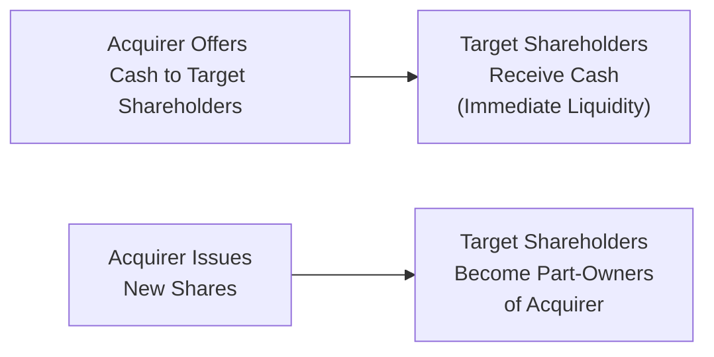

## Overview

Mergers and acquisitions (M&A) can be structured in various ways, but two of the most common deal types are cash transactions and stock (equity) transactions. You might have heard folks—maybe at a conference—debate whether an acquirer should “pony up” the cash or issue shares when buying another firm. It's a huge strategic question. Each approach has distinct implications for ownership structure, control, tax treatments, synergy realization, and how the combined firm plans for future growth. In this section, we’ll dig deeper into the trade-offs, benefits, and pitfalls associated with each method.

We’ll look at:

• How a cash deal changes the ownership and control dynamic.  
• Why acquirers sometimes prefer stock, especially if their share price is considered “frothy” or if they want to preserve liquidity.  
• The tax considerations for both parties (and the potential for tax deferral in a stock-swap).  
• The effect on capital structure, risk-sharing, synergy realization, and how markets perceive each deal type.  
• How to incorporate these choices into valuation models like DCF or comparables.  

Sometimes you’ll hear, “Cash deals are simpler.” But is that always true? Let’s jump in and see what’s really going on behind the scenes.

## Cash Offers: Immediate Liquidity and Clear Ownership Changes

In a cash acquisition, the acquirer pays the target’s shareholders in cash for their shares. Picture an all-cash deal like selling a house for a lump-sum payment versus a mortgage or installment plan. The key features:

• Target shareholders get immediate liquidity.  
• The acquirer ends up with full ownership of the target.  
• The deal typically triggers immediate capital gains taxes for target shareholders (depending on local tax rules).  
• The acquirer’s leverage (or immediate use of cash reserves) often increases if the cash is borrowed.  

### Why Acquirers Might Prefer Cash

1. ■ Lower Administrative Complexity: A pure cash settlement can be straightforward to execute.  
2. ■ Signaling Confidence: It often signals that the acquirer has sufficient liquidity or can easily raise debt financing. Market participants may see this as the acquirer “putting its money where its mouth is.”  
3. ■ Full Retention of Future Earnings: Since target shareholders are “cashed out,” the acquirer’s existing shareholders do not dilute their stake in future earnings.  
4. ■ Speed of Integration: Cash deals sometimes conclude faster because there are fewer steps (for instance, no new share issuance documentation) and the ownership structure changes quickly.

A personal anecdote from a former colleague: She once worked through an all-cash merger where the acquirer was rolling in free cash from cyclical equipment sales. They didn’t want to jumble their capital structure with more shares. The speed and clarity of an all-cash route appealed to them big time, though it left them somewhat strapped for liquidity after the deal.

### Potential Downsides of Cash Offers

• Debt Burden: If the acquirer doesn’t have the cash on hand, it may have to borrow. That can elevate leverage and potentially hurt the firm’s credit rating.  
• Opportunity Cost of Capital: Some large, profitable firms might prefer to keep their cash for other investments or share repurchases, especially if they expect higher returns elsewhere.  
• Tax Consequences for Target Shareholders: A cash deal typically triggers immediate taxation on any capital gain, which might be a disadvantage unless the shareholders can reinvest quickly.

## Stock Offers: Sharing Future Upside and Spreading Risk

In a stock-based acquisition, the acquirer typically issues shares to buy the target. Target shareholders exchange their shares for new ownership in the acquirer. Think of it like you’re adding new partners into your business rather than just paying them off and sending them on their way.

### Why Acquirers Might Prefer Stock

1. ■ Preserving Cash: No need to drain precious cash resources or take on debt.  
2. ■ Risk-Sharing: Since the target’s shareholders remain invested in the combined entity, they share in the post-merger upside (and downside).  
3. ■ Potentially Attractive Valuation: If the acquirer’s stock price is high—or overvalued relative to fundamentals—issuing additional shares can effectively be a cheaper currency.  

### Potential Downsides of Stock Offers

• Dilution of Ownership: Existing acquirer shareholders see their stake diluted, which can be a hot-button issue, especially if the acquisition targets appear overvalued or if synergy estimates are uncertain.  
• Complex Integration: Corporate governance structures may need to be recalibrated if a significant portion of the new entity is owned by “legacy” shareholders from the target.  
• Market Perception: If the acquirer’s share price dips significantly during deal negotiations, the final terms might look less favorable to target shareholders, sparking renegotiation or even deal failure.  

## Diagram: Cash vs. Stock Transaction Flows

Below is a small flowchart illustrating the fundamental difference:

In the left flow, the deal is straightforward: Target shareholders get cash, walk away. In the right flow, they swap their target shares for new acquirer shares.

## Impact on Capital Structure and Leverage

When an acquirer finances a deal with cash, it may use retained earnings or debt. If debt is used, watch out for:

• Higher Interest Expenses: Heavier leverage can escalate financial risk.  
• Financial Covenants: Lenders may impose covenants restricting future payouts or additional borrowings.  
• Negotiation Flexibility: Overly leveraged firms might have less flexibility for future capital expenditures or strategic moves.

With stock-financed deals, you avoid taking on more debt, but:

• You expand the total share count, leading to potential EPS dilution in the short run.  
• Existing shareholders’ control can shift. Large new stakeholders from the target might want board seats or influence strategic direction.  

## Dilution, Ownership, and Future Earnings Sharing

A core difference is how future earnings and risks are shared once the deal closes.

• In a cash deal, the acquirer—along with its original shareholders—captures 100% of the target’s future earnings. Target shareholders lose any direct stake in the combined firm’s upside (though they can reinvest the sale proceeds however they see fit).  
• In a stock deal, target shareholders join the acquirer’s shareholder base, participating in future improvements (or declines). 

This difference in risk-sharing can significantly affect the synergy story. A stock deal might keep key people in the target more vested in the combined entity, encouraging them to remain for the long haul and help realize synergies.  

## Tax Implications

One key financial puzzle (and possible headache) in choosing a deal structure is tax:

• Cash Offers: Target shareholders typically realize a capital gain on any share price appreciation, which could be taxed in the year of the transaction. Acquirers might also reduce their after-tax cash if the transaction is financed by debt with deductible interest—but that can cut both ways if leverage overshoots.  
• Stock Offers: In some jurisdictions, an equity-for-equity exchange can trigger tax deferral for target shareholders, meaning they postpone recognition of the capital gain until they sell the newly issued shares. This deferral can be appealing but depends on how the local tax code is structured (and it can get complicated under IFRS vs. US GAAP reporting).  

## Market Perceptions of Valuation

Market sentiment can shift quickly, and the chosen transaction structure can either reassure or worry investors:

• If an acquirer uses stock when its share price is trading at a perceived premium, it may effectively acquire the target using inflated currency. That’s beneficial for acquirer shareholders—unless the market starts suspecting the stock is overvalued for a reason.  
• A cash deal often signals that the acquirer has confidence in the target’s prospects and believes the synergy upside is worth the liquidity or debt burden. However, if the acquirer’s own share price is depressed, financing with additional equity might be too dilutive or unattractive, pushing the acquirer to lean on cash or debt instead.  

## Integrating Deal Structure Choices into Valuation Models

### Discounted Cash Flow (DCF)

In a DCF approach, you’ll want to account for:

1. Changes in capital structure. If you ramp up debt, factor in the new interest costs and potential impacts on the Weighted Average Cost of Capital (WACC).  
2. Synergy Realization: Overly optimistic synergy assumptions can cause you to overpay, especially in a stock-based deal that shares upside with new shareholders.  
3. Terminal Value Adjustments: Your terminal value might shift depending on the new capital structure at the end of the projection.  

### Comparable Multiples

When you do your EV/EBITDA or P/E multiples:

• Watch how the share count will balloon in a stock deal—especially relevant to P/E-based valuations.  
• Evaluate whether you can factor synergy into the forward multiples, particularly if the combined firm’s leverage is drastically different.  

### Dilution Example

Say the acquirer has 100 million shares outstanding at $50 each (market cap of $5 billion). They acquire a target for $2 billion, financed entirely with newly issued stock. If the new shares are also priced at $50, that’s 40 million freshly minted shares. Now the total share count is 140 million. Existing shareholders own roughly 71.4% of the combined firm, while the target’s shareholders own around 28.6%. If synergy disappoints, the original shareholders bear that reduced EPS effect.  

## Scenario Analysis and Sensitivity Testing

Many advanced M&A models use scenario analysis to test how different structures might affect the firm’s stability, synergy capture, and credit ratings. For instance:

• Base Case: Modest synergy, financed with 50% cash, 50% debt. Does the firm maintain an investment-grade rating?  
• Upside Case: High synergy, financed with stock at a strong acquirer share price. The resulting entity’s leverage might remain low, but the acquirer’s old shareholders might be giving away more of that synergy upside.  
• Downside Case: The synergy is minimal, or the macro environment deteriorates. A cash-financed deal leaves the acquirer highly leveraged or with less liquidity, while a stock deal could mitigate risk.

## Risk-Sharing Between Acquirer and Target

In any deal, you have to ask: Who carries the majority of post-merger risk and reward?

• Cash Deal: The acquirer shoulders all future performance risk. If synergy fails to materialize, the acquirer’s shareholders suffer. The target’s shareholders effectively cashed out at the deal price.  
• Stock Deal: Both sets of shareholders share the synergy gain—or take the synergy disappointment. This can align interests more effectively, especially if the target’s management is critical to the combined firm’s success.

## Best Practices and Pitfalls

• Beware Overleverage: Overly aggressive cash deals can hamper strategic flexibility down the road.  
• Assess Tax Deferral Environments: In certain jurisdictions, stock-for-stock transactions offer significant benefits, but the complexity can be high.  
• Communicate Clearly: Market perception is huge. If you choose a 100% stock offer while your share price is near an all-time high, explain your rationale carefully—or risk speculation that your stock might be overvalued.  
• Involve Target Management: Especially if you want them to stay around. Stock deals can be an effective way to motivate target stakeholders by giving them “skin in the game.”  

## Conclusion

Choosing between a cash acquisition and a stock-based deal isn’t as simple as flipping a coin. It’s a nuanced decision balancing capital structure, tax implications, valuation considerations, control issues, synergy expectations, and risk-sharing. If the acquirer’s stock is trading at a premium, issuing shares might be the more attractive route for funding. Meanwhile, a cash deal can project strength, clarity, and immediate liquidity for target shareholders—though it may raise corporate debt levels or draw down precious resources.

From a CFA Level II perspective, the specific “right” answer to these deal-structure dilemmas often lies in the synergy estimates, target shareholders’ preferences, capital market conditions, and the acquirer’s strategic game plan. A thorough analysis, grounded in both qualitative assessments (e.g., retention of key personnel, brand fit) and quantitative modeling (e.g., DCF, scenario testing), provides the best foundation for a successful M&A transaction.

## Glossary

• Acquirer: The company that initiates and executes the purchase or merger with another firm.  
• Target: The company being purchased or merged with.  
• Synergy: Incremental value or cost savings realized when two firms combine, exceeding the sum of their standalone values.  
• Dilution: A decrease in existing shareholders’ ownership percentage after new shares are issued.  
• Cash Offer: An acquisition in which the acquirer pays cash in exchange for target shareholders’ stock.  
• Stock Offer: An acquisition in which the acquirer offers its own shares to target shareholders.  
• Leverage: The use of borrowed funds that can amplify returns (or losses).  
• Tax Deferral: Structuring a transaction to reduce or delay tax obligations, often through share exchanges.

## References, Further Reading, and Resources

• CFA Institute Program Curriculum – Corporate Finance Readings on Mergers & Acquisitions  
• Damodaran, A. (n.d.). “Valuation of Mergers and Acquisitions.” Available at: http://pages.stern.nyu.edu/~adamodar/  
• Bruner, R.F. (2004). Applied Mergers and Acquisitions. John Wiley & Sons.  
• Gugler, K., Mueller, D.C., & Weichselbaumer, M. (2012). “Market Anticipation of Mergers and Acquisitions.” The Review of Economics and Statistics  

## M&A Deal Structure Mastery Quiz



### Determining Deal Structure

- [ ] A cash deal never triggers immediate taxation for target shareholders.
- [ ] A stock deal always preserves acquirer shareholders’ control.
- [x] A cash deal often leaves the acquirer with full ownership and immediate tax consequences for target shareholders.
- [ ] Debt is not used in cash deals.

> **Explanation:** In a typical cash deal, target shareholders receive cash for their shares, triggering tax on any capital gains. Also, the acquirer can end up with full ownership immediately. Debt may be used, but it’s not obligatory.

### Stock vs. Cash Financing Impact

- [ ] Stock deals eliminate all risk for target shareholders.
- [x] Stock deals allow target shareholders to share in post-merger upside.
- [ ] Cash deals automatically align interests between acquirer and target.
- [ ] Stock deals result in no dilution of ownership for existing shareholders.

> **Explanation:** In a stock deal, target shareholders become part-owners of the combined firm, sharing in its future performance. That introduces ownership dilution for the acquirer’s existing shareholders.

### Tax Benefits of Stock Transactions

- [ ] Stock transactions never provide tax deferrals.
- [x] Stock transactions often allow target shareholders to defer capital gains.
- [ ] Stock transactions impose higher taxes on the acquirer.
- [ ] Cash deals typically reduce capital gains for target shareholders.

> **Explanation:** In many jurisdictions, an exchange of stock in an acquisition can defer capital gains for target shareholders until they dispose of the new shares.

### Effects on Capital Structure

- [ ] A cash deal never alters a company’s leverage.
- [x] A highly leveraged firm may struggle to finance a cash deal without violating covenants.
- [ ] A stock deal automatically reduces the acquirer’s financial risk.
- [ ] A cash deal must be funded through retained earnings only.

> **Explanation:** If the acquirer funds a cash deal by borrowing, it may significantly increase leverage. Existing covenants could limit available credit.

### Market Perception

- [x] Using stock when it’s trading at a premium can lower the acquirer’s cost of acquisition.
- [ ] Stock offers convey that the target is overvalued.
- [ ] Paying cash always signals financial weakness.
- [ ] A high stock price always guarantees a successful deal.

> **Explanation:** If an acquirer’s shares trade at a premium relative to their intrinsic value, issuing new equity can effectively reduce the cost of acquiring the target.

### Dilution Concerns

- [ ] A stock deal never dilutes the acquirer’s ownership.
- [x] A stock deal increases the total share count, potentially reducing existing shareholders’ percentage stake.
- [ ] Cash deals lead to a higher share price for the target but not the acquirer.
- [ ] None of the above.

> **Explanation:** By issuing new shares in a stock deal, the acquirer’s existing shareholders experience dilution of their ownership percentage.

### Valuation Integration

- [ ] DCF models do not account for changes in capital structure.
- [x] A DCF model must incorporate new interest expenses or changes in WACC due to financing choices.
- [ ] Comparable multiples are unaffected by share count changes.
- [ ] None of the above.

> **Explanation:** When you adjust how a deal is financed, you have to change your cost of capital assumptions, interest expense forecasts, and share count for valuation models.

### Risk-Sharing Dynamics

- [ ] Cash deals split post-merger value and risk between acquirer and target.
- [x] In a stock deal, target shareholders share in future synergies and risks.
- [ ] Cash deals ensure the target’s management never remains involved post-merger.
- [ ] Stock deals reduce synergy potential by shifting risk to the acquirer.

> **Explanation:** A stock deal generally results in target shareholders owning part of the acquirer, so they share in the combined entity’s risks and rewards, including synergy outcomes.

### Financing Choice and Corporate Strategy

- [ ] Acquirers prefer cash deals only when interest rates are high.
- [ ] Acquirers prefer stock deals because it always leads to higher EPS post-merger.
- [ ] The financing choice does not affect synergy realizations.
- [x] The decision often depends on capital availability, market valuations, synergy expectations, and the acquirer’s strategic objectives.

> **Explanation:** There isn’t a one-size-fits-all approach. Acquirers weigh liquidity, potential dilution, synergy alignment, and overall strategy.

### True or False: M&A Tax Effects

- [x] True
- [ ] False

> **Explanation:** In many markets, a cash transaction triggers immediate taxable gains for target shareholders, while a stock-based acquisition can offer tax deferral, contingent on various conditions.


