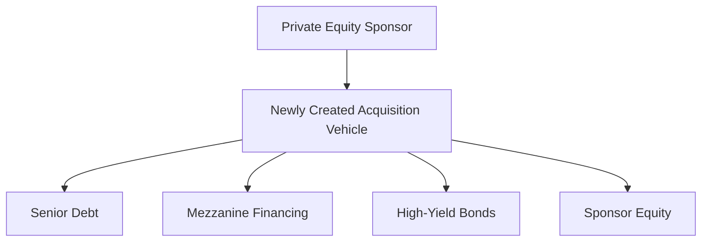

## Introduction
Sometimes, when you look at the corporate world, it feels like you’re watching a daring circus act: big companies teeter on huge piles of debt, private equity sponsors throw money around, and managers suddenly become owners of the very place they were running. Well, that’s more or less what happens in leveraged buyouts (LBOs) and management buyouts (MBOs). These transactions can profoundly reshape a firm’s capital structure and governance, often with dramatic outcomes for everyone involved—equity holders, creditors, and management teams. In this section, we’ll untangle the nuts and bolts of LBOs and MBOs. Don’t worry: we’ll keep it as straightforward as possible, layering real examples and tying them back to the calculations you’ll need for the exam (and beyond).

## LBO Structures and Key Considerations
An LBO occurs when an entity—often a private equity (PE) sponsor—acquires a company primarily using borrowed funds. The acquired company’s cash flow and assets typically secure the debt. It’s called a “leveraged buyout” because leverage (debt) takes center stage in financing the purchase.

But why pile on so much debt? Because debt can magnify returns to equity holders. If the investment is managed well, the equity sponsor can earn a higher rate of return than if they had bought the company purely with cash. Of course, leverage works both ways; it amplifies losses if the target fails to produce enough cash flows to service that debt.

### Common Financing Sources
Typical LBO capital structures combine multiple layers of debt with an equity infusion from the sponsor:

• Senior Debt: The largest piece of the capital stack, secured by the target’s assets and with priority in receiving interest and principal payments.  
• Mezzanine Financing: Subordinated to senior debt but senior to equity. Often combines debt-like and equity-like features, sometimes with warrants or convertible notes.  
• High-Yield Bonds: Debt with higher interest rates and looser covenants, commonly issued in LBO transactions as a way to stretch the financing capacity.  
• Sponsor Equity: The private equity sponsor (and sometimes management) invests in the equity portion of the deal. While often a smaller percentage of the total capital, it’s the “skin in the game” that reaps the biggest returns if all goes well.

Here’s a quick visualization of the usual structure:

## Characteristics of a Good LBO Target
Not every company is a strong candidate for an LBO. You typically want to see:

• Stable and Predictable Cash Flows: The firm needs to handle substantial debt payments.  
• Low Capital Expenditure (CapEx) Requirements: High ongoing CapEx can strain free cash flow needed to meet interest and principal.  
• Strong Asset Base for Collateral: Lenders need collateral if things go sideways.  
• Potential for Operational Improvements: The private equity sponsor seeks to boost value through cost savings, revenue growth, or strategic repositioning.

## Roles of Private Equity Sponsors
Private equity sponsors are the puppet masters of the deal:

• Structuring the Transaction: They determine the mix of senior debt, mezzanine, and equity.  
• Managing Risk: Through covenants, financial engineering, and oversight of management.  
• Improving Operations: Often bringing in managerial expertise or cost-cutting strategies.  
• Planning Exit Strategies: Potential exits include an initial public offering (IPO), a secondary buyout (sale to another PE sponsor), or a strategic sale to another operating company.

## Contrast: Management Buyout (MBO) vs. Traditional LBO
A management buyout (MBO) is, in many ways, a special type of LBO. However, the incumbent management team drives the buyout by partnering with financiers (possibly private equity or banks). So, how does this differ from a sponsor-led LBO?

• Management’s Role: In an MBO, the existing management becomes the owner, which can be super motivating—there’s direct alignment between the company’s leadership and its success.  
• Potential Conflicts: Minority shareholders might feel shortchanged if management uses insider knowledge to acquire the company at a low price. That’s why fairness opinions and third-party valuations matter.  
• Control and Autonomy: MBOs can give managers more freedom to implement plans without public market scrutiny. But ironically, they often must answer to the lenders or PE firms now providing most of the capital.  

In a traditional LBO, external private equity has much greater control and may install its own (or newly hired) leadership team.

## Calculating Leverage Ratios
Leveraged transactions typically revolve around a couple of key metrics:

### Debt/EBITDA
This ratio measures how many years of current EBITDA are needed to repay the total debt. After an LBO, it could be 5× or 6×, or higher, depending on market conditions. A higher ratio implies more leverage and risk.

### Interest Coverage Ratio (ICR)
Often expressed as EBITDA divided by interest expense. A lower ICR spells higher credit risk (less ability to cover interest payments). Post-LBO, ICR falls, reflecting the increased debt burden.

In formula terms:

Debt/EBITDA =  
Debt ÷ EBITDA  

Interest Coverage Ratio =  
EBITDA ÷ Interest Expense  

Imagine Company A with $100 million in total debt and $20 million in EBITDA. Debt/EBITDA = 5×. If the interest expense is $5 million, then ICR is 4×. Now, if an LBO jacks up debt to $160 million (with EBITDA unchanged at $20 million), Debt/EBITDA becomes 8× and interest expense might jump to $10 million, dropping ICR to only 2×. Creditors, rating agencies, and even the CFO begin sweating at that point.

## Building an LBO Model
Constructing a full-blown LBO model often unleashes a monstrous spreadsheet with integrated financial statements, debt schedules, and sensitivity analyses. Here’s a simplified approach:

1. Revenue and EBITDA Projections: Forecast sales, expenses, and EBITDA margins.  
2. Debt Schedules: Lay out tranches of debt (senior, mezzanine, etc.) with associated interest rates and mandatory amortization.  
3. Cash Flow Waterfall: Prioritize cash flows to pay operating expenses, interest, principal, and so forth.  
4. Exit Multiples: Estimate what multiple of EBITDA the sponsor might get if they sell the company after, say, 5 years.  
5. IRR and MOIC Calculation: Project equity holders’ return based on initial equity contribution versus net equity proceeds at exit.

A snippet of the IRR formula, using time 0 as your initial outflow and time T as your final inflow:

$$
\sum_{t=0}^{T} \frac{CF_t}{(1 + r)^t} = 0
$$

Where \\(CF_0\\) is typically a negative value (equity investment), and \\(CF_T\\) is the final net proceeds at exit. Solving for \\(r\\) yields the Internal Rate of Return.

MOIC (Multiple on Invested Capital) is simpler:


\text{MOIC} = \frac{\text{Total Proceeds}}{\text{Total Equity Invested}}


If you put \$50 million into the deal (total sponsor equity) and earn \$150 million at exit, your MOIC is 3.0×.

## Evaluating Potential Returns
PE sponsors love a good internal rate of return (IRR). The higher the IRR, the more they can boast about their performance. However, IRR can be misleading if the investment horizon is short or if capital is deployed and returned in uneven lumps.

Therefore, sponsors often consider both IRR and MOIC. A deal might have a decent IRR but a low MOIC, especially if it’s a quick flip. By contrast, a steady longer-term investment might yield a sky-high MOIC but involve a moderate annualized IRR.

## Management Motivations in an MBO
Shifting from an LBO to an MBO, management’s motivation typically centers on:

• Autonomy: They get to call the shots without outside shareholders’ immediate scrutiny.  
• Economic Upside: If they perform well, the equity stake becomes very lucrative.  
• Potential Undervaluation: Longtime executives might see untapped value no one else appreciates and decide to “buy low,” though they need to ensure fairness for other shareholders.  

That last bit is especially critical. MBOs often involve fairness opinions from independent investment banks to confirm that management isn’t using inside knowledge to push a lowball price.

## Common Pitfalls and Best Practices
• Over-Leveraging: Just because lenders are willing to finance a high multiple doesn’t mean it’s wise. Excessive leverage can cripple the company.  
• Overly Optimistic Projections: PE sponsors might, well, be enthusiastic. But if growth or cost savings don’t pan out, a once-promising IRR can vanish.  
• Misalignment of Incentives: In MBOs, minority investors may see conflicts of interest if management weighs personal gain over broader shareholder value.  
• Ignoring Macroeconomic Shifts: A slump in economic conditions can hammer an over-levered firm.  

## Glossary
Leveraged Buyout (LBO): Acquisition strategy using significant borrowed funds to meet the cost of the acquisition.  
Management Buyout (MBO): A transaction where a company’s management team acquires the firm, often with external financing.  
Private Equity (PE) Sponsor: Investment firm focusing on acquiring and revamping companies before exiting for capital gains.  
Mezzanine Financing: Hybrid financing, typically subordinated debt with equity-like features, positioned between senior debt and common equity.  
Interest Coverage Ratio (ICR): EBITDA/Interest Expense, indicating how comfortably a firm covers its interest.  
Internal Rate of Return (IRR): The discount rate at which the net present value of future cash flows equals zero.  
Exit Multiple: The valuation multiple (often of EBITDA) applied at the time of exit to determine overall proceeds.  
MOIC (Multiple on Invested Capital): Ratio of total investment returns to the amount originally invested.

## References, Further Reading, and Resources
• Kaplan, S., & Strömberg, P. (2009). “Leveraged Buyouts and Private Equity.” Journal of Economic Perspectives.  
• Rosenbaum, J., & Pearl, J. (2013). Investment Banking: Valuation, LBOs, M&A. Wiley Finance.  
• CFA Institute Program Curriculum, Corporate Finance—Sections on Private Equity and LBOs.

## Assessing Your Knowledge: Leveraged Buyouts (LBOs) and Management Buyouts (MBOs) Quiz



### Which of the following typically characterizes a suitable LBO target?
- [ ] Highly cyclical cash flows
- [x] Stable operating cash flows with low ongoing CapEx needs
- [ ] Multiple product lines facing constant disruption
- [ ] No tangible assets to serve as collateral

> **Explanation:** Strong collateral, low CapEx, and stable cash flows reduce the financing risk for lenders and the PE sponsor in an LBO.

### What is the primary role of a private equity sponsor in an LBO transaction?
- [ ] Providing expertise in advanced manufacturing techniques
- [x] Structuring the capital mix, overseeing management, and planning exits
- [ ] Auditing the financial statements to ensure IFRS compliance
- [ ] Eliminating the need for working capital management

> **Explanation:** PE sponsors are central to capital structuring, governance oversight, and identifying an optimal exit mechanism.

### Which statement best distinguishes an MBO from a typical LBO led by an external PE sponsor?
- [ ] An MBO includes senior debt but no mezzanine debt
- [ ] An MBO must occur in private companies only
- [x] In an MBO, incumbent managers become owners, potentially creating conflicts with minority shareholders
- [ ] In an MBO, no equity contribution is required

> **Explanation:** MBOs are driven by incumbent management; the potential conflict arises over deal valuation and fairness to existing shareholders.

### If a buyout transaction increases a company’s Debt/EBITDA from 3× to 5× while EBITDA remains constant, which of the following is most likely to occur?
- [ ] The interest coverage ratio will likely improve
- [x] The financial risk of the company increases
- [ ] The company’s credit rating will automatically improve
- [ ] The equity portion of the capital structure will necessarily increase

> **Explanation:** A higher Debt/EBITDA ratio signals higher debt relative to operating profits, which elevates financial risk.

### In calculating IRR for a leveraged buyout, which of the following cash flows is typically considered?
- [ ] Only dividends paid out during the holding period
- [x] The initial equity outlay and the final net proceeds at exit
- [ ] Depreciation expense in each year
- [ ] Fair value adjustments of intangible assets

> **Explanation:** IRR focuses on the sponsor’s actual cash inflows and outflows—initial equity investment and final equity proceeds (plus any interim dividends).

### What is the primary function of mezzanine financing in an LBO structure?
- [ ] To replace common equity
- [ ] To serve as collateral for the senior lenders
- [x] To fill the gap between senior debt and sponsor equity, often at a higher yield
- [ ] To eliminate the need for fairness opinions

> **Explanation:** Mezzanine financing helps bridge financing needs beyond senior debt, bearing higher risk (and yield) than senior debt but ranking above equity.

### Which factor tends to make a Management Buyout attractive to a company's executives?
- [x] The prospect of equity ownership and direct participation in future upside
- [ ] The chance to eliminate any personal financial commitment
- [ ] A guarantee of investment success due to insider knowledge
- [ ] The ability to bypass lenders and investors

> **Explanation:** MBOs often motivate managers by giving them a larger ownership stake, aligning their efforts with business success.

### A firm’s Interest Coverage Ratio (ICR) is measured as:
- [ ] (Long-Term Debt + Short-Term Debt) ÷ EBITDA
- [ ] Net Income ÷ Interest Expense
- [x] EBITDA ÷ Interest Expense
- [ ] EBIT ÷ Principal Repayment

> **Explanation:** ICR is typically EBITDA/Interest Expense, capturing the ability to service interest from core operating earnings.

### If a PE sponsor invests $20 million of equity in a buyout and exits for a total equity value of $80 million, the MOIC is:
- [ ] 2.0×
- [ ] 3.0×
- [ ] 3.5×
- [x] 4.0×

> **Explanation:** MOIC = Total Proceeds ÷ Initial Equity = \$80 million ÷ \$20 million = 4.0×.

### True or False: In evaluating an MBO, a fairness opinion is often sought to mitigate concerns about conflicts of interest.
- [x] True
- [ ] False

> **Explanation:** Fairness opinions aim to protect minority shareholders by ensuring management’s buyout offer reflects a fair valuation.


