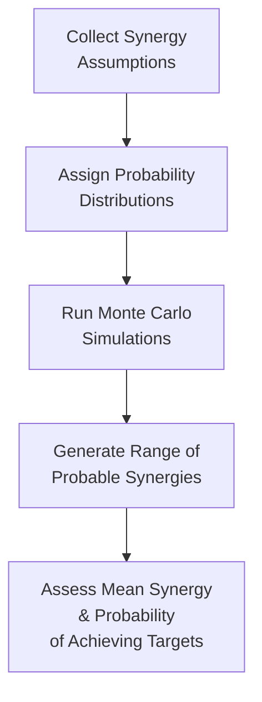
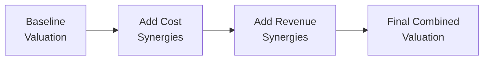

## Introduction

So, you’ve embarked on analyzing major corporate restructuring deals like M&A or LBO transactions, and now you’re facing the question: “How on earth do I quantify all these synergies management keeps talking about?” That was me, years ago, sitting in a conference room with stacks of financial statements and enough coffee to fuel an office party. My job? Sort out how to measure the intangible savings and extra revenues that, on paper, justify huge acquisition premiums.

In this section, we’ll sift through precisely that challenge. We’ll explore how to model restructuring outcomes using synergy assessments, focusing on:

• Identifying incremental revenue opportunities and cost savings after a merger.  
• Integrating those synergy assumptions into a Discounted Cash Flow (DCF) model.  
• Performing sensitivity analysis, scenario analysis, and even Monte Carlo simulations.  
• Demonstrating how synergy is best presented to stakeholders—warts and all.

Though synergy forecasting can get stressful, rest assured: with a bit of structured thinking—plus some healthy skepticism—it becomes much more manageable.

## Distinguishing Cost and Revenue Synergies

We often split synergies under two main buckets:

• Revenue Synergies  
• Cost Synergies  

In plain language, revenue synergies may include cross-selling and broader market access, while cost synergies usually revolve around combining operations, trimming duplicative staff, and optimizing overhead. You’d be surprised how often executives promise eye-popping revenue synergies that never quite materialize. Cost synergies, by contrast, are typically easier to estimate—headcount cuts, facility consolidations, or purchasing discounts tend to be more straightforward. 

### Certainty and Timing

It’s important to differentiate not just the synergy type but also the certainty and timing associated with each synergy. Cost synergies tend to be realized more reliably and relatively faster: maybe you can close redundant offices or cut overlapping research programs immediately. Revenue synergies, however, can hinge on deeper brand integration or new product cross-selling that may take years to pan out, if at all. Since these uncertainties matter a lot for valuation, you’ll see that modeling synergy in a DCF requires carefully layered assumptions and discount rates that reflect each synergy’s risk profile.

## Quantifying Synergies: The NPV Framework

When two businesses combine, we typically use the synergy formula:


\text{Synergy} = V(A + B) - \bigl(V(A) + V(B)\bigr)


where:
• V(A + B) = The combined value of the merged entity after factoring in synergies.  
• V(A) = The pre-merger standalone value of Company A.  
• V(B) = The pre-merger standalone value of Company B.

In practical terms, synergy is the extra “oomph” that we hope to unlock by merging. Let’s break down how we get from synergy concept to synergy calculations.

### Step 1: Establish Standalone Values

Before analyzing synergy, you need each firm’s standalone valuation. This typically involves a standard DCF approach for both firms:

1) Forecast free cash flows (FCFs) for each entity (A and B) as if they remain separate.  
2) Discount each set of FCFs back to the present using an appropriate discount rate—often their own weighted average cost of capital (WACC).  
3) Sum up these present values to get V(A) and V(B).

### Step 2: Project Combined Operations

Next, estimate what the combined entity looks like post-merger. Account for:

• Incremental revenue from cross-selling (or from improved pricing power).  
• Reduction in selling, general, and administrative (SG&A) expenses.  
• Other operating cost savings arising from integrated supply chains or shared operating facilities.

### Step 3: Adjust Forecast Assumptions

Include synergy bills that come due. For instance, capturing synergy may require upfront restructuring costs like severance, relocation, or integration expenses. So you’ll want to adjust:

• Revenue growth rates to reflect synergy.  
• Operating profit margins to reflect cost efficiencies.  
• Capital expenditures (CAPEX) for integration or expansion.  
• Working capital changes (maybe you reduce inventory across the merged supply chain).

### Step 4: Discount the Combined Future Cash Flows

Given the new synergy-infused forecast, discount the combined (A + B) future cash flows to get V(A + B). You’d typically use a discount rate that reflects the combined entity’s risk. This might differ slightly from either firm’s original WACC, especially if leverage changes or if the business mix after the merger is riskier—like venturing into a new product line.

### Step 5: Calculate Net Synergy

Finally, synergy is simply:


\text{Synergy} = V(A + B) - (V(A) + V(B))


If synergy is negative, your integration plan might need rethinking or the proposed deal is simply overpriced. 

## Seeing It in Action: A Simple Example

Let’s say we have two companies, RayCo (A) and BeeCo (B). The summarized numbers for the next year:

• V(A) = \$500 million (based on A’s standalone free cash flows).  
• V(B) = \$400 million (based on B’s standalone free cash flows).  
• Projected synergy: cost cuts of \$10 million per year for five years plus revenue bumps starting at \$5 million in Year 1, growing 5% annually for five years.

We model these synergy payments as additional free cash flows, discount each year at 10%, then get a net present value of synergy, say \$60 million. If you run a DCF for the combined entity, you find V(A + B) = \$960 million. Meanwhile, V(A) + V(B) = \$900 million, which indeed suggests synergy of \$60 million. This checks out.

The key is consistent assumptions: the synergy we project in the combined forecast should match the synergy we discount separately.

## Incorporating Synergies into the DCF Model

Though synergy can be integrated implicitly by forecasting the combined entity’s income statement, some analysts prefer modeling synergy separately: they build a base-case combined projection without synergy and then add synergy as incremental free cash flows. This approach fosters transparency, especially when presenting to stakeholders who want a clear synergy breakdown.

### Revenue Growth Adjustments

If you assume cross-selling leads to incremental product sales, you’d start by layering in small gains in the first forecast years. Over time, as the sales force merges and distribution channels unify, you might see a more robust growth rate. But be wary of overly optimistic assumptions. If, say, you claim your marketing synergy will magically double your combined revenue within a year—stakeholders may question your credibility.

### Cost Savings and Operating Margins

Cost synergy often reduces overhead and raises operating margin. Suppose the new combined sales remain the same, but you trim SG&A by eliminating duplicated administrative functions. This higher margin typically starts in Year 1 or Year 2 after the close, once the integration is in full swing.

### Changes in Working Capital and CAPEX

Revenue synergy might require more inventory or accounts receivable, so be sure to bump or trim your working capital assumptions accordingly. Similarly, synergy-driven expansions can force higher CAPEX if you scale up production capacity.

## Sensitivity Analysis

Minimally, you want to run sensitivity analysis on your synergy assumptions. A few quick toggles:

• Discount rate up or down 1–2%.  
• Synergy realization timelines delayed by 1–2 years.  
• Synergy magnitude changed by ±20%.  
• Terminal value multiples or perpetual growth rates varied in the DCF model.

Consider building a table that shows synergy’s net present value under multiple discount rates and synergy increments. Why? Because synergy can be insanely sensitive: a small shortfall in synergy might drastically reduce the deal’s attractiveness.

Here’s a small conceptual example of such a table, with synergy measured in \$ millions:

|                | Discount Rate 8% | Discount Rate 10% | Discount Rate 12% |
|----------------|------------------|-------------------|-------------------|
| Synergy - 20%  | 45               | 39                | 34                |
| Synergy Base   | 56               | 50                | 44                |
| Synergy + 20%  | 67               | 60                | 52                |

## Scenario Analysis and Monte Carlo Simulations

Sometimes synergy depends on uncertain external factors—say, competitor reactions or macroeconomic conditions. This is where scenario analysis comes in:

• Best-Case Scenario: The synergy is realized quickly, with minimum dis-synergies (*i.e.*, revenue cannibalization or integration friction).  
• Base-Case Scenario: Management’s official synergy plan.  
• Worst-Case Scenario: Integration drags on, synergy arrives late, or cost reductions come at a steeper price.

### Monte Carlo Simulation

If you want to get fancy, consider a Monte Carlo simulation to capture the range of possible synergy outcomes. It might look like this:

1) Assign probability distributions to synergy drivers (revenue growth, cost-savings timeline, integration costs).  
2) Randomly sample from these distributions thousands of times.  
3) Generate a probability distribution of synergy NPVs.

Analysts then glean the percentage of outcomes that produce a positive synergy and use that insight to gauge risk tolerance. If 90% of runs show synergy is positive, that might be reassuring; if 90% are negative, that’s a problem. 

Below is a simplified Mermaid diagram that illustrates the synergy modeling flow when employing Monte Carlo:

## Presenting Synergy Outcomes to Stakeholders

After you’ve crunched the numbers, you might be staring at a spreadsheet that shows a big synergy payoff—but you know how uncertain synergy can be. Here are some tips for presenting synergy outcomes effectively:

• Highlight key assumptions—like expected growth rates, margin expansions, and timeline.  
• Show both quantitative results (e.g., synergy NPV) and qualitative commentary (“cost synergy from regional offices is 80% likely by Year 2, while new cross-selling synergies might take up to three years to ramp up”).  
• Provide fallback or contingency plans if synergy lags. Maybe management can pivot or recoup synergy in other ways.  

Often, such transparency can reassure investors, board members, or regulators that you haven’t just slapped an arbitrary synergy premium on the deal.

## Potential Pitfalls and Best Practices

• Overestimation of Revenue Synergy: People super often over-promise. Try to use industry benchmarks, historical cross-selling data, or pilot programs as a sanity check.  
• Underestimation of Integration Costs: Integration typically requires costs for severance, system updates, or facility consolidation. Make sure those show up in your synergy model—these can quickly erode synergy.  
• Double Counting: Don’t incorporate synergy in both the combined projections and a separate synergy line item. That artificially inflates synergy.  
• Risk-Adjusted Discount Rates: If synergy is uncertain, reflect that in the discount rate or in scenario weighting. A separate synergy risk premium might be appropriate.  

## Practical Example: Combining a Retailer and a Manufacturer

Picture a scenario where a specialty retailer merges with a niche manufacturer. The synergy thesis is that the retailer can directly source from the manufacturer at cost, saving distribution markups. That’s a cost synergy. Meanwhile, the retailer also expects to expand product lines using the manufacturer’s capabilities—this is a revenue synergy.

Try it step by step:  
1) Map out the retailer’s historical SG&A and how that might drop if the manufacturer’s overhead merges with retail’s existing structure.  
2) Assess the synergy timeline. Perhaps cost synergy can be realized within six months by integrating procurement. But the new product lines might take a couple of years, so you adjust revenue synergy to be smaller in Year 1, bigger in Year 3, and so on.  
3) Perform a combined projection with synergy added. Then do a quick sensitivity analysis at, say, ±25% synergy variations.  
4) Present outcomes in a synergy waterfall chart—it’s a neat visual that shows how synergy builds from baseline to final synergy.  

## Exam Relevance

In a Level II or Level III setting, synergy modeling often appears in item sets that detail a proposed merger, show partial synergy assumptions, and ask for your best estimate of combined value or synergy NPV. Watch carefully for:

• Trick numbers that might be double counted.  
• Integration costs that appear sporadically.  
• Overly optimistic synergy timelines that might require you to discount synergy more heavily.  

On the exam, you might be asked to perform a quick synergy calculation (like synergy = V(A + B) - [V(A) + V(B)]) or to parse synergy assumptions in a DCF. You could also see a scenario that tests your ability to do a brief sensitivity analysis. The best tip is to keep synergy assumptions in line with realistic growth or margin expansions. The exam loves to see if you can detect red-flag synergy assumptions.

## References, Further Reading, and Resources

• Damodaran, A. (2015). Applied Corporate Finance. Wiley.  
• Koller, T., Goedhart, M., & Wessels, D. (2020). Valuation: Measuring and Managing the Value of Companies. McKinsey & Co.  
• CFA Institute Program Curriculum, Corporate Finance—Sessions on Forecasting and Valuation Modeling.  

(If you’re keen on Monte Carlo, check out specialized texts on simulation and risk-based modeling. Also, large consultancies often publish synergy “scorecards” that can help you benchmark typical synergy percentages by industry.)

## Final Thoughts

Modeling restructuring outcomes and synergy assessments can feel overwhelming at first, but it’s really just an extension of DCF with extra care for integration details. Indeed, synergy is the sizzle that sells a deal—but ironically, the toughest piece to measure. Be conservative with synergy estimates, anchor them in verifiable data, and always remember that synergy is worthless if the combined entity can’t actually achieve it.

The next time someone waltzes into a room proclaiming unimaginable synergy from a random acquisition, you’ll be ready with a robust synergy analysis that can either back them up—or bust the hype. And that skill, my finance-loving friends, often sets truly astute valuation pros apart from the crowd.

---

## Practice Questions: Synergy Analysis, M&A Restructuring Outcomes



### A corporation is evaluating a merger and calculates the following values:
• V(A) = $300 million  
• V(B) = $250 million  
• V(A + B) = $580 million  

What is the estimated synergy value?

- [ ] $530 million  
- [ ] $50 million  
- [x] $30 million  
- [ ] $330 million  

> **Explanation:** Synergy = V(A + B) − (V(A) + V(B)) = 580 − (300 + 250) = $30 million.

### An analyst wants to present a synergy forecast by adding incremental revenue and cost savings directly into the combined financials, instead of as a separate line. Which of the following best describes a potential pitfall of this approach?

- [ ] It simplifies the synergy presentation, which is always advisable.  
- [ ] It allows adding synergy repeatedly in separate statements, raising synergy.  
- [x] It can obscure the separate identification of synergy, making transparency harder.  
- [ ] It ensures synergy discount rates are always lower.  

> **Explanation:** When synergy is combined into the standard forecast, stakeholders may lose track of how much synergy is actually embedded. This reduces clarity, making it difficult to challenge assumptions or stress-test synergy independently.

### Which of the following is generally considered the easiest synergy component to realize?

- [ ] Revenue synergy from cross-selling.  
- [x] Cost synergy from headcount and facility consolidation.  
- [ ] Revenue synergy due to product line expansion.  
- [ ] Synergy from new venture capital financing.  

> **Explanation:** Cost synergies (e.g., facility closures, headcount cuts) are usually more straightforward than revenue synergies, which require market acceptance, brand expansion, or product integration.

### In a DCF model for synergy valuation, which of the following changes typically increases the NPV of synergy?

- [ ] Delaying synergy realization by one year.  
- [ ] Increasing the discount rate used for synergy.  
- [x] Decreasing the discount rate used for synergy.  
- [ ] Adding integration costs to synergy cash flows.  

> **Explanation:** A lower discount rate will increase the present value of future synergy cash flows, thereby increasing synergy’s NPV.

### An analyst is testing synergy assumptions by varying the discount rate from 8% to 12% and the synergy growth rate from 2% to 4%. What type of analysis is this?

- [ ] Simulation analysis.  
- [ ] Scenario planning with multiple qualitative changes.  
- [ ] Break-even analysis.  
- [x] Sensitivity analysis.  

> **Explanation:** Sensitivity analysis isolates the impact of changing one—or in some cases two—key variables at a time, showing how valuation responds to small shifts in assumptions.

### In synergy modeling, if you attempt to measure cost savings realization under multiple macroeconomic outcomes and competitor responses, each with assigned probabilities, you’re performing:

- [ ] Sensitivity analysis.  
- [x] Scenario analysis.  
- [ ] Strict IFRS compliance.  
- [ ] One-factor partial exposure analysis.  

> **Explanation:** Scenario analysis typically involves defining distinct future states (e.g., "recession," "base," "boom") and evaluating synergy under each scenario, often with assigned probabilities.

### A synergy’s present value is found to be negative based on realistic assumptions. Which of the following statements is most accurate?

- [ ] The merger must have high revenue synergies.  
- [ ] The synergy discount rate is always incorrect.  
- [x] The deal may be overpriced, or cost savings might not offset high integration costs.  
- [ ] The synergy is irrelevant because synergy is always valued at 1.0x.  

> **Explanation:** If synergy is negative, it may indicate that acquisition costs, integration expenses, or other negative factors outweigh any projected benefits. This suggests the merger might be overpriced or synergy has been overestimated.

### A firm wants to ensure it captures the full distribution of potential synergy values rather than just a few discrete sets of assumptions. Which method is most appropriate?

- [ ] Roundtable discussion with all managers.  
- [ ] One-way data table in Excel.  
- [x] Monte Carlo simulation.  
- [ ] Terminal value referencing IFRS.  

> **Explanation:** Monte Carlo simulation randomly generates a multitude of possible synergy outcomes based on specified probability distributions, producing a comprehensive synergy distribution.

### Which of the following might reduce synergy forecasts the most for a high-tech merger?

- [ ] Faster cost savings from integrated supply chains.  
- [ ] Unexpected brand synergy from combining marketing.  
- [x] Higher-than-expected integration costs for software and IT systems.  
- [ ] Lower synergy discount rates from synergy-specific risk.  

> **Explanation:** In technology-focused mergers, IT integration costs can be huge and potentially overshadow planned cost savings or revenue synergy.

### True or False: When calculating synergy, it is recommended to use the acquiring firm’s discount rate for all synergy cash flows, regardless of the deal structure.

- [ ] False  
- [x] True  

> **Explanation:** Typically, synergy cash flows are reflected in the combined entity’s cash flow. If the acquiring firm is the primary risk taker, you might use the acquirer's discount rate. However, some argue for an adjusted discount rate if the deal or synergy is riskier or has a different capital structure. For the exam, though, many questions assume synergy is discounted at the acquirer’s or combined entity’s WACC.


