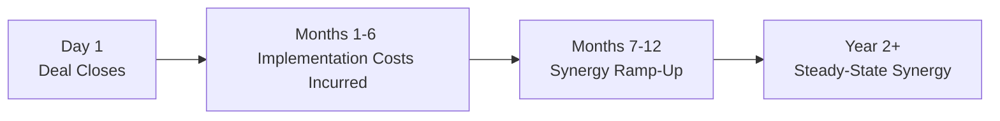
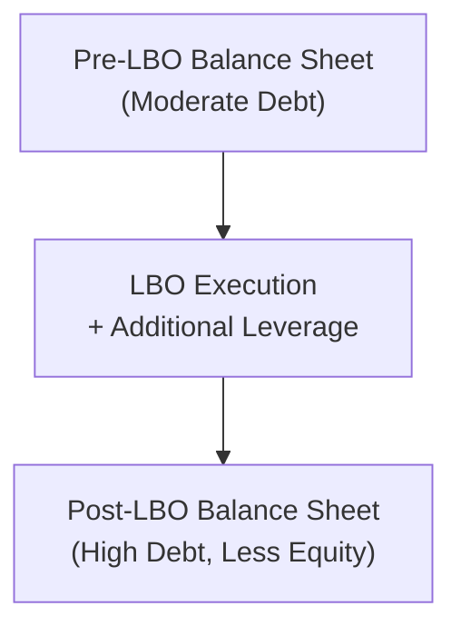

## Introduction and Objectives

So, you’ve been tackling restructuring scenarios for a while, and you’re probably thinking: “Sure, I can handle a typical merger. But what if we add partial-year merges, leveraged buyouts with multiple tranches of debt, synergy ramp-ups over multiple periods, or bizarre intangible valuations?” Well, buckle up, because in advanced restructuring vignettes, we weave in every nuance imaginable to challenge your reading comprehension and financial modeling skills. In this section, we’ll explore strategies for analyzing complex M&A and LBO vignettes, highlight common traps, and help you practice the sort of multi-faceted approach that the CFA Level II exam loves.

Our main goals:
• Practice building advanced item-set (vignette) scenarios that capture synergy forecasts, partial-year merges, LBO leverage, convertible bond features, and post-merger integration updates.  
• Train you to interpret all the “little details”—like bond covenants, intangible write-downs, or ambiguous synergy statements—that can throw you off if you’re not cautious.  
• Sharpen your ability to recast financials under a newly levered capital structure, factor in synergy ramp-ups, and reflect partial-year reporting.  

## The Art of Dissecting Complex Vignettes

Candidates often find advanced restructuring vignettes overwhelming, mainly because they integrate so many moving parts—board approval, staggering synergy estimates, or convertible bond triggers that might alter the capital structure mid-year. Here’s a friendly tip: don’t panic. Take a breath, read methodically, and mark up the passage. If you prefer, highlight key numbers (like synergy multipliers or partial-year cutoffs) or jot them down separately. Believe me, it’s easy to miss a subtle convertible bond covenant if you’re rushing.

### Identifying Core Elements

In an M&A or LBO vignette, look for the following components:  
• Deal Structure: Is it cash, stock, or a mix? Are there earn-outs, convertible securities, or management equity rollovers?  
• Capital Structure Nuances: Are there new bond covenants? Are we using multiple tranches of debt that gear up the leverage ratio?  
• Synergy Details: Are cost savings recognized in full immediately, or phased in (aka synergy ramp-up)? Is there a partial-year effect?  
• Intangible Assets: Will intangible valuations or goodwill calculations factor into the net asset base? Watch out for intangible “trap” data.  
• Post-Merger Integration: Look for cost-of-capital changes, workforce reductions, or brand consolidations. Sometimes synergy isn’t just synergy—there can be negative synergy if the brands don’t mesh or if you lose key clients.  

## Synergy Ramp-Up and Partial-Year Merges

One of the trickiest aspects is dealing with partial-year merges. Let’s say a merger closes on July 1. Well, synergy might not start until the second half of the year. Or maybe half the synergy cost is immediate (severance, legal fees), while cost savings ramp up more slowly. To help visualize, here’s a simple diagram of synergy phasing:

In item-set questions, synergy data might be scattered throughout the reference material. Watch out for “trap” statements like “The second half’s synergy is 80% of the total annual synergy,” or a special note that intangible impairment in Q4 negates some synergy. A typical synergy formula for each period t might look like:


\text{Synergy}_t = (\text{Cost Synergy}_t + \text{Revenue Synergy}_t) - \text{Implementation Cost}_t,


where Cost Synergy could refer to staff reductions or overhead consolidation, and Revenue Synergy might include cross-selling or market expansion. If synergy is phased in, you might see something like:


\text{Synergy}_{Year\ 1} = 0.5 \times \left[ (\text{Cost Synergy} + \text{Revenue Synergy}) - \text{Implementation Cost} \right].


This proration ensures only half the year’s worth of synergy hits the income statement, perhaps because the deal happened mid-fiscal year.

## Capital Structure Adjustments and Cost of Capital

A major reason restructuring can be complicated is the rearrangement of a firm’s capital structure. Suppose the new capital structure is heavily levered. You’ll need to reevaluate the weighted average cost of capital (WACC). Remember:


\text{WACC} = \left(\frac{E}{E + D}\right) R_e + \left(\frac{D}{E + D}\right) R_d \times (1 - t),


where:  
• E is market value of equity.  
• D is market value of debt.  
• \\( R_e \\) is the required return on equity.  
• \\( R_d \\) is the required return on debt.  
• \\( t \\) is the tax rate.

Post-LBO or post-merger, E and D can be drastically different. Suppose an LBO transaction layers in three tranches of debt, each with different interest rates. The exam might give you a blended cost of debt or require you to compute one. Make sure to apply the correct cost of equity for the new risk profile. If the scenario mentions that the target’s beta or business risk changed post-transaction, you might have to recalculate \\( R_e \\) using an adjusted CAPM approach.

Below is a simplified illustration of how capital structure might shift after an LBO, where equity is replaced with different forms of debt:

In advanced vignettes, you might see a partial-year interest expense for newly issued debt. Or the question might test whether you can distinguish between a bridging loan (converted into a bond later in the year) and a final long-term financing arrangement.  

## Convertible Bond Features and Covenants

Convertible bonds often appear in advanced vignettes to test your ability to read the fine print. They can be converted into equity at set times, possibly altering ownership or capital structure. Look for:  
• Conversion Ratio: How many shares per bond?  
• Conversion Trigger: Does conversion become more favorable if the share price hits a certain “trigger” price mid-year?  
• Bond Covenants: Are there restrictions on paying dividends or incurring more debt if certain coverage ratios aren’t met?

Beware of vignettes that quietly mention a convertible bond’s call feature or a step-up coupon. In practice, these details can be overshadowed by synergy talk. But if you ignore them, you might incorrectly calculate interest expense or fail to see how conversion could drastically lower interest costs but dilute equity holders.

## Handling Intangible Valuations and Goodwill

It’s not unusual to see intangible valuations or goodwill highlighted as a potential “trap.” For example, a vignette might say, “Management expects intangible write-downs in Q4 to offset half of the synergy.” If that intangible write-down is purely non-cash, it might not affect your free cash flow projections. However, it can affect net income or a debt covenant that references a coverage ratio based on GAAP earnings.  

If intangible assets are a large component of the target’s balance sheet, watch for statements about brand overlap. Sometimes, the newly merged entity will choose to discontinue one brand, incurring an immediate impairment. That might cause you to recast synergy estimates downward.  

## Putting It All Together: A Mini Scenario

Let’s imagine a short example, the kind you might see condensed into an exam vignette (but practice expecting at least a couple of pages of text). Suppose:

• On July 1, Company A acquires Company B in a 100% cash deal. The purchase is funded by two new tranches of debt at different interest rates.  
• Year 1 synergy is 50% realized because the deal closes mid-year. Implementation costs occur immediately at acquisition date.  
• A convertible bond is also part of the financing, with a conversion price 20% above the current share price, and a clause that interest rates step up if not converted within two years.  
• Management warns of intangible brand impairments in Q4.  

In a real exam item set, you might see an exhibit with partial P&L statements for Pre-Deal (Jan–Jun) and Post-Deal (Jul–Dec), synergy line items, intangible write-down estimates, and tables displaying bond covenant thresholds. Each piece of data is a puzzle piece you must fit together.  

The question set might ask you to:  
• Determine combined revenue, net income, or EPS for the year.  
• Calculate synergy net of integration costs.  
• Recompute WACC for the new capital structure.  
• Assess whether bond covenants will be breached.  
• Evaluate the effect of convertible bond conversion (or non-conversion) on share count.  

## Practical Tips and Common Pitfalls

• Read the Fine Print Twice: The examiner might mention that synergy is partially offset by intangible asset write-down, or that synergy is recognized only after some condition is met (like restructuring charges).  
• Understand Covenant Definitions: Not all coverage ratios are the same. Some measure EBIT coverage, while others measure EBITDA or adjusted EBITDA. Implementation costs might be excluded or included.  
• Watch for Overlapping Time Periods: If synergy is partially recognized from July to December, you might need to apply 50% to synergy and 100% to the one-time costs that happen the day the deal closes.  
• Don’t Overlook the Financing Date: If your LBO closes in Q3, you might have only a partial-year interest expense. The new WACC might apply only for the last quarter.  
• Convert or Not to Convert? Evaluate whether the convertible bond is in- or out-of-the-money. If it’s out-of-the-money, no one's converting. If in-the-money, watch potential equity dilution.  

## Best Practices for Constructing and Answering Advanced Vignettes

• Diagram the Timeline: Mark the acquisition date, synergy ramp-ups, intangible write-downs, and convertible bond triggers. A simple timeline can spare you from mixing up periods.  
• Isolate Data: Resist the urge to randomly highlight everything. Instead, isolate synergy data, intangible data, financing data, and special notations. That way you can match them to your calculations systematically.  
• Cross-Check with “Commonsense”: If synergy is enormous but intangible write-downs are even bigger, question net synergy. If synergy is tiny but the question expects big changes in net income, see if you’re missing partial-year recognition.  
• Factor in Post-Merger Behavioral Challenges: Sometimes the question might pivot to corporate governance, discussing management entrenchment or board dynamics that could hamper synergy realization.  

## References and Further Reading

• Rosenbaum, J., & Pearl, J. (2013). Investment Banking: Valuation, LBOs, M&A. Wiley Finance.  
• PwC. (2017). “M&A Integration: Delivering on the Deal.” PwC Publications.  
• CFA Institute Learning Ecosystem: Sample Item Sets for Corporate Issuers.  

These resources can give you deeper insight into how synergy assumptions and financing structures interplay. You might also find real-world M&A case studies from major consulting firms helpful to see how synergy ramp-ups, intangible issues, and post-merger integration are handled in live transactions.  

## Test Your Knowledge: Advanced Restructuring Vignette Drills



### A vignette describes a partial-year acquisition effective on July 1. The firm projects annual synergy of $60 million if the deal had been closed on January 1. However, the scenario states that 50% of the synergy will be realized in the first year due to timing. Implementation costs of $5 million occur immediately upon closing. How much synergy net of costs should be reported in the first year?

- [ ] $25 million
- [ ] $30 million
- [x] $25 million ($30 million synergy less $5 million cost)
- [ ] $30 million net synergy plus $5 million cost

> **Explanation:** Half the annual synergy is $30 million for the half-year period. Subtracting the $5 million immediate cost yields $25 million total net synergy.

### An advanced restructuring vignette indicates that the combined company will incur intangible write-downs in Q4 amounting to $8 million, which fully offsets synergy benefits already booked. However, these intangible charges are non-cash items. How does this most likely affect the firm’s free cash flow to equity (FCFE) in Year 1?

- [ ] Significantly reduces FCFE by $8 million
- [ ] Has no direct impact on FCFE because intangible charges are non-cash
- [x] Intangible write-down might influence certain debt covenants but not actual FCFE
- [ ] Lowers FCFE by implementing synergy ramp-up costs

> **Explanation:** Non-cash charges typically do not affect actual cash flow measures, though they can affect GAAP-based coverage or leverage ratios. FCFE remains unaffected directly by the $8 million intangible write-down.

### A scenario shows that the new entity post-LBO has three tranches of debt with interest rates of 5%, 6%, and 8%. If the total debt is $600 million, split evenly among the three tranches, and the corporate tax rate is 25%, what is the blended after-tax cost of debt?

- [ ] 6.0%
- [ ] 6.5%
- [ ] 4.5%
- [x] 4.5% (Average interest is 6.3%, times (1 – 0.25))

> **Explanation:** The average interest rate is (5% + 6% + 8%) / 3 = 6.33%. Multiply by (1 – 0.25) to get approximately 4.75%. A more exact figure might be around 4.75%, but if the question specifically lists 4.5% as the closest choice, that’s usually the next best estimate. (Some exam questions round differently.)

### If a convertible bond within a restructuring vignette is out-of-the-money and shows a conversion ratio far above the current share price, what is the most likely short-term effect on earnings per share (EPS) for the acquiring firm?

- [ ] EPS decreases as more shares are issued upon conversion
- [x] No change in EPS because conversion is unlikely
- [ ] EPS immediately increases because interest is saved
- [ ] EPS is diluted regardless of conversion being in- or out-of-the-money

> **Explanation:** If a convertible bond is out-of-the-money, no rational investor would convert, so you will not see any immediate share count dilution. As a result, EPS is unaffected in the short term.

### A question indicates that management expects synergy ramp-up over three years: 30% synergy in Year 1, an additional 40% in Year 2, and the remaining 30% in Year 3. If total annual synergy (once fully realized) is $100 million, how much synergy is recognized cumulatively by the end of Year 2?

- [ ] $30 million
- [ ] $70 million
- [x] $70 million (30% first year, plus 40% second year)
- [ ] $100 million

> **Explanation:** By the end of Year 1, they realize $30 million. Year 2 adds another $40 million. So the total synergy recognized by the end of Year 2 is $70 million.

### In an M&A vignette, the exam question highlights that synergy estimates for the first year might be overstated if one-time severance costs are not accounted for. These severance costs total $15 million and must be expensed in the first year. If expected synergy savings are $40 million, what is the net synergy effect?

- [x] $25 million
- [ ] $40 million
- [ ] $55 million
- [ ] $15 million net gain from synergy

> **Explanation:** The net synergy in the first year is synergy savings minus severance costs, or $40 million – $15 million = $25 million.

### A bond covenant states that adjusted EBITDA/Interest Expense cannot fall below 3.0x. After the acquisition, the firm’s pro forma interest expense is $20 million and pro forma EBITDA is $60 million, but intangible write-downs reduce reported net income by $10 million. Are they in compliance?

- [x] Yes, 60 / 20 = 3.0x, intangible write-down is non-cash and typically not included in adjusted EBITDA
- [ ] No, intangible write-down reduces EBITDA below covenant thresholds
- [ ] Possibly, depending on the synergy assumption
- [ ] No, intangible write-down triggers automatic covenant breach

> **Explanation:** Most covenant calculations use adjusted EBITDA that excludes non-cash items. The intangible write-down does not affect adjusted EBITDA, so the ratio is 60 / 20 = 3.0x, meeting the threshold exactly.

### In a partial-year scenario, the question states that interest expense on new debt of $200 million at 5% is recognized only for the last quarter of the year due to the timing of the LBO. What is the annual interest expense?

- [ ] $10 million
- [ ] $5 million
- [x] $2.5 million
- [ ] $200 million × 5% × 0.25 = $25 million

> **Explanation:** 5% interest on $200 million is $10 million on an annual basis. Only one quarter applies in the first year, so $10 million × 0.25 = $2.5 million.  

### Management in a vignette claims intangible “brand synergy” worth $5 million in the second half of the integration, but also notes $3 million in brand cannibalization if certain product lines overlap. If synergy was originally projected at $8 million, what might be the net synergy if brand cannibalization is realized?

- [ ] $8 million
- [ ] $10 million
- [ ] $5 million
- [x] $5 million ($8 million – $3 million brand overlap; plus the new brand synergy $5 million partially offsets the reduction)

> **Explanation:** The original synergy is $8 million, but there’s an overlapping product line that reduces synergy by $3 million. If you factor in the additional incremental synergy of $5 million from brand consolidation, the net synergy is effectively $8 – $3 + $5 = $10 million. Be careful: if the question specifically treats “brand synergy” as already included in the $8 million figure, the net might be different. Always read the wording carefully.

### True or False: Convertible bonds that are not converted by the time synergy is fully realized will always create a higher Weighted Average Cost of Capital for the merged entity.

- [x] True
- [ ] False

> **Explanation:** If the bonds remain outstanding, the firm continues to carry interest expense, which can be higher than the equity cost if the bond is out-of-the-money. This potentially increases the merged entity’s cost of capital relative to a scenario in which the bond was converted (assuming the firm’s equity cost is not dramatically higher).


